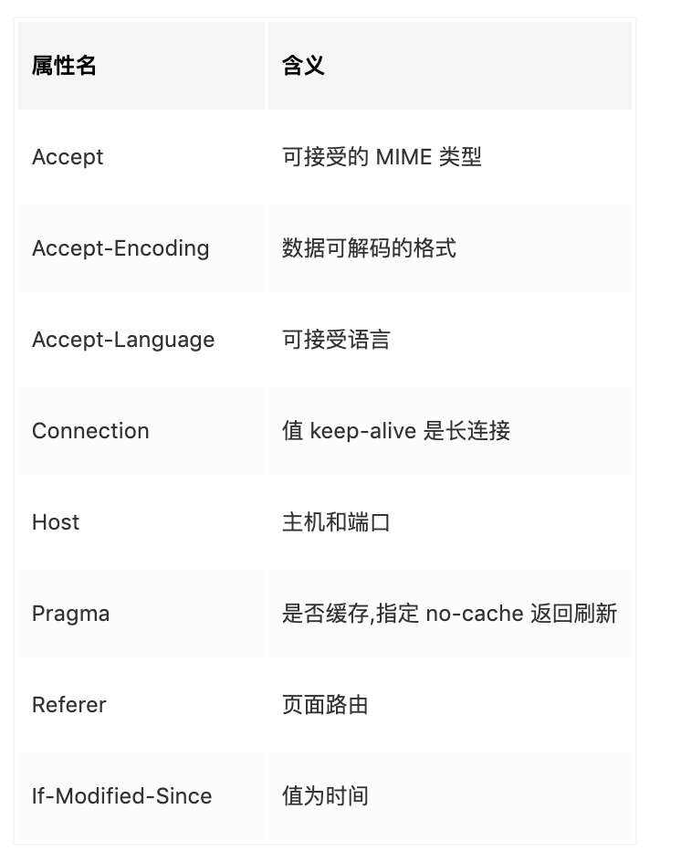
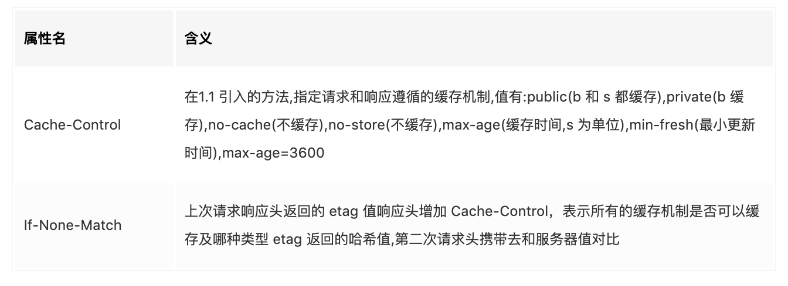
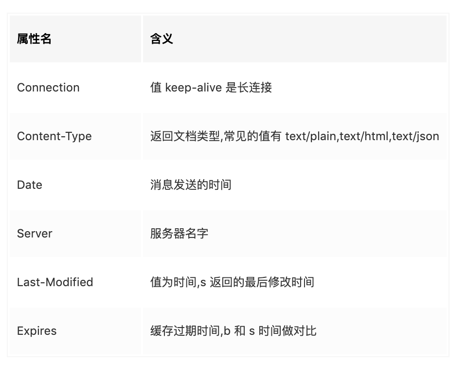
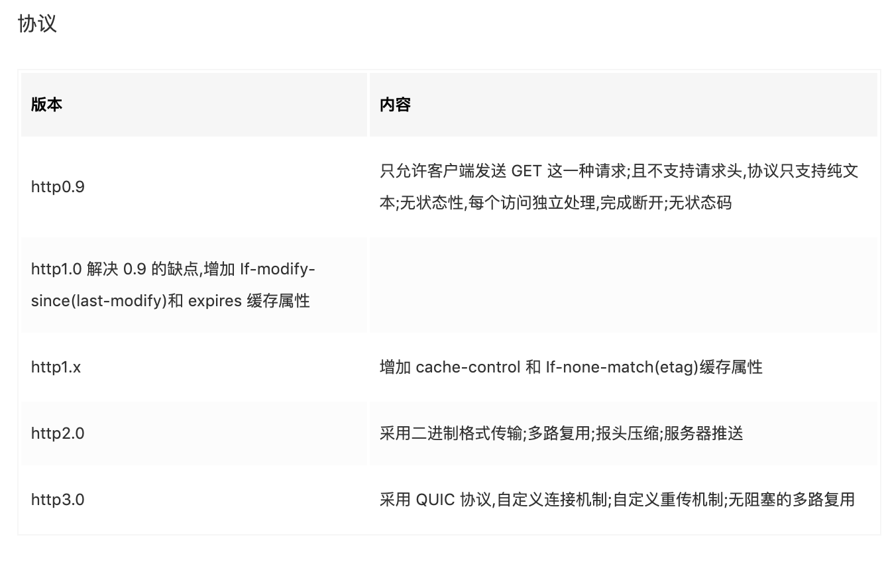

## HTTP 0.9
* 只允许客户端发送GET这一种请求；
* 且不支持请求头，协议只支持纯文本；
* 无状态性，每个访问独立处理，完成断开；
* 无状态码。

## HTTP/1.0介绍
* 有身份认证，三次握手；
* 请求与响应支持头域；

请求头内容：


响应头内容：


注意：
* expires 是响应头内容，返回一个固定的时间,缺陷是时间到了服务器要重新设置；
* 请求头中如果有 If-Modified-Since，服务器会将时间与 last-modified 对比，相同返回 304；
* 响应对象以一个响应状态行开始；
* 响应对象不只限于超文本；
* 支持 GET、HEAD、POST 方法；
* 有状态码；
* 支持长连接（但默认还是使用短连接）、缓存机制以及身份认证。

**HTTP/1.0 版的主要缺点是**：每个`TCP`连接只能发送一个请求。发送数据完毕，连接就关闭，如果还要请求其他资源，就必须再新建一个连接。
新建`TCP`连接的成本很高，因为需要客户端和服务器三次握手，并且开始时发送速率较慢。所以，`HTTP 1.0`版本的性能比较差。随着网页加载的外部资源越来越多，这个问题就愈发突出了。
为了解决这个问题，有些浏览器在请求时，用了一个非标准的`Connection`字段。
```bash
Connection: keep-alive
```
这个字段要求服务器不要关闭TCP连接，以便其他请求复用。服务器同样回应这个字段。
```bash
Connection: keep-alive
```
一个可以复用的TCP连接就建立了，直到客户端或服务器主动关闭连接。但是，这不是标准字段，不同实现的行为可能不一致，因此不是根本的解决办法。
## HTTP/1.1
请求头增加 Cache-Control



>注意：Cache-Control 的 max-age 返回是缓存的相对时间 Cache-Control 优先级比 expires 高 缺点：不能第一时间拿到最新修改文件。

### 请求消息结构
由请求行、请求头、一个空行和消息主体构成。
#### 请求行
请求消息的第一行就是请求行。它指明使用的**请求方法**、资源标识符(URI)和HTTP协议版本。如：
```bash
GET /demo.htm HTTP/1.1
```
#### 请求方法
请求方法用来定义操作资源的方式，HTTP/1.1协议中定义了八种请求方法：
 - GET：读取资源数据;
 - POST：新建资源数据;
 - PUT：更新资源数据;
 - DELETE：删除资源数据;
 - HEAD：读取资源的元数据;
 - OPTIONS：读取该资源所支持的所有请求方法;
 - TRACE：回显服务器收到的请求，主要用于测试或诊断;
 - CONNECT：HTTP/1.1 协议中预留给能够将连接改为管道方式的代理服务器。通常用于SSL加密服务器的链接.

#### 请求头字段
 - **Cache-Control：** 客户端希望服务端如何缓存自己的请求数据，如"Cache-Control: no-cache"，"Cache-Control: max-age=0"；
 - **Connection：** 客户端是否希望与服务端之间保持长连接，如"Connection: close", "Connection: keep-alive"；
 - **Date：** 只有当请求方法为POST或PUT方法时客户端才可能会有些字段；
 - **Pragma：** 包含了客户端一些特殊请求信息，如 "Pragma: no-cache", 客户端希望代理或应用服务器不应缓存与该请求相关的结果数据；
 - **Accept：** 表明客户端可接受的请求回应的媒体类型范围列表,如：如 Accept: text/html;
 - **Accept-Charset：** 客户端所能识别的字符集编码格式；
 - **Accept-Language：** 客户端所能识别的语言；
 - **Host：** 客户请求的主机域名或主机IP；
 - **User-Agent：** 表明用户所使用的浏览器标识，主要用于统计的目的；
 - **Referer：** 指明该请求是从哪个页面连接过来的;
 - **Accept-Encoding：** 客户端所能识别的编码压缩格式，如："Accept-Encoding: gzip, deflate"；
 - **If- Modified-Since：** 该字段与客户端缓存相关，客户端所访问的URL自该指定日期以来在服务端是否被修改过，如果修改过则服务端返回新的修改后 的信息，如果未修改过则服务器返回304表明此请求所指URL未曾修改过；
 - **If-None-Match：** 该字段与客户端缓存相关，客户端发送URL请求的同时发送该字段及标识，如 果服务端的标识与客户端的标识一致，则返回304表明此URL未修改过，如果不一致则服务端返回完整的数据信息;
 - **Cookie：** 为扩展字段，存储于客户端，向同一域名的服务端发送属于该域的cookie；
 - **Content-Encoding：** 客户端所能识别的编码压缩格式，如：Content-Encoding: gzip, deflate；
 - **Content-Length：** 客户端以POST方法上传数据时数据体部分的内容长度，如：Content-Length: 24；
 - **Content- Type：** 客户端发送的数据体的内容类型，如：Content-Type: application/x-www-form-urlencoded为以普通的POST方法发送的数据；
#### 空行
指示头字段区完成，消息主体开始（如果有消息主体的话）。
#### 消息主体
消息主体是请求消息的承载数据。比如在提交POST表单，并且表单方法不是GET时，表单数据就是打包在消息主体内的。消息主体是可选的。
### 响应消息结构
#### 状态行
由http协议版本、状态码、状态描述文字构成。如：
```js
HTTP/1.1 200 OK
```
#### 状态码
HTTP状态码是用以表示网页服务器HTTP响应状态的3位数字代码。所有的状态码的第一个数字代表了响应的五种状态之一:

 - 1xx：代表请求已被接受，需要继续处理。这类响应是临时响应，只包含状态行和某些可选的响应头信息，并以空行结束；
 - 2xx：代表请求已成功被服务器接收、理解、并接受；
 - 3xx：代表需要客户端采取进一步的操作才能完成请求。通常，这些状态码用来**重定向**，后续的请求地址（重定向目标）在本次响应的**Location域**中指明；
 - 4xx：代表了**客户端看起来可能发生了错误**，妨碍了服务器的处理。
 - 5xx：代表了**服务器在处理请求的过程中有错误或者异常状态发生**，也有可能是服务器意识到以当前的软硬件资源 无法完成对请求的处理。

[详见百度百科](http://baike.baidu.com/link?url=49LS7hRvR-6HpWycKbOZPia9YxKCnC_hzyrM_zQOCklxoIAsopFZmrO55fwyFrPZeNsMo8UO5WykrXJeUjWyyq)
>**常见状态码有：**

 - 200: 请求已经成功，请求所希望的响应头或者数据体将随着此响应返回 ;
 - 202: 服务器已接受请求，但尚未处理。
 - **204: 服务器成功处理了请求，但不需要返回任何实体内容，并且希望返回更新了的元信息;**
 - 301：永久重定向;
 - 302：临时重定向;
 - 304：被请求的资源内容没有发生更改;
 - 400：Bad Request  服务器无法理解请求的格式，客户端不应当尝试再次使用相同的内容发起请求;
 - 401：Unauthorized  请求未授权;
 - 403：Forbidden  禁止访问;
 - 404：Not Found 请求失败，请求所希望得到的资源未被在服务器上发现;
 - 408：请求超时。客户端可以再次提交这一请求而无需任何修改;
 - 500：服务器内部错误，无法处理请求 ;
 - 502：作为网关或者代理工作的服务器尝试执行请求时，从上游服务器接收到无效响应。
 - 503：由于临时的服务器维护或者过载，服务器当前无法处理请求。

[请点击这里查看更多状态码](http://tool.oschina.net/commons?type=5)
#### 响应头字段
 - **Cache- Control：** 服务端要求中间代理及客户端如何缓存自己响应的数据，如"Cache-Control: no-cache"，如："Cache-Control: private"不希望被缓存，"Cache-Control: public" 可以被缓存；
 - **Connection：** 服务端是否希望与客户端之间保持长连接；
Date：只有当请求方法为POST或PUT方法时客户端才可能会有些字段；
 - **Pragma：** 包含了服务端一些特殊响应信息，如"Pragma: no-cache"服务端希望代理或客户端不应缓存结果数据；
 - **Transfer-Encoding：** 服务端向客户端传输数据所采用的传输模式(仅在HTTP1.1中出现)；
 - **Accept-Ranges：** 表明服务端接收的数据单位，如：Accept-Ranges: bytes；
 - **Location：** 服务端向客户端返回此信息以使客户端进行**重定向**；
 - **Server：** 服务器的名称;
 - **ETag：** 服务端返回的响应数据的标识字段，客户端可根据此字段的值向服务器发送某URL是否更新的信息；
 - **Content-Encoding：** 服务端响应数据的编码格式，如："Content-Encoding: gzip"；
 - **Content-Length：** 服务端返回数据的数据体部分的内容长度，如："Content-Length: 24"；
 - **Content-Type：** 服务端返回的数据体的内容类型，如："Content-Type: text/html; charset=utf-8"；
 - **Set-Cookie：** 服务端返回给客户端的cookie数据;
### 持久连接(keep-alive)
HTTP1.1版的最大变化，就是**引入了持久连接**，即TCP连接默认不关闭，可以被多个请求复用，不用声明`Connection: keep-alive`。
**客户端和服务器发现对方一段时间没有活动，就可以主动关闭连接**。不过，规范的做法是，客户端在最后一个请求时，发送`Connection: close`，明确要求服务器关闭TCP连接。
```bash
Connection: close
```
目前，对于同一个域名，大多数浏览器允许同时建立6个持久连接。
### 管道机制
`HTTP1.1`版还引入了管道机制，即在同一个TCP连接里面，客户端可以同时发送多个请求。这样就进一步改进了HTTP协议的效率。
举例来说：客户端需要请求两个资源。以前的做法是，在同一个TCP连接里面，先发送A请求，然后等待服务器做出回应，收到后再发出B请求。**管道机制则是：**允许浏览器同时发出A请求和B请求，但是服务器还是按照顺序，先回应A请求，完成后再回应B请求。
### Content-Length字段
一个TCP连接现在可以传送多个回应，势必就要有一种机制，区分数据包是属于哪一个回应的。这就是`Content-length`字段的作用，声明本次回应的数据长度。
```bash
Content-Length: 3495
```
上面代码告诉浏览器，本次回应的长度是3495个字节，后面的字节就属于下一个回应了。
在1.0版中，Content-Length字段不是必需的，因为浏览器发现服务器关闭了TCP连接，就表明收到的数据包已经全了。
### 分块传输编码
使用Content-Length字段的前提条件是，服务器发送回应之前，必须知道回应的数据长度。
对于一些很耗时的动态操作来说，这意味着，服务器要等到所有操作完成，才能发送数据，显然这样的效率不高。更好的处理方法是，产生一块数据，就发送一块，采用"流模式"（stream）取代"缓存模式"（buffer）。
因此，1.1版规定可以不使用Content-Length字段，而使用"分块传输编码"。只要请求或回应的头信息有Transfer-Encoding字段，就表明回应将由数量未定的数据块组成。
```bash
Transfer-Encoding: chunked
```
### 其他功能
1.1版还新增了许多动词方法：PUT、PATCH、HEAD、OPTIONS、DELETE。
另外，客户端请求的头信息新增了Host字段，用来指定服务器的域名。
```js
Host: www.example.com
```
有了Host字段，就可以将请求发往同一台服务器上的不同网站，为虚拟主机的兴起打下了基础。
### 缺点
虽然1.1版允许复用TCP连接，但是同一个TCP连接里面，所有的数据通信是按次序进行的。服务器只有处理完一个回应，才会进行下一个回应。要是前面的回应特别慢，后面就会有许多请求排队等着。这称为"队头堵塞"。
为了避免这个问题，只有两种方法：一是减少请求数，二是同时多开持久连接。这导致了很多的网页优化技巧，比如合并脚本和样式表、将图片嵌入CSS代码、域名分片等等。如果HTTP协议设计得更好一些，这些额外的工作是可以避免的。
## SPDY 协议
2009年，谷歌公开了自行研发的`SPDY`协议，主要解决`HTTP/1.1`效率不高的问题。
这个协议在Chrome浏览器上证明可行以后，就被当作 HTTP/2 的基础，主要特性都在 HTTP/2 之中得到继承。
## HTTP/2
* 采用二进制格式传输；
* 多路复用，其实就是将请求数据分成帧乱序发送到TCP中。TCP只能有一个steam，所以还是会阻塞；
* 报头压缩；
* 服务器推送主动向B端发送静态资源，避免往返延迟。

* 二进制协议：
    * HTTP/1.1 版的头信息肯定是文本（ASCII编码），数据体可以是文本，也可以是二进制。HTTP/2 则是一个彻底的二进制协议，头信息和数据体都是二进制，并且统称为"帧"（frame）：头信息帧和数据帧。
    * 二进制协议的一个好处是，可以定义额外的帧。HTTP/2 定义了近十种帧，为将来的高级应用打好了基础。如果使用文本实现这种功能，解析数据将会变得非常麻烦，二进制解析则方便得多。
* 多工：
    * HTTP/2 复用TCP连接，在一个连接里，客户端和浏览器都可以同时发送多个请求或回应，而且不用按照顺序一一对应，这样就避免了"队头堵塞"。
    * 举例来说，在一个TCP连接里面，服务器同时收到了A请求和B请求，于是先回应A请求，结果发现处理过程非常耗时，于是就发送A请求已经处理好的部分， 接着回应B请求，完成后，再发送A请求剩下的部分。这样双向的、实时的通信，就叫做多工（Multiplexing）。
* 数据流：
    * 因为HTTP/2 的数据包是不按顺序发送的，同一个连接里面连续的数据包，可能属于不同的回应。因此，必须要对数据包做标记，指出它属于哪个回应。
    * HTTP/2 将每个请求或回应的所有数据包，称为一个数据流。每个数据流都有一个独一无二的编号。数据包发送的时候，都必须标记数据流ID，用来区分它属于哪个数据流。另外还规定，客户端发出的数据流，ID一律为奇数，服务器发出的，ID为偶数。
    * 数据流发送到一半的时候，客户端和服务器都可以发送信号（RST_STREAM帧），取消这个数据流。1.1版取消数据流的唯一方法，就是关闭TCP连接。这就是说，HTTP/2 可以取消某一次请求，同时保证TCP连接还打开着，可以被其他请求使用。
    * 客户端还可以指定数据流的优先级。优先级越高，服务器就会越早回应。
* 头信息压缩
    * HTTP协议不带有状态，每次请求都必须附上所有信息。所以，请求的很多字段都是重复的，比如Cookie和User Agent，一模一样的内容，每次请求都必须附带，这会**浪费很多带宽，也影响速度**。
    * HTTP/2 对这一点做了优化，引入了头信息压缩机制（header compression）。一方面，头信息使用gzip或compress压缩后再发送；另一方面，客户端和服务器同时维护一张头信息表，所有字段都会存入这个表，生成一个索引号，以后就不发送同样字段了，只发送索引号，这样就提高速度了。
* 服务器推送
    * HTTP/2允许服务器未经请求，主动向客户端发送资源，这叫做服务器推送（server push）。
    * 常见场景是客户端请求一个网页，这个网页里面包含很多静态资源。正常情况下，客户端必须收到网页后，解析HTML源码，发现有静态资源，再发出静态资源请求。其实，服务器可以预期到客户端请求网页后，很可能会再请求静态资源，所以就主动把这些静态资源随着网页一起发给客户端了。

## HTTP 3.0
是基于QUIC协议，基于UDP。

特点:
* 自定义连接机制：TCP以IP/端口标识，变化重新连接握手，UDP是一64位ID标识，是无连接；
* 自定义重传机制：TCP 使用序号和应答传输，QUIC是使用递增序号传输； 无阻塞的多路复用：同一条 QUIC 可以创建多个steam。

HTTP协议是互联网的基础协议，它是基于`TCP/IP`协议(传输层协议)的**应用层协议**，不涉及数据包传输，主要规定了**客户端和服务器之间的通信格式**，默认使用80端口，是一种请求/响应式的协议，客户端与服务器建立连接后，发送一个请求给服务器，服务器接到请求后，给予相应的响应信息。
## 参考博文
1. [HTTP 协议入门](http://www.ruanyifeng.com/blog/2016/08/http.html)
2. [HTTPS 升级指南](http://www.ruanyifeng.com/blog/2016/08/migrate-from-http-to-https.html)
3. [HTTP,HTTP2.0,SPDY,HTTPS你应该知道的一些事](http://www.alloyteam.com/2016/07/httphttp2-0spdyhttps-reading-this-is-enough/)
4. [HTTP 协议简介](http://blog.jobbole.com/104886/)
5. [超文本传输协议（HTTP）介绍](http://www.imooc.com/article/4803)
6. [一文读懂HTTP/2 及 HTTP/3特性](https://juejin.im/post/5c658309e51d4542331c442e)
