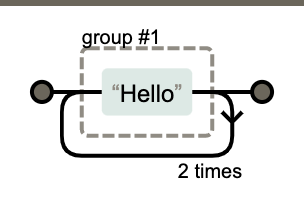

正则表达式工具：http://regexper.com

正则表达式(Regular Expression)：使用单个字符串来描述、匹配一系列符合某个句法规则的字符串。简而言之，就是按照某种规则去匹配符合条件的字符串。

```js
// 查看文件目录
ls
// 在当前目录中查找所有的txt文件
find ./ -name *.txt
```

* `.`：代表任意字符，可以是中文英文数字或特殊符号
* `*`：代表0到多个或任意个字符
* +：表示1个或多个
* ?：表示0个或1个
* ^：表示开头
* $：表示结尾
* \b：匹配单词边界
* \：转义字符
* ()：分组，`$1-9`按顺序引用分组`($1：`提取分组内容，即第一个括号里的内容)
* \d：数字
* {}：个数
* []：或

举个例子：匹配日期格式（2019-01-01或2019/01/10）

```js
// 表示以四位数字开头的年份 /或者- 2位数的月份 /或者- 2位数的日期结尾 的格式
const reg = /^(\d{4})[-/](\d{2})[-/](\d{2})$/g;
reg.test('2020-06-04'); // true
reg.test('2020/06/04'); // true
```

需要注意：非英文字符，需要进行转义。分组，对需要的数据外加 () 进行分组，然后使用`$1`、`$2`、`$3`进行获取替换。

## Regexp对象

JavaScript通过内置对象RegExp支持正则表达式。有两种方法实例化RegExp对象：

* 字面量
* 构造函数

字面量形式：

```js
// \b表示单词边界
// 匹配单词is
// g表示全局匹配
var reg = /\bis\b/g;
```

构造函数形式：

```js
const reg = new RegExp('\\bis\\b', 'g');
```

### 修饰符

* g：global全文搜索，默认false，搜索到第一个匹配目标就停止；
* i：ignore case 忽略大小写，默认大小写敏感；
* m：multiple lines多行搜索，默认false
* lastIndex：是正则表达式的一个可读可写的整型属性，用来指定下一次匹配的起始索引。(只有正则表达式使用了表示全局检索的 "`g`" 标志时，该属性才会起作用。)
* source：正则表达式的文本字符串

```js
'Bb'.replace(/b/g, 'a') // "Ba"
'Bb'.replace(/b/gi, 'a') // "aa"
```

```js
const reg = /\w(?=\d)/g;
reg.source; // \w(?=\d)
```

```js
var re = /(hi)?/g;
console.log(re.exec('hi')); // [ 'hi', 'hi', index: 0, input: 'hi', groups: undefined ]
console.log(re.lastIndex); // 2
console.log(re.exec('hi')); // [ '', undefined, index: 2, input: 'hi', groups: undefined ]
console.log(re.lastIndex); // 2
```

### 元字符

正则表达式由两种基本字符类型组成：

* 原义文本字符
* 元字符：指在正则表达式中有特殊含义的非字母字符。例如`\b`指的是单词边界。


一般情况下，正则表达式的一个字符对应字符串的一个字符。比如：`/ab\t/`所表示的意义如下图所示：


#### 匹配字符类

我们可以使用元字符[]来构建一个简单的类。所谓类就是指符合某些特性的对象，一个泛指，而不是特指某个字符。表达式[abc]把字符a或b或c归为一类，表达式可以匹配这类的字符。


```js
// 替换abc字符
'a1b2c3'.replace(/[abc]/g, 'X'); // X1X2X3
```

#### 字符类取反

使用元字符`^`创建反向类/负向类，反向类的意思是不属于某个类的内容。比如：表达式`[^abc]`表示不是字符a或b或c的内容。

```js
// 替换非abc的字符
'a1b2c3'.replace(/[^abc]/g, 'X'); // aXbXcX
```

#### 范围类

使用`[a-zA-Z]`来表示从a到z和从A到Z的任意字符。需要注意的是在范围类中的`-`是不起作用的，如需匹配需要在范围类后面加上`-`。

```js
'2019-01-20'.replace(/[0-9-]/g, 'X'); // XXXXXXXXXX
```

#### 预定义类及边界

正则表达式提供了**预定义类**来匹配常见的字符类。


> 需要注意：匹配任意字符，即除了回车和换行符。`[^\r\n]`

举个例子：匹配ab + 数字 + 任意字符的字符串，即/ab\d./，如下图所示


#### 边界匹配


* `^`（脱字符）匹配开头，在多行匹配中匹配行开头。
* `$`（美元符号）匹配结尾，在多行匹配中匹配行结尾。

```js
'hello'.replace(/^|$/, '@') // "@hello"
// 加上全局匹配
'hello'.replace(/^|$/g, '@') // "@hello@"
```

多行匹配模式时，二者是行的概念，这个需要我们的注意：

```js
const result = 'I\nlove\njavascript'.replace(/^|$/gm, '#');
console.log(result);
#I#
#love#
#javascript#
```

边界和边界取反：

```js
'this is a dog'.replace(/\bis\b/g, '666') // "this 666 a dog"
'this is a dog'.replace(/\Bis\b/g, '666') // "th666 is a dog"
```

```js
'@123@abc@'.replace(/@./g, 'Q') // "Q23Qbc@"
'@123@abc@'.replace(/^@./g, 'Q') // "Q23@abc@"
'@123@abc@'.replace(/.@/g, 'Q') // "@12QabQ"
'@123@abc@'.replace(/.@$/g, 'Q') // "@123@abQ"
```

处理多行的情况：


### 量词

* `{m,}` 表示至少出现m次。
* `{m}`等价于`{m,m}`，表示出现m次。
* `{n,m} `表示出现n到m次。
* `?`等价于`{0,1}`，表示出现或者不出现。
* `+`等价于`{1,}`，表示出现至少一次。
* `*`等价于`{0,}`，表示出现任意次，有可能不出现。

#### 贪婪模式与非贪婪模式

贪婪模式：尽可能多的匹配。

```js
// 该正则/\d{3,6}/g的意思是匹配3到6个数字
// 正则默认是贪婪匹配，即尽可能多的匹配，所以这里匹配了6个数字
'12345678'.replace(/\d{3,6}/g, 'Q'); // Q78
```

```js
const reg = /\d{2,5}/g; // 表示数字连续出现2到5次，会匹配2位、3位、4位、5位连续数字
const str = "123 1234 12345 123456";
console.log(str.match(reg));
// => ["123", "1234", "12345", "12345"]
```

非贪婪模式：在后面加？

```js
// 这里123和456均被匹配，被替换成了Q
'12345678'.replace(/\d{3,6}?/g, 'Q'); // QQ78
```

```js
const reg = /\d{2,5}?/g; // 表示虽然2到5次都行，当2个就够的时候，就不在往下尝试了
const str = "123 1234 12345 123456";
console.log(str.match(reg) );
// => ["12", "12", "34", "12", "34", "12", "34", "56"]
```

通过在量词后面加个问号就能实现惰性匹配，因此所有惰性匹配情形如下：

> ```js
> {m,n}?
> {m,}?
> ??
> +?
> *?
> ```

### 分组

如果要匹配字符串`Hello`连续出现3次的情况：`/Hello{3}/`，这样是不行的。


上面的是n重复3次，而不是整个单词重复3次。使用`()`可以达到分组的功能，使量词作用于分组。

```js
/(Hello){3}/
```



```js
'a1b2c3d4'.replace(/([a-z]\d){3}/g, 'A'); // Ad4
```

#### 或

使用`|`可以达到或的效果。

下图代表的是：`/hello|world/`


下图代表的是：`/hel(lo|wo)rld/`，这里的或作用于：lo和wo。


```js
'helloworld'.replace(/hello|world/g, 'Q'); // QQ
// 下面的正则匹配Byronsper或者ByrCasper
'ByronsperByrCasper'.replace(/Byr(on|Ca)sper/g, 'Q'); // QQ
```

需要注意：或也是惰性的，即当前面的匹配上了，后面的就不再尝试了，来看个例子：

```js
const regex = /good|goodbye/g;
const string = "goodbye";
console.log(string.match(regex)); // => ["good"]
```

```js
const regex = /goodbye|good/g;
const string = "goodbye";
console.log(string.match(regex)); // => ["goodbye"]
```

#### 反向引用

2020-06-04 => 06/04/2020

```js
'2020-06-04'.replace(/(\d{4})-(\d{2})-(\d{2})/g, '$2/$3/$1') // "06/04/2020"
```

```js
'2019-01-20'.replace(/(\d{4})-(\d{2})-(\d{2})/g, '$2/$3/$1'); // 01/20/2019

// 匹配第一个分组
'2019-01-20'.replace(/(\d{4})-(\d{2})-(\d{2})/g, '$1'); // 2019
// 第二个分组
'2019-01-20'.replace(/(\d{4})-(\d{2})-(\d{2})/g, '$2'); // 01
// 第三个分组
'2019-01-20'.replace(/(\d{4})-(\d{2})-(\d{2})/g, '$3'); // 20
```

#### 忽略分组

如果不希望捕获某些分组，只需要在分组内加上`?:`就可以了。

```js
(?:hello).(world)
```


### 正则对象方法test和exec

#### test

`test` 方法执行一个检索，用来查看正则表达式与指定的字符串是否匹配。返回 `true` 或 `false`。

当你想要知道一个模式是否存在于一个字符串中时，就可以使用 `test()`（类似于` `[`String.prototype.search()`](https://developer.mozilla.org/zh-CN/docs/Web/JavaScript/Reference/Global_Objects/String/search) 方法），差别在于test返回一个布尔值，而 search 返回索引（如果找到）或者-1（如果没找到）；

```js
// 用于测试字符串参数中是否存在匹配正则表达式模式的字符串，存在返回true，否则返回false。
RegExp.prototype.test(str)
```

```js
let str = 'hello world!';
let result = /^hello/.test(str);
// str以hello开头，因此返回true
console.log(result); // true
```

```js
var reg2 = /\w/g;
```

进行`reg2.test('ab')`时，第三次会变成`false`。

原因：

```js
while(reg2.test('ab')) {
    console.log(reg2.lastIndex);
}
```

即进行`test`时，正则表达式的`lastIndex`会发生变化，输出：1和2，表示第一个匹配上了、第二个匹配上了。

#### exec

`exec `方法在一个指定字符串中执行一个搜索匹配，返回一个结果数组或 [`null`](https://developer.mozilla.org/zh-CN/docs/Web/JavaScript/Reference/Global_Objects/null)。

如果匹配成功，`exec()` 方法返回一个数组（包含额外的属性 `index` 和 `input` ），并更新正则表达式对象的 [`lastIndex`](https://developer.mozilla.org/zh-CN/docs/Web/JavaScript/Reference/Global_Objects/RegExp/lastIndex) 属性。完全匹配成功的文本将作为返回数组的第一项，从第二项起，后续每项都对应正则表达式内捕获括号里匹配成功的文本。

如果匹配失败，`exec()` 方法返回 [`null`](https://developer.mozilla.org/zh-CN/docs/Web/JavaScript/Reference/Global_Objects/null)，并将 [`lastIndex`](https://developer.mozilla.org/zh-CN/docs/Web/JavaScript/Reference/Global_Objects/RegExp/lastIndex) 重置为 0 。

```js
// 使用正则表达式模式对字符串执行搜索，并将更新全局RegExp对象的属性以反映匹配结果。
RegExp.prototype.exec(str)
```

如果没有匹配则返回`null`，否则返回一个结果数组：

* `index`声明匹配文本的第一个字符的位置；
* `input`存放被检索的字符串string。

非全局调用：

* 调用非全局的RegExp对象的exec()时，返回数组；
* 第一个元素是与正则表达式相匹配的文本；
* 第二个元素是与RegExpObject的第一个子表达式（分组）相匹配的文本；
* 第三个元素是与RegExp对象的第二个子表达式（分组）相匹配的文本。

```js
const reg = /quick\s(brown).+?(jumps)/ig;
const res = reg.exec('The Quick Brown Fox Jumps Over The Lazy Dog');
console.log(res); //  ["Quick Brown Fox Jumps", "Brown", "Jumps", index: 4, input: "The Quick Brown Fox Jumps Over The Lazy Dog", groups: undefined]
```


```js
const reg = /\d(\w)(\w)\d/;
const str = '$1aa2bb3cy4dd5ee';
const res = reg.exec(str);
console.log(res); // ["1aa2", "a", "a", index: 1, input: "$1aa2bb3cy4dd5ee", groups: undefined]
console.log(res.toString()); // 1aa2,a,a
console.log(reg.lastIndex + '\t' + res.index); // 0       1
```

### 字符串对象方法

#### search

```
// 返回首次匹配项的索引
string.protatype.search(reg)
```

`search`方法用于检索字符串中指定的子字符串，或检索与正则表达式相匹配的子字符串。如果匹配成功，则 `search` 返回正则表达式在字符串中**首次匹配项**的索引；否则，返回 **-1**。

> 需要注意：`search`方法不执行全局匹配，它将忽略标志`g`，并且总是从字符串开始进行检索。

#### macth

```js
string.prototype.match(reg)
```

`match`方法将检索字符串，以找到一个或多个与`regexp`匹配的文本。`regexp`是否具有修饰符`g`对匹配结果影响很大。

非全局调用(即不具有修饰符g)：如果`regexp`没有修饰符`g`，那么`match`方法就只能在字符串中执行一次匹配，如果没有找到任何匹配的文本，将返回`null`，否则将返回一个数组，其中存放了与它找到的匹配文本有关的信息。**返回数组**的第一个元素存放的是匹配文本，而其余元素存放的是与正则表达式的子表达式匹配的文本。

除了常规数组元素之外，返回的数组还含有3个对象属性：

- `groups`: 一个捕获组数组 或 [`undefined`](https://developer.mozilla.org/zh-CN/docs/Web/JavaScript/Reference/Global_Objects/undefined)（如果没有定义命名捕获组）
- `index`: 匹配结果的开始位置
- `input`: 搜索的字符串

在下例中，使用 match 查找 "Chapter" 紧跟着 1 个或多个数值字符，再紧跟着一个小数点和数值字符 0 次或多次。正则表达式包含 i 标志，因此大小写会被忽略。

```js
var str = 'For more information, see Chapter 3.4.5.1';
var re = /see (chapter \d+(\.\d)*)/i;
var found = str.match(re);

console.log(found);
// 这里lastIndex等于字符串的长度，且该正则表达式不匹配空字符串 ，则该正则表达式不匹配字符串，lastIndex 被设置为 0
console.log(found.index + '\t' + re.lastIndex); // 22       0

// logs [ 'see Chapter 3.4.5.1',
//        'Chapter 3.4.5.1',
//        '.1',
//        index: 22,
//        input: 'For more information, see Chapter 3.4.5.1' ]

// 'see Chapter 3.4.5.1' 是整个匹配。
// 'Chapter 3.4.5.1' 被'(chapter \d+(\.\d)*)'捕获。
// '.1' 是被'(\.\d)'捕获的最后一个值。
// 'index' 属性(22) 是整个匹配从零开始的索引。
// 'input' 属性是被解析的原始字符串。
```

```js
const reg = /\d(\w)\d/;
const str = '$1a2b3c4d5e';
const res = str.match(reg);
console.log(res); // [ '1a2', 'a', index: 1, input: '$1a2b3c4d5e', groups: undefined ]
console.log(res.index + '\t' + reg.lastIndex); // 1       0
```

全局调用(即具有修饰符g)：如果`regexp`具有修饰符`g`，则`match`方法将执行全局检索，找到字符串中的所有匹配子字符串。

* 没有找到任何匹配的子串，则返回null；
* 如果找到了一个或多个匹配子串，则返回一个数组，数组元素中存放的是字符串中所有的匹配子串，而且也没有index属性或input属性。

下例展示了 match 使用 global 和 ignore case 标志。A-E、a-e 的所有字母将会作为一个数组的元素返回。

```js
var str = 'ABCDEFGHIJKLMNOPQRSTUVWXYZabcdefghijklmnopqrstuvwxyz';
var regexp = /[A-E]/gi;
var matches_array = str.match(regexp);

console.log(matches_array);
// ['A', 'B', 'C', 'D', 'E', 'a', 'b', 'c', 'd', 'e']
```

```js
const reg2 = /\d(\w)\d/g;
const str = '$1a2b3c4d5e';
const res = str.match(reg2);
console.log(res); // [ '1a2', '3c4' ]
console.log(res.index + '\t' + reg.lastIndex); // undefined       0
```

#### split

```js
String.prototype.split(reg)
```

经常使用`split`方法把字符串分割为字符数组。

```js
'a,b,c,d'.split(','); // ['a','b','c','d']
```

在一些复杂的分割情况下可以使用正则表达式解决：

```js
'a1b2c3d'.split(/\d/g); // ['a','b','c','d']
```

####  replace

```js
// 将字符串中的某些子串替换为需要的内容
String.prototype.replace(rex)
```

**replace**方法返回一个由替换值（`replacement`）替换一些或所有匹配的模式（`pattern`）后的新字符串。模式可以是一个字符串或者一个[正则表达式](https://developer.mozilla.org/zh-CN/docs/Web/JavaScript/Reference/RegExp)，替换值可以是一个字符串或者一个**每次匹配都要调用的回调函数**。即有如下3种形式：

```js
String.prototype.replace(str, replaceStr) // 匹配模式和替换值都是字符串
String.prototype.replace(reg, replaceStr) // 匹配模式是正则，替换值是字符串
String.prototype.replace(reg, function) // 匹配模式是正则，替换值是函数
```

function会在每次匹配替换的时候调用，有四个参数：

1. 匹配字符串
2. 正则表达式分组内容，没有分组则没有该参数
3. 匹配项在字符串中的index
4. 原字符串

```js
'a2c'.replace('2', 6); // a6c
'a2c2d2'.replace('2', 6); // a6c2d2
'a2c2d2'.replace(/2/g, 6); // a6c6d6
```

```js
'a1b2c3d4'.replace(/\d/g, function(match, index, origin) {
  		// 这里match的值会匹配4次，分别为1，2，3，4
			console.log(index);
			return parseInt(match) + 1;
});
// 输出结果如下：
1
3
5
7
"a2b3c4d5"
```

```js
'a1b2c3d4e5'.replace(/(\d)(\w)(\d)/g, function(match, group1, group2, group3, index, origin) {
			console.log(match);
			return group1 + group3;
});
// 输出结果如下：
1b2
3d4
"a12c34e5"
```

## 案例分析

### 日期匹配

比如yyyy-mm-dd格式为例。

要求匹配：

> 2017-06-10

分析：

* 年，四位数字即可，可用`[0-9]{4}`。
* 月，共12个月，分两种情况01、02、……、09和10、11、12，可用`(0[1-9]|1[0-2])`。
* 日，最大31天，可用`(0[1-9]|[12][0-9]|3[01])`

```js
const reg = /^[0-9]{4}-(0?[1-9]|1[0-2])-(0?[1-9]|[12][0-9]|3[01])$/;
reg.test('2020-06-05'); // true
reg.test('2020-6-5'); // true
```

### **匹配时间**

以24小时制为例。

要求匹配：

> 23:59
>
> 02:07

分析：

1. 共4位数字，第一位数字可以为`[0-2]`。
2. 当第1位为2时，第2位可以为`[0-3]`，其他情况时，第2位为`[0-9]`。
3. 第3位数字为`[0-5]`，第4位为`[0-9]`

```js
const reg = /^([01][0-9]|[2][0-3]):[0-5][0-9]$/
reg.test('23:59'); // true
reg.test('02:08'); // true
```

如果也要求匹配7:9，也就是说时分前面的0可以省略。

此时正则变成：

```js
const reg = /^(0?[0-9]|[01][0-9]|[2][0-3]):(0?[0-9]|[0-5][0-9])$/
reg.test('2:8'); // true
```

### **匹配16进制颜色值**

要求匹配：

> \#ffbbad
>
> \#Fc01DF
>
> \#FFF
>
> \#ffE

分析：

* 表示一个16进制字符，可以用字符组`[0-9a-fA-F]`。
* 其中字符可以出现3或6次，需要是用量词和分支结构。
* 使用或结构时，需要注意顺序。

```js
const regex = /#([0-9a-fA-F]{6}|[0-9a-fA-F]{3})/g;
const string = "#ffbbad #Fc01DF #FFF #ffE";
console.log( string.match(regex) ); // => ["#ffbbad", "#Fc01DF", "#FFF", "#ffE"]

```

### **匹配id**

要求从

> <div id="container" class="main"></div>

提取出id="container"。

可能最开始想到的正则是：

```js
var regex = /id=".*"/
var string = '<div id="container" class="main"></div>';
console.log(string.match(regex)[0]);  // => id="container" class="main"
```

因为`.`是通配符，本身就匹配双引号的，而量词`*`又是贪婪的，当遇到container后面双引号时，不会停下来，会继续匹配，直到遇到最后一个双引号为止。

解决之道，可以使用惰性匹配：

```js
var regex = /id=".*?"/
var string = '<div id="container" class="main"></div>';
console.log(string.match(regex)[0]); // => id="container"
```
## 参考文档
1. [JS正则表达式完整教程](https://juejin.im/post/5965943ff265da6c30653879#heading-5)