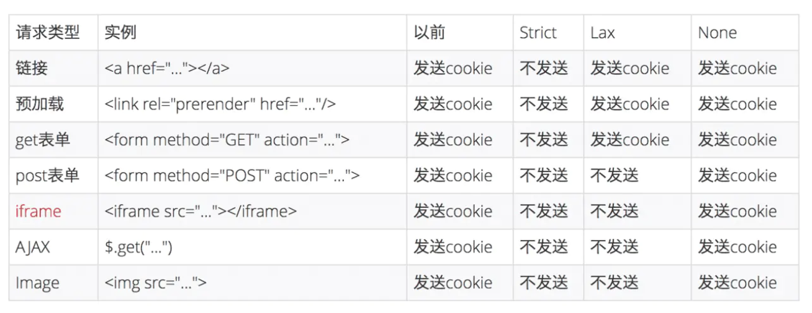

## Cookie属性
### Name/Value
用 JavaScript 操作 Cookie 的时候注意对 Value 进行编码处理。
### Expires
Expires 用于设置 Cookie 的过期时间。比如：
```js
Set-Cookie: id=a3fWa; Expires=Wed, 21 Oct 2015 07:28:00 GMT;
```
当 Expires 属性缺省时，表示是会话性 Cookie，像上图 Expires 的值为 Session，表示的就是会话性 Cookie。当为会话性 Cookie 的时候，值保存在客户端内存中，并在用户关闭浏览器时失效。需要注意的是，有些浏览器提供了会话恢复功能，这种情况下即使关闭了浏览器，会话期 Cookie 也会被保留下来，就好像浏览器从来没有关闭一样。

与会话性 Cookie 相对的是持久性 Cookie，持久性 Cookies 会保存在用户的硬盘中，直至过期或者清除 Cookie。这里值得注意的是，设定的日期和时间只与客户端相关，而不是服务端。
### Max-Age
Max-Age 用于设置在 Cookie 失效之前需要经过的秒数。比如：
```js
Set-Cookie: id=a3fWa; Max-Age=604800;
```
Max-Age 可以为正数、负数、甚至是 0。
如果 max-Age 属性为正数时，浏览器会将其持久化，即写到对应的 Cookie 文件中。
当 max-Age 属性为负数，则表示该 Cookie 只是一个会话性 Cookie。
当 max-Age 为 0 时，则会立即删除这个 Cookie。
假如 Expires 和 Max-Age 都存在，Max-Age 优先级更高。
### Domain
Domain指定了 Cookie 可以送达的主机名。假如没有指定，那么默认值为当前文档访问地址中的主机部分（但是不包含子域名）。
像淘宝首页设置的 Domain 就是 .taobao.com，这样无论是 a.taobao.com 还是 b.taobao.com 都可以使用 Cookie。
在这里注意的是，不能跨域设置 Cookie，比如阿里域名下的页面把 Domain 设置成百度是无效的：
```js
Set-Cookie: qwerty=219ffwef9w0f; Domain=baidu.com; Path=/; Expires=Wed, 30 Aug 2020 00:00:00 GMT
```
### Path
Path 指定了一个 URL 路径，这个路径必须出现在要请求的资源的路径中才可以发送 Cookie 首部。比如设置 Path=/docs，/docs/Web/ 下的资源会带 Cookie 首部，/test 则不会携带 Cookie 首部。

**Domain 和 Path 标识共同定义了 Cookie 的作用域：即 Cookie 应该发送给哪些 URL**。

### Secure属性
标记为 Secure 的 Cookie 只应通过被HTTPS协议加密过的请求发送给服务端。使用 HTTPS 安全协议，可以保护 Cookie 在浏览器和 Web 服务器间的传输过程中不被窃取和篡改。
### HTTPOnly
设置 HTTPOnly 属性可以**防止客户端脚本通过 document.cookie 等方式访问 Cookie，有助于避免 XSS 攻击**。
### SameSite
我们先来看看这个属性的作用：
SameSite属性可以让Cookie在跨站请求时不会被发送，从而可以阻止跨站请求伪造攻击（CSRF）。

SameSite可以有下面三种值：
* Strict 仅允许一方请求携带 Cookie，即浏览器将只发送相同站点请求的 Cookie，即当前网页 URL 与请求目标 URL 完全一致。
* Lax 允许部分第三方请求携带 Cookie
* None 无论是否跨站都会发送 Cookie

之前默认是 None 的，Chrome80 后默认是 Lax。



## Cookie的作用
Cookie 主要用于以下三个方面：

1. 会话状态管理（如用户登录状态、购物车、游戏分数或其它需要记录的信息）
2. 个性化设置（如用户自定义设置、主题等）
3. 浏览器行为跟踪（如跟踪分析用户行为等）
## Cookie 的缺点
可以从大小、安全、增加请求大小等方面回答。

1. 最大只能是4KB
2. 不安全
3. 在请求中传递，无论是否需要，会增加请求大小
## 跨域和跨站
首先要理解的一点就是跨站和跨域是不同的。同站(same-site)/跨站(cross-site)」和第一方(first-party)/第三方(third-party)是等价的。但是与浏览器同源策略（SOP）中的「同源(same-origin)/跨域(cross-origin)」是完全不同的概念。


## 参考文档
1. [Cookie 的 SameSite 属性](http://www.ruanyifeng.com/blog/2019/09/cookie-samesite.html?utm_content=buffer67e06&utm_medium=social&utm_source=twitter.com&utm_campaign=buffer)
2. [预测最近面试会考 Cookie 的 SameSite 属性](https://juejin.im/post/5e718ecc6fb9a07cda098c2d)