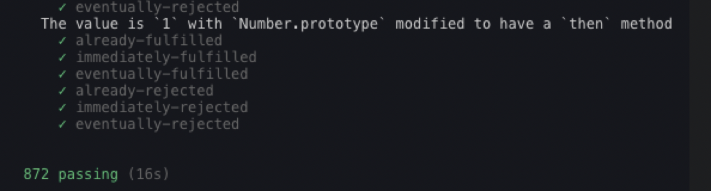

## 同步处理
本文主要是从零开始实现一个符合Promises/A+规范的Promise。

使用过Promise小伙伴都知道Promise是一个类，我们一般通过`new Promise((resolve, reject)=>{})`的方式来使用。Promise构造函数接收一个执行器函数([promisesA+规范](https://promisesaplus.com/)里称为executor，传入就执行)作为参数。

executor里面接收两个参数，一个是resolve，一个是reject。

### Promise基本状态
在[promisesA+规范](https://promisesaplus.com/)中有如下规定：

* Promise存在三种状态pending(等待态)、fulfilled(成功态)、rejected(失败态)；
* pending为初始态，并可以转化为fulfilled和rejected；一旦状态改变，则状态就固化了，不可再变。
* `new Promise((resolve, reject) =>{resolve(value)})`resolve为成功，接收参数value，状态改变为fulfilled，成功之后不可再转为其他状态；
* `new Promise((resolve, reject)=>{reject(reason)})`reject为失败，接收参数reason，状态改变为rejected，失败之后不可再转为其他状态；
* 若是executor函数报错，则直接执行reject()。

### then方法
我们都知道Promise有一个then方法，接收两个参数：onFulfilled和onRejected，分别表示成功后的回调函数和失败后的回调函数。

* 当状态status为fulfilled时，执行onFulfilled，传入this.value。当状态staus为rejected时，执行onRejected，传入this.reason；
* onFulfilled，onRejected如果都是函数，则必须分别在fulfilled，rejected后被调用，value或reason依次作为他们的第一个参数。

经过上面的分析，可以得到以下代码：
```js
const PENDING = 'PENDING';
const FULFILLED = 'FULFILLED';
const REJECTED = 'REJECTED';
class Promise {
    constructor(executor) {
        this.status = PENDING; // 默认当前状态是等待态
        this.value; // 成功后的返回值
        this.reason; // 失败的原因
        // 表示成功的函数
        const resolve = value => {
            // 只有是等待态的时候，才能更改状态
            // 因为Promise状态一旦改变，就不能再发生变化
            if(this.status === PENDING) {
                this.status = FULFILLED;
                this.value = value;
            }
        }
        // 表示失败的函数
        const reject = reason => {
            if(this.status === PENDING) {
                this.status = REJECTED;
                this.reason = reason;
            }
        }
        // 这里可能会发生异常，处理throw new Error('失败了');的情况
        // executor是立即执行
        try {
            executor(resolve, reject);
        } catch (error) {
            // 如果执行时报错了，则直接执行reject方法
            reject(error);
        }
    }
    // then方法接收两个参数，分别是成功的回调和失败的回调
    then(onfulfilled, onrejected) {
        // 如果状态是成功的时候
        if(this.status === FULFILLED) {
            onfulfilled(this.value);
        }
        if(this.status === REJECTED) {
            onrejected(this.reason);
        }
    }
}

module.exports = Promise;
```
上述代码只是实现了executor中同步代码的场景，未考虑异步情况。
## 异步处理
Promise主要是针对异步操作的，下面来处理executor中是异步代码的情况。

之前的版本基本上实现简单的同步代码情况，但是当resolve在setTimeout中执行，在执行then方法的时候，status还是pending等待状态。这种情况就需要在then方法执行的时候，将成功和失败的回调存到各自的回调数组中，一旦Promise状态发生改变(resolve或者reject)，就依次执行对应回调数组中的函数。

实现思路：类似于发布-订阅模式，先将then方法里面的两个函数储存起来，由于一个promise可以有多个then，所以存在同一个数组内。
### 多个then的情况
多个then的情况，其实就是发布-订阅模式。
```js
const Promise = require('./promise');
const promise = new Promise(function(resolve, reject) {
    // throw new Error('错误'); // 执行时可能会发生异常 ，那就内部将错误异常作为原因，让promise变成失败态
    // resolve('成功'); // 同步触发直接执行
    setTimeout(() => { // 异步的情况基于发布订阅
        resolve('成功233'); // 发布
        // reject('失败'); // 发布
    }, 1000);
});
// 同步的时候直接触发，异步的时候发布订阅
// 发布订阅模式

promise.then(function(value) {
    console.log('success', value);
}, function(reason) {
    console.log('fail', reason);
});
promise.then(function(value) {
    console.log('success', value);
}, function(reason) {
    console.log('fail', reason);
});
promise.then(function(value) {
    console.log('success', value);
}, function(reason) {
    console.log('fail', reason);
});
// 一个promise实例 可以then多次，分别绑定成功和失败，当触发resolve和reject的时候，触发对应的成功和失败
```
成功或者失败时，forEach循环调用对应的数组中存储的回调函数。
```js
const PENDING = 'PENDING';
const FULFILLED = 'FULFILLED';
const REJECTED = 'REJECTED';
class Promise {
    constructor(executor) {
        this.status = PENDING; // 默认当前状态是等待态
        this.value; // 成功后的返回值
        this.reason; // 失败的原因
        this.resolveCallbacks = []; // 存放成功回调函数数组
        this.rejectCallbacks = []; // 存放失败回调函数数组
        // 表示成功的函数
        const resolve = value => {
            // 只有是等待态的时候，才能更改状态
            // 因为Promise状态一旦改变，就不能再发生变化
            if(this.status === PENDING) {
                this.status = FULFILLED;
                this.value = value;
                // 依次执行resolveCallbacks中的回调函数
                this.resolveCallbacks.forEach(cb => cb()); // 发布
            }
        }
        // 表示失败的函数
        const reject = reason => {
            if(this.status === PENDING) {
                this.status = REJECTED;
                this.reason = reason;
                // 依次执行rejectCallbacks中的回调函数
                this.rejectCallbacks.forEach(cb => cb()); // 发布
            }
        }
        // 这里可能会发生异常，处理throw new Error('失败了');的情况
        // 默认会调用执行函数
        try {
            executor(resolve, reject);
        } catch (error) {
            // 如果执行时报错了，等同于执行reject方法
            reject(error);
        }
    }
    then(onfulfilled, onrejected) { // 成功的回调和失败的回调
        // 处理executor同步情况，如果状态是成功的时候
        if(this.status === FULFILLED) {
            onfulfilled(this.value);
        }
        // 处理executor同步情况，如果状态是失败的时候
        if(this.status === REJECTED) {
            onrejected(this.reason);
        }
        // 处理executor异步情况
        if(this.status === PENDING) {
            // 异步的情况，先把成功的回调和失败的回调分开存放
            // 先订阅
            this.resolveCallbacks.push(() => {
                onfulfilled(this.value);
            });
            this.rejectCallbacks.push(() => {
                onrejected(this.reason);
            });
        }
    }
}

module.exports = Promise;
```
## Promise 解决过程
Promise的解决过程主要依赖于resolvePromise函数来实现。
### 解决链式调用
我门经常用到`new Promise().then().then()`，这就是链式调用，用来解决回调地狱问题。
#### 注意点1
为了实现链式调用，需要在每一个then方法里返回一个新的promise，且每个then方法中返回的promise都不相同。

[promisesA+规范](https://promisesaplus.com/)规定了一种方法，就是在then方法里面返回一个新的promise对象，称为promise2。

* 将这个promise2返回的值传递到下一个then方法中；
* 如果返回一个普通的值，则将普通的值传递到下一个then方法中。

#### 注意点2
当在第一个then方法中return了一个参数（参数未知，需判断）。这个return出来的新的promise就是onFulfilled()或onRejected()的值。

[promisesA+规范](https://promisesaplus.com/)规定：onFulfilled或onRejected的值，即第一个then返回的值，叫做x，判断x的函数叫做resolvePromise。

* 首先要比较x和promise2，两者相等则是循环引用；
* 其次要看x是不是promise，如果是promise，则取它的结果，作为新的promise2成功的结果；如果是普通值，直接作为promise2成功的结果；
* resolvePromise的参数有四个：promise2、x、resolve、reject，需要注意resolve和reject是promise2的。

### 完善resolvePromise函数
[promisesA+规范](https://promisesaplus.com/)规定：不同的promise代码互相套用，叫做resolvePromise。

#### 循环引用处理
如果`x === promise2`，则是会造成循环引用，自己等待自己完成，则报**循环引用**错误。
```js
// 循环引用
// 保证返回的promise不是当前then返回的promise 否则就变成了自己等待自己完成
const p1 = new Promise((resolve, reject)=>{
    resolve(100);
})
const promise2 = p1.then(()=>{
    return promise2;
});
// 这里promise2再等待自己完成，但是promise2既不能调用resolve，也不能调用reject，因此永远也无法完成
promise2.then(data => {
    console.log(data);
}, err => {
    console.log('err', err);
})
```


#### x的判断
* x 不能是null；
* x 是普通值，直接resolve(x)；
* x 是对象或者函数（包括promise），获取then方法，let then = x.then；
* 当x是对象或者函数（默认promise），声明了then，如果取then报错，则走reject()；
* 如果then是函数，则用call执行then，第一个参数是x(this指向)，后面是成功的回调和失败的回调；
* 如果成功的回调还是pormise，就递归继续解析。

#### 处理x和y都是promise情况(递归解析)
```js
let p1 = new Promise((resolve,reject)=>{
    resolve(100);
})
let promise2 = p1.then(() => {
    // p1的成功回调又返回了promise，即x是promise的情况
    return new Promise((resolve, reject) => {
        setTimeout(() => {
            // resolve(500);
            // 对x调用then，这里resolve了一个promise，即y也是promise
            // 这就需要递归解析了，继续调用resolvePromise方法，直到解析出一个常量为止，最终把常量传递下去
            resolve(new Promise((resolve, reject) => {
                setTimeout(() => {
                     resolve(10000);
                }, 1000)
             }));
        }, 1000)
    })
});
promise2.then(data => {
    console.log(data);
}, err => {
    console.log('err',err);
})
```
```js
// promise的处理函数
const resolvePromise = (promise2, x, resolve, reject) => {
    // 判断x的类型来决定是调用resovle还是reject
    if (promise2 === x) { // 循环引用
        return reject(new TypeError('Chaining cycle detected for promise #<Promise>'));
    }
    // 如果x是函数或者对象
    if ((typeof x === 'object' && x !== null) || typeof x === 'function') {
        try {
            let then = x.then;
            // 如果then是函数，说明x是一个promise
            if (typeof then === 'function') {
                then.call(x, y => {
                    // y可能还是promise
                    // 如果成功的回调返回值还是pormise，就递归继续解析
                    resolvePromise(promise2, y, resolve, reject);
                }, r => {
                    reject(r);
                });
            } else { // x就是一个普通对象或函数，并没有then方法
                resolve(x);
            }
        } catch (error) { // 取then报错就抛出异常
            reject(error);
        }
    } else { // // x是普通值，直接传递给下一个then，常量直接抛出去即可
        resolve(x);
    }
}
```
### 防止多次调用
* 成功和失败只能调用一个，所以设定一个called来防止多次调用。
### 处理then穿透问题
[promisesA+规范](https://promisesaplus.com/)规定：onFulfilled，onRejected都是可选参数，如果他们不是函数，必须被忽略。

* onFulfilled返回一个普通的值，成功时等同于`value => value`；
* onRejected返回一个普通的值，失败时如果直接等于 value => value，则会跑到下一个then中的onFulfilled中，所以直接扔出一个错误`err => {throw err}`；
* onFulfilled或onRejected不能同步被调用，必须异步调用。我们就用setTimeout解决异步问题(onfulfilled, onrejected不能同步被调用的原因是为了确保promise2存在，利用setTimeout将resolvePromise函数执行放到下一次事件循环中)；
* 如果onFulfilled或onRejected报错，则直接返回reject()。

解决方案：onfulfilled, onrejected是可选参数，没有指定的话，赋予默认值。
```js
let p1 = new Promise((resolve,reject)=>{
    // resolve(100);
    reject('出错了');
})

p1.then().then().then(data => {
    console.log(data);
}, err => {
    console.log('err', err);
})
```
可以通过给onfulfilled, onrejected指定默认值来解决then穿透问题。
```js
// onfulfilled, onrejected是可选参数，没有指定的话，赋予默认值
onfulfilled = typeof onfulfilled === 'function' ? onfulfilled : val => val;
onrejected = typeof onrejected === 'function' ? onrejected : err => {throw err};
```
## 实例和静态方法实现
## 实例方法
### Promise.prototype.finally实现
finally方法返回一个Promise。在promise结束时，无论结果是fulfilled还是rejected，都会执行指定的回调函数。这为在不管Promise对象最后状态如何，都需要执行的代码提供了一种方式。

>finally作用：避免了同样的语句需要在then和catch中各写一次的情况。

需要注意：finally方法的回调函数不接受任何参数，这意味着没有办法知道，前面的Promise状态到底是fulfilled还是rejected。这表明，finally方法里面的操作，应该是与状态无关的，不依赖于Promise的执行结果。

应用场景：在提交表单后进行loading加载，不管请求是否成功，都需要取消Loading加载效果。这时就可以在finally中处理这样的逻辑。
#### finally本质上是then方法的特例
```js
promise
.finally(() => {
  // finally中需要执行得语句
});

// 等同于
promise
.then(
  result => {
    // finally中需要执行得语句
    return result;
  },
  error => {
    // finally中需要执行得语句
    throw error;
  }
);
```
上面代码中，如果不使用finally方法，同样的语句需要在成功和失败两种情况中各写一次才能保证该语句一定会被执行。有了finally方法，则只需要写一次。
#### finally实现
核心思路：

1. 当前this指向的是当前Promise对象，所以可以直接用this.then；
2. then回调中的两个参数，一个是成功的回调，另一个是失败的回调，利用这个两个参数处理当前promise对象的两种不同情况；
3. 无论如何都要调用传入的callback函数，并且将当前Promise的决议值继续传递下去。

```js
finally(callback) {
    let P = this.constructor;
    return this.then(
        // P.resolve(callback())的用意在于兼容callback如果是个异步操作，返回promise呢，希望等callback执行完再接着执行。
        value  => P.resolve(callback()).then(() => value), // 成功的回调
        err => P.resolve(callback()).then(() => { throw err; }) // 失败的回调
    );
    // finally的作用是：不管前面的Promise是fulfilled还是rejected，都会执行回调函数callback。
};
```
### catch实现
```js
catch(errCallback) { // catch其实就是没有成功的then
    return this.then(null, errCallback);
}
```
### then方法实现
## 静态方法
### resolve
```js
static resolve(value) {
    return new Promise((resolve, reject) => {
        resolve(value);
    });
}
```
### reject
```js
static reject(error) {
    return new Promise((resolve, reject) => {
        reject(error);
    });
}
```
### race
#### race用法
```js
const p1 = new Promise((resolve, reject) => {
    setTimeout(resolve, 1000, '1秒延迟');
});

const p2 = new Promise((resolve, reject) => {
    setTimeout(resolve, 2000, '2秒延迟');
});

// 这里p1先决议，因此返回p1的结果
Promise.race([p1, p2]).then(data => {
    console.log(data); // 1秒延迟
}).catch(err => {
    console.log('err', err);
});
```
```js
const p1 = new Promise((resolve, reject) => {
    setTimeout(reject, 1000, '1秒延迟');
});

const p2 = new Promise((resolve, reject) => {
    setTimeout(resolve, 2000, '2秒延迟');
});

Promise.race([p1, p2]).then(data => {
    console.log(data);
}).catch(err => {
    // 这里p1先决议，即使p1失败了，也返回p1失败的结果
    console.log('err', err); // err 1秒延迟
});
```
#### race实现
核心思路：谁先决议就返回谁，所以将all中的计数器和逻辑判断全部去除掉就可以了。
```js
static race(promiseArr) {
    return new Promise((resolve, reject) => {
        for(let i = 0; i < promiseArr.length; i++) {
            promiseArr[i].then(resolve, reject);
        };
    });
}
```
```js
static race(iterators) {
    return new Promise((resolve, reject) => {
        for (let p of iterators) {
            Promise.resolve(p).then(data => {
                resolve(data);
            }).catch(err => {
                reject(err);
            })
        }
    });
}
```
这里使用for…of进行遍历，因为凡是可遍历的变量应该都是部署了iterator方法，所以用for…of遍历最安全。
### all
需要注意：Promise.all方法的参数可以不是数组，但必须具有Iterator接口，且返回的每个成员都是Promise实例。
#### 用法
```js
const p1 = Promise.resolve(123);
const p2 = 234;
const p3 = new Promise((resolve, reject) => {
    setTimeout(resolve, 1000, 345);
});
// 所有的promise都变为resolved
Promise.all([p1, p2, p3]).then(data => {
    console.log(data); // [ 123, 234, 345 ]
}).catch(err => {
    console.log('err', err);
});
```
```js
// 如果参数promise中有一个失败，当前Promise回调失败，失败原因的是第一个失败promise的结果
const p1 = Promise.reject('出错了');
const p2 = 234;
const p3 = new Promise((resolve, reject) => {
    setTimeout(resolve, 1000, 345);
});

Promise.all([p1, p2, p3]).then(data => {
    console.log(data);
}).catch(err => {
    console.log('err', err); // err 出错了
});
```
#### 实现思路
1. Promise.all方法返回的肯定是一个promise对象，所以直接这样写return new Promise((resolve, reject)=>{})；
2. 遍历传入的参数，用Promise.resolve()将参数包一层，使不是Promise的参数变成一个Promise对象，而原本就是Promise的参数会原封不动的被返回。
3. 关键点是什么时候resolve，这里通过计数器count来实现，每个参数promise对象决议后就将计数器加1，并将决议结果存储在结果数组中。与此同时，判断当前计数器的值是否与传入的参数个数相等，如果相等则调用resolve()，如果任何一个参数promise对象失败，则调用reject()方法。

细节问题：

1. Promise.all()接受的参数是一个可遍历的参数，所以不一定是一个数组，所以用Array.from()转化一下。

```js
Promise.all = function(promiseArr) {
    return new Promise((resolve, reject) => {
        const arr = [];
        let count = 0;
        function processData(index, data) {
            arr[index] = data;
            count++;
            if (count === promiseArr.length) {
                resolve(arr);
            }
        }
        for (let i = 0; i < promiseArr.length; i++) {
            promiseArr[i].then(data => {
                processData(i, data);
            }, reject);
        }
    });
}
```
```js
static all(iterators) {
        // Promise.resolve方法，将参数转为Promise实例
        const promiseArr = Array.from(iterators);
        const len = promiseArr.length;
        let count = 0;
        const result = [];
        return new Promise((resolve, reject) => {
            promiseArr.forEach((p, index) => {
                Promise.resolve(p)
                    .then(data => {
                        count++;
                        result[index] = data;
                        if (count === len) {
                            resolve(result);
                        }
                    }).catch(err => reject(err));
            });
        });
    }
```
### promisify实现
```js
static promisify(fn) {
    return function() {
        const args = [...arguments];
        return new Promise((resolve, reject) => {
            fn.apply(null, args.concat((err, data) => err ? reject(err) : resolve(data)));
        });
    };
}
```
```js
const fs = require('fs');
const Promise = require('./promise');

// promiseFn是fs.readFile的Promise化版本
const promiseFn = Promise.promisify(fs.readFile);

promiseFn('./age.txt', 'utf8').then(data => {
    console.log(data);
}, err => {
    console.log(err);
});
```
## 最终版本
```js
const PENDING = 'PENDING';
const FULFILLED = 'FULFILLED';
const REJECTED = 'REJECTED';

// promise的处理函数
// promise2参数的目的，主要用来判断是否有循环引用
// resolve, reject参数是promise2的
// x是第一个then方法返回的值
const resolvePromise = (promise2, x, resolve, reject) => {
    // 判断x的类型来决定是调用resovle还是reject
    if (promise2 === x) { // 循环引用
        return reject(new TypeError('Chaining cycle detected for promise #<Promise>'));
    }
    // 如果x是函数或者对象
    if ((typeof x === 'object' && x !== null) || typeof x === 'function') {
        let called; // // 默认没有调用
        try {
            let then = x.then;
            // 如果then是函数，说明x是一个promise
            if (typeof then === 'function') {
                then.call(x, y => {
                    if (called) return;
                    called = true;
                    // y可能还是promise
                    // 如果成功的回调返回值还是pormise，就递归继续解析
                    resolvePromise(promise2, y, resolve, reject);
                }, r => {
                    if (called) return;
                    called = true;
                    reject(r);
                });
            } else { // x就是一个普通对象或函数，并没有then方法
                resolve(x);
            }
        } catch (error) { // 取then报错就抛出异常
            // 成功和失败只能调用一个
            if (called) return;
            called = true;
            reject(error);
        }
    } else { // // x是普通值，直接传递给下一个then，常量直接抛出去即可
        resolve(x);
    }
}
class Promise {
    constructor(executor) {
        this.status = PENDING; // 默认当前状态是等待态
        this.value; // 成功后的返回值
        this.reason; // 失败的原因
        this.resolveCallbacks = []; // 存放成功回调函数数组
        this.rejectCallbacks = []; // 存放失败回调函数数组
        // 表示成功的函数
        const resolve = value => {
            // 只有是等待态的时候，才能更改状态
            // 因为Promise状态一旦改变，就不能再发生变化
            if(this.status === PENDING) {
                this.status = FULFILLED;
                this.value = value;
                // 依次执行resolveCallbacks中的回调函数
                this.resolveCallbacks.forEach(cb => cb()); // 发布
            }
        }
        // 表示失败的函数
        const reject = reason => {
            if(this.status === PENDING) {
                this.status = REJECTED;
                this.reason = reason;
                // 依次执行rejectCallbacks中的回调函数
                this.rejectCallbacks.forEach(cb => cb()); // 发布
            }
        }
        // 这里可能会发生异常，处理throw new Error('失败了');的情况
        // 默认会调用执行函数
        try {
            executor(resolve, reject);
        } catch (error) {
            // 如果执行时报错了，等同于执行reject方法
            reject(error);
        }
    }
    then(onfulfilled, onrejected) { // 成功的回调和失败的回调
        // onfulfilled, onrejected是可选参数，没有指定的话，赋予默认值
        onfulfilled = typeof onfulfilled === 'function' ? onfulfilled : val => val;
        onrejected = typeof onrejected === 'function' ? onrejected : err => {throw err;};
        // 调用then后必须返回一个新的promise，规范里称为promise2
        let promise2;
        promise2 = new Promise((resolve, reject) => {
            // 处理executor同步情况，如果状态是成功的时候
            // 这里需要判断onfulfilled和onrejected的结果(规范里称为x)，如果是普通值则走promise2的成功(resolve)，但是该结果也有可能是新的Promise，因此这里需要做处理
            if(this.status === FULFILLED) {
                // 因为需要使用promise2，为了保证promise2存在，这里需要写成异步的形式
                setTimeout(() => {
                    try {
                        const x = onfulfilled(this.value);
                        // 这里的resolve, reject是promise2的
                        resolvePromise(promise2, x, resolve, reject);
                    } catch (error) {
                        // 如果上一个Promise的onfulfilled函数执行报错，则直接走promise2的reject
                        reject(error);
                    }
                }, 0);
            }
            // 处理executor同步情况，如果状态是失败的时候
            if(this.status === REJECTED) {
                setTimeout(() => {
                    try {
                        const x = onrejected(this.reason);
                        resolvePromise(promise2, x, resolve, reject);
                    } catch (error) {
                        reject(error);
                    }
                }, 0);
            }
            // 处理executor异步情况
            if(this.status === PENDING) {
                // 异步的情况，先把成功的回调和失败的回调分开存放
                // 先订阅
                this.resolveCallbacks.push(() => {
                    setTimeout(() => {
                        try {
                            const x = onfulfilled(this.value);
                            resolvePromise(promise2, x, resolve, reject);
                        } catch (error) {
                            reject(error);
                        }
                    }, 0);
                });
                this.rejectCallbacks.push(() => {
                    setTimeout(() => {
                        try {
                            const x = onrejected(this.reason);
                            resolvePromise(promise2, x, resolve, reject);
                        } catch (error) {
                            reject(error);
                        }
                    }, 0);
                });
            }
        });
        return promise2;
    }
    // catch其实就是没有成功的then
    catch(callback) {
        return this.then(null, callback);
    }
    // finally要放在最后
    finally(callback) {
        let P = this.constructor;
        return this.then(
            value  => P.resolve(callback()).then(() => value), // 成功得回调
            err => P.resolve(callback()).then(() => { throw err; }) // 失败的回调
        );
        // finally的作用是：不管前面的Promise是fulfilled还是rejected，都会执行回调函数callback。
    };

    // 类方法
    static resolve(value) {
        return new Promise((resolve, reject) => {
            resolve(value);
        });
    }
    static reject(error) {
        return new Promise((resolve, reject) => {
            reject(error);
        });
    }
    static race(promiseArr) {
        return new Promise((resolve, reject) => {
            for(let i = 0; i < promiseArr.length; i++) {
                promiseArr[i].then(resolve, reject);
            };
        });
    }
    static all(promiseArr) {
        return new Promise((resolve, reject) => {
            let arr = [];
            let i = 0;
            function processData(index, data) {
                arr[index] = data;
                i++;
                if (i === promiseArr.length) {
                    resolve(arr);
                };
            };
            for(let i = 0; i < promiseArr.length; i++) {
                promiseArr[i].then(data => {
                    processData(i, data);
                }, reject);
            };
        });
    }

    static promisify(fn) {
        return function() {
            const args = [...arguments];
            return new Promise((resolve, reject) => {
                fn.apply(null, args.concat((err, data) => err ? reject(err) : resolve(data)));
            });
        };
    }
}
// 测试promise用
Promise.deferred = function() {
    let dfd = {};
    dfd.promise = new Promise((resolve, reject) => {
        dfd.resolve = resolve;
        dfd.reject = reject;
    });
    return dfd;
};

module.exports = Promise;
```
## 验证promise是否正确
第一步：先在代码中加上下述代码：
```js
// 测试promise用
Promise.deferred = function() {
    let dfd = {};
    dfd.promise = new Promise((resolve, reject) => {
        dfd.resolve = resolve;
        dfd.reject = reject;
    });
    return dfd;
};
```
第二步：全局安装promises-aplus-tests插件：
```js
npm i promises-aplus-tests -g 或者
yarn global add promises-aplus-tests
```
第三步：命令行运行：`promises-aplus-tests [js文件名]`，即可验证。


出现上图，说明全部验证通过。

## 参考文档
1. [BAT前端经典面试问题：史上最最最详细的手写Promise教程](https://juejin.im/post/5b2f02cd5188252b937548ab)
2. [从零开始写一个符合Promises/A+规范的promise](https://mp.weixin.qq.com/s/4yek2gxbU2JZlQ4_Gx8Ovg)
3. [Promise晋级—完全吃透](https://juejin.im/post/5bb4a8f25188255c9538419e)
4. [Promises/A+](https://promisesaplus.com/)
5. [Promise A+ 规范](https://malcolmyu.github.io/2015/06/12/Promises-A-Plus/#note-4)
