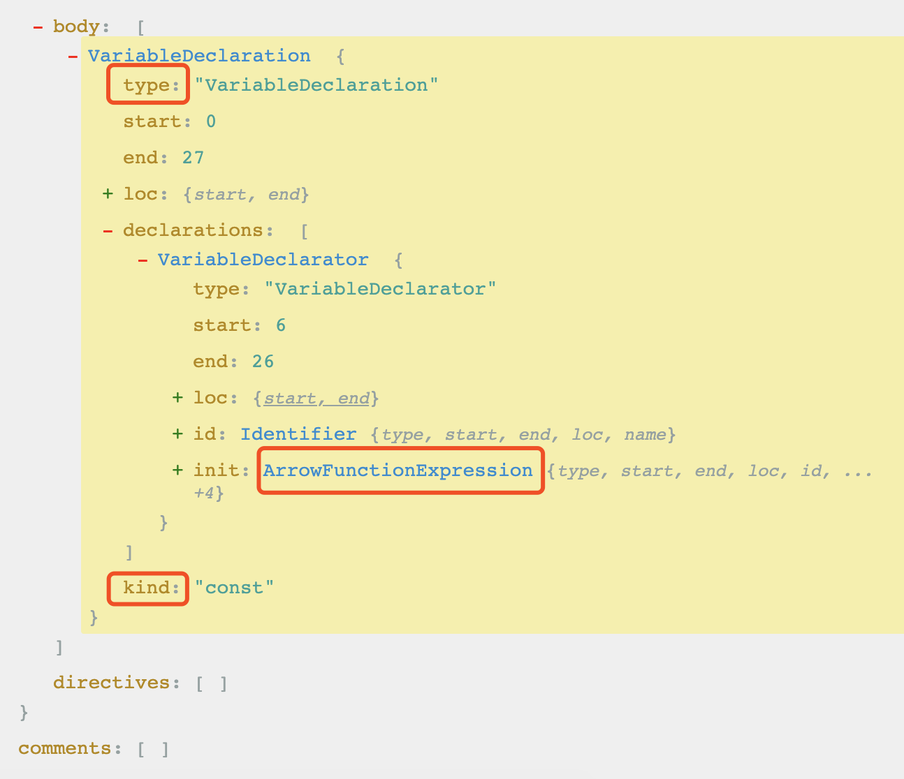
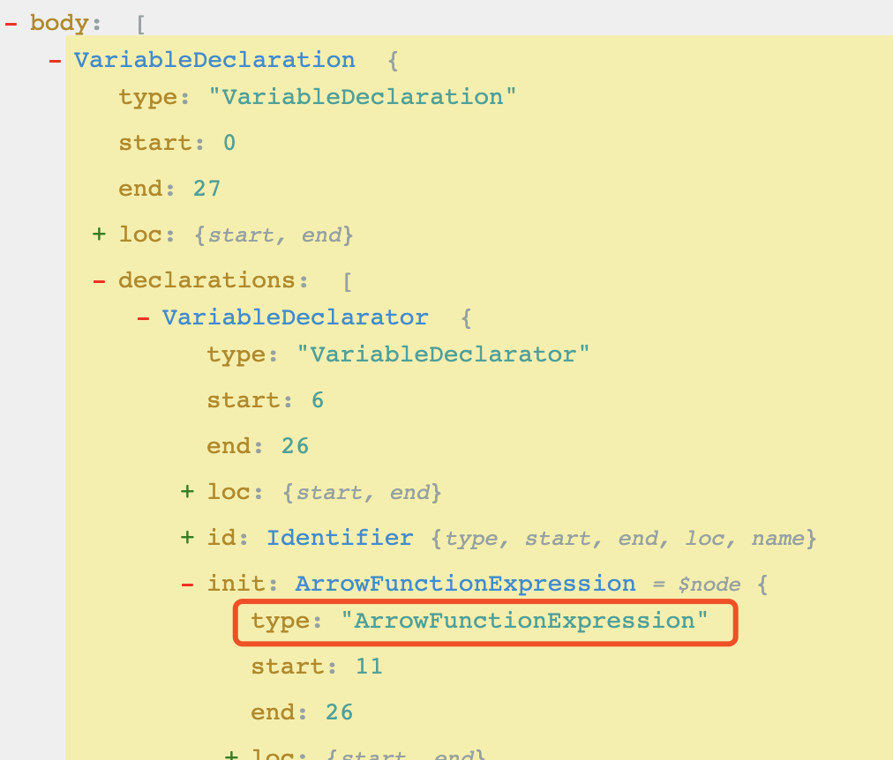
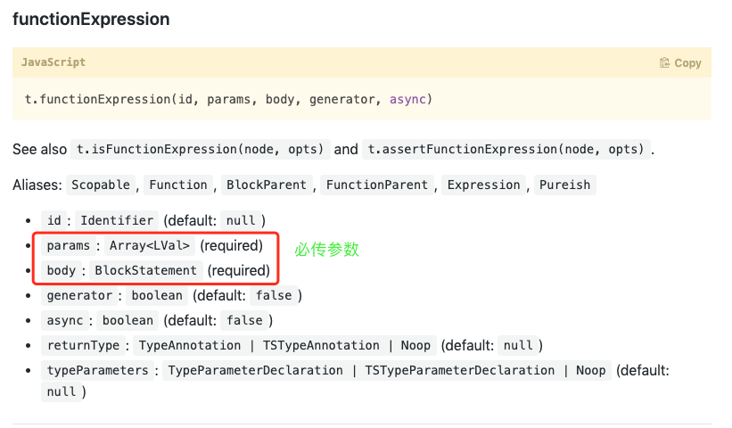
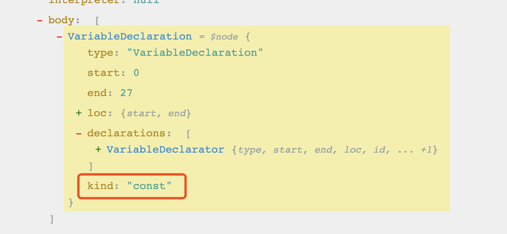
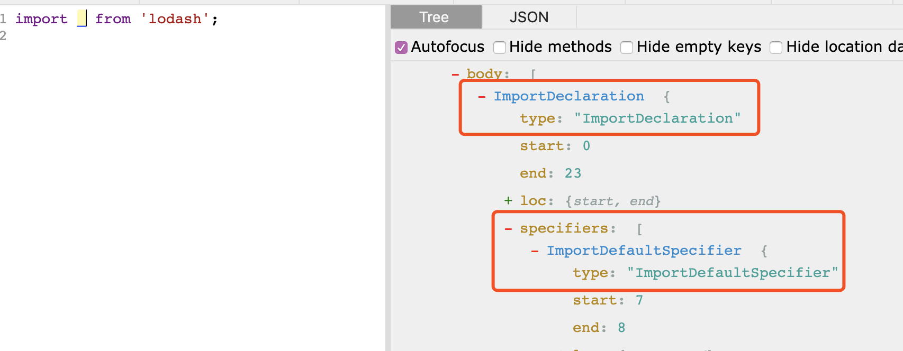
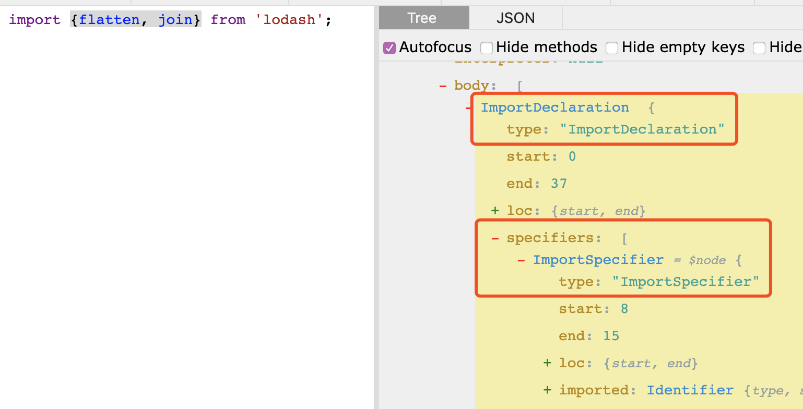
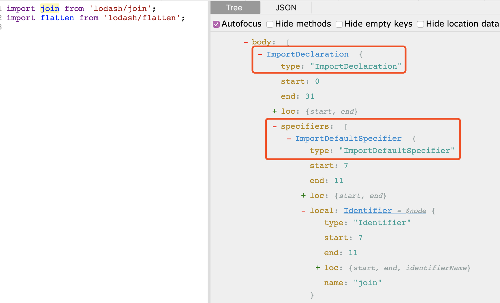

[TOC]
::: tip
写作不易，Star是最大鼓励，感觉写的不错的可以给个Star⭐，请多多指教。[本博客的Github地址](https://github.com/liujie2019/VuePress-Blog)。
:::
## babel概述
babel可以看作是一个转换器，把一些代码转成浏览器可以运行的代码。其转换过程可以分为3个步骤：
1. 源码解析生成AST：将代码解析成抽象语法树（AST），每个js引擎（比如Chrome浏览器中的V8引擎）都有自己的AST解析器，而Babel是通过Babylon实现的。在解析过程中有两个阶段：词法分析和语法分析，词法分析阶段把字符串形式的代码转换为令牌（tokens）流，令牌类似于AST中节点；而语法分析阶段则会把一个令牌流转换成 AST的形式，同时这个阶段会把令牌中的信息转换成AST的表述结构。
2. AST转换成新的AST：在这个阶段，Babel接受得到AST并通过babel-traverse对其进行深度优先遍历，在此过程中对节点进行添加、更新及移除操作。这部分也是Babel插件介入工作的部分。
3. 用新的AST生成新的代码：将经过转换的AST通过babel-generator再转换成js代码，过程就是深度优先遍历整个AST，然后构建可以表示转换后代码的字符串。

## AST(Abstract Syntax Tree)
我们知道，babel的作用其实就是一个转换器，把我们的代码转成浏览器可以运行的代码。编译代码都是一个文件一个文件的处理，把代码读出来，然后经过处理，再输出，在处理的过程中每个文件的代码其实就是个大的字符串。但是我们要把有些语法修改，比如let定义变量改成var定义，很明显用字符串替换是不现实的，这里babel是把代码转成ast语法树，然后经过一系列操作之后再转成字符串输出。

## 访问者模式
访问者模式是一种将算法与对象结构分离的软件设计模式。

这个模式的基本想法如下：首先我们拥有一个由许多对象构成的对象结构，这些对象的类都拥有一个accept方法用来接受访问者对象；访问者是一个接口，它拥有一个visit方法，这个方法对访问到的对象结构中不同类型的元素作出不同的反应；在对象结构的一次访问过程中，我们遍历整个对象结构，对每一个元素都实施accept方法，在每一个元素的accept方法中回调访问者的visit方法，从而使访问者得以处理对象结构的每一个元素。我们可以针对对象结构设计不同的访问者类来完成不同的操作。———— 维基百科

具体来说，我们的AST的每一个Node有一个accept方法，当我们用一个 visitor 来遍历我们的 AST 时，每遍历到一个 Node 就会调用这个 Node 的 accept 方法来接待这个visitor，而在 accept 方法内，我们会回调 visitor 的 visit 方法。我们来用访问者模式来实现一个旅行者访问城市景点的逻辑。

实际上Node是有两个方法，enter和exit，指遍历进入和离开 Node 的时候。通常访问者的 visit 方法会在 enter 内被调用。
### Visitors（访问者）
当我们谈及“进入”一个节点，实际上是说我们在访问它们， 之所以使用这样的术语是因为有一个访问者模式（visitor）的概念。

访问者是一个用于 AST 遍历的跨语言的模式。 简单的说它们就是一个对象，定义了用于在一个树状结构中获取具体节点的方法。 这么说有些抽象所以让我们来看一个例子。
```js
const MyVisitor = {
  Identifier() {
    console.log("Called!");
  }
};
```
>注意： Identifier() { ... } 是 Identifier: { enter() { ... } } 的简写形式。

这是一个简单的访问者，把它用于遍历中时，每当在树中遇见一个 Identifier 的时候会调用 Identifier() 方法。

所以在下面的代码中 Identifier() 方法会被调用四次（包括 square 在内，总共有四个 Identifier）。)
```js
function square(n) {
  return n * n;
}
```
```js
Called!
Called!
Called!
Called!
```
这些调用都发生在进入节点时，不过有时候我们也可以在退出时调用访问者方法。

假设我们有一个树状结构：
```js
- FunctionDeclaration
  - Identifier (id)
  - Identifier (params[0])
  - BlockStatement (body)
    - ReturnStatement (body)
      - BinaryExpression (argument)
        - Identifier (left)
        - Identifier (right)
```
当我们向下遍历这颗树的每一个分支时我们最终会走到尽头，于是我们需要往上遍历回去从而获取到下一个节点。 向下遍历这棵树我们进入每个节点，向上遍历回去时我们退出每个节点。

让我们以上面那棵树为例子走一遍这个过程。
* 进入 FunctionDeclaration
    * 进入 Identifier (id)
    * 走到尽头
    * 退出 Identifier (id)
    * 进入 Identifier (params[0])
    * 走到尽头
    * 退出 Identifier (params[0])
    * 进入 BlockStatement (body)
        * 进入 ReturnStatement (body)
        * 进入 BinaryExpression (argument)
        * 进入 Identifier (left)
            * 走到尽头
        * 退出 Identifier (left)
        * 进入 Identifier (right)
            * 走到尽头
        * 退出 Identifier (right)
        * 退出 BinaryExpression (argument)
    * 退出 ReturnStatement (body)
    * 退出 BlockStatement (body)
* 退出 FunctionDeclaration

所以当创建访问者时你实际上有两次机会来访问一个节点。
```js
const MyVisitor = {
  Identifier: {
    enter() {
      console.log("Entered!");
    },
    exit() {
      console.log("Exited!");
    }
  }
};
```
## 遍历
想要转换AST你需要进行递归的树形遍历。

比如：我们有一个 FunctionDeclaration 类型。它有几个属性：id，params，和 body，每一个都有一些内嵌节点。
```js
{
  type: "FunctionDeclaration",
  id: {
    type: "Identifier",
    name: "square"
  },
  params: [{
    type: "Identifier",
    name: "n"
  }],
  body: {
    type: "BlockStatement",
    body: [{
      type: "ReturnStatement",
      argument: {
        type: "BinaryExpression",
        operator: "*",
        left: {
          type: "Identifier",
          name: "n"
        },
        right: {
          type: "Identifier",
          name: "n"
        }
      }
    }]
  }
}
```
## 实现箭头函数转换插件
* @Babel/type：类似lodash那样的工具集，主要用来操作AST节点，比如创建、校验、转变等。举例：判断某个节点是不是标识符(identifier)。
* path：AST中有很多节点，每个节点可能有不同的属性，并且节点之间可能存在关联。path是个对象，它代表了两个节点之间的关联。你可以在path上访问到节点的属性，也可以通过path来访问到关联的节点（比如父节点、兄弟节点等）
* state：代表了插件的状态，你可以通过state来访问插件的配置项。
* visitor：Babel采取递归的方式访问AST的每个节点，之所以叫做visitor，只是因为有个类似的设计模式叫做访问者模式，不用在意背后的细节。
* Identifier：AST的每个节点，都有对应的节点类型，比如标识符（Identifier）、函数声明（FunctionDeclaration）等，可以在visitor上声明同名的属性，当Babel遍历到相应类型的节点，属性对应的方法就会被调用，传入的参数就是path、state。

插件功能：
1. 把箭头函数转换成普通function；
2. const转换成var。

```js
// 源代码为：
const fn = (a, b) => a + b
// 转换后的结果如下：
var fn = function fn(a, b) {
  return a + b;
};
```
分析：
通过[astexplorer](https://astexplorer.net/)将源代码转为AST，如下图所示：


从上图中可以发现：**每个节点都有一个type字段，代表当前节点的类型**，（如："FunctionDeclaration"，"Identifier"，或 "BinaryExpression"）。AST的节点类型有很多，更多的type可以到这里[节点类型](https://github.com/babel/babylon/blob/master/ast/spec.md)查看。

### 实现插件核心方法和工具
#### visitor
visitor对象简单理解就是**一些监听函数的集合**，当babel在处理AST的每个节点时，如果在visitor中存在声明某个节点类型的方法，那么当babel处理AST此类型节点时就会执行对应的方法，举个🌰：
```js
visitor: {
    Identifier(path, state) { // 当节点类型为identifier时，就会执行该方法
        console.log('Called!');
    }
}
```
#### 如何添加visitor对象的节点监听方法？
我们可以将需要转换的源码放到[astexplorer](https://astexplorer.net/)中转换成AST，然后找到对应节点的type字段，type字段的值就是就我们要在visitor对象里添加的方法名称。
### Path
Path是一个对象，它表示两个节点之间的连接。在visitor对象声明的方法中，第一个参数是path，是捕获到的节点对应的信息，包含了当前节点的信息以及对节点的添加、更新、移动和删除等方法。更多详细信息见[path源码](https://github.com/babel/babel/blob/master/packages/babel-traverse/src/path/index.js)。

我们可以通过path.node获得这个节点的AST，在这个基础上进行修改就能完成了我们的目标。
```js
── 属性
  - node   当前节点
  - parent  父节点
  - parentPath 父path
  - scope   作用域
  - context  上下文
  - ...
── 方法
  - get   当前节点
  - findParent  向父节点搜寻节点
  - getSibling 获取兄弟节点
  - replaceWith  用AST节点替换该节点
  - replaceWithMultiple 用多个AST节点替换该节点
  - insertBefore  在节点前插入节点
  - insertAfter 在节点后插入节点
  - remove   删除节点
  - ...

```
### @babel/types
`@babel/types`是用于处理AST节点的工具库，包含了构造、验证AST节点等方法。具体请参考[@babel/types相关API](https://babeljs.io/docs/en/babel-types#blockstatement)
### 实现箭头函数转换为function函数
第一步：给visitor对象添加对应节点的监听方法。可以从AST中找到箭头函数类型的监听方法的写法，如下图所示：


从上图中可以看出箭头函数类型是ArrowFunctionExpression，所以visitor里的写法如下：
```js
visitor: {
  ArrowFunctionExpression: (path, state) => {}
}
```
第二步：转换AST。要将箭头函数转换为function普通函数，需要使用`@babel/types`的function函数构造方法来构造一个function函数节点，然后将原来的箭头函数节点替换掉即可，具体使用方法见[@babel/types](https://babeljs.io/docs/en/babel-types#functionexpression)。


### 实现const转换成var
第一步：给visitor对象添加对应节点的监听方法。可以从AST中找到变量声明的type为VariableDeclaration，即visitor对象对应的方法名。
```js
visitor: {
  VariableDeclaration: (path, state) => {}
}
```
第二步：转换AST


如上图所示：VariableDeclaration类型的节点有一个变量kind标识着声明变量的方式，所以要实现将const转换为var，那可以直接在visitor里监听的VariableDeclaration方法中将该节点的kind属性赋值为var即可：
```js
visitor: {
  VariableDeclaration: (path, state) => {
      const {node} = path;
      if (node.kind === 'const' || node.kind === 'let') {
          node.kind = 'var'; // 方式1：直接替换
      }
  }
}
```
除了上述直接替换的方式，我们也可以通过替换当前节点的方式来达到同样的效果。上文说过`@babel/types`用于处理AST节点的工具库，包含了构造、验证AST节点等方法。所以我们可以直接用`@babel/types`定义的构造方法来构造一个variableDeclaration节点，代码实现如下：
```js
visitor: {
  VariableDeclaration: (path, state) => {
      const {node} = path;
      if (node.kind === 'const' || node.kind === 'let') {
          // 基于@babel/types的VariableDeclaration方法构造一个variableDeclaration节点
          const variableDeclaration = type.VariableDeclaration('var', node.declarations)
          // replaceWith为替换节点的方法
          path.replaceWith(variableDeclaration);
      }
  }
}
```
最终实现如下：
```js
const babel = require('@babel/core');
const type = require('@babel/types');

const transformArrowFunction = {
    // 该visitor包含两个节点监听方法VariableDeclaration和ArrowFunctionExpression
    visitor: {
        // 将const和let转换为var
        // 每个节点都有一个type字段，type值为VariableDeclaration会被匹配成功
        VariableDeclaration: (path, state) => {
            const {node} = path;
            if (node.kind === 'const' || node.kind === 'let') {
                // node.kind = 'var'; // 方式1：直接替换
                // 方式2：采用replaceWith
                // 基于@babel/types的VariableDeclaration方法构造一个variableDeclaration节点
                const variableDeclaration = type.VariableDeclaration('var', node.declarations)
                // replaceWith为替换节点的方法
                path.replaceWith(variableDeclaration);
            }
        },
        // Visitor中的每个函数接收2个参数：path和state
        // path是表示两个节点之间连接的对象
        ArrowFunctionExpression: (path, state) => {
            // console.log(path);
            // node就是ArrowFunctionExpression匹配到的当前节点
            // parent是当前节点的父节点
            const {node, parent} = path;
            const id = parent.id;
            const params = node.params; // 获取参数
            // 将BinaryExpression转换为BlockStatement
            const body = type.blockStatement([
                // node.body原来是a+b，即BinaryExpression
                type.returnStatement(node.body)
            ]);
            // 生成对应的functionExpression
            const functionExpression = type.functionExpression(id, params, body, false, false);
            // 节点替换，将匹配到的ArrowFunctionExpression替换为新生成的FunctionExpression
            path.replaceWith(functionExpression);
        }
    }
};

const code = 'const fn = (a, b) => a + b';
const result = babel.transform(code, {
    plugins: [
        transformArrowFunction
    ]
});

console.log(result.code);
```
## 预计算插件
```js
const babel = require('@babel/core');
const type = require('@babel/types');
const code = 'const num = 2 * 3 * 4 * 5';

const preCalculatePlugin = {
    visitor: {
        BinaryExpression: (path, state) => {
            const node = path.node;
            const {left, right, operator} = node;
            if (!isNaN(left.value) && !isNaN(right.value)) {
                let result = eval(left.value + operator + right.value);
                result = type.numericLiteral(result);
                path.replaceWith(result);
                // 如果当前节点的父节点也是表达式的话，需要递归计算
                if (path.parentPath.node.type === 'BinaryExpression') {
                    preCalculatePlugin.visitor.BinaryExpression.call(null, path.parentPath);
                }
            }
        }
    }
}

const res = babel.transform(code, {
    plugins: [preCalculatePlugin]
});

console.log(res.code); // const num = 120;
```
## 实现按需加载插件
### 默认导入不做处理


上图导入的方式为默认导入，不做处理。
```js
// 判断是否是默认导入
types.isImportDefaultSpecifier(specifiers[0]))
```



从上面两个图中，可以看出两种导入方式的区别在于specifiers的类型不同。因此，只要重新生成newImportSpecifiers即可，最终代码实现如下：
```js
const types = require('@babel/types');

const visitor = {
    // 这里的ref是ImportDeclaration的第二个参数，值是.babelrc中的{"library": "lodash"}
    ImportDeclaration(path, ref = {opts: {}}) {
        const {opts} = ref;
        const node = path.node; // 拿到当前节点
        const specifiers = node.specifiers;
        // isImportDefaultSpecifier判断是否是默认导入，是的话不做处理
        if (opts.library === node.source.value && !types.isImportDefaultSpecifier(specifiers[0])) {
            const newImportSpecifiers = specifiers.map(specifier => (
                    types.importDeclaration([types.ImportDefaultSpecifier(specifier.local)],
                    types.stringLiteral(`${node.source.value}/${specifier.local.name}`
                ))
            ));
            path.replaceWithMultiple(newImportSpecifiers);
        }
    }
}

module.exports = () => {
    return {visitor};
}
```
```js
// .babelrc配置：
{
    "presets": ["@babel/preset-env"],
    "plugins": [
        [
            "dynamic-import",
            {
                "library": "lodash" // 引用哪个库的时候使用我们写的这个插件
            }
        ]
    ]
}
```
最后将编写好的插件放入到`/node_modules/babel-plugin-dynamic-import/`文件夹下，并在package.json文件中指明入口。

没有按需加载前的打包结果如下：
```js
yarn run v1.16.0
$ webpack --mode development
Hash: 8e4da5b2edbe6c47dd1c
Version: webpack 4.41.2
Time: 325ms
Built at: 2019-11-13 19:45:03
    Asset     Size  Chunks             Chunk Names
bundle.js  552 KiB    main  [emitted]  main
Entrypoint main = bundle.js
[./node_modules/webpack/buildin/global.js] (webpack)/buildin/global.js 472 bytes {main} [built]
[./node_modules/webpack/buildin/module.js] (webpack)/buildin/module.js 497 bytes {main} [built]
[./src/index.js] 37 bytes {main} [built]
    + 1 hidden module
✨  Done in 1.53s.
```
采用按需加载前的打包结果如下：
```js
yarn run v1.16.0
$ webpack --mode development
Hash: 58ece130df8aef56b95d
Version: webpack 4.41.2
Time: 105ms
Built at: 2019-11-13 19:46:28
    Asset      Size  Chunks             Chunk Names
bundle.js  20.9 KiB    main  [emitted]  main
Entrypoint main = bundle.js
[./node_modules/webpack/buildin/global.js] (webpack)/buildin/global.js 472 bytes {main} [built]
[./src/index.js] 110 bytes {main} [built]
    + 15 hidden modules
✨  Done in 0.67s.
```
### 注意事项
1. babel插件的文件夹命名，必须以babel-plugin-xxx命名，否则引入不成功；
2. babel插件返回的是一个对象，里面有一个visitor对象。

## demo
```js
// 这里手动指定环境变量为development，在命令行执行如下命令：
NODE_ENV=development npx babel index.js
// 转换结果如下：
if ("development" === 'development') {
  console.log('开发环境');
}
```
## @babel/parser(Babylon的升级)
能传递选项给 parse()：
```js
babylon.parse(code, {
  sourceType: "module", // default: "script"
  plugins: ["jsx"] // default: []
});
```
sourceType 可以是 "module" 或者 "script"，它表示 Babylon 应该用哪种模式来解析。 "module" 将会在严格模式下解析并且允许模块定义，"script" 则不会。

>注意：sourceType 的默认值是 "script" 并且在发现 import或 export 时产生错误，使用 scourceType: "module" 来避免这些错误。

## 总结
插件其实就是基于源代码的AST，利用一些工具生成目标代码的AST的过程。

## 参考文档
1. [Babel 插件开发指南](https://github.com/brigand/babel-plugin-handbook/blob/master/translations/zh-Hans/README.md#babylon)
2. [Babel 插件开发入门指南](http://web.jobbole.com/94758/?utm_source=blog.jobbole.com&utm_medium=relatedPosts)
3. [自己写一个Babel插件](https://www.colabug.com/4556670.html)
4. [理解 Babel 插件](http://taobaofed.org/blog/2016/09/30/babel-plugins/)
6. [Babel插件开发入门指南](https://www.cnblogs.com/chyingp/p/how-to-write-a-babel-plugin.html)
7. [原来babel插件是这样写的](https://juejin.im/post/5d5bdb02e51d4561db5e3a52#heading-1)
8. [AST 与前端工程化实战](https://juejin.im/post/5d50d1d9f265da03aa25607b#heading-15)
9. [Parser_API](https://developer.mozilla.org/zh-CN/docs/Mozilla/Projects/SpiderMonkey/Parser_API)
10. [如何编写一个 babel 插件](https://www.imliyan.com/blogs/article/%E5%A6%82%E4%BD%95%E7%BC%96%E5%86%99%E4%B8%80%E4%B8%AA%20babel%20%E6%8F%92%E4%BB%B6/)
11. [重拳出击：打造 Vue3.0 + Typescript + TSX 开(乞)发(丐)模式](https://www.codenong.com/j5e3251546fb9a02ff84/)
12. [深入Babel，这一篇就够了](https://juejin.im/post/5c21b584e51d4548ac6f6c99#heading-1)
13. [13 个示例快速入门 JS 抽象语法树](https://juejin.im/post/5b4d759d51882519a62f5b64#heading-72)
14. [入门babel--实现一个es6的class转换器](https://juejin.im/post/5ac1c5bf518825558949f898)