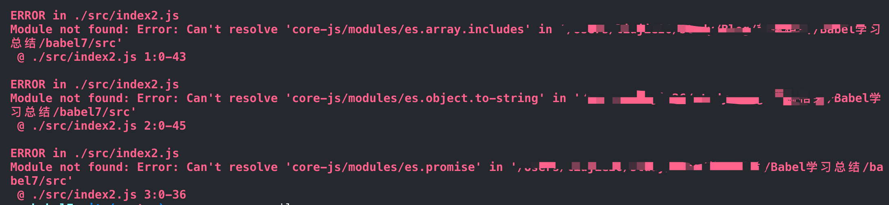

## 什么是babel
`Babel`是一个`JavaScript`编译器，主要用于在旧的浏览器或环境中将`ECMAScript 2015+`代码转换为向后兼容版本的`JavaScript`代码，这一过程叫做`源码到源码`编译，也被称为转换编译。其主要作用如下：

1. 转换语法；
2. `Polyfill`实现目标环境中缺少的功能(通过`@babel/polyfill`)；
3. 源代码转换。

## 常用包
* [@babel/core](https://babeljs.io/docs/en/babel-core)：核心包，Babel的编译器(将 js 代码编译成 AST)，核心API都在这里面，比如常见的 transform、parse。
* [@babel/cli](https://babeljs.io/docs/en/babel-cli)：Babel命令行工具，安装了@babel/cli就能够在命令行中使用babel命令来编译文件。当然我们一般不会用到，打包工具已经帮我们做好了。
* [@babel/preset-env](https://babeljs.io/docs/en/babel-preset-env): 包含 es6+ 的语法转换规则，如箭头函数、const 等
* [@babel/polyfill](https://babeljs.io/docs/en/babel-polyfill): es6 内置对象和函数的垫片，如 Promise、Array.from 等
* [@babel/plugin-transform-runtime](https://babeljs.io/docs/en/babel-plugin-transform-runtime): 防止 polyfill 污染全局变量
* [@babel/runtime](https://babeljs.io/docs/en/babel-runtime): 与 @babel/plugin-transform-runtime 配套使用
* @babel/node：直接在node环境中运行ES6的代码。
* babylon：Babel解析器。
* @babel/traverse：用于遍历AST，维护了整棵树的状态，并且负责替换、移除和添加节点。
* @babel/types：用于AST节点的 Lodash 式工具库, 它包含了构造、验证以及变换 AST 节点的方法，对编写处理 AST 逻辑非常有用。
* @babel/generator：Babel的代码生成器，它读取AST并将其转换为代码和源码映射(sourcemaps)。

### @babel/core(核心库)

 `@babel/core` 在`npm`官网中的解释是：`Babel compiler core`，也就是`Babel`编译器的核心。因此，如果想要进行`es6`的编码，首先需要安装`@babel/core`。

特别说明：`@babel/core`安装了就行，无需手动配置和引入。

###@babel/cli(命令行工具)

`@babel/cli`是`babel`提供的命令行工具，用于**命令行下**编译`ES6+`代码。

```js
// 初始化项目
npm init -y
// 安装依赖
yarn add -D @babel/core @babel/cli
```
安装了@babel/cli后，就能够在命令行中使用 `babel` 命令来编译文件。

在`babel6`中，安装依赖是通过如下命令：

```js
yarn add -D babel-cli
```
这里的`@`符号是什么意思？这是`babel7`的一大调整，原来的`babel-xx`包统一迁移到[Babel域下](https://docs.npmjs.com/misc/scope)-域由`@`符号来标识，一来便于区别官方与非官方的包，二来避免可能的包命名冲突。

现在假定我们的项目下有一个`script.js`文件，内容是：
```js
let fn = () => console.log('hello babel');
```
我们试试运行`npx babel script.js`：
```js
let fn = () => console.log('hello babel');
```
还是原来的代码，没有任何变化。说好的编译呢？

这个调整则是在`babel6`里发生的。`Babel6`做了大量模块化的工作，将原来集成一体的各种编译功能分离出去，独立成插件。现在我们没有配置任何插件，编译前后的代码是完全一样的。这意味着，默认情况下，当下版本的`babel`不会编译代码。因此，babel 本身不具有任何转化功能，它把转化的功能都分解到一个个 plugin 里面。因此当我们不配置任何插件时，经过 babel 的代码和输入是相同的。

或者可以通过配置scripts脚本来编译：可以使用 `npm run compiler` 来执行代码编译。

```js
"scripts": {    
		"compiler": "babel src --out-dir dist --watch"
}
```

### @babel/node

在`babel 7`之前的版本中，`babel-cli`工具自带一个`babel-node`命令，提供一个支持`ES6`的`REPL`环境。它支持`Node`的 `REPL`环境的所有功能，而且可以直接运行`ES6`代码。`babel-node`不需要单独安装，而是随`babel-cli`一起安装。然后，执行`babel-node`就进入`REPL`环境。

`babel-node`命令可以直接运行`ES6`脚本。将上面的代码放入脚本文件`es6.js`，然后直接运行。

```js
babel-node es6.js
```

在`Babel 7`中，这个命令被分成了单独的`@babel/node`包，所以，如果想要使用`babel-node`命令，需要在项目中添加这个新的依赖。

`@babel/node`的作用是在 node 环境中，直接运行 es2015 的代码，而不需要额外进行转码

```js
npm i @babel/node -D
// 进入`REPL`环境
npx babel-node
// 编译并运行test.js
npx babel-node test.js
```

特别说明：npx是一个npm包执行器。

可以说：`@babel/node` = `@babel/polyfill` + `@babel/register`。

### @babel/register

`@babel/register` 模块改写 `require` 命令，为它加上一个钩子。此后，每当使用 `require` 加载 `.js`、`.jsx`、`.es` 和 `.es6` 后缀名的文件，就会先用 babel 进行转码。

使用时，必须首先加载 `require('@babel/register')`。

需要注意的是，`@babel/register` 只会对 `require` 命令加载的文件转码，而 **不会对当前文件转码**。

另外，由于它是实时转码，所以 **只适合在开发环境使用**。

### @babel/polyfill

babel 默认只转换 js 语法，而不转换新的 API，比如 Iterator、Generator、Set、Maps、Proxy、Reflect、Symbol、Promise 等全局对象，以及一些定义在全局对象上的方法(比如 `Object.assign`)都不会转码。

举例来说，es2015 在 Array 对象上新增了 `Array.from` 方法。babel 就不会转码这个方法。如果想让这个方法运行，必须使用 `@babel/polyfill`。(内部集成了 `core-js` 和 `regenerator`)

使用时，在所有代码运行之前增加 `require('@babel/polyfill')`。或者更常规的操作是在 `webpack.config.js` 中将 `@babel/polyfill` 作为第一个 entry。因此必须把 `@babel/polyfill` 作为 `dependencies` 而不是 `devDependencies`

`@babel/polyfill` 主要有以下两个缺点：

1. 使用 `@babel/polyfill` 会导致打出来的包非常大，因为 `@babel/polyfill` 是一个整体，把所有方法都加到原型链上。比如：我们只使用了 `Array.from`，但它把 `Object.defineProperty` 也给加上了，这就是一种浪费了。这个问题可以通过单独使用 `core-js` 的某个类库来解决，`core-js` 都是分开的。
2. `@babel/polyfill` 会污染全局变量，给很多类的原型链上都作了修改，如果我们开发的也是一个类库供其他开发者使用，这种情况就会变得非常不可控。

### 小结

|                       名称                       |                             作用                             |                             备注                             |
| :----------------------------------------------: | :----------------------------------------------------------: | :----------------------------------------------------------: |
|                    @babel/cli                    |              支持命令行使用babel命令来编译文件               |                                                              |
|                   @babel/node                    |       支持命令行使用babel-node命令直接转译和执行js文件       |          从@babel/cli分离出来了，使用时需要单独安装          |
|                 @babel/register                  |  改写require命令，为其加载的文件进行转码，不对当前文件转码   |                       只适用于开发环境                       |
|                 @babel/polyfill                  |                    为所有API增加兼容方法                     | @babel/polyfill需要安装为依赖，需要在所有代码之前引入，且体积比较大 |
| @babel/plugin-transform-runtime & @babel/runtime | 把帮助类方法从每次使用前注入到对应文件中改为同一require，减少冗余代码 |         @babel/runtime需要安装为依赖，而不是开发依赖         |
|                   babel-loader                   |                   webpack和babel之前的桥梁                   |                                                              |

## babel插件

#### 插件的使用

如果需要将上面的箭头函数编译成`ES5`函数，需要安装额外的`babel`插件。
```js
yarn add -D @babel/plugin-transform-arrow-functions
```
然后，在命令行编译时指定使用该插件：
```js
npx babel script.js --plugins @babel/plugin-transform-arrow-functions
```
```js
// 箭头函数编译成功
let fn = function () {
  return console.log('hello babel');
};
```
随着各种功能插件的加入，我们的命令行参数会越来越长。这时，我们可以新建一个`.babelrc`文件，把各种命令行参数统一到该配置文件中。如果插件发布在 `npm` 上，可以直接填写插件的名称， `Babel` 会自动检查它是否已经被安装在 `node_modules` 目录下，在项目目录下新建 `.babelrc` 文件 ，比如，要配置前面提到过的箭头函数插件：

```js
{
  "plugins": ["@babel/plugin-transform-arrow-functions"]
}
```
```js
{    
  "plugins": ["./node_modules/@babel/plugin-transform-arrow-functions"]
}
```

执行 `npm run compiler`，babel`会自动读取`.babelrc`里的配置并应用到编译，可以看到箭头函数已经被编译OK，`dist/index.js内容如下:

```js
let fn = function () {
  return console.log('hello babel');
};
```
现在，我们仅支持转换箭头函数，如果想将其它的新的ES2015+特性转换成低版本，需要使用其它对应的 `plugin` 。如果我们一个个配置的话，会非常繁琐，因为你可能需要配置几十个插件，这显然非常不便，那么有没有什么办法可以简化这个配置呢？

有！预设！！！

## 预设(presets)

通过使用或创建一个 `preset` 即可**轻松**使用一组插件。简单来讲，presets就是一系列插件的集合。

1. `preset`中包含了一组`Babel`插件用来转换`ES2015+`语法，如果代码中只用到了少数新语法和新API，可以不使用`preset`而只使用对应的转换插件和`polyfill`；
2. 需要注意的是：babel默认只转换语法，而不转换新的API，如需使用新的API，还需要使用对应的转换插件或者polyfill。

常见的官网预设如下：

- @babel/preset-env
- @babel/preset-flow
- @babel/preset-react
- @babel/preset-typescript

> 需要注意：从 Babel v7 开始，所有针对标准提案阶段的功能所编写的预设(stage preset)都已被弃用，官方已经移除了 `@babel/preset-stage-x`。

### @babel/preset-env

如果项目中的页面要求支持`IE10`，但`IE10`不支持箭头函数、class及const这些新增的JavaScript语法，假如项目里写了这么一段代码：

```js
const alertMe = msg => {
  window.alert(msg)；
}
class Robot {
  constructor (msg) {
    this.message = msg；
  }
  say () {
    alertMe(this.message)；
  }
}
const marvin = new Robot('hello babel')；
```

显然，在`IE10`下这段代码报错了。
解决上述报错问题也很简单，安装对应语法的编译插件即可：

```js
yarn add -D @babel/plugin-transform-arrow-functions @babel/plugin-transform-block-scoping @babel/plugin-transform-classes
```

然后将安装的插件加入`.babelrc`配置文件中：
```js
{
  "plugins": [
    "@babel/plugin-transform-arrow-functions",
    "@babel/plugin-transform-block-scoping",
    "@babel/plugin-transform-classes"
    ]
}
```
```js
// 运行npx babel demo.js
// 编译结果
function _classCallCheck(instance, Constructor) { if (!(instance instanceof Constructor)) { throw new TypeError("Cannot call a class as a function");} }

function _defineProperties(target, props) { for (var i = 0; i < props.length; i++) { var descriptor = props[i]; descriptor.enumerable = descriptor.enumerable || false; descriptor.configurable = true; if ("value" in descriptor) descriptor.writable = true; Object.defineProperty(target, descriptor.key, descriptor); } }

function _createClass(Constructor, protoProps, staticProps) { if (protoProps) _defineProperties(Constructor.prototype, protoProps); if (staticProps) _defineProperties(Constructor, staticProps); return Constructor; }

var alertMe = function (msg) {
  window.alert(msg);
};

var Robot =
/*#__PURE__*/
function () {
  function Robot(msg) {
    _classCallCheck(this, Robot);

    this.message = msg;
  }

  _createClass(Robot, [{
    key: "say",
    value: function say() {
      alertMe(this.message);
    }
  }]);

  return Robot;
}();

var marvin = new Robot('hello babel');
```
但是，这样安装各种各样的插件、然后再配置`.babelrc`的过程非常乏味，而且容易出错。通常，开发人员不会关心到具体的某个`ES2015`特性支持情况这个层面，我们更关心浏览器版本这个层面。

你说，我不想关心`babel`插件的配置，我只希望给`babel`一个我想支持`IE 10` 的提示，`babel`就帮我编译出能在`IE 10`上正常运行的`JavaScript`代码。

对于上述的需求，`@babel/preset-env`可以帮助我们实现。那么，`Preset` 是什么？前面我们已经认识了插件，那么不妨把`Preset`理解为套餐，每个套餐里打包了不同的插件，这样安装套餐就等于一次性安装各类`babel`插件。
```js
yarn add -D @babel/preset-env
```
然后修改`.babelrc`：
```js
{
  "presets": ["@babel/preset-env"]
}
```
```js
npx babel demo.js
// 运行结果：
"use strict";

function _classCallCheck(instance, Constructor) { if (!(instance instanceof Constructor)) { throw new TypeError("Cannot call a class as a function");} }

function _defineProperties(target, props) { for (var i = 0; i < props.length; i++) { var descriptor = props[i]; descriptor.enumerable = descriptor.enumerable || false; descriptor.configurable = true; if ("value" in descriptor) descriptor.writable = true; Object.defineProperty(target, descriptor.key, descriptor); } }

function _createClass(Constructor, protoProps, staticProps) { if (protoProps) _defineProperties(Constructor.prototype, protoProps); if (staticProps) _defineProperties(Constructor, staticProps); return Constructor; }

var alertMe = function alertMe(msg) {
  window.alert(msg);
};

var Robot =
/*#__PURE__*/
function () {
  function Robot(msg) {
    _classCallCheck(this, Robot);

    this.message = msg;
  }

  _createClass(Robot, [{
    key: "say",
    value: function say() {
      alertMe(this.message);
    }
  }]);

  return Robot;
}();

var marvin = new Robot('hello babel');
```
从结果来看，与前面辛苦配置各种插件后的输出结果几乎一模一样。可是，我们还没告诉`babel`我们要支持`IE 10`的，为什么它却好像预知一切？

我们来看`babel-preset-env`的一段文档：
```js
Without any configuration options, babel-preset-env behaves exactly the same as babel-preset-latest (or babel-preset-es2015, babel-preset-es2016, and babel-preset-es2017 together).
```
默认情况下，`babel-preset-env`等效于三个套餐，而我们前面安装的几个插件已经囊括在`babel-preset-es2015`中。

`@babel/preset-env`主要作用是对我们所使用的并且目标浏览器中缺失的功能进行代码转换和加载 `polyfill`，在不进行任何配置的情况下，`@babel/preset-env`所包含的插件将支持所有最新的JS特性(ES2015，ES2016等，不包含 stage 阶段)，将其转换成ES5代码。例如，如果你的代码中使用了可选链(目前，仍在 stage 阶段)，那么只配置 `@babel/preset-env`，转换时会抛出错误，需要另外安装相应的插件。

```js
{
    "presets": ["@babel/preset-env"]
}
```

需要说明的是，`@babel/preset-env`会根据你配置的目标环境，生成插件列表来编译。对于基于浏览器的项目，官方推荐使用 `.browserslistrc`文件来指定目标环境。默认情况下，如果你没有在 `Babel`配置文件中(如 .babelrc)设置 `targets`或 `ignoreBrowserslistConfig`，`@babel/preset-env`会使用 `browserslist`配置源。

如果你不是要兼容所有的浏览器和环境，推荐你指定目标环境，这样你的编译代码能够保持最小。

例如，仅包括浏览器市场份额超过0.25％的用户所需的 `polyfill`和代码转换（忽略没有安全更新的浏览器，如 IE10 和 BlackBerry）:

```js
> 0.25%
not dead
```

查看 [`browserslist`](https://github.com/browserslist/browserslist)的更多配置。

例如，你将 `.browserslistrc` 的内容配置为:

```js
last 2 Chrome versions
```

然后再执行 `npm run compiler`，你会发现箭头函数不会被编译成ES5，因为 `chrome`的最新2个版本都能够支持箭头函数。现在，我们将 `.browserslistrc`仍然换成之前的配置。

就咱们目前的代码来说，当前的配置似乎已经是OK的了。

我们修改下 `src/index.js`:

```js
const isInclude = [1, 2, 3].includes(2);
const p = new Promise(() => {});
```

编译结果为：

```js
const isInclude = [1, 2, 3].includes(2);
const p = new Promise(function () {});
```

这个编译出来的代码在低版本浏览器中使用的话，显然是有问题的，因为低版本浏览器中数组实例上没有 `includes`方法，也没有 `Promise`构造函数。

这是为什么呢？这里特别声明一下：`Babel`默认只转换新的`JavaScript`语法，而不转换新的`API`。 例如：`Iterator、Generator、Set、Maps、Proxy、Reflect、Symbol、Promise`等全局对象，以及一些定义在全局对象上的方法（比如`Object.assign`）都不会转译。 如果想使用这些新的对象和API，则需要为当前环境提供一个`polyfill`。顾名思义，`polyfill`的中文意思是垫片，所谓垫片就是垫平不同浏览器或者不同环境下的差异，让新的内置函数、实例方法等在低版本浏览器中也可以使用。

## Polyfill

默认情况下babel可以将箭头函数，class等语法转换为ES5兼容的形式，但是却不能转换Map，Set，Promise等新的全局对象，这时候就需要使用polyfill去模拟这些新特性。

`@babel/polyfill`模块包括 `core-js`和一个自定义的 `regenerator runtime`模块，可以模拟完整的 ES2015+ 环境（不包含第4阶段前的提议）。

这意味着可以使用诸如 `Promise`和 `WeakMap`之类的新的内置组件、 `Array.from`或 `Object.assign`之类的静态方法、`Array.prototype.includes`之类的实例方法以及生成器函数(前提是使用了 `@babel/plugin-transform-regenerator`插件)。为了添加这些功能，`polyfill`将添加到全局范围和类似 `String`这样的内置原型中(会对全局环境造成污染，后面我们会介绍不污染全局环境的方法)。

`@babel/polyfill`是通过改写全局`prototype`的方式实现，比较适合单独运行的项目。

开启`@babel/polyfill`的方式，可以直接在代码中`require`，或者在`webpack`的`entry`中添加，也可以在`babel`的`env`中设置`useBuildins`为`true`来开启。

`@babel/polyfill`原理是：当运行环境中没有实现一些方法时，`@babel/polyfill`会给其做兼容。但是这样做有一个缺点：会污染全局变量，而且项目打包以后体积会增大很多，因为把整个依赖包也搭了进去。对于现代的浏览器，有些不需要`polyfill`，造成流量浪费污染了全局对象，所以并不推荐在一些方法类库中去使用。

用法：

```js
// 安装@babel/polyfill依赖
yarn add -S @babel/polyfill
// 在应用的入口引用，以确保它能够最先加载：
import 'babel-polyfill';
// 或者
require('babel-polyfill');
```

注意：不使用 `--save-dev`，因为这是一个需要在源码之前运行的垫片。

需要将完整的 `polyfill` 在代码之前加载，修改的 `src/index.js`:

```js
import '@babel/polyfill';

const isInclude = [1, 2, 32].includes(2);
console.log(isInclude);
const p = new Promise(() => {});
```

现在，我们的代码不管在低版本还是高版本浏览器(或node环境)中都能正常运行了。不过，很多时候，我们未必需要完整的 `@babel/polyfill`，这会导致最终打包出来的代码中存在很多冗余polyfill，导致构建出的包的体积增大。

我们更期望的是，如果我使用了某个新特性，再引入对应的 `polyfill`，避免引入无用的代码。

`@babel/preset-env`提供了一个 `useBuiltIns`参数，设置值为 `usage`时，就只会包含代码需要的 `polyfill`。有一点需要注意：配置此参数的值为 `usage`，必须要同时设置 `corejs`(如果不设置，会给出警告，默认使用的是"corejs": 2) ，注意: 这里仍然需要安装 `@babel/polyfill`(当前 `@babel/polyfill`版本默认会安装 "corejs": 2):

首先说一下使用 `core-js@3`的原因，`core-js@2`分支中已经不会再添加新特性，新特性都会添加到 `core-js@3`。例如你使用了 `Array.prototype.flat()`，如果你使用的是 `core-js@2`，那么其不包含此新特性。为了可以使用更多的新特性，建议大家使用 `core-js@3`。

```js
yarn add core-js@3 --save
```

配置文件修改如下：

```js
{    
    "presets": [
        ["@babel/preset-env", {
            "useBuiltIns": "usage",
            "corejs": 3
        }]
    ]
}
```

`Babel` 会检查所有代码，以便查找在目标环境中缺失的功能，然后仅仅把需要的 `polyfill` 包含进来。

重新编译代码，结果如下：

```js
"use strict";

require("core-js/modules/es.array.includes");

require("core-js/modules/es.object.to-string");

require("core-js/modules/es.promise");

var isInclude = [1, 2, 32].includes(2);
console.log(isInclude);
var p = new Promise(function () {});
```

上述编译后的代码中：其实是在`Array.prototype`上新增了 `includes` 方法，并且新增了全局的 `Promise` 方法，这污染了全局环境。

`core-js/modules/es.array.includes`文件部分代码如下：

```js
// `Array.prototype.includes` method
// https://tc39.github.io/ecma262/#sec-array.prototype.includes
$({ target: 'Array', proto: true, forced: !USES_TO_LENGTH }, {
  includes: function includes(el /* , fromIndex = 0 */) {
    return $includes(this, el, arguments.length > 1 ? arguments[1] : undefined);
  }
});
```

调用了$方法：
```js
var $ = require('../internals/export');
```

`../internals/export`中的部分代码如下：因此GLOBAL和STATIC都是undefined，所以会走到最后的else中去。


前面曾提到，在 `useBuiltIns`参数值为 `usage`时，仍然需要安装 `@babel/polyfill`，虽然我们上面的代码转换中看起来并没有使用到，但是，如果我们源码中使用到了 `async/await`，那么编译出来的代码需要 `require("regenerator-runtime/runtime")`，在 `@babel/polyfill`的依赖中，当然了，你也可以只安装 `regenerator-runtime/runtime`取代安装 `@babel/polyfill`。

**特别注意 (2020/01/07)：** V7.4.0 版本开始，`@babel/polyfill`已经被废弃(前端发展日新月异)，需单独安装 `core-js`和 `regenerator-runtime`模块。当前使用的版本为V7.10.0，如果不单独安装的话，将会报如下错误，可以正常编译通过，但是运行时会报错。




`Babel` 会使用很小的辅助函数来实现类似 `_createClass` 等公共方法。默认情况下，它将被添加(`inject`)到需要它的每个文件中。

假如，我们的 `src/index.js` 是这样的:

```js
class Person {
    constructor(name, age) {
        this.name = name;
        this.age = age;
    }
    say() {
        return this.name;
    }
}

const p = new Person('lisi', 12);
```

编译结果如下：

```js
"use strict";

require("core-js/modules/es.function.name");

require("core-js/modules/es.object.define-property");

function _classCallCheck(instance, Constructor) { if (!(instance instanceof Constructor)) { throw new TypeError("Cannot call a class as a function"); } }

function _defineProperties(target, props) { for (var i = 0; i < props.length; i++) { var descriptor = props[i]; descriptor.enumerable = descriptor.enumerable || false; descriptor.configurable = true; if ("value" in descriptor) descriptor.writable = true; Object.defineProperty(target, descriptor.key, descriptor); } }

function _createClass(Constructor, protoProps, staticProps) { if (protoProps) _defineProperties(Constructor.prototype, protoProps); if (staticProps) _defineProperties(Constructor, staticProps); return Constructor; }

var Person = /*#__PURE__*/function () {
  function Person(name, age) {
    _classCallCheck(this, Person);

    this.name = name;
    this.age = age;
  }

  _createClass(Person, [{
    key: "say",
    value: function say() {
      return this.name;
    }
  }]);

  return Person;
}();

var p = new Person('lisi', 12);
```

看起来，似乎并没有什么问题，但是你想一下，如果你有10个文件中都使用了这个 `class`，是不是意味着 `_classCallCheck`、`_defineProperties`、`_createClass`这些方法被 `inject`了10次。这显然会导致包体积增大，最关键的是，我们并不需要它 `inject`多次。

这个时候，就是 `@babel/plugin-transform-runtime`插件大显身手的时候了，使用 `@babel/plugin-transform-runtime`插件，所有帮助程序都将引用模块 `@babel/runtime`，这样就可以避免编译后的代码中出现重复的帮助程序，有效减少包体积。

## @babel/plugin-transform-runtime

```js
yarn add -D @babel/plugin-transform-runtime
yarn add @babel/runtime
```

```js
"use strict";

var _interopRequireDefault = require("@babel/runtime/helpers/interopRequireDefault");

require("core-js/modules/es.function.name");

var _classCallCheck2 = _interopRequireDefault(require("@babel/runtime/helpers/classCallCheck"));
// 从直接注入改为直接引用，这样就不会重复定义了，就不存在代码重复的问题了
var _createClass2 = _interopRequireDefault(require("@babel/runtime/helpers/createClass"));

// 但在这里，我们也发现@babel/runtime出场了，它就是这些方法的集合处，也因此，在使用@babel/plugin-transform-runtime的时候必须把@babel/runtime当做依赖。
var Person = /*#__PURE__*/function () {
  function Person(name, age) {
    (0, _classCallCheck2["default"])(this, Person);
    this.name = name;
    this.age = age;
  }

  (0, _createClass2["default"])(Person, [{
    key: "say",
    value: function say() {
      return this.name;
    }
  }]);
  return Person;
}();

var p = new Person('lisi', 12);
```

可以看出，帮助函数现在不是直接被 `inject` 到代码中，而是从 `@babel/runtime` 中引入。helpers函数已经从 `@babel/runtime` 包require进来了，这都是 `@babel/runtime` 的功劳。

@babel/runtime的作用是提供统一的模块化的helper，那什么是helper，我们举个例子：
我们编译之后的index.js代码里面有不少新增加的函数，如`_classCallCheck，_defineProperties，_createClass`，这种函数就是helper。那这种helper跟我们的@babel/runtime有什么关系了，我们接着看，比如像这个`_createClass`就是我们将es6的class关键字转化成传统js时生成的一个函数，那么如果我有很多个js文件中都定义了class类，那么在编译转化时就会产生大量相同的`_createClass`方法，那这些`_createClass`这样的helper方法是不是冗余太多，因为它们基本都是一样的，所以我们能不能采用一个统一的方式提供这种helper，也就是利用es或者node的模块化的方式提供helper，将这些helper做成一个模块来引入到代码中，岂不是可以减少这些helper函数的重复书写。

`@babel/plugin-transform-runtime`的作用其实就是辅助`@babel/runtime`的，因为@babel/plugin-transform-runtime会自动动态require @babel/runtime中的内容，如果没有这个@babel/plugin-transform-runtime，那么要使用@babel/runtime中的内容，就只有像require('@babel/polyfill')那样人工去手动添加了。所以，@babel/plugin-transform-runtime非常方便，由于@babel/plugin-transform-runtime是一个插件，所以它是需要配置到`.babelrc`中的，这一点要记住。
`@babel/plugin-transform-runtime`转换器插件主要做了一下三件事：

* 当我们使用generators/async方法、函数时自动调用babel-runtime/regenerator；
* 当你使用`ES6`的`Map`或者内置的东西时自动调用`babel-runtime/core-js`；
*  移除内联`babel helpers`并替换使用`babel-runtime/helpers`来替换。

`@babel/plugin-transform-runtime`优点：

* 不会污染全局变量
* 多次使用只会打包一次
* 依赖统一按需引入，无重复引入，无多余引入

`@babel/plugin-transform-runtime`缺点：

* 不支持实例化的方法，`Array.includes(2)`就不能转化；
* 如果使用的`API`用的次数不是很多，那么`transform-runtime`引入`polyfill`的包会比不使用`transform-runtime`时大。

@babel/runtime`，它内部集成了：

1. `core-js`: 转换一些内置类 (`Promise`, `Symbols`等等) 和静态方法 (`Array.from` 等)。绝大部分转换是这里做的。自动引入。
2. `regenerator`: 作为 `core-js` 的拾遗补漏，主要是 `generator/yield` 和 `async/await` 两组的支持。当代码中有使用 `generators/async` 时自动引入。
3. helpers：如上面的 `asyncToGenerator` 就是其中之一，其他还有如 `jsx`, `classCallCheck` 等等，可以查看 [babel-helpers](https://link.zhihu.com/?target=https%3A//github.com/babel/babel/blob/6.x/packages/babel-helpers/src/helpers.js)。在代码中有内置的 helpers 使用时(如上面的第一段代码)移除定义，并插入引用(于是就变成了第二段代码)。

```js
@babel/runtime is a library that contain's Babel modular runtime helpers and a version of regenerator-runtime.
```

`@babel/runtime`目前仅仅包含`helpers`(Only Helpers)，如果我们需要`core-js`，可以使用`@babel/runtime-corejs2`。

```js
yarn add @babel/runtime -S
yarn add @babel/plugin-transform-runtime -D
```

配置如下：

```js
"plugins": ["@babel/plugin-transform-runtime"]
```

Helpers + polyfilling from core-js：

```js
yarn add @babel/runtime-corejs2 -S
yarn add @babel/plugin-transform-runtime -D
```

在babel编译es6到es5的过程中，`@babel/plugin-transform-runtime`这个插件会自动`polyfill es5`不支持的特性，这些`polyfill`包就是在`@babel/runtime-corejs2`这个包里，比如说：`core-js`、`regenerator`等`poiiyfill`。

`@babel/runtime-corejs2`和`@babel/plugin-transform-runtime`的区别是：`@babel/runtime-corejs2`是手动挡而`@babel/plugin-transform-runtime`是自动挡。每当要转译一个`api`时都要手动加上`require('@babel/runtime-corejs2')`，

而`@babel/plugin-transform-runtime`会由工具自动添加，主要的功能是为`api`提供沙箱的垫片方案，不会污染全局的`api`，因此适合用在第三方的开发产品中。

如果我们希望 `@babel/plugin-transform-runtime`不仅仅处理帮助函数，同时也能加载 `polyfill`的话，我们需要给 `@babel/plugin-transform-runtime`增加配置信息。

```js
const isInclude = [1, 2, 32].includes(2);
const p = new Promise(() => {});
async function say () {
    await 1;
    console.log(666);
}

class Person {
    constructor(name, age) {
        this.name = name;
        this.age = age;
    }
    say() {
        return this.name;
    }
}
```

配置文件：

```js
{    
    "presets": [
        ["@babel/preset-env", {
            "useBuiltIns": "usage",
            "corejs": 3
        }]
    ],
    "plugins": [
        [
            "@babel/plugin-transform-runtime"
        ]
    ]
}
```

说明：

* corejs: 2仅支持全局变量 (`Promise`, `Symbols`等等) 和静态方法 (`Array.from`等)
* corejs: 3除了支持全局变量 (`Promise`, `Symbols`等等) 和静态方法 (`Array.from`等)外，还支持实例属性（例如Array.prototype.includes）


编译后：

```js
"use strict";

var _interopRequireDefault = require("@babel/runtime/helpers/interopRequireDefault");

require("core-js/modules/es.array.includes");

require("core-js/modules/es.function.name");

require("core-js/modules/es.object.to-string");

require("core-js/modules/es.promise");

var _regenerator = _interopRequireDefault(require("@babel/runtime/regenerator"));

require("regenerator-runtime/runtime");

var _classCallCheck2 = _interopRequireDefault(require("@babel/runtime/helpers/classCallCheck"));

var _createClass2 = _interopRequireDefault(require("@babel/runtime/helpers/createClass"));

var _asyncToGenerator2 = _interopRequireDefault(require("@babel/runtime/helpers/asyncToGenerator"));

var isInclude = [1, 2, 32].includes(2);
var p = new Promise(function () {});

function say() {
  return _say.apply(this, arguments);
}

function _say() {
  _say = (0, _asyncToGenerator2["default"])( /*#__PURE__*/_regenerator["default"].mark(function _callee() {
    return _regenerator["default"].wrap(function _callee$(_context) {
      while (1) {
        switch (_context.prev = _context.next) {
          case 0:
            _context.next = 2;
            return 1;

          case 2:
            console.log(666);

          case 3:
          case "end":
            return _context.stop();
        }
      }
    }, _callee);
  }));
  return _say.apply(this, arguments);
}

var Person = /*#__PURE__*/function () {
  function Person(name, age) {
    (0, _classCallCheck2["default"])(this, Person);
    this.name = name;
    this.age = age;
  }

  (0, _createClass2["default"])(Person, [{
    key: "say",
    value: function say() {
      return this.name;
    }
  }]);
  return Person;
}();
```

使用 `@babel/plugin-transform-runtime` 可以避免全局污染，我们来看看是如何避免污染的。首先新增依赖 `@babel/runtime-corejs3`:

```js
yarn add @babel/runtime-corejs3
```

修改配置文件如下(移除了 `@babel/preset-env` 的 `useBuiltIns` 的配置，不然不就重复了)：

```js
{    
    "presets": [
        ["@babel/preset-env"]
    ],
    "plugins": [
        [
            "@babel/plugin-transform-runtime", {
                "corejs": 3
            }
        ]
    ]
}
```

```js
"use strict";

var _interopRequireDefault = require("@babel/runtime-corejs3/helpers/interopRequireDefault");

var _regenerator = _interopRequireDefault(require("@babel/runtime-corejs3/regenerator"));

var _classCallCheck2 = _interopRequireDefault(require("@babel/runtime-corejs3/helpers/classCallCheck"));

var _createClass2 = _interopRequireDefault(require("@babel/runtime-corejs3/helpers/createClass"));

var _asyncToGenerator2 = _interopRequireDefault(require("@babel/runtime-corejs3/helpers/asyncToGenerator"));

// 将源代码中的Promise全局变量用局部变量_promise替换，避免污染全局变量，从而导致的命名冲突
var _promise = _interopRequireDefault(require("@babel/runtime-corejs3/core-js-stable/promise"));

var _includes = _interopRequireDefault(require("@babel/runtime-corejs3/core-js-stable/instance/includes"));

var _context;

var isInclude = (0, _includes["default"])(_context = [1, 2, 32]).call(_context, 2);
var p = new _promise["default"](function () {});

function say() {
  return _say.apply(this, arguments);
}

function _say() {
  _say = (0, _asyncToGenerator2["default"])( /*#__PURE__*/_regenerator["default"].mark(function _callee() {
    return _regenerator["default"].wrap(function _callee$(_context2) {
      while (1) {
        switch (_context2.prev = _context2.next) {
          case 0:
            _context2.next = 2;
            return 1;

          case 2:
            console.log(666);

          case 3:
          case "end":
            return _context2.stop();
        }
      }
    }, _callee);
  }));
  return _say.apply(this, arguments);
}

var Person = /*#__PURE__*/function () {
  function Person(name, age) {
    (0, _classCallCheck2["default"])(this, Person);
    this.name = name;
    this.age = age;
  }

  (0, _createClass2["default"])(Person, [{
    key: "say",
    value: function say() {
      return this.name;
    }
  }]);
  return Person;
}();
```

可以看出，没有直接去修改 `Array.prototype`，或者是新增 `Promise`方法，避免了全局污染。如果上面 `@babel/plugin-transform-runtime`配置的 `core-js`是 "2"，其中不包含实例的 `polyfill`需要单独引入。具体编译结果如下图所示，实例方法includes的polyfill并没有被引入。


如果我们配置的 `corejs` 是 `3` 版本，那么不管是实例方法、静态方法还是全局方法，都不会再污染全局环境。

为了不污染全局对象和内置的对象原型，但是又想体验使用新鲜语法的快感。就可以配合使用@babel/runtime(新版本需要安装`@babel/runtime-corejs3`或者corejs3)和@babel/plugin-transform-runtime。

比如当前运行环境不支持promise，可以通过引入@babel/runtime/core-js/promise来获取promise，或者通过@babel/plugin-transform-runtime自动重写你的promise。

也许有人会奇怪，为什么会有两个runtime插件，其实是有历史原因的：刚开始开始只有@babel/runtime插件，但是用起来很不方便，在代码中直接引入helper函数，意味着不能共享，造成最终打包出来的文件里有很多重复的helper代码。

所以，Babel又开发了@babel/plugin-transform-runtime，这个模块会将我们的代码重写，如将Promise重写成`_Promise`（只是打比方），然后引入`_Promise helper`函数。这样就避免了重复打包代码和手动引入模块的痛苦。

启用插件`@babel/plugin-transform-runtime`后，`Babel`就会使用`@babel/runtime`下的工具函数。

再来验证下polyfill重复的情况，代码如下：

```js
const isInclude = [1, 2, 32].includes(2);
console.log(isInclude);
const p = new Promise(() => {});
async function say () {
    await 1;
    console.log(666);
}
say();
```

```js
{    
    "presets": [
        ["@babel/preset-env", {
            "useBuiltIns": "usage",
            "corejs": 3
        }]
    ],
    "plugins": [
        [
            "@babel/plugin-transform-runtime", {
                "corejs": 3
            }
        ]
    ]
}
```

采用上述配置文件编译的话，会导致引入重复的polyfill。


## 小结
### babel polyfill分类
* @babel/runtime
* @babel/plugin-transform-runtime
* @babel/polyfill

`@babel/runtime`和`@babel/plugin-transform-runtime`的区别在于：使用`@babel/runtime`时每次要转码一个api都需要手动添加`require('@babel/runtime')`；而`@babel/plugin-transform-runtime`会由工具自动添加，主要的功能是为api提供沙箱的垫片方案，不会污染全局的api。

`@babel/polyfill`则是通过修改全局`prototype`来实现API的垫片的，因此比较适合用在单独运行的项目中。

在`babel`编译`es6`到`es5`的过程中，`@babel/plugin-transform-runtime`这个插件会自动`polyfill es5`不支持的特性，这些`polyfill`包就是在`@babel/runtime`这个包里，所以`@babel/runtime`需要安装在`dependency`而不是`devDependency`。

`dependency`和`devDependency的区别是：一个是生产环境依赖，一个是开发环境依赖。假如一个用户`npm install`了你发布在`npm`上的一个包，他只会安装这个包的`dependency`依赖，`devDependency`是不会安装的(比如安装jquery，由于其没有dependency依赖，因此只会安装jquery这一个包。)，那么假如`@babel/runtime`是安装在`devDependency的话，有些polyfill就会找不到了。

至于这两个包有什么区别，字面意思就能看出来，一个是转化的包（插件），一个是充满`polyfill`的包。

### @babel/polyfill VS @babel/runtime

想要转译 ES2015+ 的新语法和新API，目前有两种方案：

1. `@babel/preset-env + @babel/polyfill`
2. `@babel/preset-env + @babel/plugin-transform-runtime + @babel/runtime-corejs2`

上述两套方案取其一即可，其中`@babel/preset-env` 提供转译 ES 新语法，剩下的事情（即 ES 的新 API）才是 `@babel/polifill` 或 `@babel/plugin-transform-runtime` 需要去解决的事情。

需要注意：`@babel/runtime`不能转码实例方法，比如这样的代码：

```js
'!!!'.repeat(3);
'hello'.includes('h');
```

这只能通过`@babel/polyfill`来转码，因为`@babel/polyfill` 是直接在原型链上增加方法。

### corejs@3 升级策略

对于方案一：@babel/polyfill不必再安装，转而需要依靠`core-js`和`regenerator-runtime`（详细原因请看作者的阐述），替代方案用法如下：

```js
yarn add babel-loader @babel/core @babel/preset-env -D
yarn add core-js regenerator-runtime
```

.babelrc配置如下：

```js
{
  "presets": [
    [
      "@babel/preset-env",
      {
        "modules": false, // 对ES6的模块文件不做转化，以便使用tree shaking、sideEffects等
        "useBuiltIns": "entry", // browserslist环境不支持的所有垫片都导入
        "corejs": {
          "version": 3, // 使用core-js@3
          "proposals": true,
        }
      }
    ]
  ]
}
```

js代码里取代原先的`import '@babel/polyfill'`，做如下修改：

```js
import "core-js/stable"
import "regenerator-runtime/runtime"
```

对于方案二(**transform-runtime 按需加载方案 的升级策略**)：

```js
yarn add babel-loader @babel/core @babel/preset-env @babel/plugin-transform-runtime -D
yarn add @babel/runtime-corejs3
```

```js
{
  "presets": [
    [
      "@babel/preset-env",
      {
        "modules": false,
      }
    ]
  ],
  "plugins": [
    [
      "@babel/plugin-transform-runtime",
      {
        "corejs": {
          "version": 3,
          "proposals": true
        },
        "useESModules": true
      }
    ]
  ]
}
```

## 配置文件`.babelrc`详解

### plugins和presets顺序

1. `plugins`在`presets`之前运行；
2. `plugins`顺序是**从前到后**的；
3. `presets`顺序是相反的(从后到前)。
例如:
```js
{
  "plugins": [
    "@babel/plugin-proposal-class-properties",
    "@babel/plugin-syntax-dynamic-import"
  ]
}
```
将会运行`@babel/plugin-proposal-class-properties`，然后是`@babel/plugin-syntax-dynamic-import`。

关于`presets`一定要记住，顺序是相反的。如下：
```js
{
  "presets": [
    "@babel/preset-env",
    "@babel/preset-react"
  ]
}
```
将会以如下顺序运行：`@babel/preset-react, @babel/preset-env`。这主要是为了**确保向后兼容性**。

### 预设和插件参数

插件和 `preset`都可以接受参数，参数由插件名和参数对象组成一个数组。`preset`设置参数也是这种格式。

如:

```json
{
    "plugins": [
        [
            "@babel/plugin-proposal-class-properties",
            { "loose": true }
        ]
    ]
}
```

##### 预设和插件的短名称

* 如果预设名称为 `@babel/preset-XXX`，可以使用短名称`@babel/XXX`;
* 如果插件名称为 `@babel/plugin-XXX`，可以使用短名称`@babel/XXX`;

```js
{
    "presets": [
        "@babel/env"
    ]
    "plugins": [
        "@babel/transform-arrow-functions" // 同 "@babel/plugin-transform-arrow-functions"
    ]
}
```

### targets配置

babel 7 提供了`targets`配置，其主要用于指定需要支持的环境，一般是指浏览器版本。（ targets 还可以指定 node、android、ios、electron 等其他环境）。

设置了 targets，babel 在转换前，会先检查 targets 指定的环境已经支持了哪些新语法和 API，然后就不再转换或者不引入已经支持的内容。

调整`.babelrc`的配置：
```js
{
  "presets": [
    ["@babel/preset-env", {
      "targets": {
        "browsers": ["last 1 Chrome versions"] // 仅支持最新版本的Chrome
      }
    }]
  ]
}
```
```js
// 再次编译
npx babel demo.js
```
```js
"use strict";

const alertMe = msg => {
  window.alert(msg);
};

class Robot {
  constructor(msg) {
    this.message = msg;
  }

  say() {
    alertMe(this.message);
  }
}

const marvin = new Robot('hello babel');
```
最新版本的`Chrome`已经支持箭头函数、class、const，所以`babel`在编译过程中，不会编译它们。这也是为什么我把`@babel/preset-env`称为 `JavaScript`的`Autoprefixer`。

```js
{
　　"presets": [
　　　　[
　　　　　　'@babel/preset-env',
　　　　　　{
　　　　　　　　'targets':{
　　　　　　　　　　"browsers": [
            			"ie>=8",
            			"chrome>=62",
            			'> 1%' // 支持所有市场占有率超过`1%`的浏览器
          			 ],
　　　　　　　　　　"node": "8.9.0",
　　　　　　　　　　"safari": "tp"
　　　　　　　　},
　　　　　　　　"modules": false,
　　　　　　　　"debug": true,
　　　　　　　　"uglify": true
　　　　　　　　"useBuiltIns": true
　　　　　　}
　　　　]
　　]
}
```
* targets：描述您为项目配置的 支持/定位 的环境；
* browsers：浏览器的支持情况，将返回支持浏览器列表。会被 target.ie 覆盖，['ie>=8'] 支持 ie8 的环境；
* node：指定是 node 环境，且可以指定版本；
* safari：safari 版本；
* modules：启用将 es6 转为其他模块；
* debug：是否启用console.log；
* include/exclude：必须启用的 plugin 功能 / 不启用的 plugin 功能；
* uglify : 压缩代码；
* useBuiltIns
    * usage：使用 usage 属性，不需要引入 @babel/polyfill
    * entry：使用 entry 属性，必须在项目入口处引入一次 @babel/polyfill
    * false：不引入 polyfill

```js
targets: {
	browser: ['chrome']
}
```

把参数变成chrome，那么打包出的代码，只能保证在chrome上运行正常，其他浏览器能不能跑就不好说了，因为你配置的打包程度就是兼容chrome即可。

## 参考文档
1. [不容错过的 Babel7 知识](https://juejin.im/post/5ddff3abe51d4502d56bd143)
2. [Babel 7 转码](https://webpack.eleven.net.cn/content/babel/)
3. [Babel7 转码（四）- polyfill 还是 transform-runtime](https://segmentfault.com/a/1190000020237790)
4. [[Babel7 转码（五）- corejs3 的更新](https://segmentfault.com/a/1190000020237817)
5. [ES6和Babel你不知道的事儿](https://www.imooc.com/article/21866)
6. [babel 7 的使用的个人理解](https://www.jianshu.com/p/cbd48919a0cc)