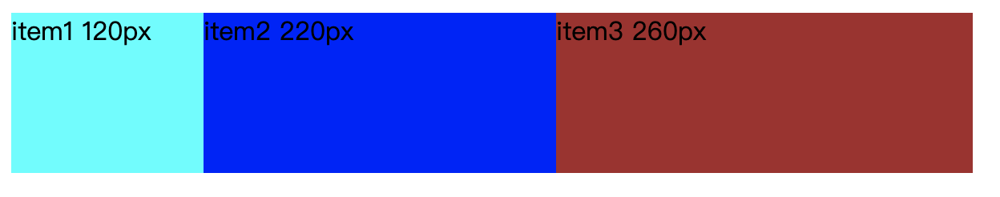

flex是 flex-grow、flex-shrink、flex-basis的缩写。其取值可以考虑以下情况：
flex的默认值是以上三个属性值的组合。假设以上三个属性同样取默认值，则flex的默认值是`flex: 0 1 auto`，等同于`flex: 'initial'`。

同理，如下是等同的：
```css
.item {flex: 2 3 200px;}
.item {
    flex-grow: 2;
    flex-shrink: 3;
    flex-basis: 200px;
}
```
当flex取值为none，则计算值为`0 0 auto`，如下是等同的：
```css
.item {flex: none;}
.item {
    flex-grow: 0;
    flex-shrink: 0;
    flex-basis: auto;
}
```
当 flex 取值为 auto，则计算值为 1 1 auto，如下是等同的：
```css
.item {flex: auto;}
.item {
    flex-grow: 1;
    flex-shrink: 1;
    flex-basis: auto;
}
```
当 flex 取值为一个非负数字，则该数字为flex-grow值，flex-shrink取1，flex-basis取0%，如下是等同的：
```css
.item {flex: 1;}
.item {
    flex-grow: 1;
    flex-shrink: 1;
    flex-basis: 0%;
}
```
当 flex 取值为一个长度或百分比，则视为 flex-basis 值，flex-grow 取 1，flex-shrink 取 1，有如下等同情况（注意 0% 是一个百分比而不是一个非负数字）：
```css
.item-1 {flex: 0%;}
.item-1 {
    flex-grow: 1;
    flex-shrink: 1;
    flex-basis: 0%;
}
.item-2 {flex: 24px;}
.item-1 {
    flex-grow: 1;
    flex-shrink: 1;
    flex-basis: 24px;
}
```
当 flex 取值为两个非负数字，则分别视为 flex-grow 和 flex-shrink 的值，flex-basis 取 0%，如下是等同的：
```css
.item {flex: 2 3;}
.item {
    flex-grow: 2;
    flex-shrink: 3;
    flex-basis: 0%;
}
```
当 flex 取值为一个非负数字和一个长度或百分比，则分别视为 flex-grow 和 flex-basis 的值，flex-shrink 取 1，如下是等同的：
```css
.item {flex: 2 300px;}
.item {
    flex-grow: 2;
    flex-shrink: 1;
    flex-basis: 300px;
}
```

flex-basis 规定的是子元素的基准值。所以是否溢出的计算与此属性息息相关。flex-basis 规定的范围取决于 box-sizing。这里主要讨论以下 flex-basis 的取值情况：
* auto：首先检索该子元素的主尺寸，如果主尺寸不为auto，则使用值采取主尺寸之值；如果也是auto，则使用值为content。
* content：指根据该子元素的内容自动布局。有的用户代理没有实现取 content 值，等效的替代方案是 flex-basis 和主尺寸都取 auto。
* 百分比：根据其包含块（即伸缩父容器）的主尺寸计算。如果包含块的主尺寸未定义（即父容器的主尺寸取决于子元素），则计算结果和设为 auto 一样。

来看个例子：
```html
<!DOCTYPE html>
<html lang="en">
<head>
    <meta charset="UTF-8">
    <meta name="viewport" content="width=device-width, initial-scale=1.0">
    <meta http-equiv="X-UA-Compatible" content="ie=edge">
    <title>Document</title>
    <style>
        .box {
            display: flex;
            width: 600px;
        }
        .box > div {
            height: 100px;
        }
        .item1 {
            width: 140px;
            flex: 2 1 0%;
            background-color: aqua;
        }
        .item2 {
            width: 100px;
            flex: 2 1 auto;
            background-color: blue;
        }
        .item3 {
            flex: 1 1 200px;
            background-color: brown;
        }
    </style>
</head>
<body>
    <div class="box">
        <div class="item1">item1 120px</div>
        <div class="item2">item2 220px</div>
        <div class="item3">item3 260px</div>
    </div>
</body>
</html>
```
主轴上父容器总尺寸为600px

子元素的总基准值是：0% + auto + 200px = 300px，其中：
- 0%：即 0 宽度
- auto：应取主尺寸即 100px

故剩余空间为：600px - 300px = 300px

伸缩放大系数之和为：2 + 2 + 1 = 5

剩余空间分配如下：
- item1 和 item2 各分配 2/5，各得 120px
- item3 分配 1/5，得 60px

各项目最终宽度为：

- item1 = 0% + 120px = 120px
- item2 = auto + 120px = 100px + 120px = 220px
- item3 = 200px + 60px = 260px

当item1基准值取0%的时候，是把该项目视为零尺寸的，故即便声明其尺寸为140px，也并没有什么用，形同虚设；而item2基准值取auto的时候，根据规则：基准值使用值是主尺寸值即100px，故这100px不会纳入剩余空间。

如下图所示：



再来看如下样式设置：
```css
.box {
    display: flex;
    height: 100px;
    width: 400px;
}
.child {
    flex: 1 1 auto;
}
.left {
    background-color: aquamarine;
}
.right {
    width: 100px;
    background-color: blueviolet;
}
```
flex-basis 的取值情况：
* auto：首先检索该子元素的主尺寸，如果主尺寸不为auto，则使用值采取主尺寸之值；如果也是auto，则使用值为content。
* content：指根据该子元素的内容自动布局。有的用户代理没有实现取 content 值，等效的替代方案是 flex-basis 和主尺寸都取 auto。
* 百分比：根据其包含块（即伸缩父容器）的主尺寸计算。如果包含块的主尺寸未定义（即父容器的主尺寸取决于子元素），则计算结果和设为 auto 一样。

首先左右盒子都设置了`flex: 1 1 auto;`，按照上述规则进行计算：
* 左边盒子主尺寸为auto，则左边盒子的宽度为content的宽度；
* 右边盒子主尺寸为100px，则该盒子宽度为100px；
* 故剩余空间为：400px - 100px - 左盒子内容宽度 = 剩余空间宽度
* 伸缩放大系数之和为：1 + 1 = 2
* 左边盒子最终宽度 = 剩余空间宽度 / 2 + 左盒子内容宽度
* 右边盒子最终宽度 = 剩余空间宽度 / 2 + 100px
