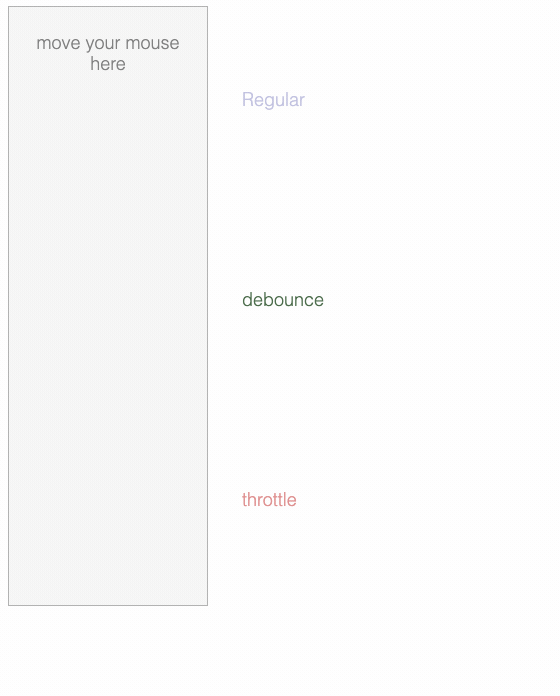

::: tip
写作不易，Star是最大鼓励，感觉写的不错的可以给个Star⭐，请多多指教。[Github地址](https://github.com/liujie2019/VuePress-Blog)。
:::
DOM操作比起非DOM操作需要更多的内存和CPU，连续尝试进行过多的DOM相关操作可能会导致浏览器挂起，有时候甚至会崩溃。

如果在程序中使用了onresize事件处理程序，当调整浏览器大小的时候，该事件会连续触发。如果在该事件处理程序内部进行了相关DOM操作，其高频率的更改可能会导致浏览器崩溃。为了解决这个问题，我们可以考虑使用定时器对该函数进行节流。
::: tip
**函数节流的核心思想**：某些代码不可以在没有间断的情况下连续重复执行。第一次调用函数，创建一个定时器，在指定的时间间隔之后运行代码。当第二次调用该函数时，它会清除之前的定时器并设置另一个。如果前一个定时器已经执行过了，这个操作就没有任何意义。然而，如果前一个定时器尚未执行，其实就是将其替换为一个新的定时器。目的是在只有在执行函数的请求停止了一段时间之后才执行。
:::

以下场景往往由于事件频繁被触发，因而频繁执行DOM操作、资源加载等重行为，导致UI停顿甚至浏览器崩溃。
* window对象的resize、scroll事件；
* 拖拽时的mousemove事件；
* 鼠标的mousedown、键盘的keydown/keyup/keypress事件；

实际上对于window的resize事件，需求大多为停止改变大小n毫秒后执行后续处理；而其他事件大多的需求是以一定的频率执行后续处理。针对这两种需求就出现了debounce和throttle两种解决办法。

throttle(节流)和debounce(防抖)其实都是**函数调用频率的控制器**。在处理一些高频率触发的`DOM`事件的时候，它们都能极大提高用户体验。
* `debounce`强制函数在某段时间内只执行一次；
* `throttle`强制函数以固定的速率执行。

在处理`resize、scroll、mousemove`和`keydown/keyup/keypress`等事件的时候，通常我们不希望这些事件太过频繁地触发，尤其是监听程序中涉及到大量的计算或者有非常耗费资源的操作。

以`mousemove`事件为例，根据`DOM Level 3`的规定，如果鼠标连续移动，那么浏览器就应该触发多个连续的`mousemove`事件，这意味着浏览器会在其内部计时器允许的情况下，根据用户移动鼠标的速度来触发`mousemove`事件。`resize、scroll和key*`等事件与此类似。
## Debounce(防抖)
DOM事件里的`debounce`概念其实是从机械开关和继电器的`去弹跳（debounce）`衍生而来的，基本思路就是：把多个信号合并为一个信号。

在js中，`debounce`函数作用就是：**限制一个函数在某个连续的时间段内只执行一次**，哪怕它本来会被调用多次。我们希望在用户停止某个操作一段时间之后才执行相应的监听函数，而不是在用户操作的过程当中，浏览器触发多少次事件，就执行多少次监听函数。

举个🌰：在3s钟内连续地移动鼠标，浏览器可能会触发几十（甚至几百）个`mousemove`事件，不使用`debounce`的话，监听函数就要执行这么多次；如果对监听函数使用`100ms`的`去弹跳`，那么浏览器只会执行一次这个监听函数，而且是在第`3.1s`的时候执行的。
### 代码实现
debounce函数接收两个参数，第一个是要`去弹跳`的回调函数fn，第二个是延迟的时间delay。实际上，大部分的完整debounce实现还有第三个参数`immediate`，表明回调函数是在一个时间区间的最开始执行`(immediate为true)`还是最后执行`(immediate为false)`，比如underscore的`_.debounce`。这里先不考虑这个参数，只考虑最后执行的情况：
```js
// 考虑最后执行的情况
function debounce(fn, delay) {
    if(!fn instanceof Function) {
        throw new TypeError('Expected a function');
    }
    let timer = null;
    return function(...args) {
        clearTimeout(timer);
        timer = setTimeout(() => {
            fn.apply(this, args);
        }, delay);
    }
}
```
::: tip
核心思想：debounce函数返回了一个闭包，这个闭包函数依然会被连续执行。但是在闭包内部，通过定时器限制了fn函数的执行频率，强制fn函数只在连续操作停止后的指定时间(delay参数)后执行一次。
:::
第一次触发后，进行倒计delay毫秒，如果倒计时过程中有其他触发，则清楚计时器；否则执行fn。用防抖来丢弃一些重复的密集操作、活动，直到流量减慢。
### 防抖应用
1. 列表数据的模糊查询(根据用户输入获取对应的服务端数据)，当用户输入内容过快时，`key*`事件被触发的频率也是很高的，如果按照用户输入速度高频率地发送请求，一方面我们并没有拿到用户的完整输入发送给服务器，二是这种频繁的无用请求是没有必要，因为大部分的请求结果并不是用户想要的。因此，我们可以在用户输入内容结束后，停止指定时间(delay参数)再去获取数据；
2. 按钮提交操作，如果多次点击按钮，只有最后一次有效；
3. 表单校验，对用户输入的内容进行检查，只有在用户停止输入后停止指定时间(delay参数)再进行合法性的校验；
4. 浏览器窗口的resize事件，当窗口大小停止变化之后再重新计算布局。

```js
$('input').on('keyup', debounce(() => {
	// 发送ajax请求
}, 200))
```
再下面两个更具体的例子：
```html
<!DOCTYPE html>
<html lang="en">
<head>
    <meta charset="UTF-8">
    <meta name="viewport" content="width=device-width, initial-scale=1.0">
    <meta http-equiv="X-UA-Compatible" content="ie=edge">
    <title>防抖</title>
    <style>
        #box, #box2 {
            width: 100px;
            height: 100px;
            background-color: aquamarine;
            margin-bottom: 10px;
        }
    </style>
</head>
<body>
    <div id="box"></div>
    <div id="box2"></div>
    <script>
        function debounce(fn, delay) {
            if(!fn instanceof Function) {
                throw new TypeError('Expected a function');
            }
            let timer = null;
            return function(...args) {
                clearTimeout(timer);
                timer = setTimeout(() => {
                    fn.apply(this, args);
                }, delay);
            }
        }
        const box = document.querySelector('#box');
        const box2 = document.querySelector('#box2');
        let count = 0;
        let count2 = 0;
        // 不进行防抖处理
        document.addEventListener('mousemove', () => {
            count++;
            box.innerHTML = count;
        }, false);
        document.addEventListener('mousemove', debounce(() => {
            count2++;
            box2.innerHTML = count2;
        }, 200), false);
    </script>
</body>
</html>
```
```html
<!DOCTYPE html>
<html lang="en">
<head>
    <meta charset="UTF-8">
    <meta name="viewport" content="width=device-width, initial-scale=1.0">
    <meta http-equiv="X-UA-Compatible" content="ie=edge">
    <title>防抖</title>
    <style>
        #box {
            width: 100px;
            height: 100px;
            background-color: aquamarine;
        }
    </style>
</head>
<body>
    <div id="box"></div>
    <script>
        function debounce(fn, delay) {
            if(!fn instanceof Function) {
                throw new TypeError('Expected a function');
            }
            let timer = null;
            return function(...args) {
                if (timer) clearTimeout(timer);
                timer = setTimeout(() => {
                    fn.apply(this, args);
                }, delay);
            }
        }
        const box = document.querySelector('#box');
        let count = 0;
        window.addEventListener('resize', () => {
            box.innerHTML = ++count;
        }, false);
        // 防抖处理
        window.addEventListener('resize', debounce(() => {
            box.innerHTML = ++count;
        }, 200), false);
    </script>
</body>
</html>
```
## Throttle(节流)
所谓的节流就是固定函数执行的频率。正常情况下，假设`mousemove`的监听函数每20ms执行一次，如果设置200ms的节流，那么它就会每200ms执行一次。比如在1s的时间段内，正常的监听函数可能会执行50次，节流200ms后则会执行5次。
### 具体实现
基于时间戳实现：
```js
function throttle(fn, delay) {
   if(!fn instanceof Function) {
        throw new TypeError('Expected a function');
   }
   let preTime = Date.now();
   return function(...args) {
       const curTime = Date.now();
       // 时间间隔大于delay时执行一次，并更新preTime的值
       if (curTime - preTime >= delay) {
           fn.apply(this, args);
           preTime = curTime;
       }
   }
}
```
基于setTimeout和时间戳实现：
```js
function throttle(fn, delay = 250) {
   if(!fn instanceof Function) {
       throw new TypeError('Expected a function');
   }
   let preTime = Date.now();
   let timer = null;
   return function(...args) {
       let curTime = Date.now();
       if (preTime + delay > curTime) {
           clearTimeout(timer);
           timer = setTimeout(() => {
               fn.apply(this, args);
               preTime = curTime;
           }, delay);
       } else {
           fn.apply(this, args);
           preTime = curTime;
       }
   }
}
```
### 节流两种方式对比
第一种：如果在一个delay间隔内多次触发，fn只会被执行一次，最后一次并不会进入下一个周期执行。
第二种：在一个delay间隔内多次触发，fn总共会执行两次，注意：第二次会进入下一个delay周期执行。
### 节流应用
与debounce类似，throttle也接收两个参数，一个实际要执行的函数fn，一个执行间隔阈值threshhold。

同样的，`throttle`的更完整实现可以参看`underscore`的 `_.throttle`。
```html
<!DOCTYPE html>
<html lang="en">
<head>
    <meta charset="UTF-8">
    <meta name="viewport" content="width=device-width, initial-scale=1.0">
    <meta http-equiv="X-UA-Compatible" content="ie=edge">
    <title>节流</title>
    <style>
        #box {
            width: 100px;
            height: 100px;
            background-color: aquamarine;
        }
    </style>
</head>
<body>
    <div id="box"></div>
    <script>
        function throttle(fn, delay) {
            if(!fn instanceof Function) {
                 throw new TypeError('Expected a function');
            }
            let preTime = Date.now();
            return function(...args) {
                const curTime = Date.now();
                // 时间间隔大于delay时执行一次，并更新preTime的值
                if (curTime - preTime >= delay) {
                    fn.apply(this, args);
                    preTime = curTime;
                }
            }
        }
        const box = document.querySelector('#box');
        let count = 0;
        window.addEventListener('resize', throttle(() => {
            box.innerHTML = ++count;
        }, 3000), false);
    </script>
</body>
</html>
```
```html
<!DOCTYPE html>
<html lang="en">
<head>
    <meta charset="UTF-8">
    <meta name="viewport" content="width=device-width, initial-scale=1.0">
    <meta http-equiv="X-UA-Compatible" content="ie=edge">
    <title>Document</title>
    <style>
        .wrapper {
            width: 200px;
            height: 200px;
            float: left;
            border: 1px solid #ddd;
            overflow: auto;
            position: relative;
        }
        .wrapper .content {
            height: 100%;
            width: 100%;
            overflow: auto;
        }
        .content .inner {
            height: 6000px;
        }
        .wrapper .desc {
            position: absolute;
        }
        .wrapper .count {
            position: absolute;
            top: 50%;
            left: 50%;
            transform: translate(-50%, -50%);
        }
        .normal {
            margin-right: 20px;
        }
    </style>
</head>
<body>
    <h3>Try scrolling in the 2 boxes...</h3>
    <div>
        <div class="wrapper normal">
            <div class="desc">Normal scroll</div>
            <div class="content">
                <div class="inner"></div>
            </div>
            <span id="normal" class="count">0</span>
        </div>
        <div class="wrapper throttled">
            <div class="desc">Throttled scroll</div>
            <div class="content">
                <div class="inner"></div>
            </div>
            <span id="throttled" class="count">0</span>
        </div>
    </div>
    <script>
        function throttle(fn, threshhold = 250) { // 默认间隔为250ms
            // 记录上次执行的时间
            var last;
            // 定时器
            var timer = null;
            // 返回函数，每隔threshhold毫秒就执行一次fn函数
            return function(...args) {
                var now = +new Date(); // 加号的作用是将日期转为时间戳
                // 如果距离上次执行fn函数的时间小于threshhold，就不执行fn
                // 否则执行fn，并重新计时
                if (last && now < last + threshhold) {
                    clearTimeout(timer);
                    // 保证在当前时间区间结束后，再执行一次fn
                    timer = setTimeout(() => {
                        last = now;
                        fn.apply(this, args);
                    }, threshhold);
                }
                else {
                    last = now;
                    fn.apply(this, args);
                }
            }
        }
        var normalCount = 0;
        var throttledCount = 0;
        var normalSpan = document.querySelector('#normal');
        var throttledSpan = document.querySelector('#throttled');
        var normalContent = document.querySelector('.normal .content');
        var throttledContent = document.querySelector('.throttled .content');
        normalContent.addEventListener('scroll', function() {
            normalSpan.innerText = ++normalCount;
        }, false);
        throttledContent.addEventListener('scroll', throttle(function() {
            throttledSpan.innerText = ++throttledCount;
        }, 250), false);
        document.addEventListener('mouseleave', function() {
            normalCount = 0;
            throttledCount = 0;
            normalSpan.innerText = 0;
            throttledSpan.innerText = 0;
        }, false);
    </script>
</body>
</html>
```
原理也不复杂，相比debounce，无非是多了一个时间间隔的判断，其他的逻辑基本一致。throttle的使用方式如下：
```js
$(document).on('mouvemove', throttle(() => {
	// 代码
}, 250))
```
### throttle使用场景
* throttle常用的场景是限制mousemove、resize和scroll(鼠标滚动、window.resize)的触发频率。

第一次触发后先执行fn(当然可以通过{leading: false}来取消)，然后wait ms后再次执行，在单位wait毫秒内的所有重复触发都被抛弃。即如果有连续不断的触发，每wait ms执行fn一次。

## 业务场景使用
一个常见的例子：用户在无限滚动的页面上向下滚动鼠标加载页面，你需要判断现在距页面底部的高度。如果用户快接近页面底部时，我们应该发送请求来加载更多内容到页面。在此debounce没有用，因为它只会在用户停止滚动时触发，但我们需要用户快到达底部时去请求。通过throttle我们可以不间断的监测距离底部多远。
```js
$(document).ready(function(){
  // 这里设置时间间隔为300ms
  $(document).on('scroll', throttle(function(){
    check_if_needs_more_content();
  }, 300));

  // 是否需要加载更多资源
  function check_if_needs_more_content() {
    var pixelsFromWindowBottomToBottom = 0 + $(document).height() - $(window).scrollTop() - $(window).height();
    // 滚动条距离页面底部小于200，加载更多内容
    if (pixelsFromWindowBottomToBottom < 200){
      // 加载更多内容
      $('body').append($('.item').clone());
    }
  }
});
```
## debounce和throttle的差异(可视化展示)


## 项目实例
Vue官网里的一个🌰，就是用于对用户输入的事件进行了防抖处理，因为用户输入后需要进行ajax请求，如果不进行防抖会频繁的发送ajax请求，所以通过debounce对ajax请求的频率进行了限制。
```js
methods: {
  // `_.debounce` 是一个通过Lodash限制操作频率的函数。
  // 在这个例子中，我们希望限制访问 yesno.wtf/api 的频率
  // AJAX 请求直到用户输入完毕才会发出。想要了解更多关于
  getAnswer: _.debounce(function() {
    if (!reg.test(this.question)) {
      this.answer = 'Questions usually end with a question mark. ;-)';
      return;
    }
    this.answer = 'Thinking ... ';
    let self = this;
    axios.get('https://yesno.wtf/api')
    // then中的函数如果不是箭头函数，则需要对this赋值self
    .then(response => {
      this.answer = _.capitalize(response.data.answer)
    }).
    catch (error => {
      this.answer = 'Error! Could not reach the API. ' + error
    })
  }, 500) // 这是我们为判定用户停止输入等待的毫秒数
},
```
## 防抖和节流的异同
相同点：
* 其实本质上都是为了节省程序的性能（防止函数被频繁调用）
* 借助了闭包的特性来缓存变量
* 都可以使用setTimeout实现

区别：
* 使用防抖，可能n个threshhold时间间隔之后fn也没执行，但是使用节流，在threshhold间隔内有且只执行一次；
* 同样threshhold间隔内连续触发，防抖只执行一次，而节流会执行两次，只是在不同的threshhold周期内；
* 侧重点不同，防抖侧重于稳定只能执行一次，而节流强调限周期内次数，即执行频率，不限制所有时间内的总次数。
## 参考文档
1. [深入浅出防抖函数 debounce](https://github.com/yygmind/blog/issues/39)
2. [Debounce 和 Throttle 的原理及实现](https://blog.csdn.net/redtopic/article/details/69396722)
3. [debounce 和 throttle 的可视化差异](http://demo.nimius.net/debounce_throttle/)
4. [函数去抖（debounce）和函数节流（throttle）](https://blog.csdn.net/duola8789/article/details/78871789)
5. [debounce与throttle区别](https://blog.csdn.net/ligang2585116/article/details/75003436)
6. [JS高级技巧学习小结](https://blog.csdn.net/liujie19901217/article/details/51020339)
7. [7分钟理解JS的节流、防抖及使用场景](https://juejin.im/post/5b8de829f265da43623c4261)
8. [前端战五渣学JavaScript——防抖、节流和rAF](https://juejin.im/post/5cce5380f265da03826129bf)