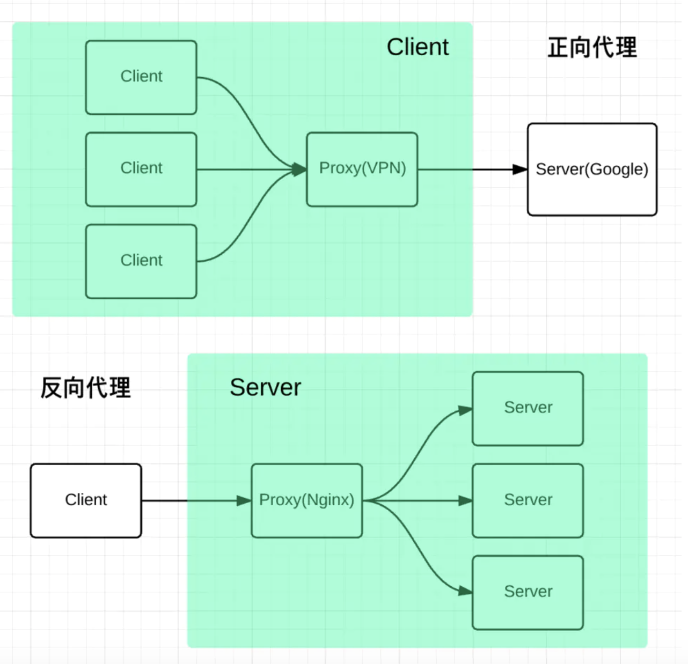

[TOC]
## 常见跨域场景
| URL        | 说明          | 是否允许通信  |
| ------------- |:-------------:| -----:|
| http://www.domain.com/a.js http://www.domain.com/b.js http://www.domain.com/lab/c.js | 同一域名，不同文件或路径 | 允许 |
| col 2 is      | centered      |   $12 |
| zebra stripes | are neat      |    $1 |
URL                                      说明                    是否允许通信
http://www.domain.com/a.js
http://www.domain.com/b.js         同一域名，不同文件或路径           允许
http://www.domain.com/lab/c.js

http://www.domain.com:8000/a.js
http://www.domain.com/b.js         同一域名，不同端口                不允许

http://www.domain.com/a.js
https://www.domain.com/b.js        同一域名，不同协议                不允许

http://www.domain.com/a.js
http://192.168.4.12/b.js           域名和域名对应相同ip              不允许

http://www.domain.com/a.js
http://x.domain.com/b.js           主域相同，子域不同                不允许
http://domain.com/c.js

http://www.domain1.com/a.js
http://www.domain2.com/b.js        不同域名                         不允许
## 什么是同源策略？
同源策略-SOP(Same origin policy)是一种约定，由Netscape公司1995年引入浏览器，它是浏览器最核心也最基本的安全功能，如果缺少了同源策略，浏览器很容易受到**XSS、CSRF**等攻击。**所谓同源是指"协议+域名+端口"三者都相同(有一个不同就是跨域)**，即便两个不同的域名指向同一个ip地址，也非同源的。

具体请参考[浏览器的同源策略](https://developer.mozilla.org/zh-CN/docs/Web/Security/Same-origin_policy)

同源策略限制以下几种行为：
1. Cookie、localStorage和IndexDB无法跨域读取；
2. 不能读取和修改对方的DOM；
3. 跨域ajax请求不能发送。

跨域请求的响应**一般会被浏览器所拦截**，注意，是被浏览器拦截，响应其实是成功到达客户端了。
### 主域名和子域名的说明
* 主域名：由两个或两个以上的字母构成，中间由点号隔开，**整个域名只有1个点号**，比如：csdn.net。
* 子域名：是**在主域名之下的域名**，域名内容会有多个点号，比如：blog.csdn.net。
### 通过修改host文件来模拟实现同源策略
* xampp

对本地的hosts文件做如下修改：
```js
127.0.0.1:8088 http://api.test.com
```
这样本地服务`127.0.0.1:8088/index.html`就可以访问`http://api.test.com/getData`接口的数据了。
### 服务器拆分
* web服务器：静态资源kbs.sports.qq.com
* 数据服务器(即数据接口)：业务逻辑和数据分析api.sports.qq.com
* 图片服务器

比如说我们在本地进行项目开发：
* web服务器地址为：127.0.0.1:8088/index.html
* 数据接口地址为：127.0.0.1:8090/list

从web服务器请求数据接口是跨域的。
## 1. jsonp
* script
* img
* link
* iframe

上述四种标签的共同特点是：**不存在跨域请求的限制**。比如说可以在页面中通过`script`标签的形式从cdn上引入jquery。
### jsonp原理
由于浏览器的同源策略限制，不允许跨域请求。但是页面中的script、img、iframe等标签不受同源策略限制。jsonp就是利用script标签跨域特性进行请求。

jsonp的原理：先在全局注册一个回调函数，定义回调数据的处理；与服务端约定好一个同名回调函数名，服务端接收到请求后，将返回一段javascript代码，在这段javascript代码中调用了约定好的回调函数，并且将数据作为参数进行传递。当网页接收到这段javascript代码后，就会执行这个全局注册的回调函数。

* jsonp优点：兼容性好，支持低版本的浏览器
* jsonp缺点：只支持GET请求，而不支持POST请求等其他类型的HTTP请求。

get请求缺点：
* 不安全
* 有缓存
* 数据大小有限制

通常为了减轻web服务器的负载，我们把js、css，img等静态资源分离到另一台独立域名的服务器上，在html页面中再通过相应的标签从不同域名下加载静态资源，而被浏览器允许。基于此原理，我们可以通过动态创建script标签，再请求一个带参网址实现跨域通信。
### 原生js实现
需要注意的点：
* 动态创建script标签
* 回调函数需要是一个全局函数
* jsonp实现需要服务端支持，返回一个函数调用的字符串
* jsonp发送的请求并不是ajax请求，type类型是script类型
```html
<script>
    // show函数需要是全局函数
    function show(data) {
        console.log(data); // {user: "我是服务端"}
    }
    const script = document.createElement('script');
    script.type = 'text/javascript';
    script.src = 'http://localhost:3000/login?user=admin&callback=show';
    document.head.appendChild(script);
</script>
```
服务端实现server.js：
```js
const express = require('express');
const app = express();

app.get('/login', (req, res) => {
    // console.log(req.query); // { user: 'admin', callback: 'show' }
    const {callback} = req.query; // 获取回调函数名称
    const data = {
        code: 0,
        msg: '我是后端服务器'
    };
    res.setHeader('Content-Type', 'text/plain;charset=utf-8'); // 指定字符编码
    // 服务器返回的是字符串，浏览器拿到这个字符串后会进行解析执行(之所以会执行是基于浏览器的机制)
    res.end(`${callback}(${JSON.stringify(data)})`);
});
app.listen(3000, () => {
    console.log('server run at port 3000');
});
```
### 原生Node实现
服务端代码：
```js
const http = require('http');
const qs = require('querystring');
const server = http.createServer();

server.on('request', (req, res) => {
    // req.url.split('?')[1] 获取到查询字符串
    const queryData = qs.parse(req.url.split('?')[1]);
    console.log(queryData); // { user: 'admin', cb: 'show' }
    // jsonp返回设置
    const {cb, user} = queryData;
    const data = JSON.stringify({user});
    const resData = `${cb}(${data})`;
    // console.log(Buffer.byteLength(resData)); // 21
    res.writeHead(200, {
        'Content-Length': Buffer.byteLength(resData),
        'Content-Type': 'text/plain;charset=utf-8'
    });
    res.write(resData);
    res.end();
});

server.listen(3000, () => {
    console.log('server run port 3000');
});
```
客户端代码如下：
```js
// 只能发送get请求
// 不安全 xss攻击
function jsonp({url, params, cb}) {
    return new Promise((resolve, reject) => {
        let script = document.createElement('script');
        // 注册全局jsonp回调函数
        window[cb] = data => {
            resolve(data);
            document.body.removeChild(script);
        };
        params = {...params, cb};
        let paramsArr = [];
        for (let key in params) {
            paramsArr.push(`${key}=${params[key]}`);
        }
        script.src = `${url}?${paramsArr.join('&')}`;
        document.body.appendChild(script);
    });
}
jsonp({
    url: 'http://localhost:3000/home',
    params: {user: 'lisi'},
    cb: 'show'
}).then(data => {
    console.log(data);
});
```
### jQuery实现jsonp
```js
$.ajax({
    url: 'http://localhost:3000/login',
    type: 'get', // 请求方法
    dataType: 'jsonp', // 请求方式为jsonp
    // 这里如果不指定的话jquery会默认生成一个全局的回调函数
    jsonpCallback: 'callback', // 自定义回调函数名
    data: {}
});
```
### 手写jsonp
```js
<script>
function jsonp({url, params, cb}) {
    return new Promise((resolve, reject) => {
        let script = document.createElement('script');
        window[cb] = data => {
            resolve(data);
            document.body.removeChild(script);
        };
        params = {...params, cb};
        let paramsArr = [];
        for (let key in params) {
            paramsArr.push(`${key}=${params[key]}`);
        }
        script.src = `${url}?${paramsArr.join('&')}`;
        document.body.appendChild(script);
    });
}
jsonp({
    url: 'http://localhost:3000/home',
    params: {wd: 'ddf'},
    cb: 'show'
}).then(data => {
    console.log(data);
});
</script>
```
server.js
```js
const express = require('express');
const app = express();

app.get('/home', (req, res) => {
    const {wd, cb} = req.query;
    res.setHeader('Content-Type', 'text/plain;charset=utf-8'); // 指定字符编码
    res.end(`${cb}('我是后端服务器')`);
});
app.listen(3000, () => {
    console.log('server run at port 3000');
});
```
jsonp缺点：
* 只能实现get请求。
* 请求不安全，容易被拦截，返回恶意代码，造成xss攻击。

## 2. CORS(跨域资源共享)
[CORS-跨域资源共享](http://docs.liujie.fun/frontend/jsTopic/06.CORS-%E8%B7%A8%E5%9F%9F%E8%B5%84%E6%BA%90%E5%85%B1%E4%BA%AB.html)

## 3. nginx设置反向代理跨域
Nginx 是一种高性能的`反向代理`服务器，可以用来轻松解决跨域问题。


正向代理用来帮助客户端访问客户端自己访问不到的服务器，然后将结果返回给客户端，常见的例子如VPN。

反向代理是拿到客户端的请求，将请求转发给其他的服务器，主要的场景是维持服务器集群的负载均衡，换句话说，反向代理帮其它的服务器拿到请求，然后选择一个合适的服务器，将请求转交给它。

因此，两者的区别就很明显了，正向代理服务器是帮客户端做事情，而反向代理服务器是帮其它的服务器做事情。
那 Nginx 是如何来解决跨域的呢？
比如说现在客户端的域名为client.com，服务器的域名为server.com，客户端向服务器发送 Ajax 请求，当然会跨域了，那这个时候让 Nginx 登场了，通过下面这个配置:
```js
server {
  listen  80;
  server_name  client.com;
  location /api {
    proxy_pass server.com;
  }
}
```
Nginx 相当于起了一个跳板机，这个跳板机的域名也是client.com，让客户端首先访问 client.com/api，这当然没有跨域，然后 Nginx 服务器作为反向代理，将请求转发给server.com，当响应返回时又将响应给到客户端，这就完成整个跨域请求的过程。

既然不能跨域请求，那么我们不跨域就可以了。**通过在请求到达服务前部署一个服务，将接口请求进行转发，这就是反向代理**。通过一定的转发规则可以将前端的请求转发到其它的服务，以Nginx为例：
```bash
server {
    listen 8088; # 服务监听的端口
    server_name  localhost; # 服务名称
    # 将所有http://localhost:8088/api开头的请求进行转发
    location ^~ /api {
        proxy_pass http://localhost:8000; # 反向代理
    }
}
```
* 我们将前端后端项目统一通过反向代理来提供对外的服务，这样在前端看上去就跟不存在跨域一样。
* 反向代理麻烦之处就在于对Nginx等反向代理服务的配置，在目前前后端分离的项目中很多都是采用这种方式。

使用nginx反向代理实现跨域，是最简单的跨域方式。该方法不**需要目标服务器配合，不过需要我们自己搭建一个中转请求的nginx服务器，用于转发请求**。只需要修改nginx的配置即可解决跨域问题，支持所有浏览器，支持session，不需要修改任何代码，并且不会影响服务器性能。
::: tip
实现思路：通过nginx配置一个代理服务器(域名与domain1相同，端口不同)做跳板机，反向代理访问domain2接口，并且可以顺便修改cookie中domain信息，方便当前域cookie写入，实现跨域登录。
:::


前端页面：`http://127.0.0.1:5501/index.html`。

实现思路：
1. 搭建一个中转请求的nginx服务器，用于转发请求；
2. 同源策略在服务器间不适用，通过代理服务器来向目标服务器发送请求。
```html
<body>
    <h2>nginx代理跨域</h2>
    <script>
        let xhr = new XMLHttpRequest;
        xhr.open('get', 'http://a.baidu.com:81/apis/login.json', true);
        xhr.onreadystatechange = function() {
            if (xhr.readyState === 4) {
                if (xhr.status >= 200 && xhr.status < 300 || xhr.status === 304) {
                    console.log(xhr.response);
                }
            }
        }
        xhr.send();
    </script>
</body>
```
`http://127.0.0.1:5501`直接请求`http://a.baidu.com:81/apis/login.json`也是跨域的，通过设置Nginx服务器中的`Access-Control-Allow-Origin`来实现跨域访问。
```js
add_header "Access-Control-Allow-Origin" "http://127.0.0.1:5501"
```
```js
// 后端服务器
const express = require('express');
const app = express();
// 以当前目录作为静态资源目录
app.use(express.static('static'));

app.listen(8097, () => {
    console.log('server run at port 8097');
});
```
配置Nginx代理服务器：所有/apis/开头的接口，全部去请求`http://localhost:8097/`。
```bash
server {
    listen       81; # 服务监听的端口
    server_name  a.baidu.com; # 服务名称

    #charset koi8-r;

    #access_log  logs/host.access.log  main;
    location ^~ /apis/ {
        # proxy_pass 常用在设置反向代理
        proxy_pass http://localhost:8097/; # 设置代理服务器的协议和地址(就是真实的后端服务器接口)
        add_header "Access-Control-Allow-Origin" "http://127.0.0.1:5501"; # 利用cors设置可以跨域
    }
    location / {
        root   html/a;
        index  index.html index.htm;
    }
}
```
这样做的好处：
1. 不需要更改后端服务器代码，即不需要后端服务器支持跨域；
2. 通过设置Nginx跨域支持即可

特别注意：proxy_pass后面的地址加/和不加/的区别：
* 加/的情况：访问`a.baidu.com/apis/login.json`会得到`http://localhost:8097/login.json`，将static文件夹作为/目录来访问；

最终的效果为：
```js
curl a.baidu.com:81/apis/login.json
{
    "msg": "我是b站点/login--haha"
}
```
* 不加/的情况：访问`a.baidu.com/apis/login.json`会得到`http://localhost:8097/apis/login.json`，将static文件下的apis文件夹作为根目录进行访问。

最终的效果为：
```js
curl a.baidu.com:81/apis/login.json
{
    "msg": "我是b站点/apis/login--hah"
}
```
```bash
location ~.*\.json {
    // 表示以.json结尾的都去json目录下去找
    root json;
}
```
注意：`~`表示忽略大小写。
### nginx相关目录
* nginx配置文件目录：`cd /usr/local/etc/nginx/`
* nginx服务目录：`/usr/local/Cellar/nginx/1.15.5/`
### nginx命令
* 启动：nginx
* 重启：nginx -s reload

## 4. Node中间件代理(两次跨域)
::: tip
实现原理：**同源策略是浏览器需要遵循的标准，而如果是服务器向服务器请求的话就无需遵循同源策略**。
:::
Node中间件代理实现跨域，原理与nginx大致相同，都是通过**启一个代理服务器**，实现数据的转发，也可以通过设置cookieDomainRewrite参数修改响应头中cookie中域名，实现当前域的cookie写入，方便接口登录认证。


代理服务器，需要做以下几个步骤：
* 接受客户端请求；
* 将请求转发给服务器；
* 拿到服务器响应数据；
* 将响应转发给客户端。
### 代码实现
前端本地文件`http://127.0.0.1:5501/index.html`，通过代理服务器`http://localhost:3000`向目标服务器`http://localhost:4000`请求数据。
```js
// http://127.0.0.1:5501/index.html
let xhr = new XMLHttpRequest();
xhr.open('get', 'http://localhost:3000/api?user=liujie', true);
xhr.onreadystatechange = function() {
    if (xhr.readyState === 4) {
        if (xhr.status >= 200 && xhr.status < 300 || xhr.status === 304) {
            console.log(xhr.response);
        }
    }
}
xhr.send();
```
构建代理服务器：
```js
const express = require('express');
const proxy = require('http-proxy-middleware');
const app = express();

app.use('/', proxy({
    target: 'http://localhost:4000',
    changeOrigin: true,
    // 修改响应头信息，实现跨域并允许带cookie
    onProxyRes: function(proxyRes, req, res) {
        res.header('Access-Control-Allow-Origin', 'http://127.0.0.1:5501');
        res.header('Access-Control-Allow-Methods', 'GET');
        // res.header('Access-Control-Allow-Credentials', 'true'); // 设置携带cookie
    }

    // 修改响应信息中的cookie域名
    // cookieDomainRewrite: 'http://127.0.0.1:5501'  // 可以为false，表示不修改
}));

app.listen(3000, () => {
    console.log('server running on port 3000');
});
```
目标服务器代码：
```js
const http = require('http');
const server = http.createServer();
const qs = require('querystring');

server.on('request', (req, res) => {
    console.log(req.url); // /api?user=liujie
    var params = qs.parse(req.url.substring(5));
    // 向前台写cookie
    res.writeHead(200, {
        'Set-Cookie': 'l=a123456;Path=/;Domain=b.baidu.com;HttpOnly'   // HttpOnly:脚本无法读取
    });
    res.write(JSON.stringify(params));
    res.end();
});
server.listen(4000, () => {
    console.log('Server is running at port 4000...');
});
```
### 基于http proxy实现跨域请求
Vue框架的跨域（1次跨域）
利用`node + webpack + webpack-dev-server`代理接口跨域。在开发环境下，由于Vue渲染服务和接口代理服务都是webpack-dev-server同一个，所以页面与代理接口之间不再跨域，无须设置headers跨域信息了。

webpack.config.js相关配置：
```js
module.exports = {
    entry: {},
    module: {},
    // ...
    devServer: {
        historyApiFallback: true,
        proxy: [{
            context: '/login',
            target: 'http://www.domain2.com:8080',  // 代理跨域目标接口
            changeOrigin: true,
            secure: false,  // 当代理某些https服务报错时用
            cookieDomainRewrite: 'www.domain1.com'  // 可以为false，表示不修改
        }],
        noInfo: true
    }
}
```
## 5. postMessage
postMessage是HTML5`XMLHttpRequest Level 2`中的API，且是为数不多可以跨域操作的window属性之一，它可用于解决以下方面的问题：
* 页面和其打开的新窗口的数据传递；
* 多窗口之间消息传递；
* 页面与嵌套的iframe消息传递；
* 上面三个场景的跨域数据传递。

postMessage方法允许来自不同源的脚本采用异步方式进行有限的通信，可以实现跨文本档、多窗口、跨域消息传递。
```js
otherWindow.postMessage(message, targetOrigin, [transfer]);
```
* message: 将要发送到其他 window的数据；
* targetOrigin: 通过窗口的origin属性来指定哪些窗口能接收到消息事件，其值可以是字符串`"*"`（表示无限制）或者一个URI。在发送消息的时候，如果目标窗口的协议、主机地址或端口这三者的任意一项不匹配targetOrigin提供的值，那么消息就不会被发送；只有三者完全匹配，消息才会被发送。
* transfer(可选)：是一串和message同时传递的Transferable对象。这些对象的所有权将被转移给消息的接收方，而发送一方将不再保有所有权。

接下来看个例子：`http://localhost:3000/a.html`页面向`http://localhost:4000/b.html`传递数据，然后后者传回数据的例子。
```html
// a.html
<body>
    <h2>我是a页面</h2>
    <iframe
        src="http://localhost:4000/b.html"
        id="frame"
        frameborder="10"
        onload="load()"
    >
    </iframe>
    <script>
        function load() {
            const frame = document.querySelector('#frame'); // 获取到iframe
            frame.contentWindow.postMessage('我是父页面a', 'http://localhost:4000');
            window.onmessage = function(e) {
                console.log(e);
                console.log(e.data);
            }
        }
    </script>
</body>
```
```js
// a.html对应的静态资源服务器
const express = require('express');
const app = express();
// 以当前目录作为静态资源目录
app.use(express.static(__dirname));

app.listen(3000, () => {
    console.log('server run at port 3000');
});
```
```html
<body>
    <h2>我是b页面</h2>
    <script>
        // 监听a页面发送过来信息
        window.onmessage = function(e) {
            const {source, data, origin} = e;
            console.log(e);
            // console.log(window.parent);
            // window.parent.postMessage('我是子页面b', origin);
            source.postMessage('我是子页面b', origin);
        }
    </script>
</body>
```
e中包含如下信息：


```js
// b.html对应的静态资源服务器
const express = require('express');
const app = express();
// 以当前目录作为静态资源目录
app.use(express.static(__dirname));

app.listen(4000, () => {
    console.log('server run at port 4000');
});
```
## 6. Websocket
Websocket是HTML5的一个持久化的协议，它实现了浏览器与服务器的全双工通信，同时也是跨域的一种解决方案。

WebSocket和HTTP都是应用层协议，都基于TCP协议。但是 WebSocket是一种双向通信协议，在建立连接之后，WebSocket的 server与client都能主动向对方发送或接收数据。同时，WebSocket在建立连接时需要借助HTTP协议，连接建立好了之后，client与server之间的双向通信就与HTTP无关了。

原生WebSocket API使用起来不太方便，我们使用Socket.io，它很好地封装了webSocket接口，提供了更简单、灵活的接口，也对不支持webSocket的浏览器提供了向下兼容。

来看个例子：本地文件index.html向`localhost:3000`发送数据和接受数据。
```html
// 客户端
<script>
    // 高级api 不兼容 socket.io(一般使用它)
    let socket = new WebSocket('ws://localhost:3000');
    socket.onopen = function() {
        socket.send('我是客户端'); // 向服务器发送数据
    };
    socket.onmessage = function(e) {
        console.log(e.data); // 接收服务器返回的数据
    }
</script>
```
```js
// 服务端
const express = require('express');
const app = express();
// 以当前目录作为静态资源目录
app.use(express.static(__dirname));

const WebSocket = require('ws');

const wss = new WebSocket.Server({port: 3000});
// 连接成功处理
wss.on('connection', function(ws) {
    // 监听客户端消息
    ws.on('message', function(data) {
        console.log(data);
        ws.send('我是服务端');
    });
});

app.listen(5000, () => {
    console.log('server run at port 5000');
});
```
## 7. 基于iframe的跨域解决方案
### 7.1 window.name + iframe
window.name属性的独特之处：name值在不同的页面（甚至不同域名）加载后依旧存在，并且可以支持非常长的name值(2MB)。

其中a.html和b.html是同域的，都是http://localhost:3000；而c.html是http://localhost:4000。
```html
// a.html
<body>
    <h2>a页面</h2>
    <iframe
        src="http://localhost:4000/c.html"
        frameborder="0"
        id="iframe"
        onload="load()"
    >
    </iframe>
    <script>
        /*
         * a和b是同域的 http://localhost:3000
         * c是独立的 http://localhost:4000
         * a获取c的数据
         * a先引用c，c把值放到window.name中，把a引用的地址改为b
         */
        let isFirst = true;
        function load() {
            console.log(666);
            if (isFirst) {
                const iframe = document.querySelector('#iframe');
                // 将地址重新指向到同源
                // 这里重新指定src后也会触发load事件，因此load函数会执行两次，第一次是在iframe加载完成
                iframe.src = 'http://localhost:3000/b.html';
                isFirst = false;
            }
            else {
                console.log(iframe.contentWindow.name);
            }
        }
    </script>
</body>
```
```js
// a.html和b.html静态资源服务器
const express = require('express');
const app = express();
// 以当前目录作为静态资源目录
app.use(express.static(__dirname));

app.listen(3000, () => {
    console.log('server run at port 3000');
});
```
**b.html为中间代理页，与a.html同域，内容为空**。
```html
<body>
    <h2>b页面</h2>
</body>
```
```html
<body>
    <h2>c页面</h2>
    <script>
        window.name = '我是c页面';
    </script>
</body>
```
```js
// c.html静态资源服务器
const express = require('express');
const app = express();
// 以当前目录作为静态资源目录
app.use(express.static(__dirname));

app.listen(4000, () => {
    console.log('server run at port 4000');
});
```


666打印了两次，说明load函数执行了两次。

总结：通过iframe的src属性由外域转向本地域，跨域数据即由iframe的window.name从外域传递到本地域。这个就巧妙地绕过了浏览器的跨域访问限制，但同时它又是安全操作。
### 7.2 location.hash + iframe
实现原理：a.html想访问c.html跨域相互通信，通过中间页b.html来实现。三个页面，不同域之间利用iframe的location.hash传值，相同域之间直接js访问来通信。

具体实现步骤：
1. 一开始a.html给c.html传一个hash值；
2. 然后c.html收到hash值后，再把hash值传递给b.html；
3. 最后b.html将结果放到a.html的hash值中。

同样的，a.html和b.html是同域的，都是http://localhost:3000，而c.html是http://localhost:4000。
```html
// a.html
<body>
    <!--
        路径后面的hash值可以用来通信
        目的：a想访问c
        a给c传一个hash值，c收到hash值后，c把hash值传递给b，b将结果放到a的hash值中
    -->
    <iframe src="http://localhost:4000/c.html#我是a页面" frameborder="0"></iframe>
    <script>
        // 监听hash变化
        window.onhashchange = function () {
            console.log(decodeURIComponent(location.hash));
        }
    </script>
</body>
```
```js
const express = require('express');
const app = express();
// 以当前目录作为静态资源目录
app.use(express.static(__dirname));

app.listen(3000, () => {
    console.log('server run at port 3000');
});
```
```html
// b.html
<body>
    <h2>b页面</h2>
    <script>
        // window.parent是拿到b的parent 即c.html
        // window.parent.parent是拿到c的parent 即a.html
        window.parent.parent.location.hash = location.hash;
    </script>
</body>
```
```html
// c.html
<body>
    <h2>c页面</h2>
    <script>
        console.log(decodeURIComponent(location.hash));
        let iframe = document.createElement('iframe');
        iframe.src = 'http://localhost:3000/b.html#我是c页面';
        document.body.appendChild(iframe);
    </script>
</body>
```
```js
const express = require('express');
const app = express();
// 以当前目录作为静态资源目录
app.use(express.static(__dirname));

app.listen(4000, () => {
    console.log('server run at port 4000');
});
```
### 7.3 document.domain + iframe
该方式只能用于二级域名相同的情况下，比如a.baidu.com和b.baidu.com就适用于该方式。

只需要给页面添加`document.domain = 'baidu.com'`，表示二级域名都相同就可以实现跨域。
**该方式只能用于：同一个主域，不同子域之间的操作。**
主域名相同的情况下，比如a.baidu.com和b.baidu.com适用于该方式。
```js
www.   baidu.  com     .
三级域  二级域   顶级域   根域
```
只需要给页面添加`document.domain = 'baidu.com'`，表示**主域名相同**就可以实现跨域。

实现原理：两个页面都通过js强制设置document.domain为基础主域，就实现了同域。

我们看个例子：页面a.baidu.com:3000/a.html获取页面b.baidu.com:3000/b.html中a的值。
```html
<body>
    <!-- 域名 一级域名和二级域名 -->
    <!-- 主域名：baidu.com -->
    <!-- www.baidu.com -->
    <!-- video.baidu.com -->
    <!-- a.html通过http://a.baidu.com:3000/a.html -->
    <iframe src="http://b.baidu.com:3000/b.html" id="iframe" onload="load()" frameborder="0"></iframe>
    <script>
        var str = 'lisi';
        document.domain = 'baidu.com';
        const iframe = document.querySelector('#iframe');
        function load() {
            console.log(iframe.contentWindow.a);
        }
    </script>
</body>
```
```html
<body>
    <script>
        document.domain = 'baidu.com';
        var a = 1000;
        // 访问父页面中的str变量
        console.log(window.parent.str); // lisi
    </script>
</body>
```
```js
const express = require('express');
const app = express();
// 以当前目录作为静态资源目录
app.use(express.static(__dirname));

app.listen(3000, () => {
    console.log('server run at port 3000');
});
```
## 总结
* CORS支持所有类型的HTTP请求，是跨域HTTP请求的根本解决方案；
* JSONP只支持GET请求，其优势在于兼容性好，支持老版本的浏览器，以及可以向不支持CORS的网站请求数据；
* 不管是Node中间件代理还是Nginx反向代理，主要是利用同源策略对服务器不加限制；
* 日常工作中，用得比较多的跨域方案是cors和nginx反向代理。

## 参考文档
1. [前端常见跨域解决方案（全）](https://segmentfault.com/a/1190000011145364)
2. [九种跨域方式实现原理（完整版\)](https://github.com/ljianshu/Blog/issues/55)
3. [跨域资源共享CORS详解](http://www.ruanyifeng.com/blog/2016/04/cors.html)
4. [浏览器同源政策及其规避方法](http://www.ruanyifeng.com/blog/2016/04/same-origin-policy.html)
5. [Nginx反向代理解决跨域问题](https://segmentfault.com/a/1190000012859206)
6. [前端开发如何独立解决跨域问题](https://segmentfault.com/a/1190000010719058#articleHeader15)
7. [一文带你彻底搞懂跨域那些事(不只会用)](https://mp.weixin.qq.com/s/uGRMTolT9lFrtXTK-YgIhQ)
8. [不要再问我跨域的问题了](https://segmentfault.com/a/1190000015597029)
9. [10种跨域解决方案（附终极大招）](https://juejin.im/post/5e948bbbf265da47f2561705#heading-38)