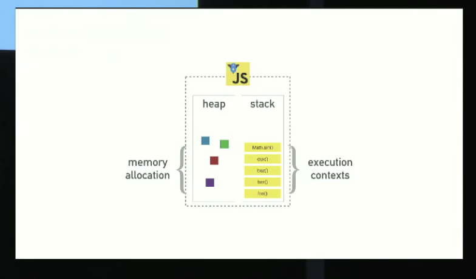
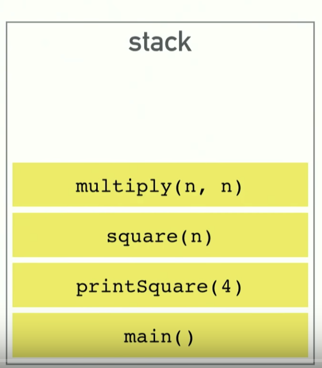
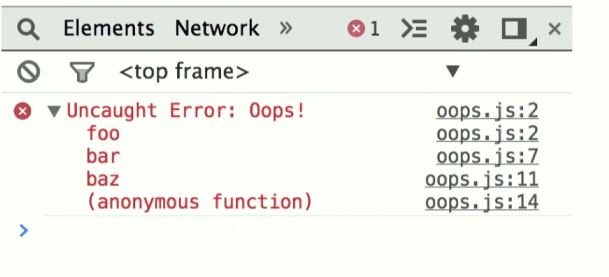
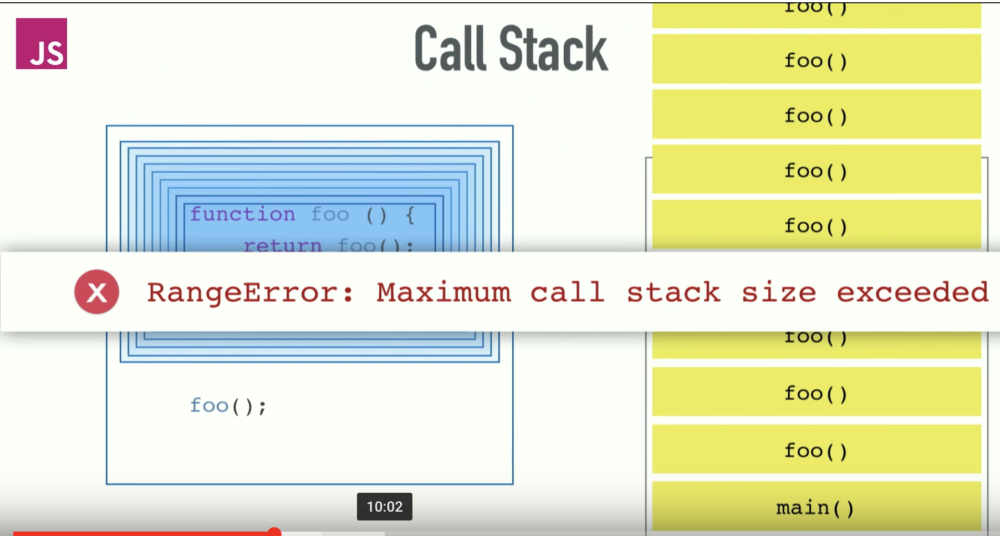

::: tip
写作不易，Star是最大鼓励，感觉写的不错的可以给个Star⭐，请多多指教。[Github地址](https://github.com/liujie2019/VuePress-Blog)。
:::
[TOC]
事件循环机制产生的原因：主线程运行的时候，产生堆和栈，栈中的代码调用各种外部API，异步操作执行完成后，就在消息队列中排队。只要栈中的代码执行完毕，主线程就会去读取消息队列，依次执行那些异步任务所对应的回调函数。
## 基础概念
主线程不断的重复获得消息、执行消息、再取消息、再执行，这种机制就称为事件循环。

`JavaScript Engine`和`JavaScript Runtime`(执行环境)。
简单来说，为了让JavaScript运行起来，要完成两部分工作（当然实际比这复杂的多）：

1. `JavaScript Engine`编译并执行`JavaScript`代码，完成内存分配、垃圾回收等；
2. `JavaScript Runtime`为`JavaScript`提供一些对象或机制，使它能够与外界交互。

`Chrome`和`Node.js`都使用了`V8 Engine`：`V8 Engine`实现并提供了`ECMAScript`标准中的所有数据类型、操作符、对象和方法（注意并没有`DOM`）。

但Chrome和Node.js的Runtime并不一样：Chrome提供了window、DOM，而Node.js则是require、process等等。

上图是一个javascript的运行环境示意图。堆(heap)记录了内存的分配，栈用于执行上下文。调用栈(stack)基本上是一个记录当前程序所在位置的数据结构，如果当前进入了某个函数，这个函数就会被放在栈里面。如果当前离开了某个函数，这个函数就会被弹出栈外，这是栈所做的事情。
```js
function multiply(a, b) {
   return a * b;
}
function square(a) {
   return multiply(a, a);
}
function printSquare(n) {
    var squared = square(n);
    console.log(squared);
}
printSquare(3);
```


当我们执行上述的js文件时，将会有一个类似`main`的函数，它**指代文件本身**，我们首先把它放入栈；然后，我们从上往下查看该文件声明的函数，最后是`printSquare`，我们知道了`printSquare`被调用了，那么我们把它推进栈里，然后它调用了`square`，所以也把`square`推进栈里，`square`又调用了`multiply`，同样也把`multiply`推进栈。最后形成了如上图所示的调用栈。

最后我们得到了`multiply`的返回值，我们把`multiply`弹出栈，然后`square`也得到了返回值，再把`square`弹出栈，最后到`printSquare`，它调用了`console.log`，到这里已经没有返回值了，到了函数的最后部分，到此完成整个过程。

```js
function foo() {
    throw new Error('Oops');
}
function bar() {
    foo();
}
function baz() {
    bar();
}
baz();
```
如果我们在Chrome运行上述的代码，`baz`函数调用了`bar`函数，`bar`函数调用了`foo`函数，`foo`函数抛出了一个错误，我们看到会是这样的：它将整个栈树都打印了出来，错误从`foo`开始，到`bar`，到`baz`，到匿名函数(也就是所谓的main函数)。

## 内存泄露
```js
function foo() {
    return foo();
}
foo();
```
以上就是一个内存泄露的例子，一个调用自身的函数foo，将会导致：超过最大限量的栈调用。


## Call Stack(调用栈)
`Call Stack`是一个记录函数调用的数据结构。当调用一个函数执行时，会先将函数调用推到调用栈中，当函数调用返回结果时，将函数从调用栈的顶部弹出。

```js
function multiply(a, b) {
   return a * b;
}
function square(a) {
   const sq = multiply(a, a);
   console.log(sq);
}
square(3);
```


## 异步
JS是一门单线程的语言，那为什么JS还有异步的写法？其实JS的异步和其他语言的异步是不相同的，本质上还是同步。因为浏览器会有多个Queue 存放异步通知，并且每个`Queue`的优先级也不同，JS 在执行代码时会产生一个执行栈，同步的代码在执行栈中，异步的在 Queue 中。有一个 Event Loop 会循环检查执行栈是否为空，为空时会在 Queue 中查看是否有需要处理的通知，有的话拿到执行栈中去执行。

具体来说，异步执行的运行机制如下：（同步执行也是如此，因为它可以被视为没有异步任务的异步执行。）

1. 所有同步任务都在主线程上执行，形成一个执行栈（execution context stack）；
2. 主线程之外，还存在一个`任务队列`（task queue）。只要异步任务有了运行结果，就在`任务队列`中放置一个事件；
3. 一旦"执行栈"中的所有同步任务执行完毕，系统就会读取"任务队列"，看看里面有哪些事件。那些对应的异步任务结束等待状态，进入执行栈，开始执行；
4. 主线程不断重复上面的第三步。

## Event Loop
javascript是单线程单一并发语言，这意味着它一次只能处理一个任务。这是由浏览器的场景决定的，避免了复杂的同步问题。HTML5提出「Web Worker」标准，允许js创建多个线程，但子线程仍受主线程控制，且不能操作DOM，js的本质未变。
### 为什么js是单线程的？
众所周知JS是门非阻塞单线程语言，因为在最初JS就是为了和浏览器交互而诞生的。如果JS是门多线程的语言话，我们在多个线程中处理 DOM 就可能会发生问题（一个线程中新加节点，另一个线程中删除节点），当然可以引入读写锁解决这个问题。

JS 在执行的过程中会产生执行环境，这些执行环境会被顺序的加入到执行栈中。如果遇到异步的代码，会被挂起并加入到 Task（有多种 task） 队列中。一旦执行栈为空，Event Loop 就会从 Task 队列中拿出需要执行的代码并放入执行栈中执行，所以本质上来说 JS 中的异步还是同步行为。

```js
setTimeout(function() {
    console.log('2222');
}, 2000);
setTimeout(function() {
    console.log('1111');
}, 1000);
function fn() {
    console.log('fn');
}
fn();

console.log('alert执行之前');
alert('------'); // alert会暂停当前主线程的执行，同时也会暂停定时器，点击确定后，恢复程序执行和定时器计数。
console.log('alert执行之后');
```
```js
console.log('script start');

setTimeout(function() {
  console.log('setTimeout');
}, 0);

console.log('script end');
```
以上代码虽然setTimeout延时为0，其实还是异步。这是因为HTML5标准规定这个函数第二个参数不得小于4毫秒，不足会自动增加。所以 setTimeout还是会在script end之后打印。

不同的任务源会被分配到不同的 Task 队列中，任务源可以分为 微任务（microtask） 和 宏任务（macrotask）。在 ES6 规范中，microtask 称为 jobs，macrotask 称为 task。

```js
console.log('script start');

setTimeout(function() {
  console.log('setTimeout');
}, 0);

new Promise((resolve) => {
    console.log('Promise')
    resolve()
}).then(function() {
  console.log('promise1');
}).then(function() {
  console.log('promise2');
});

console.log('script end');
// script start => Promise => script end => promise1 => promise2 => setTimeout
```
以上代码虽然setTimeout写在Promise 之前，但是因为 Promise 属于微任务而 setTimeout 属于宏任务，所以会有以上的打印。

### 宏任务和微任务分类
主线程每次只能执行一个任务，当主线程执行完成后，会首先执行微任务队列中的任务，把当前微任务队列中的任务执行完成后，才会执行宏任务队列中的任务。

异步任务=>等待队列=>分为宏任务队列和微任务队列。如果微任务队列中有多个任务，谁先放入的谁先执行。

* **macro-task(宏任务)包括：`script(整体代码)`，`setTimeout`，`setInterval`，`I/O`，`UI rendering`，`setImmediate(Node.js 环境)`**。
* **micro-task(微任务)包括：`Promise的then`，async/await，`process.nextTick(Node环境)`，`Object.observe(已废弃)`，`MutationObserver`**。

不同类型的任务会进入对应的`Event Queue`，比如`setTimeout和setInterval`会进入相同的`Event Queue`。

::: warning
特别注意：很多人认为微任务快于宏任务，其实是错误的。因为宏任务中包括了`script`，浏览器会先执行一个宏任务，接下来有异步代码的话就先执行微任务。
:::

所以正确的一次`Event loop`顺序是这样的：
1. 执行同步代码，这属于宏任务;
2. 执行栈为空，查询是否有微任务需要执行;
3. 执行所有微任务;
4. 必要的话渲染`UI`;
5. 然后开始下一轮`Event loop`，执行宏任务中的异步代码。

通过上述的`Event loop`顺序可知，如果宏任务中的异步代码有大量的计算并且需要操作`DOM`的话，为了更快的界面响应，我们可以把操作`DOM` 放入微任务中。

可能很多人要问了，那怎么知道主线程执行栈为空呢？js引擎存在`monitoring process`进程，会持续不断的检查主线程执行栈是否为空，一旦为空，就会去`Event Queue`里检查是否有等待被调用的函数。如果存在，则立即加入主线程执行栈中执行。


如上图所示：在JavaScript运行的时候，JavaScript Engine会创建和维护相应的堆（Heap）和栈（Stack），同时通过`JavaScript Runtime`提供的一系列`API`（例如`setTimeout、XMLHttpRequest`等）来完成各种各样的任务。调用栈中的代码调用各种外部API(Web APIS，是浏览器提供的)，它们在任务队列(Callback Queue)中加入各种事件。只要回调栈(Call Stack)中的代码执行完毕，主线程就会去读取任务队列，依次执行那些事件所对应的回调函数。执行栈中的代码（同步任务），总是在读取任务队列（异步任务）之前执行。

## 示例分析
```js
setTimeout(() => {
  console.log('我第4个执行');
}, 0);
new Promise((resolve, reject) => {
    console.log('我第1个执行');
    resolve();
}).then(() => {
    console.log('我第3个执行');
});
console.log('我第2个执行');
```
1. 整体script作为第一个宏任务进入主线程，先遇到setTimeout，将其回调函数注册后分发到宏任务Event Queue;
2. 接下来遇到了Promise，new Promise立即执行，then函数分发到微任务Event Queue;
3. 接下来遇到console.log()，立即执行;
4. 至此，整体script作为第一个宏任务执行结束，看看有哪些微任务，我们发现了then在微任务Event Queue里面，执行;
5. ok，到此第一轮事件循环就结束了。接着我们开始第二轮循环，当然要从宏任务Event Queue开始。我们发现了宏任务Event Queue中setTimeout对应的回调函数，立即执行;
6. 结束。
### demo1
```js
// 3 7 4 1 2 5
const first = () => (new Promise((resolve, reject) => {
    console.log(3);
    const p = new Promise((resolve, reject) => {
        console.log(7);
        setTimeout(() => {
           console.log(5);
           resolve(6);
        }, 0);
        resolve(1);
    });
    resolve(2);
    p.then(data => {
        console.log(data);
    });
}));

first().then(data => {
    console.log(data);
});
console.log(4);
```
分析：
* 第一轮事件循环：先执行宏任务，主script，`new Promise`立即执行，输出【3】，执行p这个`new Promise`操作，输出【7】，发现`setTimeout`，将回调放入下一轮任务队列`Event Queue`，p的then，暂且叫做then1，放入微任务队列，发现first的then，叫then2，放入微任务队列。执行console.log(4)，输出【4】，宏任务执行结束。再执行微任务，执行then1，输出【1】，执行then2，输出【2】。到此为止，第一轮事件循环结束。
* 第二轮事件循环：先执行宏任务里面的，也就是setTimeout的回调，输出【5】。resovle不会生效，因为p这个Promise的状态一旦改变(resolve(1)已经变为成功态了)就不会在改变了。所以最终的输出顺序是3、7、4、1、2、5。

::: warning
需要注意的是：Promise构造函数是立即执行。
:::
### demo2
```js
// 1 2 4 3 5
console.log(1);

setTimeout(() => {
    console.log(2);
    new Promise(resolve => {
        console.log(4);
        resolve();
    }).then(() => {
        console.log(5);
    });
    process.nextTick(() => {
        console.log(3);
    })
});
```
上述例子主要用来说明`process.nextTick`和`Promise.then`在node环境中的优先级。`process.nextTick`和`Promise.then`都属于微任务，`process.nextTick`的优先级高一点。因此输出：1 2 4 3 5。
### demo3
```js
console.log('script start'); // 1

async function async1() {
  await async2();
  console.log('async1 end'); // 5
}
async function async2() {
  console.log('async2 end'); // 2
}
async1();

setTimeout(function() {
  console.log('setTimeout'); // 8
}, 0);

new Promise(resolve => {
  console.log('Promise'); // 3
  resolve();
}).then(function() {
   console.log('promise1'); // 6
}).then(function() {
   console.log('promise2'); // 7
})

console.log('script end'); // 4
```
chrome 73版本输出结果如下：
```js
script start => async2 end => Promise => script end => async1 end => promise1 => promise2 => setTimeout
```
### process.nextTick与Promise.then都是微任务，为什么process.nextTick会先执行？
`process.nextTick`永远优先于`promise.then`执行，原因其实很简单。在Node中，`_tickCallback`在每一次执行完`TaskQueue`中的一个任务后被调用，而这个`_tickCallback`中实质上干了两件事：

1. nextTickQueue中所有任务执行掉(长度最大1e4，Node版本v6.9.1);
2. 第一步执行完后执行`_runMicrotasks`函数，执行`microtask`中的部分(promise.then注册的回调)。

所以很明显`process.nextTick`优先于`promise.then`。

## 参考文档
1. [彻底吃透 JavaScript 执行机制](https://mp.weixin.qq.com/s/Jj1TPz1aKyke1kjb5x8dNQ)
2. [JavaScript：彻底理解同步、异步和事件循环(Event Loop)](https://segmentfault.com/a/1190000004322358)
3. [一篇文章教会你Event loop——浏览器和Node](http://web.jobbole.com/94278/)
4. [深入浅出Javascript事件循环机制(上)](https://zhuanlan.zhihu.com/p/26229293)
5. [深入浅出JavaScript事件循环机制(下)](https://zhuanlan.zhihu.com/p/26238030)
6. [JS：事件循环机制、调用栈以及任务队列](https://blog.csdn.net/qq_31628337/article/details/71056294)
7. [JavaScript 运行机制详解：再谈Event Loop](http://www.ruanyifeng.com/blog/2014/10/event-loop.html)
8. [Stack(栈)的三种含义](http://www.ruanyifeng.com/blog/2013/11/stack.html)
9. [深入理解JavaScript运行机制](https://blog.csdn.net/Amos_liu/article/details/53560434)
10. [一篇文章教会你Event loop——浏览器和Node](http://web.jobbole.com/94278/)
11. [并发模型与事件循环](https://developer.mozilla.org/zh-CN/docs/Web/JavaScript/EventLoop)
12. [详细说明 Event loop](https://juejin.im/post/5aa8a07cf265da238a3022a4#heading-4)
13. [这一次，彻底弄懂 JavaScript 执行机制](https://juejin.im/post/59e85eebf265da430d571f89)
14. [Js 的事件循环(Event Loop)机制以及实例讲解](http://obkoro1.com/2018/06/17/Js-%E7%9A%84%E4%BA%8B%E4%BB%B6%E5%BE%AA%E7%8E%AF-Event-Loop-%E6%9C%BA%E5%88%B6%E4%BB%A5%E5%8F%8A%E5%AE%9E%E4%BE%8B%E8%AE%B2%E8%A7%A3/)
15. [从一道题浅说 JavaScript 的事件循环](https://github.com/dwqs/blog/issues/61)
16. [JS中的事件循环与定时器](https://blog.kaolafed.com/2015/12/01/JS%E4%B8%AD%E7%9A%84%E4%BA%8B%E4%BB%B6%E5%BE%AA%E7%8E%AF%E4%B8%8E%E5%AE%9A%E6%97%B6%E5%99%A8/)
17. [Philip Roberts的演讲《Help, I'm stuck in an event-loop》](https://vimeo.com/96425312)
18. [事件循环动画演示](http://latentflip.com/loupe/?code=JC5vbignYnV0dG9uJywgJ2NsaWNrJywgZnVuY3Rpb24gb25DbGljaygpIHsKICAgIHNldFRpbWVvdXQoZnVuY3Rpb24gdGltZXIoKSB7CiAgICAgICAgY29uc29sZS5sb2coJ1lvdSBjbGlja2VkIHRoZSBidXR0b24hJyk7ICAgIAogICAgfSwgMjAwMCk7Cn0pOwoKY29uc29sZS5sb2coIkhpISIpOwoKc2V0VGltZW91dChmdW5jdGlvbiB0aW1lb3V0KCkgewogICAgY29uc29sZS5sb2coIkNsaWNrIHRoZSBidXR0b24hIik7Cn0sIDUwMDApOwoKY29uc29sZS5sb2coIldlbGNvbWUgdG8gbG91cGUuIik7!!!PGJ1dHRvbj5DbGljayBtZSE8L2J1dHRvbj4%3D)
19. [Understanding Javascript Function Executions — Call Stack, Event Loop , Tasks & more](https://medium.com/@gaurav.pandvia/understanding-javascript-function-executions-tasks-event-loop-call-stack-more-part-1-5683dea1f5ec)
20. [深入理解 JavaScript Event Loop](https://zhuanlan.zhihu.com/p/34229323)
21. [并发模型与事件循环](https://developer.mozilla.org/zh-CN/docs/Web/JavaScript/EventLoop)
22. [JavaScript Event Loop Explained](https://medium.com/front-end-hacking/javascript-event-loop-explained-4cd26af121d4)
23. [Understanding the JavaScript event loop](https://www.zeolearn.com/magazine/understanding-the-javascript-event-loop)
24. [JavaScript 中的 task queues](https://tasaid.com/blog/20180118132704.html)
25. [深入理解Event Loop](https://gnipbao.github.io/2018/01/02/event-loop-in-deep/)
26. [JavaScript 在浏览器中的事件循环](https://github.com/pengliheng/pengliheng.github.io/issues/24)
27. [\[面试专题\]JS异步原理\(事件,队列\)](https://segmentfault.com/a/1190000010913949)
28. [JS task到底是怎么运行的](https://github.com/rhinel/blog-word/issues/4)
29. [带你彻底弄懂Event Loop前言正文总结](https://cloud.tencent.com/developer/article/1359934)
