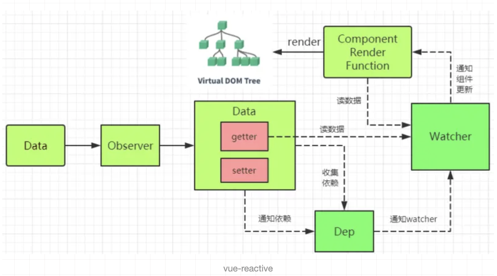
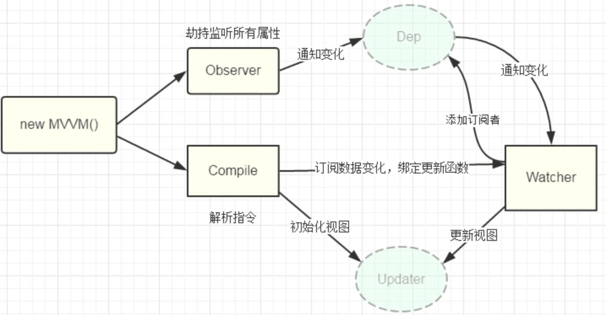
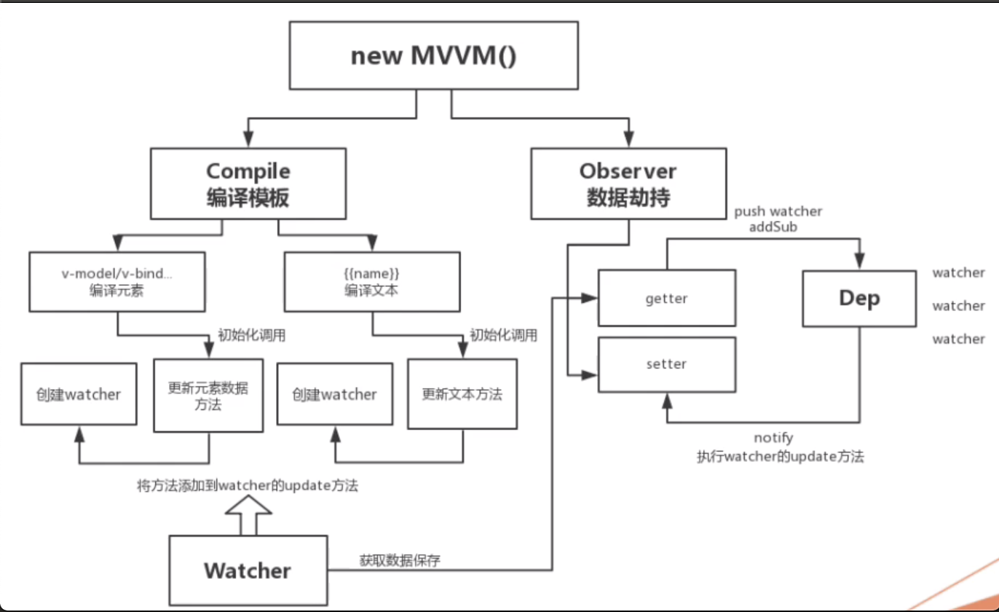
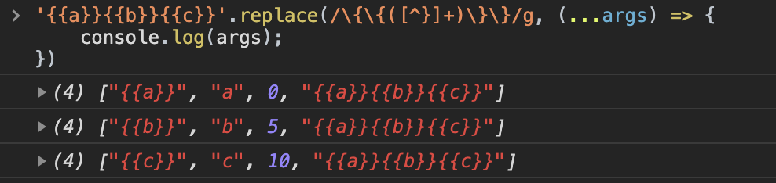

::: tip
写作不易，Star是最大鼓励，感觉写的不错的可以给个Star⭐，请多多指教。[本博客的Github地址](https://github.com/liujie2019/VuePress-Blog)。
:::



要实现MVVM的双向绑定，就必须要实现以下几点：
1. 实现一个数据监听器Observer，能够对数据对象的所有属性进行监听，如有变动可拿到最新值并通知订阅者
2. 实现一个指令解析器Compile，对每个元素节点的指令进行扫描和解析，根据指令模板替换数据，以及绑定相应的更新函数
3. 实现一个Watcher，作为连接Observer和Compile的桥梁，能够订阅并收到每个属性变动的通知，执行指令绑定的相应回调函数，从而更新视图
4. MVVM入口函数，整合以上三者

上述流程如下图所示：

## 核心实现类
* Observer：作用是给对象的属性添加getter和setter，用于依赖收集和派发更新；
* Dep：用于收集当前响应式对象的依赖关系，**每个响应式对象包括子对象都拥有一个Dep实例(里面subs是Watcher实例数组)**，当数据有变更时，会通过 dep.notify()方法通知各个watcher实例；
* Watcher：观察者对象，实例分为渲染watcher(render watcher)，计算属性watcher(computed watcher)，侦听器watcher(user watcher)三种。
### Watcher和Dep的关系
watcher中实例化了dep并向dep.subs中添加了订阅者，dep通过notify遍历dep.subs通知每个watcher更新。
### 依赖收集
在定义响应式时的get方法中进行依赖收集。

1. initState时，对computed属性初始化时，触发computed watcher依赖收集；
2. initState时，对侦听属性初始化时，触发user watcher依赖收集
3. render的过程，触发render watcher依赖收集
4. re-render时，vm.render()再次执行，会移除所有subs中的watcer的订阅，重新赋值。
### 派发更新
1. 组件中对响应的数据进行了修改，触发setter的逻辑
2. 调用dep.notify()
3. 遍历所有的 subs（Watcher 实例），调用每一个 watcher 的 update 方法。

### 核心原理
当创建Vue实例时，Vue会遍历data选项的属性，利用Object.defineProperty为属性添加getter和setter对数据的读取进行劫持（getter用来依赖收集，setter用来派发更新），并且在内部追踪依赖，在属性被访问和修改时通知变化。

每个组件实例会有相应的watcher实例，会在组件渲染的过程中记录依赖的所有数据属性（进行依赖收集，还有computed watcher，user watcher 实例），之后依赖项被改动时，setter方法会通知依赖与此 data 的 watcher 实例重新计算（派发更新），从而使它关联的组件重新渲染。

一句话总结：Vue.js采用**数据劫持结合发布-订阅模式**，通过Object.defineproperty来劫持各个属性的setter/getter，在数据变化时发布消息给订阅者，触发响应的监听回调。

主要来说下如下几个点的实现：
1. 模板的编译
2. 数据劫持-观察数据变化(Object.defineProperty，给所有属性加上getter和setter)
3. Watcher：数据发生变化，就重新编译模板

模块职责划分：
* compile.js：编译模板
* observer.js：数据劫持
* watcher.js：创建观察者
* dep：new Watch的时候，会将当前的watcher添加到dep(data的每个属性都对应一个dep实例，即每个属性都具有发布订阅的功能)的订阅者数组中，一旦数据发生变化，会调用dep的notify方法，通知对应数据的观察者更新数据



```js
// MVVM.js
class MVVM {
    constructor(options) {
        const {el, data, computed, mounted, methods} = options;
        // 先把可用的数据挂载在实例上
        this.$el = el;
        this.$data = data;
        this.computed = computed;
        this.methods = methods;
        // 如果有要编译的模板就开始编译
        if (this.$el) {
            this.initComputed(); // 初始化computed

            // 数据代理，vm上的取值操作都代理到vm.$data上，即vm.message等同于vm.$data.message
            this.proxyData(this.$data);
            // 数据劫持 就是把对象的所有属性(this.$data中的属性)改成get和set方法
            new Observer(this.$data);
            // 编译过程需要数据和元素
            // const vm = new MVVM() 实例化的过程中，this指向当前实例，这里就是vm
            new Compile(this.$el, this);
            mounted.call(this);
        }
    }
    initComputed() {
        const computed = this.computed;
        if (typeof computed === 'object') {
            Object.keys(computed).forEach(key => {
                // {{getHelloWord}} => vm.$data.getHelloWord
                // 在getVal方法中，取值是从vm.$data中取的
                // 所以这里要将计算属性代理到this.$data上，而不是this上
                Object.defineProperty(this.$data, key, {
                    // 这里判断是computed里的key是对象还是函数
                    // 如果是函数直接就会调get方法
                    // 如果是对象的话，手动调一下get方法即可
                    get: () => {
                        return typeof computed[key] === 'function' ? computed[key].call(this) : computed[key].get.call(this);
                    },
                    set: function() {}
                });
            });
        }
    }
    proxyData(data) {
        Object.keys(data).forEach(key => {
            // this就是当前vm实例
            Object.defineProperty(this, key, {
                configurable: false, // 不可删除
                enumerable: true,
                get() {
                    return data[key];
                },
                set(newValue) {
                    data[key] = newValue;
                }
            });
        });
    }
}
```
## 编译模板
```js
// compile.js
class Compile {
    constructor(el, vm) { // vm就是当前的vm实例
        // 如果在实例化vm的时候，el传的是字符串，即el: '#app'。
        // 这里就需要document.querySelector(el)获取到对应的DOM节点
        this.el = this.isElementNode(el) ? el : document.querySelector(el);
        this.vm = vm;
        if (this.el) {
            // 如果可以获取到元素，才开始编译
            // 1. 先把this.el中的真实的DOM放到内存中(采用文档碎片-fragment，在内存中操作元素性能好)
            // 放在内存中操作DOM不会造成页面的重复渲染，性能更好
            const fragment = this.nodeToFragment(this.el);
            // 2. 编译 => 提取想要的元素节点v-model和文本节点{{}}
            this.compile(fragment);
            // 3. 最后把编译好的fragment放回到页面里去
            this.el.appendChild(fragment);
        }
    }
    /**一些辅助方法 */
    isElementNode(node) {
        // 判断是否为元素节点
        return node.nodeType === 1;
    }
    // 判断是否为指令
    isDirective(name) {
        return name.startsWith('v-');
    }
    isEventDirective(dir) {
        return dir.startsWith('on');
    }
    /**核心方法 */
    compileElement(node) { // node是当前要编译的节点
        // 带v-model
        const attrs = node.attributes; // 获取当前节点的所有属性
        // console.log(attrs);
        Array.from(attrs).forEach(attr => {
            // attr举例：v-model="message.a"
            const attrName = attr.name;
            // 判断属性名字是不是包含v-
            if (this.isDirective(attrName)) {
                // 如果包含v-，则取到对应的值放到节点中
                // expr为指令对应的值
                const expr = attr.value;
                // node vm.$data
                // todo this.vm.$data中多级属性获取值，比如vm.$data.obj.a.a...
                // const type = attrName.slice(2);
                // attrName的值为v-model
                // 还有其他指令v-text、v-html
                const [, type] = attrName.split('-');
                // 事件指令特殊处理
                if (this.isEventDirective(type)) {
                    CompileUtil.eventHandler(node, this.vm, expr, type);
                } else { // 普通指令处理
                    CompileUtil[type](node, this.vm, expr);
                }
            }
        });
    }
    compileText(node) {
        // 带{{}}
        const text = node.textContent; // 获取文本中的内容
        // const reg = /\{\{(.+?)\}\}/g;
        const reg = /\{\{([^}]+)\}\}/g;
        if (reg.test(text)) {
            CompileUtil['text'](node, this.vm, text);
        }
    }

    compile(fragment) {
        // 需要递归
        // 注意childNodes也包含了空白节点
        const childNodes = fragment.childNodes;
        // console.log(childNodes);
        // 这里拿到的childNodes只是第一层，需要递归拿深层元素和文本
        // childNodes是一个NodeList，即类数组
        Array.from(childNodes).forEach(node => {
            if (this.isElementNode(node)) {
                // 如果当前节点是元素节点，其可能还有子节点，因此需要递归检查
                // console.log('元素节点', node);
                // 编译元素节点
                this.compileElement(node);
                // 递归编译元素节点
                this.compile(node);
            } else { // 当前节点是文本节点
                // 编译文本节点
                // console.log('文本节点', node);
                this.compileText(node);
            }
        });
    }
    nodeToFragment(el) { // 将el中的内容全部放到内存中
        // 新建一个文档碎片
        const fragment = document.createDocumentFragment();
        let firstChild;
        while(firstChild = el.firstChild) {
            // appendChild具有移动性，这里是将页面中的dom元素先放到文档碎片中
            // 每循环一次，就会将el中的第一个子节点放到文档碎片中
            fragment.appendChild(firstChild);
        }
        return fragment; // 返回内存中的节点
    }
}

CompileUtil = {
    // 这里的expr值是message.a
    // 根据表达式expr取到对应的数据
    getVal(vm, expr) { // 获取实例上对应的数据
        expr = expr.split('.');
        // console.log(expr);
        // console.log(vm.$data);
        // 上一次的结果作为下一次循环的输入，采用reduce
        return expr.reduce((prev, next) => {
            return prev[next];
        }, vm.$data);
    },
    getTextVal(vm, expr) { // 获取编译文本
        // 遍历表达式，将内容重新替换为一个完整的新内容进行替换
        return expr.replace(/\{\{([^}]+)\}\}/g, (...arguments) => {
            //  ["{{message.a}}", "message.a", 0, "{{message.a}}"]
            // console.log(arguments);
            // arguments[1]对应的值为message.a，即正则中分组的值
            return this.getVal(vm, arguments[1]);
        });
    },
    setVal(vm, expr, value) {
        expr = expr.split('.');
        // reduce数据收敛
        expr.reduce((prev, next, currentIndex) => {
            // 最后一项改为赋值
            if (currentIndex === expr.length - 1) {
                return prev[next] = value;
            }
            return prev[next];
        }, vm.$data);
    },
    text(node, vm, expr) { // 文本处理
        const updateFn = this.update['textUpdate'];
        // message.a => [message, a] vm.$data.message.a
        // console.log(expr); // {{message.a}}
        // expr可能是多层嵌套的，比如data.message.obj.a
        // 对于属性嵌套的情况，先将对应的expr拆分为数组，一层一层的取
        const value = this.getTextVal(vm, expr);
        // console.log(value); // message.a
        // {{a}} {{b}}
        // {{x}}可能有多个，这里循环给每个文本添加一个watcher
        expr.replace(/\{\{([^}]+)\}\}/g, (...arguments) => {
            // console.log(arguments); // ["{{message.a}}", "message.a", 0, "{{message.a}}"]
            // arguments[1]获取表达式分组的值
            // 给表达式每个{{}}都添加观察者
            new Watcher(vm, arguments[1], () => {
                // 如果数据变化了，文本节点需要重新获取依赖的数据更新文本中的内容
                updateFn && updateFn(node, this.getTextVal(vm, expr));
            });
        });
        updateFn && updateFn(node, value);
    },
    model(node, vm, expr) { // v-model处理
        const updateFn = this.update['modelUpdate'];
        // 这里应该给数据添加一个观察者，如果数据更新了就会触发对应的回调，拿新值进行更新
        // 数据变化了，应该调用watcher的callback
        new Watcher(vm, expr, newValue => {
            // 当值变化后会调用cb 将新的值传递过来
            updateFn && updateFn(node, newValue);
        });
        // 输入框input事件绑定，实现数据的双向绑定
        node.addEventListener('input', e => {
            const newValue = e.target.value; // 获取用户输入的内容
            // 值的改变会调用set，set中又会调用notify，notify中调用watcher的update方法实现更新
            this.setVal(vm, expr, newValue);
        });
        // message.a => [message, a] vm.$data.message.a
        updateFn && updateFn(node, this.getVal(vm, expr));
    },
    html(node, vm, expr) {
        const updateFn = this.update['htmlUpdate'];
        const value = this.getVal(vm, expr);
        new Watcher(vm, expr, newValue => {
            updateFn && updateFn(node, newValue);
        });
        updateFn && updateFn(node, value);
    },
    eventHandler(node, vm, expr, dir) {
        const eventType = dir.split(':')[1];
        const handler = vm.methods && vm.methods[expr];
        if (eventType && handler) {
            node.addEventListener(eventType, handler.bind(vm), false);
        }
    },
    update: {
        // 文本更新
        textUpdate(node, value) {
            node.textContent = value;
        },
        // 输入框更新
        modelUpdate(node, value) {
            node.value = value;
        }, // html更新
        htmlUpdate(node, value) {
            node.innerHTML = typeof value === 'undefined' ? '' : value;
        }
    }
};
```
```js
getTextVal(vm, expr) { // 获取编译文本
      return expr.replace(/\{\{([^}]+)\}\}/g, (...arguments) => {
          //  ["{{message.a}}", "message.a", 0, "{{message.a}}"]
          // console.log(arguments);
          // arguments[1]对应的值为message.a，即正则中分组的值
          return this.getVal(vm, arguments[1]);
      });
},
```



## 数据劫持
```js
// observer.js
class Observer {
    constructor(data) {
        this.observer(data);
    }
    observer(data) {
        // 要对这个data数据将原有的属性改成set和get的形式
        // 如果data不存在或者不是对象，则不需要劫持
        if (!data || typeof data !== 'object') {
            return;
        }
        // 要将数据 一一劫持，先获取到data的key和value
        Object.keys(data).forEach(key => {
            // 劫持
            this.defineReactive(data, key, data[key]);
            this.observer(data[key]); // 深度递归劫持
        });
    }
    // 定义响应式
    defineReactive(obj, key, value) {
        // const that = this;
        // 给每一个属性 都加上一个具有发布订阅的功能，相当于每个属性都有一个watcher数组，用来做依赖收集
        const dep = new Dep(); // 每个变化的数据都会对应一个数组，这个数组是存放所有更新的操作
        Object.defineProperty(obj, key, {
            enumerable: true,
            configurable: true,
            // 在get方法中进行依赖收集
            get() { // 当取值时调用的方法
                // 设置的时候可以做其他事情
                // Dep.target是指向当前的watcher实例
                // 创建watcher时，会获取对应属性的值，并把当前的watcher实例挂载到了Dep.target上
                Dep.target && dep.addSub(Dep.target);
                return value;
            },
            set: newValue => { // 当给data属性中设置值的时候，更改获取的属性的值
                if (newValue !== value) {
                    this.observer(newValue); // 如果新值是对象，则需要对新值继续劫持
                    value = newValue;
                    // 每个属性都有自己对应的Dep，当属性变化时，调用notify方法通知观察者数据更新了
                    dep.notify(); // 通知所有订阅者，数据更新了
                }
            }
        });
    }
}
// 发布-订阅
class Dep {
    constructor() {
        // 订阅的数组，存放所有的watcher
        this.subs = [];
    }
    addSub(watcher) { // 添加watcher
        this.subs.push(watcher);
    }
    notify() { // 发布
        this.subs.forEach(watcher => watcher.update());
    }
}
```
## Watch
```js
// watch.js
// 观察者的目的就是给需要变化的那个元素增加一个观察者，当数据变化后执行对应的方法
class Watcher {
    // 根据vm, expr来获取新的值，如果值变化了，调用cb函数
    constructor(vm, expr, cb) {
        // 将vm, expr, cb都挂载到实例属性中，方便后面使用
        this.vm = vm;
        this.expr = expr;
        this.cb = cb;
        // new Watcher()的时候会调用this.get()方法去vm实例上获取对应的属性值
        // 获取属性值就会调用get方法，在get方法中把当前的watcher实例添加到this.subs订阅数组中
        // 先获取旧值，当新值与老值不同时，再进行值的更新
        this.oldValue = this.get();
    }
    getVal(vm, expr) { // 获取实例上对应的数据
        expr = expr.split('.');
        return expr.reduce((prev, next) => {
            return prev[next];
        }, vm.$data);
    }
    get() {
        // Dep是一个全局的类，将当前的watcher实例挂载到Dep的静态属性target上
        Dep.target = this; // this就是当前的watcher实例
        const value = this.getVal(this.vm, this.expr);
        // 将Dep.target置为null，否则任何取值操作都会添加这个watcher
        Dep.target = null; // 不取消，任何值取值都会添加watcher
        return value;
    }
    // 对外暴露的方法
    // 更新操作，数据发生变化后，会调用观察者的update方法
    update() {
        // 更新的时候，先获取到新的值newValue，然后新旧值对比，发生改变了再更新
        const newValue = this.getVal(this.vm, this.expr);
        const oldValue = this.oldValue;
        if (newValue !== oldValue) {
            this.cb(newValue);
        }
    }
}
// 用新值和旧值进行比对，如果发生变化，就调用更新方法
```
```html
<!DOCTYPE html>
<html lang="en">
<head>
    <meta charset="UTF-8">
    <meta name="viewport" content="width=device-width, initial-scale=1.0">
    <meta http-equiv="X-UA-Compatible" content="ie=edge">
    <title>手写MVVM</title>
</head>
<body>
    <div id="app">
        <input type="text" v-model="c" />
        <div>{{message.a}}</div>
        <!-- <ul>
            <li></li>
        </ul> -->
        {{c}}
        <p>{{getHelloWord}}</p>
        <h1 v-html="htmlStr"></h1>
        <button v-on:click="handleClick">点击切换</button>
    </div>
    <script src="./watcher.js"></script>
    <script src="./observer.js"></script>
    <script src="./compile.js"></script>
    <script src="./MVVM.js"></script>
    <script>
        // 我们的数据一般都挂载在vm上
        const vm = new MVVM({
            el: '#app',
            data: {
                c: 'hello123',
                d: 'world',
                message: {
                    a: 'hello',
                    b: 'mvvm'
                },
                htmlStr: '<span style="color: green;">hello green</span>'
            },
            computed: {
                getHelloWord() {
                    return this.c + '---' + this.d;
                }
            },
            mounted() {
                setTimeout(() => {
                    console.log('mounted触发了');
                }, 1000);
            },
            methods: {
                handleClick(e) {
                    // this.htmlStr = '<span style="color: green;">hello green2222</span>';
                    const randomStrArr = ['childOne', 'childTwo', 'childThree'];
                    this.message.a = randomStrArr[Number.parseInt(Math.random() * 3)];
                }
            }
        });
    </script>
</body>
</html>
```
## 总结
上述实现的MVVM包含了以下几点：
* 通过模板编译对`{{}}`进行数据的替换
* 通过Object.defineProperty的get和set实现数据劫持
* 通过**发布-订阅模式**实现数据变化与视图更新的一致性
* 通过Object.defineProperty将data数据代理到当前vm实例(即this)上

## 参考文档
1. [深入理解Vue响应式原理](https://funteas.com/topic/5a809f5847dc830a0e4690c2)
2. [不好意思！耽误你的十分钟，让MVVM原理还给你](https://juejin.im/post/5abdd6f6f265da23793c4458#heading-11)
3. [剖析Vue原理&实现双向绑定MVVM](https://segmentfault.com/a/1190000006599500)