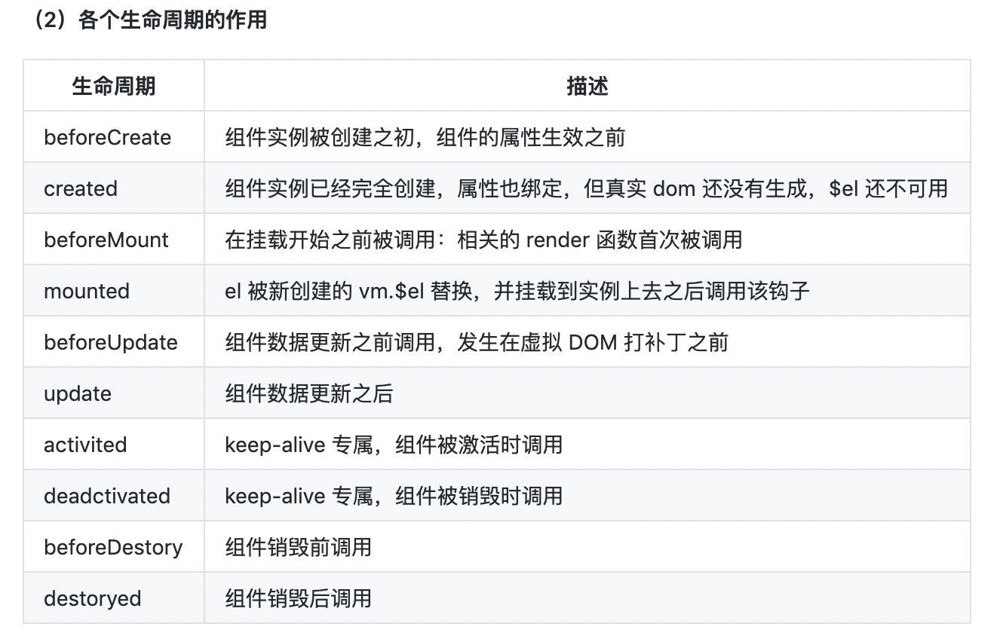
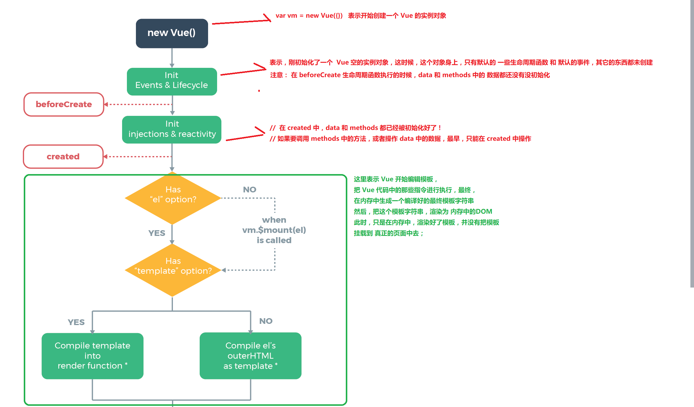
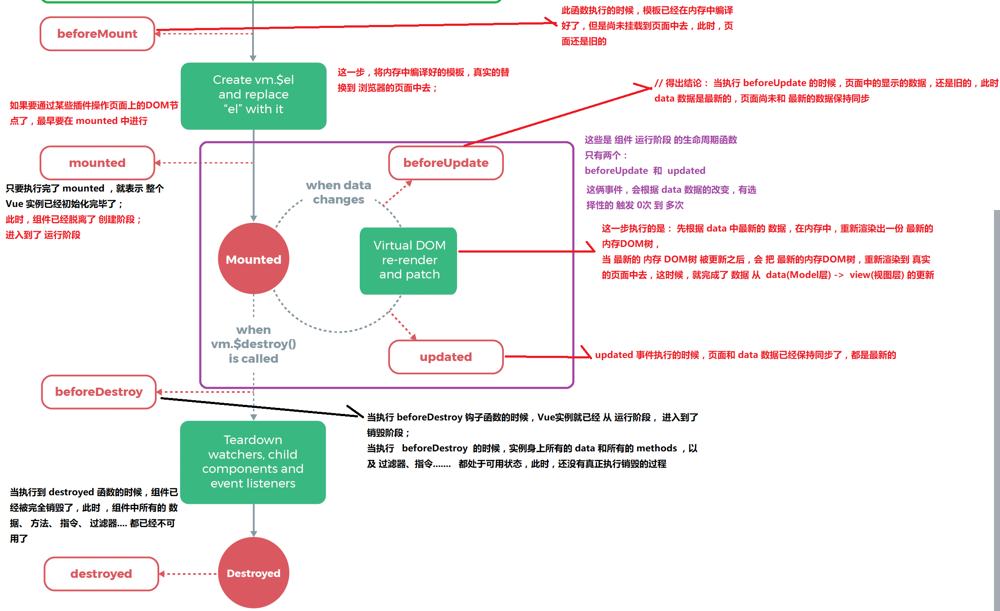

::: tip
写作不易，Star是最大鼓励，感觉写的不错的可以给个Star⭐，请多多指教。[本博客的Github地址](https://github.com/liujie2019/VuePress-Blog)。
:::
[TOC]
Vue实例有一个完整的生命周期，也就是从开始创建、初始化数据、编译模版、挂载Dom -> 渲染、更新 -> 渲染、卸载等一系列过程，我们称这是Vue的生命周期。

生命周期：从Vue实例创建、运行、到销毁期间，总是伴随着各种各样的事件，这些事件统称为生命周期钩子。生命周期钩子其实就是生命周期事件的别名而已。
生命周期钩子 = 生命周期函数 = 生命周期事件

Vue生命周期总共分为8个阶段: 创建(create)前/后，载入(mount)前/后，更新(update)前/后，销毁(destroy)前/后。
## 生命周期函数分类
```html
<div id="app">
    <h2 id="h2">{{msg}}</h2>
    <button @click="change">变更</button>
</div>
```
```js
<script>
    let vm = new Vue({
        el: '#app',
        data: {
            msg: 'test'
        },
        methods: {
            change() {
                this.msg = 'test-change';
            }
        },
        beforeCreate() {
            // console.log(this.msg); // undefined
            // this.change(); // Error in beforeCreate hook: "TypeError: this.change is not a function"
        },
        created() {
            // console.log(this.msg); // test
            // this.change();
            // console.log(this.msg); // test-change
        },
        // beforeMount() {
        //     console.log(document.querySelector('#h2').innerText); // {{msg}}
        // },
        // mounted() {
        //     console.log(document.querySelector('#h2').innerText); // test
        // },
        beforeUpdate() {
            console.log('beforeUpdate-界面上元素的内容：' + document.getElementById('h2').innerText); // test
            console.log('beforeUpdate-data中的msg数据是：' + this.msg); // test-change
        },
        updated() {
            console.log('界面上元素的内容：' + document.getElementById('h2').innerText); // test-change
            console.log('data中的msg数据是：' + this.msg); // test-change
        }
    });
</script>
```
### 创建期间的生命周期函数
* beforeCreate(创建前)：Vue实例刚刚在内存中被创建出来，此时，Vue实例的挂载元素$el和数据对象data都是undefined，data和methods属性也还没有初始化好；
```js
// 无法访问data中的数据和methods中的方法
beforeCreate() {
    console.log(this.msg); // undefined
    this.change(); // Error in beforeCreate hook: "TypeError: this.change is not a function"
}
```
* created(创建后)：实例已经在内存中创建好了，此时data和methods也都已经创建好了，此时还没有开始编译模板，$el还未初始化；
```js
// 可以访问data中的数据和methods中的方法
created() {
    console.log(this.msg); // test
    this.change();
    console.log(this.msg); // test-change
}
```
* beforeMount(载入前)：Vue实例的$el和data都初始化了，相关的render函数首次被调用。实例已完成以下的配置：编译模板(内存中编译的虚拟DOM)，把data里面的数据和模板生成html。注意：此时还没有挂载html到页面上。
```js
beforeMount() {
    console.log(document.querySelector('#h2').innerText); // {{msg}}
}
```
* mounted(载入后)：el被新创建的`vm.$el`替换，并挂载到实例上去之后调用。实例已完成以下的配置：用上面编译好的html内容替换el属性指向的DOM对象。完成模板中的html渲染到html页面中，在该生命周期中进行ajax交互。
```js
mounted() {
    console.log(document.querySelector('#h2').innerText); // test
}
```
### 运行期间的生命周期函数
* beforeUpdate(更新前)：在数据更新之前调用，发生在虚拟DOM重新渲染和打补丁之前。此时，data中的状态值是最新的，但是界面上显示的数据还是旧的，因为此时还没有开始重新渲染DOM节点。可以在该钩子中进一步地更改状态，不会触发附加的重渲染过程。
```js
// 当data中的数据发生变化的时候，该生命周期中页面上的内容还未更新
beforeUpdate() {
    console.log('beforeUpdate-界面上元素的内容：' + document.getElementById('h2').innerText); // test
    console.log('beforeUpdate-data中的msg数据是：' + this.msg); // test-change
}
```
* updated(更新后)：实例更新完毕之后调用此函数，此时data中的状态值和界面上显示的数据，都已经完成了更新，界面已经被重新渲染好了。由于数据更改导致的虚拟DOM重新渲染和打补丁之后调用。调用时，组件DOM已经更新，所以可以执行依赖于DOM的操作。然而在大多数情况下，应该避免在此期间更改状态，因为这可能会导致更新无限循环。该钩子在服务器端渲染期间不被调用。
```js
// 当data中的数据发生变化的时候，该生命周期中页面上的内容发生更新
updated() {
    console.log('界面上元素的内容：' + document.getElementById('h2').innerText); // test-change
    console.log('data中的msg数据是：' + this.msg); // test-change
}
```
### 销毁期间的生命周期函数
* beforeDestroy(销毁前)：在实例销毁之前调用。在这一步，实例仍然完全可用。
* destroyed(销毁后)：Vue实例销毁之后调用。调用后，Vue实例指示的所有东西都会解绑定，所有的事件监听器会被移除，所有的子实例也会被销毁。该钩子在服务器端渲染期间不被调用。

## 生命周期汇总


## 生命周期示意图



## 父组件和子组件生命周期钩子函数执行顺序
Vue的父组件和子组件生命周期钩子函数执行顺序可以归类为以下4部分：
### 加载渲染过程
父beforeCreate -> 父created -> 父beforeMount -> 子beforeCreate -> 子created -> 子beforeMount -> 子mounted -> 父mounted

### 子组件更新过程
父beforeUpdate -> 子beforeUpdate -> 子updated -> 父updated

### 父组件更新过程
父beforeUpdate -> 父updated

### 销毁过程
父beforeDestroy -> 子beforeDestroy -> 子destroyed -> 父destroyed

## 在哪个生命周期中调用异步请求
可以在钩子函数created、beforeMount、mounted中进行调用，因为在这三个钩子函数中，data已经创建，可以将服务端返回的数据进行赋值。但是，推荐在created钩子函数中调用异步请求，因为在created钩子函数中调用异步请求有以下优点：

* 能更快获取到服务端数据，减少页面loading时间；
* ssr不支持beforeMount、mounted钩子函数，所以放在created中有助于一致性；

## 在哪个阶段才能访问和操作DOM
在钩子函数mounted被调用前，Vue已经将编译好的模板挂载到页面上，所以在mounted中可以访问操作DOM。

## 父组件可以监听到子组件的生命周期吗
比如有父组件Parent和子组件Child，如果父组件监听到子组件挂载mounted就做一些逻辑处理，可以通过以下写法实现：
```js
// Parent.vue
<Child @mounted="doSomething" />

// Child.vue
mounted() {
  this.$emit("mounted");
}
```
以上需要手动通过$emit触发父组件的事件，更简单的方式可以在父组件引用子组件时通过@hook来监听即可，如下所示：
```js
//  Parent.vue
<Child @hook:mounted="doSomething" ></Child>

doSomething() {
   console.log('父组件监听到mounted钩子函数 ...');
},

//  Child.vue
mounted() {
   console.log('子组件触发mounted钩子函数...');
},

// 以上输出顺序为：
// 子组件触发 mounted 钩子函数 ...
// 父组件监听到 mounted 钩子函数 ...
```
当然@hook方法不仅仅是可以监听mounted，其它的生命周期事件，例如：created，updated等都可以监听。