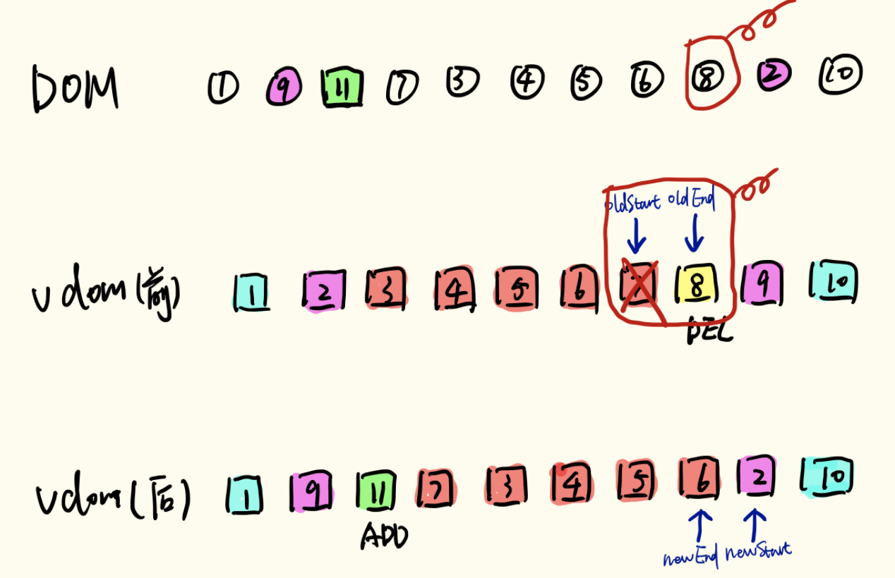

::: tip
写作不易，Star是最大鼓励，感觉写的不错的可以给个Star⭐，请多多指教。[本博客的Github地址](https://github.com/liujie2019/VuePress-Blog)。
:::
Virtual DOM是对DOM的抽象，本质上是JavaScript对象，这个对象就是更加轻量级的对DOM的描述。
## 模板转换成视图的过程
在正式介绍 Virtual Dom之前，我们有必要先了解下模板转换成视图的过程整个过程（如下图参考《深入浅出vue》）：

1. Vue.js通过编译将template 模板转换成渲染函数(render) ，执行渲染函数就可以得到一个虚拟节点树
2. 在对 Model 进行操作的时候，会触发对应 Dep 中的 Watcher 对象。Watcher 对象会调用对应的 update 来修改视图。这个过程主要是将新旧虚拟节点进行差异对比，然后根据对比结果进行DOM操作来更新视图。

简单点讲，在Vue的底层实现上，Vue将模板编译成虚拟DOM渲染函数。结合Vue自带的响应系统，在状态改变时，Vue能够智能地计算出重新渲染组件的最小代价并应到DOM操作上。
## 为什么需要Virtual DOM
### 具备跨平台的优势
DOM的渲染是依赖浏览器环境的，但是Virtual DOM是以JavaScript对象为基础而不依赖真实平台环境，所以使它具有了跨平台的能力，比如说浏览器平台、Weex、Node等。

### 操作原生DOM慢，js运行效率高。我们可以将DOM对比操作放在JS层，提高效率。
因为DOM操作的执行速度远不如Javascript的运算速度快，因此，把大量的DOM操作搬运到Javascript中，运用patching算法来计算出真正需要更新的节点，最大限度地减少DOM操作，从而显著提高性能。

Virtual DOM 本质上就是在 JS 和 DOM 之间做了一个缓存。可以类比 CPU 和硬盘，既然硬盘这么慢，我们就在它们之间加个缓存：既然 DOM 这么慢，我们就在它们 JS 和 DOM 之间加个缓存。CPU（JS）只操作内存（Virtual DOM），最后的时候再把变更写入硬盘（DOM）

### 提升渲染性能
Virtual DOM的优势不在于单次的操作，而是在大量、频繁的数据更新下，能够对视图进行合理、高效的更新。

首先，我们都知道在前端性能优化的一个秘诀就是尽可能少地操作DOM，不仅仅是DOM相对较慢，更因为**频繁变动DOM会造成浏览器的回流或者重绘**，这些都是性能的杀手，因此我们需要这一层抽象，在patch过程中尽可能地一次性将差异更新到DOM中，这样保证了DOM不会出现性能很差的情况。

其次，现代前端框架的一个基本要求就是无须手动操作DOM，一方面是因为手动操作DOM无法保证程序性能，多人协作的项目中如果review不严格，可能会有开发者写出性能较低的代码，另一方面更重要的是省略手动DOM操作可以大大提高开发效率。

最后，也是Virtual DOM最初的目的，就是更好的跨平台，比如Node.js就没有DOM，如果想实现SSR(服务端渲染)，那么一个方式就是借助Virtual DOM,因为Virtual DOM本身是JavaScript对象。


所谓的virtual dom，也就是虚拟节点。它通过JS的Object对象模拟DOM中的节点，然后再通过特定的render方法将其渲染成真实的DOM节点。
dom diff则是通过JS层面的计算，返回一个patch对象，即补丁对象，再通过特定的操作解析patch对象，完成页面的重新渲染，
上一张图让大家更加清晰点：


## diff算法总体实现思路
vdom是树状结构，其节点为vnode，vnode和浏览器DOM中的Node一一对应，通过vnode的elm属性可以访问到对应的Node即真实的DOM节点。

Vue diff算法是基于Snabbdom来实现的，并在些基础上作了很多的调整和改进。


上图一张很经典的图，出自《React’s diff algorithm》。Vue的diff算法也采取了同样的策略，即仅在同级的vnode间做diff，递归地进行同级vnode的diff，最终实现整个DOM树的更新。

整体策略：先序深度优先，同层比较。
1. 将DOM转为由VNode组成的Virtual DOM
2. 将新的Virtual DOM与老的Virtual DOM进行diff，得到一个patch对象(即补丁包)
3. 根据这个patch对象进行浏览器DOM的更新
### Vue和React diff算法对比
* 首先，都采用了只进行同层级节点比较的策略，使得算法复杂度仅为O(n)。
### patchVnode方法(进行节点复用处理)
对于任何一个VNode，可以分为三种情况：
* 文本VNode
* 存在children的VNode
* 不存在children的VNode

那么，对于oldVnode和Vnode交叉组合的话，总共有如下9种情况：


patchVnode方法主要做了以下几件事情：
* 判断Vnode和oldVnode是否指向同一个对象，如果是，那么直接return，进行节点复用即可
* 如果Vnode和oldVnode都是文本节点且文本不一致，则将oldVnode的文本更新为Vnode的文本
* 如果Vnode存在子节点而oldVnode不存在子节点，且oldVnode是文本节点，则先清空oldVnode文本，并插入Vnode的所有子节点
* 如果oldVnode存在子节点而Vnode不存在子节点，则移除所有oldVnode的子节点
* 如果Vnode和oldVnode都有子节点，则执行updateChildren函数比较子节点，这一步是diff的核心

```js
/**
   * 更新节点函数，对比新老VNode节点，根据不同的情况对真实DOM做合理的更新操作(添加、删除或者移动)
   * @param {*} oldVnode
   * @param {*} vnode
   * @param {*} insertedVnodeQueue
   * @param {*} ownerArray
   * @param {*} index
   * @param {*} removeOnly
   */
  function patchVnode (
    oldVnode,
    vnode, // 新的虚拟节点
    insertedVnodeQueue,
    ownerArray,
    index,
    removeOnly
  ) {
    // 判断Vnode和oldVnode是否指向同一个对象，如果是，那么直接return，进行节点复用即可
    if (oldVnode === vnode) {
      return
    }

    if (isDef(vnode.elm) && isDef(ownerArray)) {
      // clone reused vnode
      vnode = ownerArray[index] = cloneVNode(vnode)
    }

    // elm是当前VNode对应的真实DOM
    const elm = vnode.elm = oldVnode.elm

    if (isTrue(oldVnode.isAsyncPlaceholder)) {
      if (isDef(vnode.asyncFactory.resolved)) {
        hydrate(oldVnode.elm, vnode, insertedVnodeQueue)
      } else {
        vnode.isAsyncPlaceholder = true
      }
      return
    }

    // reuse element for static trees.
    // note we only do this if the vnode is cloned -
    // if the new node is not cloned it means the render functions have been
    // reset by the hot-reload-api and we need to do a proper re-render.
    if (isTrue(vnode.isStatic) &&
      isTrue(oldVnode.isStatic) &&
      vnode.key === oldVnode.key &&
      (isTrue(vnode.isCloned) || isTrue(vnode.isOnce))
    ) {
      vnode.componentInstance = oldVnode.componentInstance
      return
    }

    let i
    const data = vnode.data
    if (isDef(data) && isDef(i = data.hook) && isDef(i = i.prepatch)) {
      i(oldVnode, vnode)
    }

    // 查找新旧节点是否存在子节点
    const oldCh = oldVnode.children
    const ch = vnode.children

    // 属性更新 <div style="color: red"></div> => <div style="color: blue"></div>
    if (isDef(data) && isPatchable(vnode)) {
      // cbs中关于属性更新的数组拿出来
      for (i = 0; i < cbs.update.length; ++i) cbs.update[i](oldVnode, vnode)
      if (isDef(i = data.hook) && isDef(i = i.update)) i(oldVnode, vnode)
    }
    // 如果当前vnode节点没有文本时
    if (isUndef(vnode.text)) {
      // 如果新老节点都存在子节点
      if (isDef(oldCh) && isDef(ch)) {
        // 且子节点不相同，则调用updateChildren函数对子节点进行diff操作
        if (oldCh !== ch) updateChildren(elm, oldCh, ch, insertedVnodeQueue, removeOnly)
      } else if (isDef(ch)) { // 如果老节点不存在子节点，新节点存在子节点
        if (process.env.NODE_ENV !== 'production') {
          checkDuplicateKeys(ch)
        }
        // 且老节点是文本节点，先清空文本内容
        // oldVnode.text存在说明对应的VNode是文本节点，则其不可能存在子节点
        // oldVnode.children是获取对应VNode的子节点，如果该VNode存在子节点，则不可能是文本节点
        if (isDef(oldVnode.text)) nodeOps.setTextContent(elm, '')
        // 创建新的子节点并追加
        addVnodes(elm, null, ch, 0, ch.length - 1, insertedVnodeQueue)
        // 如果新节点不存在子节点，老节点存在子节点，则移除所有老节点的子节点
      } else if (isDef(oldCh)) {
        removeVnodes(oldCh, 0, oldCh.length - 1)
        // 如果新老节点都不存在子节点时，这里新节点不存在，所以直接清空老节点文本
      } else if (isDef(oldVnode.text)) {
        nodeOps.setTextContent(elm, '')
      }
      // 如果新老节点都是文本节点，且文本不一致，则进行文本替换
    } else if (oldVnode.text !== vnode.text) {
      nodeOps.setTextContent(elm, vnode.text)
    }
    if (isDef(data)) {
      if (isDef(i = data.hook) && isDef(i = i.postpatch)) i(oldVnode, vnode)
    }
  }
```
### updateChildren方法(重点)
通过上面对patchVnode方法的分析，我们知道只有在oldCh和ch都存在的情況下才会执行updateChildren方法，并将oldCh和ch作为参数传入。所以，**updateChildren方法进行的是同层级别下的子节点的更新比较**，是整个diff算法的核心部分。

```js
// 定义两组，即四个指针
let oldStartIdx = 0
let newStartIdx = 0
let oldEndIdx = oldCh.length - 1
let oldStartVnode = oldCh[0]
let oldEndVnode = oldCh[oldEndIdx]
let newEndIdx = newCh.length - 1
let newStartVnode = newCh[0]
let newEndVnode = newCh[newEndIdx]
```
首先定义了四个指针，分别指向新老节点的头和尾，然后进行while循环处理，这里是diff算法的核心流程，分情况进行了新老节点的比较并移动对应的VNode节点。while 循环的退出条件是直到老节点或者新节点的开始位置大于结束位置。每一次while循环先分别进行如下四种比较：
1. 头和头(VNode)比较
2. 尾和尾比较
3. 头和尾比较
4. 尾和头比较

寻找相同节点，如果有相同节点满足sameVnode（可以复用的相同节点）则直接进行patchVnode(该方法进行节点复用处理)，并且根据具体情形，移动新老节点的 VNode 索引，以便进入下一次循环处理。

如果本次循环在进行了上次4中尝试后都没有匹配成功，假如老节点的子节点拥有Key，则构建一个基于Key和节点索引值的哈希表(即oldKeyToIdx)，具体方法如下：
```js
// 生成哈希表
function createKeyToOldIdx (children, beginIdx, endIdx) {
  let i, key
  const map = {}
  for (i = beginIdx; i <= endIdx; ++i) {
    key = children[i].key
    // 哈希表的key为子节点的key值，value为对应子节点的索引值
    if (isDef(key)) map[key] = i
  }
  return map
}
```
假如新的子节点也存在key，
```js
/**
   * 新的子节点不存在key，则循环遍历查找
   * @param {*} node 新的子节点
   * @param {*} oldCh 老的子节点集合
   * @param {*} start
   * @param {*} end
   */
  function findIdxInOld (node, oldCh, start, end) {
    for (let i = start; i < end; i++) {
      const c = oldCh[i]
      if (isDef(c) && sameVnode(node, c)) return i
    }
  }
```
```js
// 重排算法
  function updateChildren (parentElm, oldCh, newCh, insertedVnodeQueue, removeOnly) {
    // 定义两组，即四个指针
    let oldStartIdx = 0
    let newStartIdx = 0
    let oldEndIdx = oldCh.length - 1
    let oldStartVnode = oldCh[0]
    let oldEndVnode = oldCh[oldEndIdx]
    let newEndIdx = newCh.length - 1
    let newStartVnode = newCh[0]
    let newEndVnode = newCh[newEndIdx]
    let oldKeyToIdx, idxInOld, vnodeToMove, refElm

    // removeOnly is a special flag used only by <transition-group>
    // to ensure removed elements stay in correct relative positions
    // during leaving transitions
    const canMove = !removeOnly

    if (process.env.NODE_ENV !== 'production') {
      checkDuplicateKeys(newCh)
    }
    // 循环条件：开始索引不能大于结束索引
    while (oldStartIdx <= oldEndIdx && newStartIdx <= newEndIdx) {
      // 头尾指针调整
      if (isUndef(oldStartVnode)) {
        oldStartVnode = oldCh[++oldStartIdx] // Vnode has been moved left
      } else if (isUndef(oldEndVnode)) {
        oldEndVnode = oldCh[--oldEndIdx]
        // 如果老的开始节点等于新的开始节点(即头和头比较)
        // sameVnode方法用来对可复用节点进行判断
      } else if (sameVnode(oldStartVnode, newStartVnode)) {
        patchVnode(oldStartVnode, newStartVnode, insertedVnodeQueue, newCh, newStartIdx)
        // 索引向后移动一位
        oldStartVnode = oldCh[++oldStartIdx]
        newStartVnode = newCh[++newStartIdx]
        // 如果老的结束节点等于新的结束节点(即尾和尾比较)
      } else if (sameVnode(oldEndVnode, newEndVnode)) {
        patchVnode(oldEndVnode, newEndVnode, insertedVnodeQueue, newCh, newEndIdx)
        oldEndVnode = oldCh[--oldEndIdx]
        newEndVnode = newCh[--newEndIdx]
        // 如果老的开始节点等于新的结束节点(即头和尾比较)
      } else if (sameVnode(oldStartVnode, newEndVnode)) { // Vnode moved right
        patchVnode(oldStartVnode, newEndVnode, insertedVnodeQueue, newCh, newEndIdx)
        // nodeOps.nextSibling(oldEndVnode.elm)
        // nextSibling获取对应节点后一个节点位置
        // insertBefore在对应节点之前插入某个节点
        canMove && nodeOps.insertBefore(parentElm, oldStartVnode.elm, nodeOps.nextSibling(oldEndVnode.elm))
        oldStartVnode = oldCh[++oldStartIdx]
        newEndVnode = newCh[--newEndIdx]
        // 如果老的结束节点等于新的开始节点(即尾和头比较)
      } else if (sameVnode(oldEndVnode, newStartVnode)) { // Vnode moved left
        patchVnode(oldEndVnode, newStartVnode, insertedVnodeQueue, newCh, newStartIdx)
        canMove && nodeOps.insertBefore(parentElm, oldEndVnode.elm, oldStartVnode.elm)
        oldEndVnode = oldCh[--oldEndIdx]
        newStartVnode = newCh[++newStartIdx]
      } else {
        // 4种猜想之后没有找到相同的，不得不开始循环查找，拿出新节点的第一个子节点去老节点中查找
        // createKeyToOldIdx方法是基于老节点剩余的所有子节点生成一个哈希表
        if (isUndef(oldKeyToIdx)) oldKeyToIdx = createKeyToOldIdx(oldCh, oldStartIdx, oldEndIdx)
        // 在老的子节点数组中查找新的子节点对应的索引，具体查找分为两种情况：新的子节点存在key和不存在key
        idxInOld = isDef(newStartVnode.key) // 如果新的子节点存在key
          ? oldKeyToIdx[newStartVnode.key] // 1. 新的子节点存在key则去基于老的子节点构建的哈希表中查找
          : findIdxInOld(newStartVnode, oldCh, oldStartIdx, oldEndIdx) // 2. 新的子节点不存在key则基于老的子节点循环查找
          // 如果在老节点中没有找到新的子节点，则新建该子节点
          if (isUndef(idxInOld)) { // New element
          // 没有找到则创建新元素
          createElm(newStartVnode, insertedVnodeQueue, parentElm, oldStartVnode.elm, false, newCh, newStartIdx)
        } else {
          // 找到了除了打补丁，还要移动到队首
          vnodeToMove = oldCh[idxInOld] // 获取同 key 的老节点
          // 如果新 VNode 与得到的有相同 key 的老节点是同一个 VNode，则进行patchVnode
          if (sameVnode(vnodeToMove, newStartVnode)) {
            patchVnode(vnodeToMove, newStartVnode, insertedVnodeQueue, newCh, newStartIdx)
            // 因为已经 patchVnode 进去了，所以将这个老节点赋值 undefined
            oldCh[idxInOld] = undefined
            // 当有标识位 canMove 时，可以直接插入oldStartVnode对应的真实Dom节点前面
            canMove && nodeOps.insertBefore(parentElm, vnodeToMove.elm, oldStartVnode.elm)
          } else {
            // 当新的 VNode 与找到的同样 key 的 老VNode 不是 sameVNode 的时候（比如说 tag 不一样或者是有不一样 type 的 input 标签），则创建一个新的节点
            // same key but different element. treat as new element
            createElm(newStartVnode, insertedVnodeQueue, parentElm, oldStartVnode.elm, false, newCh, newStartIdx)
          }
        }
        // 同时新节点头指针向后移动
        newStartVnode = newCh[++newStartIdx]
      }
    }
    // 当老的开始索引大于新的开始索引，说明老节点遍历完了，说明新节点比老节点多，然后新建多余的新节点并插入
    // 全部比较完成以后，发现 oldStartIdx > oldEndIdx 的话，说明老节点已经遍历完了，新节点比老节点多， 所以这时候多出来的新节点需要一个一个创建出来加入到真实 Dom 中
    if (oldStartIdx > oldEndIdx) {
      refElm = isUndef(newCh[newEndIdx + 1]) ? null : newCh[newEndIdx + 1].elm
      // 创建 newStartIdx - newEndIdx 之间的所有节点
      addVnodes(parentElm, refElm, newCh, newStartIdx, newEndIdx, insertedVnodeQueue)
      // 当新的开始索引大于新的结束索引，说明新节点遍历完了，说明老节点比新节点多，则直接将老节点中多余的子节点删除即可
      // 如果全部比较完成以后发现 newStartIdx > newEndIdx，则说明新节点已经遍历完了，老节点多于新节点，这个时候需要将多余的老节点从真实 Dom 中移除
    } else if (newStartIdx > newEndIdx) {
      removeVnodes(oldCh, oldStartIdx, oldEndIdx) // 移除 oldStartIdx - oldEndIdx 之间的所有节点
    }
  }
```
## 来看个具体例子分析


如上图的所示，oldVnode是1到10排列的Node列表，Vnode是一个乱序排列的Node列表。总结一下图中有以下几种类型的节点变化情况：

* 头部相同、尾部相同的节点：如1、10
* 头尾相同的节点：如2、9（处理完头部相同、尾部相同节点之后）
* 新增的节点：11
* 删除的节点：8
* 其他节点：3、4、5、6、7

### 优先处理特殊场景
* 头部的同类型节点、尾部的同类型节点：这类节点更新前后位置没有发生变化，所以不用移动它们对应的DOM；
* 头尾/尾头的同类型节点：这类节点位置很明确，不需要再花心思查找，直接移动DOM就好

处理了上述4种特殊场景之后，一方面一些不需要做移动的DOM得到快速处理，另一方面待处理节点变少，缩小了后续操作的处理范围，性能也得到提升。
### 原地复用
原地复用是指Vue会尽可能复用DOM，尽可能不发生DOM的移动。Vue在判断更新前后指针是否指向同一个节点，其实不要求它们真实引用同一个DOM节点，实际上它仅判断指向的是否是同类节点（比如2个不同的div，在DOM上它们是不一样的，但是它们属于同类节点），如果是同类节点，那么Vue会直接复用DOM，这样的好处是不需要移动DOM。再看上面的实例，假如10个节点都是div，那么整个diff过程中就没有移动DOM的操作了。
### 整体分析
在While循环内部是一个分支逻辑，每次循环只会进入其中的一个分支，每次循环会处理一个节点，处理之后将节点标记为已处理（oldVnode和Vnode都要进行标记，如果节点只出现在其中某一个Vnode中，则另一个Vnode中不需要进行标记），标记的方法有2种，当节点正好在vdom的指针处，移动指针将它排除到未处理列表之外即可，否则就要采用其他方法，**Vue的做法是将节点设置为undefined**。

循环结束之后，可能oldVnode或者Vnode中还有未处理的节点，如果是Vnode中有未处理节点，则这些节点是新增节点，做新增处理。如果是oldVNode中有这类节点，则这些是需要删除的节点，相应在DOM树中删除即可。

需要注意：Vue diff的整个过程是逐步找到更新前后vdom的差异，然后将差异反应到DOM树上（也就是patch），特别要提一下**Vue的patch是即时的**，并不是打包所有修改最后一起操作DOM（React则是将更新放入队列后集中处理），朋友们会问这样做性能很差吧？**实际上现代浏览器对这样的DOM操作做了优化，并无差别**。
### 逐步解析
1. 处理头部的同类型节点，即oldStart和newStart指向同类节点的情况，如下图中的节点1

这种情况下，将节点1的变更更新到DOM，然后对其进行标记，标记方法是oldStart和newStart后移1位即可，过程中不需要移动DOM（更新DOM或许是要的，比如属性变更了，文本内容变更了等等）。


2. 处理尾部的同类型节点，即oldEnd和newEnd指向同类节点的情况，如下图中的节点10
与情况1类似，这种情况下，将节点10的变更更新到DOM，然后oldEnd和newEnd前移1位进行标记，同样也不需要移动DOM


3. 处理头尾/尾头的同类型节点，即oldStart和newEnd，以及oldEnd和newStart指向同类节点的情况，如下图中的节点2和节点9

先看节点2，其实是往后移了，移到哪里？移到oldEnd指向的节点（即节点9）的后面，移动之后标记该节点，将oldStart后移1位，newEnd前移一位。


操作结束之后情况如下图：


同样地，节点9也是类似的处理，处理完之后成了下面这样：


4. 处理新增的节点

newStart来到了节点11的位置，进行如下匹配步骤：3->11(头头)、8->6(尾尾)、3->6(头尾)、8->11(尾头)，都不匹配，且在oldVdom中找不到节点11，说明它是新增的。

那么就创建一个新的节点，插入DOM树，插到什么位置？插到oldStart指向的节点（即节点3）前面，然后将newStart后移1位标记为已处理（注意oldVdom中没有节点11，所以标记过程中它的指针不需要移动），处理之后如下图：


5. 处理更新的节点

经过第4步之后，newStart来到了节点7的位置，在oldVdom中能找到它而且不在指针位置（查找oldVdom中oldStart到oldEnd区间内的节点），说明它的位置移动了

那么需要在DOM树中移动它，移到哪里？**移到oldStart指向的节点（即节点3）前面**，与此同时将节点标记为已处理，跟前面几种情况有点不同，newVdom中该节点在指针下，可以移动newStart进行标记，而在oldVdom中该节点不在指针处，所以**采用设置为undefined的方式来标记**（一定要标记，否则指针移动会受到影响）


处理后变为：


6. 处理3、4、5、6节点

经过第5步处理之后，我们看到了令人欣慰的一幕，newStart和oldStart又指向了同一个节点（即都指向节点3），很简单，按照（1）中的做法只需移动指针即可，非常高效，3、4、5、6都如此处理，处理完之后如下图：


7. 处理需删除的节点

经过前6步处理之后（实际上前6步是循环进行的），朋友们看newStart跨过了newEnd，它们相遇啦！而这个时候，oldStart和oldEnd还没有相遇，说明这2个指针之间的节点（包括它们指向的节点，即上图中的节点7、节点8）是此次更新中被删掉的节点。

OK，那我们在DOM树中将它们删除，再回到前面我们对节点7做了标记，为什么标记是必需的？标记的目的是告诉Vue它已经处理过了，是需要出现在新DOM中的节点，不要删除它，所以在这里只需删除节点8。

在应用中也可能会遇到oldVdom的起止点相遇了，但是newVdom的起止点没有相遇的情况，这个时候需要对newVdom中的未处理节点进行处理，这类节点属于更新中被加入的节点，需要将他们插入到DOM树中。


## 为什么 Vue 中不要用 index 作为 key
用索引index作为key可能会导致sameNode函数判断失败，假如一个数字列表为1->2->3，我们做了一个反转操作变为3->2->1。用索引作为key的话，列表的元素key值并没有发生变化，依旧是0/1/2。那么，sameNode函数就会进行节点复用，去更新每个节点的值，即1->3，3->1。事实上，这些操作都是多余的，仅仅需要位置移动一次就可以了。
### 不能用随机数作为key
原因是：随机数虽然可以保证key的唯一性，但是会导致sameNode函数失效，节点复用也就失效了，会降低性能。
## 小结
1. Diff算法是虚拟DOM技术的必然产物：通过新旧虚拟DOM的diff，将变化的地方即所谓的补丁对象更新在真实DOM上，另外，也需要diff高效的执行对比过程，从而将时间复杂度从O(n3)降低为O(n)。
2. Vue 2.x中diff为了降低Watcher粒度，每个组件只有一个Watcher与之对应，只有引入diff才能精确找到发生变化的地方。
3. Vue中**diff执行的时刻是组件实例执行其更新函数**时，它会对比上一次渲染结果即oldVnode和新的渲染结果newVnode，此过程称为patch.
4. diff过程整体遵循深度优先，同层比较的策略；两个节点之间比较会根据他们是否拥有子节点或者文本节点做不同操作；**比较两组子节点是算法的重点**，首先假设头尾节点可能相同做4次对比尝试(这样做的原因可以减少不必要的遍历查找)，如果没有找到相同节点才按照通用方式遍历查找，查找结束再按情况处理剩下的节点，借助key通常可以非常精确找到相同的节点，因此整个patch过程非常高效。
## 参考文档
1. [snabbdom 源码阅读分析](https://github.com/steinslin/note/blob/master/2018-08-16__snabbdom%E9%98%85%E8%AF%BB.md)
2. [Vue 原理解读系列（一） 之 Virtual DOM and Diff](https://macsalvation.net/dive-deep-into-vue-part-1-vdom-and-diff/)
3. [虚拟DOM原理](https://www.cxymsg.com/guide/virtualDom.html#%E4%B8%BA%E4%BB%80%E4%B9%88%E9%9C%80%E8%A6%81virtual-dom)
4. [Vitual DOM 的内部工作原理](https://efe.baidu.com/blog/the-inner-workings-of-virtual-dom/)
5. [Virtual DOM是如何提升页面渲染效率的](https://mp.weixin.qq.com/s/bS6HnWmCx385LRy9V3k3zg)
6. [深入浅出Vue--VirtualDOM篇](https://ppt.baomitu.com/d/2afbd5b9)
7. [Vue 的 diff 算法解析](https://www.infoq.cn/article/uDLCPKH4iQb0cR5wGY7f)
8. [Vue 虚拟dom diff原理详解](https://cloud.tencent.com/developer/article/1006029)
9. [vue源碼解析圖解diff詳細過程](https://codertw.com/%E7%A8%8B%E5%BC%8F%E8%AA%9E%E8%A8%80/665981/)
10. [为什么 Vue 中不要用 index 作为 key？](https://juejin.im/post/5e8694b75188257372503722)