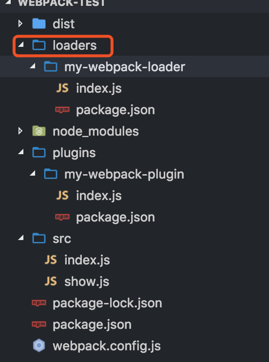
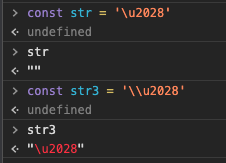

::: tip
写作不易，Star是最大鼓励，感觉写的不错的可以给个Star⭐，请多多指教。[本博客的Github地址](https://github.com/liujie2019/VuePress-Blog)。
:::
[TOC]
原则上webpack只能处理js模块，如果要处理其他类型的文件，需要使用对应的loader进行转换处理。

举个🌰：处理SCSS文件
* 先将SCSS源代码提交给sass-loader，将SCSS转换成CSS；
* 将sass-loader输出的CSS提交给css-loader处理，找出CSS中依赖的资源、压缩CSS等；
* 将css-loader输出的CSS提交给style-loader处理，转换成通过脚本加载的JavaScript代码；

Webpack相关配置如下：
```js
module.exports = {
  module: {
    rules: [
      {
        // 增加对 SCSS 文件的支持
        test: /\.scss$/,
        // SCSS文件的处理顺序为先sass-loader，再css-loader，再style-loader
        use: [
          'style-loader',
          {
            loader: 'css-loader',
            // 给css-loader传入配置项
            options: {
              minimize: true,
            }
          },
          'sass-loader']
      },
    ]
  },
};
```
可以看出，以上处理过程需要有顺序的链式执行，先sass-loader，再css-loader，再style-loader。是**从后向前**依次执行对应的loader，那么为什么loader的执行顺序是从后向前的呢？这就要说到函数组合了。

## 函数组合的两种情况
* Unix中的pipline：执行顺序是**从左往右**
* 函数组合Compose(webpack采用的就是这种)：执行顺序是**从右往左**

## 什么是loader
loader是webpack中一个重要的概念，用来将一段代码转换成另一段代码的webpack加载器。loader是导出为一个函数的node模块，该函数在loader转换资源的时候调用。给定的函数将调用loader API，并通过this上下文访问。loader就像是一个翻译员，能将源文件经过转化后输出新的结果，并且一个文件还可以链式地经过多个翻译员翻译。
## loader特点
* 第一个loader要返回js脚本
* 每个loader的职责是单一的，即只做一件事(只需要完成一种转换)
* 每一个loader都是一个Node模块
* 每个loader都是无状态的，确保loader在不同模块转换之间不保存状态

::: warning
需要注意：在开发一个loader时，请保持其**职责的单一性**，我们只需关心输入和输出。如果一个源文件需要经历多步转换才能正常使用，就通过多个loader去转换。 在调用多个loader`转换一个文件时，每个loader都会链式地顺序执行。第一个loader将会拿到需处理的原内容，上一个loader处理后的结果会被传给下一个loader接着处理，最后的loader将处理后的最终结果返回给Webpack。
:::
## loader基础
Webpack是运行在Node.js之上的，**一个loader其实就是一个Node.js模块**，这个模块需要导出一个函数。这个导出函数的工作就是：获得处理前的原内容，对原内容执行处理后，返回处理后的内容。

一个最简单的loader的源码如下：
```js
module.exports = function(source) {
  // source为compiler传递给loader的一个文件的原内容
  // 该函数需要返回处理后的内容，这里为了简单起见，直接把原内容返回了，相当于该loader没有做任何转换
  return source;
};
```
由于loader运行在Node.js中，所以我们可以调用任意`Node.js`自带的`API`，或者安装第三方模块进行调用：
```js
const sass = require('node-sass');
module.exports = function(source) {
  return sass(source);
};
```
## 初始化loader创建
```js
// 先安装webpack-cli
webpack-cli generate-loader
```
## loader进阶
以上只是个最简单的loader，Webpack还提供一些API供loader调用，下面来一一介绍：
### 使用loader-runner高效进行loader的调试
`loader-runner`允许我们在不安装webpack的情况下运行loaders。
作用：
* 作为webpack的依赖，webpack中使用它执行loader；
* 进行loader的开发和调试。
```js

```
### loader参数的获取(通过loader-utils)
在最上面处理SCSS文件的Webpack配置中，将options参数传给了css-loader，以控制css-loader。如何在自己编写的Loader中获取到用户传入的options呢？需要这样做：
```js
const loaderUtils = require('loader-utils');
module.exports = function(source) {
  // 获取用户为当前Loader传入的options
  const options = loaderUtils.getOptions(this);
  return source;
};
```
### 返回其它结果
上面的loader都只是返回了原内容转换后的内容，但在某些场景下还需要返回除了内容之外的东西。

以用babel-loader转换ES6代码为例，它还需要输出转换后的ES5代码对应的Source Map，以方便调试源码。为了将Source Map也一起随着ES5 代码返回给Webpack，可以这样写：
```js
module.exports = function(source) {
  // 通过 this.callback 告诉 Webpack 返回的结果
  this.callback(null, source, sourceMaps);
  // 当我们使用 this.callback 返回内容时，该 Loader 必须返回 undefined，
  // 以让 Webpack 知道该 Loader 返回的结果在 this.callback 中，而不是 return 中
  return;
};
```
其中的`this.callback`是 Webpack 给 Loader 注入的 API，以方便 Loader 和 Webpack 之间通信。`this.callback`的详细使用方法如下：
```js
this.callback(
    // 当无法转换原内容时，给 Webpack 返回一个 Error
    err: Error | null,
    // 原内容转换后的内容
    content: string | Buffer,
    // 用于把转换后的内容得出原内容的 Source Map，方便调试
    sourceMap?: SourceMap,
    // 如果本次转换为原内容生成了 AST 语法树，可以把这个 AST 返回，
    // 以方便之后需要 AST 的 Loader 复用该 AST，以避免重复生成 AST，提升性能
    abstractSyntaxTree?: AST
);
```
`Source Map`的生成很耗时，通常在开发环境下才会生成`Source Map`，其他环境下不用生成，以加速构建。因此，Webpack为Loader提供了 this.sourceMap API去告诉`Loader`当前构建环境下用户是否需要 Source Map。如果我们编写的Loader会生成Source Map，请考虑到这点。
### loader返回值处理
```js
return `export default ${json}`;
// loader返回一个值的话可以采用return的方式
// 如果要返回多个值的话就需要采用this.callback的方式了
// this.callback(null, json, 2, 3, 4);
```
### 同步与异步
Loader有同步和异步之分，上面介绍的Loader都是同步的Loader，因为它们的转换流程都是同步的，转换完成后再返回结果。但在某些场景下转换的步骤只能是异步完成的，例如：我们需要通过网络请求才能得出结果，如果采用同步的方式，则网络请求会阻塞整个构建，导致构建非常缓慢。

如果是异步转换，我们可以这样：通过this.async来返回一个异步函数。
```js
module.exports = function(source) {
    // 告诉 Webpack 本次转换是异步的，Loader 会在 callback 中回调结果
    var callback = this.async();
    someAsyncOperation(source, function(err, result, sourceMaps, ast) {
        // 通过 callback 返回异步执行后的结果
        // callback是this.async返回的异步函数
        // 第一个参数是Error，第二个参数是处理的结果
        callback(err, result, sourceMaps, ast);
    });
};
```
### 同步loader异常处理
* loader内直接通过throw抛出
* 通过this.callback传递错误

```js
this.callback(
    err: Error | null,
    content: string | Buffer,
    sourceMap?: SourceMap,
    meta?: any
);
```
## 处理二进制数据
在默认的情况下，Webpack传给Loader的原内容都是UTF-8格式编码的字符串。但某些场景下，Loader不会处理文本文件，而是会处理二进制文件如file-loader，就需要Webpack给Loader传入二进制格式的数据。为此，我们需要这样编写Loader：
```js
module.exports = function(source) {
    // 在 exports.raw === true 时，Webpack 传给 Loader 的 source 是 Buffer 类型的
    source instanceof Buffer === true;
    // Loader 返回的类型也可以是 Buffer 类型的
    // 在 exports.raw !== true 时，Loader 也可以返回 Buffer 类型的结果
    return source;
};
// 通过exports.raw属性告诉Webpack该Loader是否需要二进制数据
module.exports.raw = true;
```
以上代码中最关键的代码是最后一行`module.exports.raw = true;`，如果没有该行代码，则loader只能拿到字符串。
## 开启loader缓存加速
在某些情况下，有些转换操作需要大量的计算，非常耗时，如果每次构建都重新执行重复的转换操作，则构建将会变得非常缓慢。因此，**Webpack会默认缓存所有loader的处理结果**，也就是说：在需要被处理的文件或者其依赖的文件没有发生变化时，是不会重新调用对应的Loader去执行转换操作的。

如果我们想让Webpack不缓存该loader的处理结果，可以这样设置：
```js
module.exports = function(source) {
  // 关闭loader的缓存功能
  this.cacheable(false);
  return source;
};
```
缓存条件：loader的结果在相同的输入下有确定的输出。需要注意：有依赖的loader无法使用缓存。
### loader如何进行文件输出？
可以通过`this.emitFile`进行文件写入。
```js
const loaderUtils = require('loader-utils');

module.exports = function(source) {
    console.log('Loader a is excuted!');

    const url = loaderUtils.interpolateName(this, '[name].[ext]', source);

    console.log(url);
    this.emitFile(url, source);
    return source;
}
```
### 其它Loader API
除了以上提到的在`Loader`中能调用的`Webpack API`，还存在以下常用 API：
* **this.context**：当前处理文件的所在目录，假如当前 Loader 处理的文件是 /src/main.js，则 this.context 就等于 /src；
* **this.resource**：当前处理的文件的完整请求路径，包括 querystring，例如`/src/main.js?name=1`；
* **this.resourcePath**：当前处理的文件的路径，例如 /src/main.js；
* **this.resourceQuery**：当前处理的文件的 querystring；
* **this.target**：等于 Webpack 配置中的 Target；
* **this.loadModule**：但Loader 在处理一个文件时，如果依赖其它文件的处理结果才能得出当前文件的结果时，就可以通过this.loadModule(request: string, callback: function(err, source, sourceMap, module)) 去获取request对应文件的处理结果；
* **this.resolve**：像require语句一样获得指定文件的完整路径，使用方法为resolve(context: string, request: string, callback: function(err, result: string))；
* **this.addDependency**：给当前处理文件添加其依赖的文件，以便再其依赖的文件发生变化时，会重新调用 Loader 处理该文件。使用方法为 addDependency(file: string)；
* **this.addContextDependency**：和addDependency 类似，但 addContextDependency 是把整个目录加入到当前正在处理文件的依赖中。使用方法为 addContextDependency(directory: string)；
* **this.clearDependencies**：清除当前正在处理文件的所有依赖，使用方法为 clearDependencies()；
* **this.emitFile**：输出一个文件，使用方法为 emitFile(name: string, content: Buffer|string, sourceMap: {...})。

## 4种本地开发测试loader的方法(加载本地 Loader)
在开发Loader的过程中，为了测试编写的Loader是否能正常工作，需要把它配置到 Webpack中后，才可能会调用该Loader。在前面的章节中，使用的Loader都是通过npm安装的，要使用Loader时会直接使用Loader的名称，代码如下：
```js
module.exports = {
  module: {
    rules: [
      {
        test: /\.css/,
        use: ['style-loader']
      },
    ]
  },
};
```
如果还采取以上的方法去使用本地开发的Loader将会很麻烦，因为你需要确保编写的 Loader 的源码是在`node_modules`目录下。为此你需要先把编写的 Loader发布到Npm仓库后再安装到本地项目使用。

解决以上问题的便捷方法有如下几种：
### 匹配单个loader，你可以简单通过在rule对象设置path.resolve指向这个本地文件
```js
module.exports = {
  //...
  module: {
    rules: [
      {
        test: /\.js$/,
        use: [
          {
            loader: path.resolve('path/to/loader.js'),
            options: {/* ... */}
          }
        ]
      }
    ]
  }
};
```
### 匹配多个loaders，可以使用`resolveLoader.modules` 配置
`ResolveLoader`用于配置`Webpack`如何寻找`Loader`。默认情况下，只会去 `node_modules`目录下寻找，为了让`Webpack`加载放在本地项目中的`Loader`需要修改`resolveLoader.modules`。
`webpack`将会从这些目录中搜索这些`loaders`。假如本地的 Loader 在项目目录中的`./loaders/loader-name`中，则需要如下配置：

```js
module.exports = {
  //...
  resolveLoader: {
    // 去哪些目录下寻找 Loader，有先后顺序之分
    modules: [
      'node_modules',
      path.resolve(__dirname, 'loaders')
    ]
  }
};
```
加上上述配置后，Webpack会先去`node_modules`项目下寻找`Loader`，如果找不到，会再去`./loaders/`目录下寻找。

### resolveLoader.alias
```js
resolveLoader: {
        // 给loader配置别名
        alias: {
            'my-loader': path.resolve(__dirname, 'loaders', 'my-loader')
        }
        // 默认去node_modules目录下找对应的loader，找不到了再去loaders目录下寻找
        // 推荐使用
        // modules: ['node_modules', path.resolve(__dirname, 'loaders')]
    }
```
### 使用`npm link`
`npm link`专门用于开发和调试本地的`npm`模块，能做到在不发布模块的情况下，将本地的一个正在开发的模块的源码链接到项目的`node_modules`目录下，让项目可以直接使用本地的Npm模块。由于是通过软链接的方式实现的，编辑了本地的Npm模块代码，所以在项目中也能使用到编辑后的代码。

完成`npm link`的步骤如下：
1. 确保正在开发的本地`npm`模块（也就是正在开发的 Loader）的 `package.json`已经正确配置好；
2. 在本地`npm`模块根目录下执行`npm link`，把本地模块注册到全局；
3. 在项目根目录下执行`npm link loader-name`，把第2步注册到全局的本地 Npm 模块链接到项目的`node_moduels`下，其中的`loader-name`是指在第1步中的`package.json`文件中配置的模块名称。

链接好`Loader`到项目后你就可以像使用一个真正的Npm模块一样使用本地的Loader了。
## loader分类
* 前置(pre)loader
* 普通(normal)loader
* 后置(post)loader
* 行内(inline)loader

## 配置多个loader
### 数组形式
```js
rules: [
    {
        test: /\.js$/,
        loader: ['my-loader3', 'my-loader2', 'my-loader']
    }

```


### 对象形式(可以配置loader参数)
```js
rules: [
    {
        test: /\.js$/,
        use: {
            loader: 'my-loader'
        }
    }, {
        test: /\.js$/,
        use: {
            loader: 'my-loader2'
        }
    }, {
        test: /\.js$/,
        use: {
            loader: 'my-loader3'
        }
    }
]
```


### 多个loader执行顺序
::: tip
总结：从上面的两个例子中可以看出，多个loader执行顺序是：多个loader是串行执行的，从右到左，从下到上。
:::
### 配置参数改变loader执行顺序
```js
rules: [
    {
        test: /\.js$/,
        use: {
            loader: 'my-loader'
        },
        enforce: 'pre' // 指定my-loader最先使用
    }, {
        test: /\.js$/,
        use: {
            loader: 'my-loader2' // 默认为normal
        }
    }, {
        test: /\.js$/,
        use: {
            loader: 'my-loader3'
        },
        enforce: 'post' // 最后使用
    }
]
```
::: warning
需要注意：loader带参数执行的顺序: pre -> normal -> inline -> post，inline为行内loader。
:::

## inline-loader(行内loader)
```js
// ./前面的!表示将当前引入的文件交给行内loader处理
const a = require('inline-loader!./a'); // 不加限制，所有loader都调用来处理a.js
```
```js
npx webpack
// 输出
my-loader1
my-loader2
my-loader3
my-loader1 // pre
my-loader2 // normal
inline-loader
my-loader3 // post
```

### !禁用normal-loader
```js
const a = require('!inline-loader!./a'); // !禁用normal-loader，只使用pre-loader、post-loader和inline-loader处理处理a.js
```
```js
npx webpack
// 输出
my-loader1
my-loader2
my-loader3
my-loader1 // pre
inline-loader
my-loader3 // post
```
### -!禁用pre-loader和normal-loader
```js
const a = require('-!inline-loader!./a'); // -!禁用pre-loader、normal-loader，只使用post-loader和inline-loader处理处理a.js
```
```js
npx webpack
// 输出
my-loader1
my-loader2
my-loader3
inline-loader
my-loader3 // post
```
### !!禁用pre-loader、normal-loader、post-loader，只能行内处理
```js
const a = require('!!inline-loader!./a'); // !!禁用pre-loader、normal-loader、post-loader，只使用inline-loader处理处理a.js
```
```js
npx webpack
// 输出
my-loader1
my-loader2
my-loader3
inline-loader
```
## loader组成
loader默认由**pitch和normal**两部分组成。

每个loader模块都支持一个`.pitch`属性，上面的方法会优先于loader的实际方法执行。实际上，webpack官方也给出了pitch与loader本身方法的执行顺序图：
```js
|- a-loader `pitch`
  |- b-loader `pitch`
    |- c-loader `pitch`
      |- requested module is picked up as a dependency
    |- c-loader normal execution
  |- b-loader normal execution
|- a-loader normal execution
```
pitch和normal的执行顺序正好相反，当pitch没有定义或者没有返回值时，会先依次执行再获取资源执行loader。如果定义的某个pitch有返回值，则会跳过读取资源和自己的loader。
### 所有loader均无返回值

```js
use: ['my-loader3', 'my-loader2', 'my-loader']
```
如果'my-loader3', 'my-loader2', 'my-loader'3个loader均无返回值，那么先执行`pitch`方法，从左到右，再获取资源。


所有的pitchLoader都没有返回值。
```js
pitch   loader3 → loader2 → loader1
                                    ↘
                                      资源
                                    ↙
normal   loader3 ← loader2 ← loader1
```
```js
我是loader3 的pitch
我是loader2 的pitch
我是loader1 的pitch
my-loader1
my-loader2
my-loader3
```
### 有pitchLoader存在返回值
有返回值：**直接跳过后续所有的loader包括自己的**，跳到之前的loader，可用于阻断loader。


```js
const loader = source => {
    // 当前loader仅仅在源码后面追加了一段文字
    console.log('my-loader2');
    return source + '我是手写loader处理过的';
}

loader.pitch = () => {
    return '我有返回值-阻断了';
}

module.exports = loader;
```
输出：
```js
my-loader3
```
## loader-runner
定义：loader-runner 允许你在不安装 webpack 的情况下运行 loaders。

作用：
* 作为 webpack 的依赖，webpack 中使用它执行 loader
* 进行 loader 的开发和调试

## 实战


首先在项目目录下新建loaders目录，用来存放自定义的loader。在loaders目录中新建`my-webpack-loader`目录，这就是我们的第一个自定义loader，并在该目录下新建index.js和package.json文件。具体内容如下：

index.js：
```js
const loaderUtils = require('loader-utils');

module.exports = function(content) {
    // 获取用户配置的options
    const options = loaderUtils.getOptions(this);
    console.log('***options***', options);
    // 该loader的作用就是在原内容前加上如下字符串
    return '{test123};' + content;
}
```
package.json：
```js
{
  "name": "my-webpack-loader",
  "version": "1.0.0",
  "description": "",
  "main": "index.js",
  "scripts": {
    "test": "echo \"Error: no test specified\" && exit 1"
  },
  "keywords": [],
  "author": "liujie",
  "license": "ISC"
}
```
在webpack.config.js中配置：
```js
module: {
    rules: [
      {
        test: /\.js$/,
        exclude: /node_modules/,
        use: {
            loader: 'my-webpack-loader',
            options: {
                test: 'wangwu'
            }
        }
      }
    ]
}
```
执行`npm run dev`，结果如下：


### raw-loader


* `\u2028`：行分隔符(行结束符)
* `\u2029`：段落分隔符(行结束符)

`\u2028`为行分隔符，会被浏览器解析为换行，而在Javascript的字符串表达式中是不允许换行的，从而导致错误。

把特殊字符转义替换即可，代码如下所示：
```
str = str.replace(/\u2028/g, '\\u2028');
```


## 参考文档
1. [loader API](https://webpack.docschina.org/api/loaders/)
2. [webpack原理](https://segmentfault.com/a/1190000015088834#articleHeader10)
3. [编写一个 loader](https://webpack.docschina.org/contribute/writing-a-loader/)
4. [【webpack进阶】你真的掌握了loader么？- loader十问](https://juejin.im/post/5bc1a73df265da0a8d36b74f)
5. [Webpack Loader 高手进阶(一)](https://github.com/CommanderXL/Biu-blog/issues/31)
