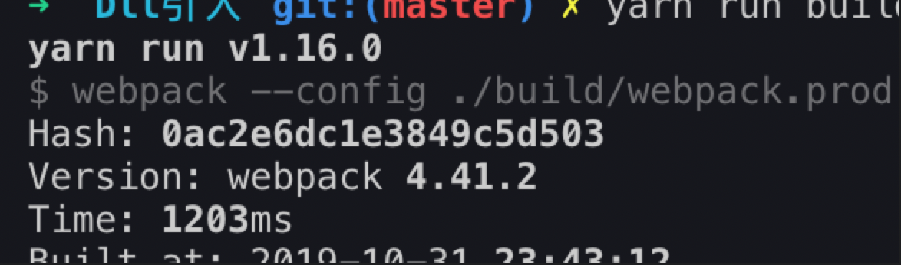
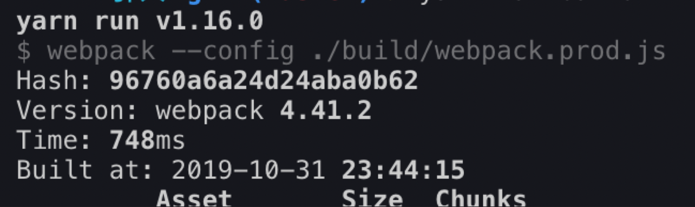

::: tip
写作不易，Star是最大鼓励，感觉写的不错的可以给个Star⭐，请多多指教。[本博客的Github地址](https://github.com/liujie2019/VuePress-Blog)。
:::
[TOC]
## 打包速度分析
优化webpack构建速度的第一步是知道将精力集中在哪里。我们可以通过`speed-measure-webpack-plugin`测量你的 webpack构建期间各个阶段花费的时间：

```js
// 分析打包时间
const SpeedMeasurePlugin = require("speed-measure-webpack-plugin");
const smp = new SpeedMeasurePlugin();
// ...
module.exports = smp.wrap(prodWebpackConfig)
```

## 1. 跟上技术的迭代(Node,Npm,Yarn)
在项目尽可能的使用新的webpack、node、npm、yarn。
## 2. 在尽可能少的模块上应用loader
可以采用**exclude和include**来进行优化(例如对babel-loader进行优化，而像图片处理的url-loader则不需要这样处理，因为所有的图片都需要被处理)。

合理的使用exclude(忽略一些目录下文件不处理)和include(仅处理指定目录下文件)来降低loader的使用频率，从而提升打包速度。
```js
module: {
    rules: [
        {
            test: /\.jsx?$/, // ?表示匹配x 0次或者1次，即匹配js或者jsx
            loader: 'babel-loader', // babel-loader只是webpack和babel之间通信的桥梁
            exclude: /node_modules/, // 忽略node_modules目录下文件,
            include: path.resolve(__dirname, './src')
        }
    ]
}
```
## 3. Plugin尽可能精简并确保可靠
插件要合理的使用。
## 4. resolve参数合理配置
### extensions
```js
resolve: {
    extensions: ['.js', '.jsx', '.tsx', '.json']
}
```
extensions字段中只配置处理js逻辑的文件的后缀名，比如`.js`或者`.jsx`或者`.tsx`等，而像图片和css文件还是直接在项目文件中直接显式引入。因为，都配置在extensions中的话，会增加文件查找的次数，降低打包速度。因为extensions的每一次匹配操作都是一次文件查找，当然我们可以把使用频率高的文件后缀写在最前面。
### mainFiles
```js
resolve: {
    mainFiles: ['index', 'child']
}
```
mainFiles配置引入模块时默认引入的模块名称，比如`import Child from './src/child/';`默认引入的child目录下的index.js。配置了mainFiles后，当在child目录下找不到index.js时，会查找child.js。
### alias
```js
resolve: {
    alias: {
      Utilities: path.resolve(__dirname, 'src/utilities/'),
      Templates: path.resolve(__dirname, 'src/templates/')
    }
}
```
在配置alise之前需要这样写：
```js
import Utility from '../../utilities/utility';
```
配置之后只需要这样就可以：
```js
import Utility from 'Utilities/utility';
```
## 5. 使用DllPlugin提高打包速度
目标：第三方模块只打包一次

1. 第一步：第三方模块打包一次
2. 引入第三方模块的时候，要去使用dll文件引入

不启用dll，打包时间：


启用后：


```js
const files = fs.readdirSync(path.resolve(__dirname, '../dll'));
files.forEach(file => {
    // /.*\.dll.js/匹配以.dll.js结尾的文件
    if (/.*\.dll.js/.test(file)) {
        plugins.push(new AddAssetHtmlWebpackPlugin({
            filepath: path.resolve(__dirname, '../dll', file)
        }));
    }
    if (/.*\.manifest.json/.test(file)) {
        // 在打包过程中进行分析，如果需要的模块在dll中有，则直接使用，不会再去node_modules中查找
        // manifest.json文件中存储了模块的映射关系
        plugins.push(new webpack.DllReferencePlugin({
            manifest: path.resolve(__dirname, '../dll', file)
        }));
    }
});
```
## 6. 控制包文件大小
## 7. happypack多进程打包
1. thread-loader
2. [parallel-webpack](https://github.com/trivago/parallel-webpack)
3. happypack
## 8. 合理使用sourceMap
sourceMap越详细，打包速度越慢。
## 9. 结合stats分析打包结果
## 10. 开发环境优化
1. 开发环境内存编译
2. 开发环境剔除无用插件
## preload和prefetch
### prefetch
```html
<link rel="prefetch" ></link>
```
这段代码告诉浏览器，这段资源将会在未来某个导航或者功能要用到，但是本资源的下载顺序权重比较低。也就是说prefetch通常用于加速下一次导航，而不是本次的。

被标记为prefetch的资源，将会被**浏览器在空闲时间加载**。
举个例子：比如页面上的登录弹框，在页面首次渲染的时候是不需要加载的，只有当页面加载完了，点击登录按钮的时候才需要显示出来，因此就可以将登录弹框的代码采用prefetch的形式来加载。
### preload
```html
<link rel="preload" ></link>
```
preload通常用于本页面要用到的关键资源，包括关键js、字体、css文件。preload将会把资源得下载顺序权重提高，使得关键数据提前下载好，优化页面打开速度。
### webpack 搭配prefetch优化单页面应用code-splitting
单页面应用由于页面过多，可能会导致代码体积过大，从而使得首页打开速度过慢。所以切分代码，优化首屏打开速度尤为重要。

但是所有的技术手段都不是完美的。当我们切割代码后，首屏的js文件体积减少了好多。但是也有一个突出的问题：那就是当跳转其他页面的时候，**需要下载相应页面的js文件**，这就导致体验极其不好，**每一次点击访问新页面都要等待js文件下载**，然后再去请求接口获取数据。频繁出现loading动画的体验真的不好。

所以如果我们在进入首页后，在浏览器的空闲时间提前下好用户可能会点击页面的js文件，这样首屏的js文件大小得到了控制，而且再点击新页面的时候，相关的js文件已经下载好了，可以直接从缓存中加载对应的js文件，这样速度就会快很多，就不再会出现loading动画。

动态(import)引入js文件，实现code-splitting，减少首屏打开时间。
```js
// 代码分割后的react组件
const Brand = asyncComponent(() => import(
 /*webpackChunkName: 'mp-supports'*/
  './views/Brand'
))


// 路由引入
<Route path="/" component={App}>
    <Route path="/brand" component={Brand} />
</Route>
```
首页组件的生命周期：
```js
// 在接口取的数据后，进行prefetch
componentDidUpdate({ topics }) {
  if( topics.length === 0 && this.props.topics.length > 0 ) {
   // 实行prefetch，注意只有webpack 4版本才支持prefetch功能。
    import(
        /* webpackPrefetch: true */
        /*webpackChunkName: 'topic'*/
        "../topic"
      )
  }
}
```
这里有两个关键点：
1. `/webpackChunkName: 'chunk-name'/`：webpack的动态import()需要指定包命，如果不在注释中说明包名，那么用了几次import() , webpack就会给同一个文件打包多少次。使得我们prefetch的文件和路由中要用到的文件并不是同一个文件。
2. componentDidUpdate：prefetch会在浏览器空闲时，下载相应文件。这是一个很笼统的定义，在我的使用中，我发现在接口没有返回数据，以及图片等还没有请求成功时，prefetch就会请求数据了。这一点是很不好的，最起码prefetch不能影响首页接口的获取速度。所以我把prefetch的执行事件放在了componentDidUpdate生命周期内。保障了prefetch的执行，不会影响到关键的首页数据获取。
当然prefetch在服务端渲染的页面并不会有影响接口的问题，是一个比较好的技术选择。

## 参考文档
1. [玩转 webpack，使你的打包速度提升 90%](https://mp.weixin.qq.com/s/KhoGugu1Ooh-FhDOQJ3E9A)
2. [五种可视化方案分析 webpack 打包性能瓶颈](https://mp.weixin.qq.com/s/sN3qiJT7cfsEbTv3lnDjlw)