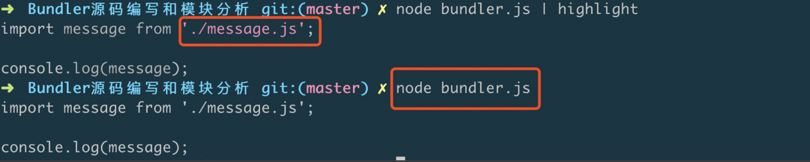
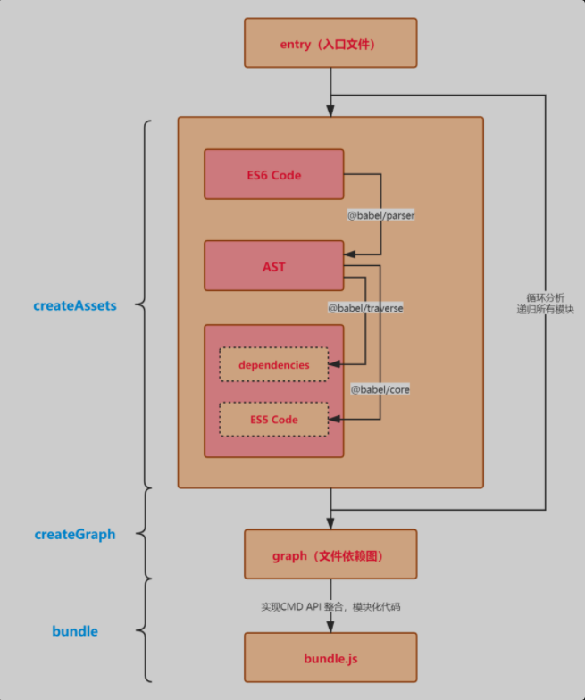
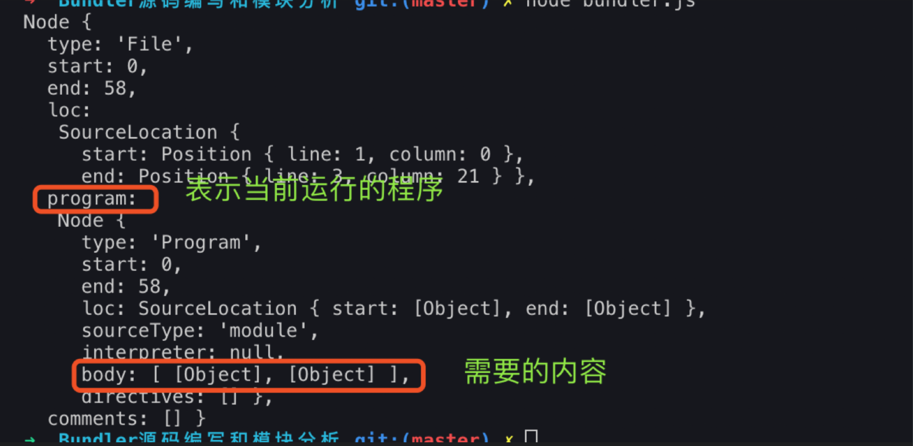
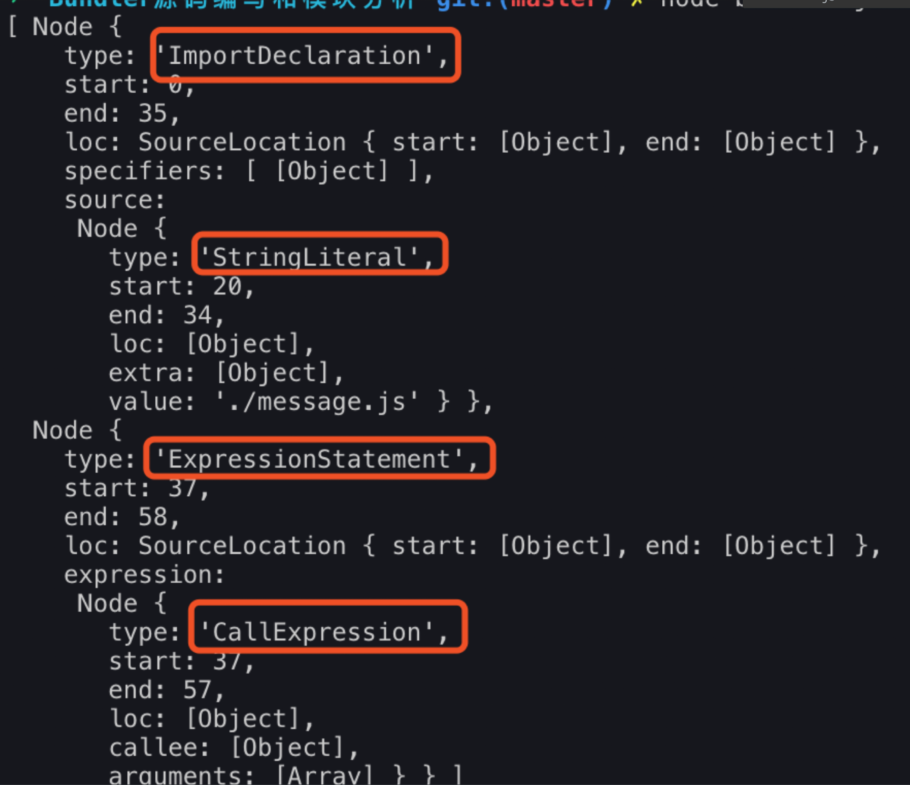
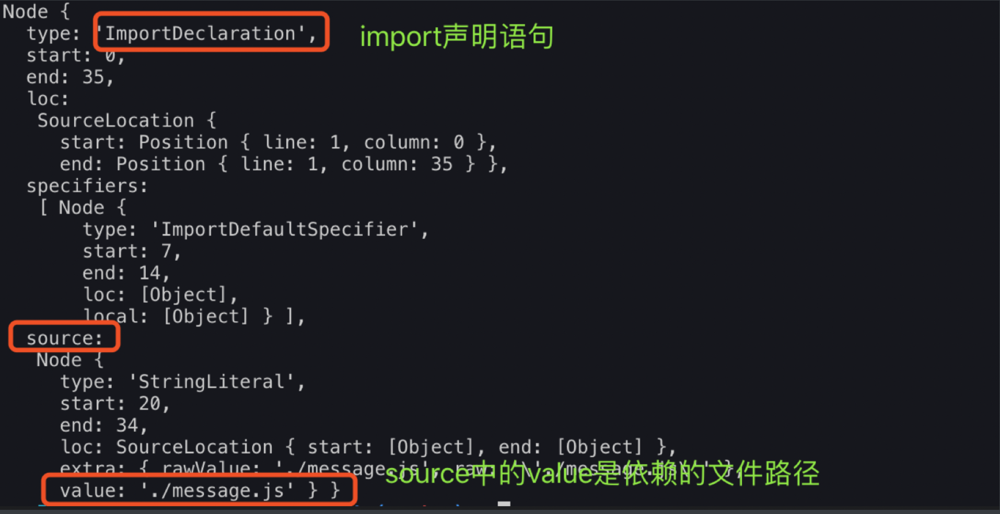
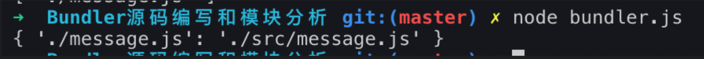
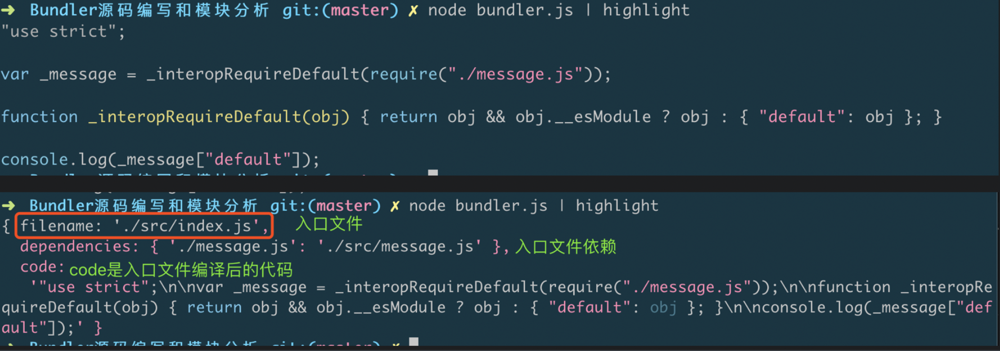
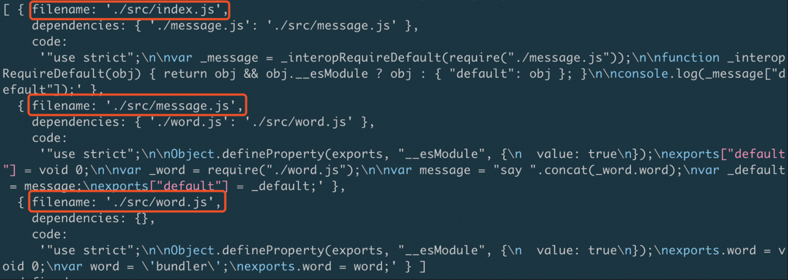

::: tip
写作不易，Star是最大鼓励，感觉写的不错的可以给个Star⭐，请多多指教。[本博客的Github地址](https://github.com/liujie2019/VuePress-Blog)。
:::
终端代码高亮显式：

```js
// 装包
yarn global add cli-highlight
// 运行如下命令即可在终端中查看文件高亮显示的代码
node 文件名 | highlight
```


先初始化一个项目：
```js
yarn init -y
```
安装下面四个依赖包：
* @babel/parser: 用于分析通过 fs.readFileSync 读取的文件内容，并返回 AST (抽象语法树)；
* @babel/traverse: 用于遍历 AST，获取必要的数据；
* @babel/core: babel核心模块，提供 transformFromAst 方法，用于将 AST 转化为浏览器可运行的代码；
* @babel/preset-env: 将转换后代码转化成 ES5 代码；
```js
yarn add @babel/parser @babel/traverse @babel/core @babel/preset-env
```

大致流程如下：


## 第一步：源码分析(@babel/parser)

`@babel/parser`主要作用是：对源码进行解析，将源代码转换为ast抽象语法树。
```js
// 依赖@babel/parser
yarn add @babel/parser -D
```
```js
const fs = require('fs');
const parser = require('@babel/parser');
const moduleAnalyser = filename => {
    const content = fs.readFileSync(filename, 'utf-8');
    console.log(parser.parse(content, {
        sourceType: 'module'
    }));
    // console.log(content);
}

moduleAnalyser('./src/index.js');
```
`parser.parse`解析源代码生成ast(抽象语法树)。



```js
const fs = require('fs');
const parser = require('@babel/parser');
const moduleAnalyser = filename => {
    const content = fs.readFileSync(filename, 'utf-8');
    const ast = parser.parse(content, {
        sourceType: 'module'
    });
    console.log(ast.program.body);
    // console.log(content);
}

moduleAnalyser('./src/index.js');
```


## 第二步：@babel/traverse(依赖管理)
`@babel/traverse`主要作用是：找出文件中的import声明。
```js
yarn add @babel/traverse -D
```
```js
const fs = require('fs');
const parser = require('@babel/parser');
// @babel/traverse默认是ES module导出，所以要加default
const traverse = require('@babel/traverse').default;

const moduleAnalyser = filename => {
    const content = fs.readFileSync(filename, 'utf-8');
    const ast = parser.parse(content, {
        sourceType: 'module'
    });
    traverse(ast, {
        ImportDeclaration({node}) {
            console.log(node);
        }
    });
    // console.log(ast.program.body);
    // console.log(content);
}

moduleAnalyser('./src/index.js');
```


```js
const fs = require('fs');
const path = require('path');
const parser = require('@babel/parser');
// @babel/traverse默认是ES module导出，所以要加default
const traverse = require('@babel/traverse').default;

const moduleAnalyser = filename => {
    const content = fs.readFileSync(filename, 'utf-8');
    const ast = parser.parse(content, {
        sourceType: 'module'
    });
    // dependencies中保存的不能相对路径，需要转为绝对路径
    const dependencies = {}; // 定义一个依赖对象
    traverse(ast, {
        ImportDeclaration({node}) {
            const dirname = path.dirname(filename);
            const newFile = './' + path.join(dirname, node.source.value);
            dependencies[node.source.value] = newFile;
        }
    });

    console.log(dependencies);
    // console.log(ast.program.body);
    // console.log(content);
}

moduleAnalyser('./src/index.js');
```
依赖对象中，key是文件原始引用路径，value是文件的真实路径。



## 第三步：编译代码(@babel/core)
`@babel/core和@babel/preset-env`将代码转换为浏览器可以识别的代码。
```js
yarn add @babel/core @babel/preset-env -D
```
```js
const fs = require('fs');
const path = require('path');
const parser = require('@babel/parser');
// @babel/traverse默认是ES module导出，所以要加default
const traverse = require('@babel/traverse').default;
const babel = require('@babel/core');

const moduleAnalyser = filename => {
    const content = fs.readFileSync(filename, 'utf-8');
    const ast = parser.parse(content, {
        sourceType: 'module'
    });
    // dependencies中保存的不能相对路径，需要转为绝对路径
    const dependencies = {}; // 定义一个依赖对象
    traverse(ast, {
        ImportDeclaration({node}) {
            const dirname = path.dirname(filename);
            const newFile = './' + path.join(dirname, node.source.value);
            dependencies[node.source.value] = newFile;
        }
    });
    const {code} = babel.transformFromAst(ast, null, {
        presets: ['@babel/preset-env']
    });
    console.log(code);
    // console.log(dependencies);
    // console.log(ast.program.body);
    // console.log(content);
}

moduleAnalyser('./src/index.js');
```


## 生成依赖图谱


从生成的依赖图谱可以看出，index.js依赖了message.js，message.js又依赖了word.js。


## 生成代码
```js
const fs = require('fs');
const path = require('path');
const parser = require('@babel/parser');
// @babel/traverse默认是ES module导出，所以要加default
const traverse = require('@babel/traverse').default;
const babel = require('@babel/core');

// 定义一个模块分析函数
const moduleAnalyser = filename => {
    const content = fs.readFileSync(filename, 'utf-8');
    const ast = parser.parse(content, {
        sourceType: 'module'
    });
    // dependencies中保存的不能相对路径，需要转为绝对路径
    const dependencies = {}; // 定义一个依赖对象
    traverse(ast, {
        ImportDeclaration({node}) {
            const dirname = path.dirname(filename);
            const newFile = './' + path.join(dirname, node.source.value);
            dependencies[node.source.value] = newFile;
        }
    });
    const {code} = babel.transformFromAst(ast, null, {
        presets: ['@babel/preset-env']
    });
    return {
        filename,
        dependencies,
        code
    }
    // console.log(code);
    // console.log(dependencies);
    // console.log(ast.program.body);
    // console.log(content);
}
// 定义一个生成项目依赖图谱的函数
const makeDependenciesGraph = entry => {
    const entryModule = moduleAnalyser(entry);
    const graphArray = [entryModule];
    for (let i = 0; i < graphArray.length; i++) {
        const item = graphArray[i];
        const {dependencies} = item; // 拿到当前模块的依赖对象
        if (dependencies) { // 如果依赖对象存在，对依赖对象进行遍历
            for (let key in dependencies) {
                graphArray.push(moduleAnalyser(dependencies[key]));
            }
        }
    }
    // 对依赖图谱graphArray进行数据格式转换，由数组变为对象
    const graph = {};
    graphArray.forEach(({filename, dependencies, code}) => {
        graph[filename] = {
            dependencies,
            code
        }
    });
    return graph;
};
// 生成代码
const generateCode = entry => {
    const graph = JSON.stringify(makeDependenciesGraph('./src/index.js'));
    return `
        (function(graph) {
            function require(module) {
                function localRequire(relativePath) {
                    return require(graph[module].dependencies[relativePath]);
                }
                var exports = {};
                (function (require, exports, code) {
                    eval(code)
                })(localRequire, exports, graph[module].code)
                return exports;
            }
            require('${entry}')
        })(${graph});
    `;
};
const code = generateCode('./src/index.js');
console.log(code);
```
如下代码是最终生成的依赖图谱：
```js
{
    "./src/index.js": {
        "dependencies": {
            "./message.js": "./src/message.js"
        },
        "code": "\"use strict\";\n\nvar _message = _interopRequireDefault(require(\"./message.js\"));\n\nfunction _interopRequireDefault(obj) { return obj && obj.__esModule ? obj : { \"default\":obj }; }\n\nconsole.log(_message[\"default\"]);"
    },
    "./src/message.js": {
        "dependencies": {
            "./word.js": "./src/word.js"
        },
        "code": "\"use strict\";\n\nObject.defineProperty(exports, \"__esModule\", {\n  value: true\n});\nexports[\"default\"] = void 0;\n\nvar _word = require(\"./word.js\");\n\nvar message = \"say \".concat(_word.word);\nvar _default = message;\nexports[\"default\"] = _default;"
    },
    "./src/word.js": {
        "dependencies": {},
        "code": "\"use strict\";\n\nObject.defineProperty(exports, \"__esModule\", {\n  value: true\n});\nexports.word = void 0;\nvar word = 'webpack';\nexports.word = word;"
    }
}
```
在上述依赖图谱的每个文件对应的code，都有一个require方法，有的还依赖exports对象。
```js
require(\"./message.js\")
```
```js
eval(code)
```
通过eval去执行各个文件中的代码，因此需要自己构造出一个require方法和exports对象。


## 参考文档
1. [了不起的 Webpack 构建流程学习指南](https://mp.weixin.qq.com/s/mhfb3lwxDPnTmUTIsK181w)