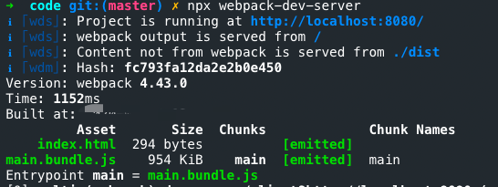
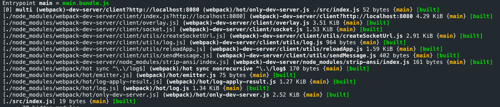
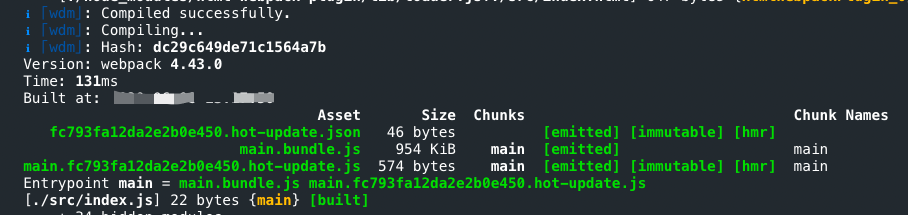
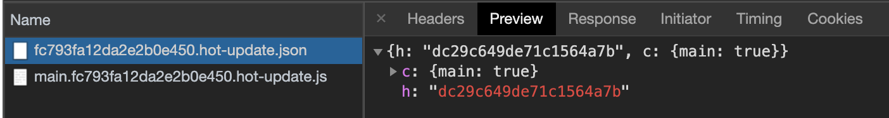
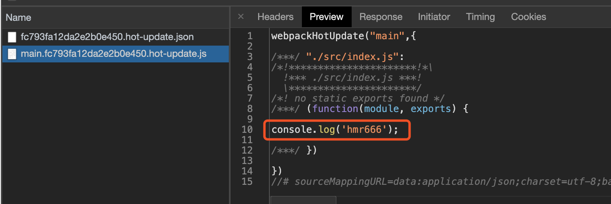
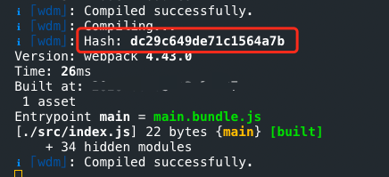
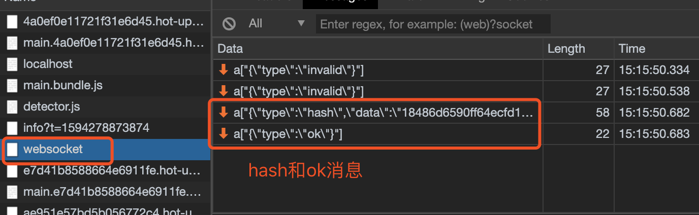
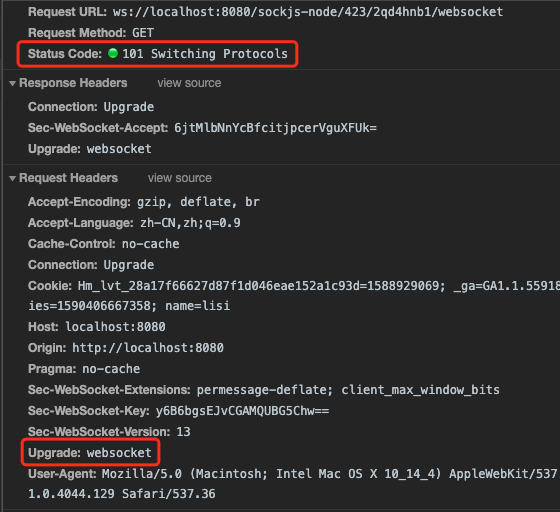
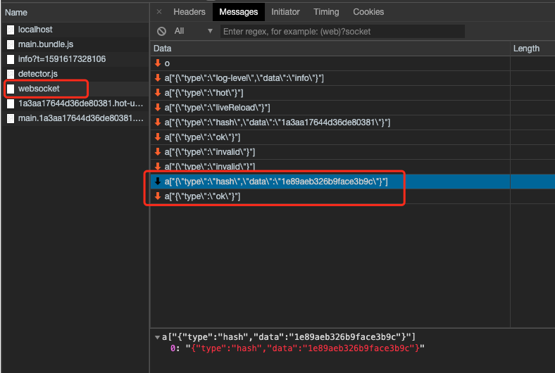
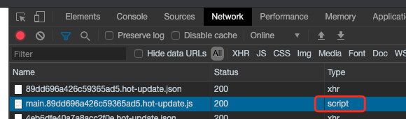

::: tip
写作不易，Star是最大鼓励，感觉写的不错的可以给个Star⭐，请多多指教。[本博客的Github地址](https://github.com/liujie2019/VuePress-Blog)。
:::

[TOC]
在webpack中开启HMR（Hot Module Replacement）后 ，当对代码进行修改并保存后，webpack 将对代码重新打包，并将新的模块发送到浏览器端，浏览器通过新的模块替换老的模块，这样在不刷新浏览器的前提下就能够对页面**进行局部刷新**。

开启HMR的好处是：
1. **可以在更新页面的同时保存页面状态**。
2. 只更新变更内容，以节省宝贵的开发时间。
3. 调整样式更加快速 - 几乎相当于在浏览器调试器中更改样式。

## 0. 为什么需要HMR
在 webpack HMR 功能之前，已经有很多 live reload 的工具或库，比如 [live-server](https://link.zhihu.com/?target=http%3A//tapiov.net/live-server/)，这些库监控文件的变化，然后通知浏览器刷新页面，那么我们为什么还需要 HMR 呢？

首先，**live reload 工具并不能够保存应用的状态**（states），当刷新页面后，应用之前状态丢失。举个例子，点击按钮出现弹窗，当浏览器刷新后，弹窗也随即消失，要恢复到之前状态，还需再次点击按钮。而 webapck HMR 则不会刷新浏览器，而是运行时对模块进行热替换，保证了应用状态不会丢失，提升了开发效率。

## 1. 模块热替换编译构建过程分析
在命令行中通过运行`yarn run dev`命令启动项目后，可以看到控制台中有如下输出：生成了本次构建的Hash值`fc793fa12da2e2b0e450`。





当对项目代码进行修改并保存后，控制台会出现Compiling提示，说明修改代码触发了新的代码编译。在控制台中可以看到新的构建输出：

* 新的Hash值：dc29c649de71c1564a7b
* 新的json文件：fc793fa12da2e2b0e450.hot-update.json
* 新的js文件：main.fc793fa12da2e2b0e450.hot-update.js





首先看json文件，返回的结果中，h代表本次新生成的Hash值，用于下次文件热更新请求的前缀，c表示当前要热更新的文件对应的是index模块。
再看下生成的js文件，那就是本次修改的代码，重新编译打包后的。


需要注意：如果没有对代码进行修改，直接保存，在控制台中也会输出相应的编译打包信息。具体结果如下：



由上图结果可以看出，如果没有对代码进行修改，打包的Hash值并不会发生改变，这里webpack版本为`4.43.0`。
通过观察浏览器发出的请求响应结果，本次构建并没有请求发出，因此说明本次构建没有需要更新的代码。



## 2. 热更新实现原理
### 2.1 webpack-dev-server启动本地服务
我们根据`webpack-dev-server`的`package.json`中的`bin`命令，可以找到命令的入口文件`bin/webpack-dev-server.js`。
```js
// node_modules/webpack-dev-server/bin/webpack-dev-server.js

try {
    // 生成webpack编译主引擎compiler
    compiler = webpack(config);
  } catch (err) {
    if (err instanceof webpack.WebpackOptionsValidationError) {
      log.error(colors.error(options.stats.colors, err.message));
      // eslint-disable-next-line no-process-exit
      process.exit(1);
    }

    throw err;
  }
}

// 启动本地服务
let server = new Server(compiler, options, log);
...
} else {
    // 调用server的listen方法，启动express服务
    server.listen(options.port, options.host, (err) => {
      if (err) {
        throw err;
      }
    });
  }
```
本地服务代码：
```js
// node_modules/webpack-dev-server/lib/Server.js
class Server {
    constructor() {
        this.setupApp(); // 初始化express服务
      	this.createServer(); // 启动express服务
        this.setupHooks(); // 注册监听事件
        this.setupCheckHostRoute();
        this.setupDevMiddleware(); // 监听本地代码的变化
    }

    setupApp() {
      // Init express server
      // eslint-disable-next-line new-cap
      // 初始化express 服务
      this.app = new express();
    }

    createServer() {
        this.listeningApp = http.createServer(this.app);
    }
    listen(port, hostname, fn) {
        return this.listeningApp.listen(port, hostname, (err) => {
            // 启动express服务后，启动websocket服务
            this.createSocketServer();
        }
    }
}

```
以上代码主要做了三件事：
- 启动webpack，生成compiler实例。compiler上有很多方法，比如可以启动`webpack`所有**编译**工作的run方法，以及**监听**本地文件的变化。
- 基于express框架启动本地server，让浏览器可以请求本地的**静态资源**。
- 本地server启动之后，再去启动websocket服务。通过websocket，可以建立本地服务和浏览器的双向通信。这样就可以实现当本地文件发生变化，立马告知浏览器可以热更新代码。

上述代码主要干了三件事，但是源码在**启动服务前**又做了很多事，接下来便看看`webpack-dev-server/lib/Server.js`还做了哪些事？
### 2.2 修改webpack.config.js的entry配置
在Server中有如下代码：
```js
class Server {
  constructor(compiler, options = {}, _log) {
    updateCompiler(this.compiler, this.options);
  }
}
```
在updateCompiler方法中调用了addEntries方法来修改打包入口：
```js
addEntries(webpackConfig, options);
```

启动本地服务前，调用了`updateCompiler(this.compiler)`方法。这个方法中有 2 段关键性代码，一个是获取`websocket`客户端代码路径，另一个是根据配置获取webpack热更新代码路径。
```js
// node_modules/webpack-dev-server/lib/util/addEntries.js
// 获取websocket客户端代码
const clientEntry = `${require.resolve(
  '../../client/'
)}?${domain}${sockHost}${sockPath}${sockPort}`;

/** @type {(string[] | string)} */
// 根据配置获取热更新代码
let hotEntry;

if (options.hotOnly) {
  hotEntry = require.resolve('webpack/hot/only-dev-server');
} else if (options.hot) {
  hotEntry = require.resolve('webpack/hot/dev-server');
}

const additionalEntries = checkInject(
  options.injectClient,
  config,
  webTarget
)
  ? [clientEntry]
  : [];

if (hotEntry && checkInject(options.injectHot, config, true)) {
  additionalEntries.push(hotEntry);
}
// 添加对应的入口文件
config.entry = prependEntry(config.entry || './src', additionalEntries);
```

修改后的`webpack`入口配置如下：
```js
// 修改后的entry入口
{ entry:
    { index:
        [
            // 上面获取的clientEntry，包含和服务端通信的websocket代码
            'xxx/node_modules/webpack-dev-server/client/index.js?http://localhost:8080',
            // 上面获取的hotEntry，包含热更新的代码
            'xxx/node_modules/webpack/hot/dev-server.js',
            // 开发配置的入口
            './src/index.js'
    	],
    },
}
```
为什么要新增了2个文件？在入口默默增加了2个文件，那就意味会一同打包到`bundle`文件中去，也就是线上运行时。
#### `webpack-dev-server/client/index.js`
首先这个文件是用于和浏览器之间的`websocket`通信的，因为websoket是双向通信。我们在`webpack-dev-server`初始化的过程中，启动的是本地服务端的`websocket`。那么，客户端也就是我们的浏览器，并没有和服务端通信的代码，因此，浏览器要和服务端进行websocket通信，我们需要把`websocket`客户端通信代码注入到我们的前端代码中。

**webpack-dev-server/client/index.js当接收到type为hash消息后会将hash值暂存起来，当接收到type为ok的消息后对应用执行reload操作**，如下图所示，hash消息是在ok消息之前。




#### webpack/hot/dev-server.js
这个文件主要是用于检查热更新逻辑的。
### 2.3 监听webpack编译结束
修改好入口配置后，又调用了setupHooks方法。这个方法是用来注册监听事件的，监听每次webpack编译完成。
```js
// node_modules/webpack-dev-server/lib/Server.js
// 绑定监听事件
setupHooks() {
    // Listening for events
    const invalidPlugin = () => {
      this.sockWrite(this.sockets, 'invalid');
    };

    const addHooks = (compiler) => {
      const { compile, invalid, done } = compiler.hooks;

      compile.tap('webpack-dev-server', invalidPlugin);
      invalid.tap('webpack-dev-server', invalidPlugin);
      // 监听webpack的done钩子，tapable提供的监听方法
      done.tap('webpack-dev-server', (stats) => {
        this._sendStats(this.sockets, this.getStats(stats));
        this._stats = stats;
      });
    };

    if (this.compiler.compilers) {
      this.compiler.compilers.forEach(addHooks);
    } else {
      addHooks(this.compiler);
    }
  }
```
当监听到一次webpack编译结束，就会调用`_sendStats`方法通过`websocket`给浏览器发送通知，ok和hash事件，这样浏览器就可以拿到最新的`hash`值了，做检查更新逻辑。
```js
// 通过websoket给客户端发消息
_sendStats(sockets, stats, force) {
    const shouldEmit =
      !force &&
      stats &&
      (!stats.errors || stats.errors.length === 0) &&
      stats.assets &&
      stats.assets.every((asset) => !asset.emitted);

    if (shouldEmit) {
      return this.sockWrite(sockets, 'still-ok');
    }
	// 调用 sockWrite 方法将 hash 值通过 websocket 发送到浏览器端
  	// stats.hash 是最新打包文件的 hash 值
    this.sockWrite(sockets, 'hash', stats.hash);

    if (stats.errors.length > 0) {
      this.sockWrite(sockets, 'errors', stats.errors);
    } else if (stats.warnings.length > 0) {
      this.sockWrite(sockets, 'warnings', stats.warnings);
    } else { // 没有错误和警告后发送ok消息
      this.sockWrite(sockets, 'ok');
    }
}
```
### 2.4 webpack监听文件变化(webpack-dev-middleware实现)
每次修改代码，就会触发编译。说明我们还需要监听本地代码的变化，主要是通过`setupDevMiddleware`方法实现的。

这个方法主要执行了`webpack-dev-middleware`库。很多人分不清`webpack-dev-middleware`和`webpack-dev-server`的区别。其实就是因为`webpack-dev-server`只负责启动服务和前置准备工作，**所有文件相关的操作都抽离到`webpack-dev-middleware`库了**，主要是本地文件的**编译和输出以及监听**，无非就是职责的划分更清晰了。

那我们来看下`webpack-dev-middleware`源码里做了什么事：
```js
// node_modules/webpack-dev-middleware/index.js
// 开始监听
if (!options.lazy) {
  context.watching = compiler.watch(options.watchOptions, (err) => {
    if (err) { // 错误处理
      context.log.error(err.stack || err);
      if (err.details) {
        context.log.error(err.details);
      }
    }
  });
} else {
  ...
}

// 通过memory-fs库将打包后的文件写入内存
setFs(context, compiler);
```
调用`compiler.watch`方法，这个方法主要就做了2件事：
- 首先对本地文件代码进行编译打包，也就是webpack的一系列编译流程。
- 其次编译结束后，开启对本地文件的监听，当文件发生变化，重新编译，编译完成之后继续监听。

为什么代码的改动保存会自动编译，重新打包？这一系列的重新检测编译就归功于`compiler.watch`这个方法了。**监听本地文件的变化主要是通过定时获取文件的最后编辑时间，每次都存下最新的编辑时间，如果发现当前获取的和最后一次保存的最后编辑时间不一致，就认为该文件发生了变化**。

**执行setFs方法，这个方法主要目的就是将编译好的文件打包到内存**。这就是为什么在开发的过程中，你会发现dist目录没有打包后的代码，因为都在内存中。**原因就在于访问内存中的代码比访问文件系统中的文件更快，而且也减少了代码写入文件的开销**，这一切都归功于`memory-fs`。
### 2.5 浏览器接收到热更新的通知
到现在为止，我们已经可以监听到文件的变化了，当文件发生变化时，就触发重新编译。同时还监听了每次编译结束的事件，当监听到一次webpack编译结束，`_sendStats`方法就通过websoket给浏览器发送通知，检查下是否需要热更新。下面重点讲的就是`_sendStats`方法中的ok和hash事件都做了什么。

那浏览器是如何接收到websocket的消息呢？回忆下第2步骤增加的入口文件，也就是websocket客户端代码。
```js
'/node_modules/webpack-dev-server/client/index.js?http://localhost:8080'
```
这个文件的代码会被打包到bundle.js中，运行在浏览器中。下面来看下这个文件的核心代码：
```js
// /node_modules/webpack-dev-server/client/index.js
var socket = require('./socket');
var onSocketMessage = {
    hash: function hash(_hash) {
        // 更新currentHash值
        status.currentHash = _hash;
    },
    ok: function ok() {
        sendMessage('Ok');
        // 进行更新检查等操作
        reloadApp(options, status);
    },
};
// 连接服务地址socketUrl，?http://localhost:8080，本地服务地址
socket(socketUrl, onSocketMessage);

// 在reload操作中，会根据hot配置决定是刷新浏览器还是对代码进行热更新（HMR）
function reloadApp() {
    // 根据hot配置来判断是否需要热更新
	if (hot) {
        log.info('[WDS] App hot update...');

        // hotEmitter其实就是EventEmitter的实例
        // 如果配置了模块热更新，就调用webpack/hot/emitter中初始化的events来将最新hash值发送给webpack，然后将控制权交给 webpack 客户端代码
        var hotEmitter = require('webpack/hot/emitter');
    	// 触发webpackHotUpdate事件
        hotEmitter.emit('webpackHotUpdate', currentHash);
    } else if (liveReload) { // 如果没有配置模块热更新，就直接调用 location.reload 方法刷新页面。
      var rootWindow = self; // use parent window for reload (in case we're in an iframe with no valid src)

      var intervalId = self.setInterval(function () {
        if (rootWindow.location.protocol !== 'about:') {
          // reload immediately if protocol is valid
          applyReload(rootWindow, intervalId);
        } else {
          rootWindow = rootWindow.parent;

          if (rootWindow.parent === rootWindow) {
            // if parent equals current window we've reached the root which would continue forever, so trigger a reload anyways
            applyReload(rootWindow, intervalId);
          }
        }
      });
    }
  function applyReload(rootWindow, intervalId) {
    clearInterval(intervalId);
    log.info('[WDS] App updated. Reloading...');
    // 刷新浏览器
    rootWindow.location.reload();
  }
}
```
socket方法建立了`websocket`和服务端的连接，并注册了 2 个监听事件。

- `hash`事件，更新最新一次打包后的`hash`值。
- `ok`事件，进行热更新检查。

首先将 hash 值暂存到 currentHash 变量，当接收到 ok 消息后，对 App 进行 reload。热更新检查事件是调用`reloadApp`方法，如果配置了模块热更新，就调用 webpack/hot/emitter 将最新 hash 值发送给 webpack，然后将控制权交给 webpack 客户端代码。如果没有配置模块热更新，就直接调用 location.reload 方法刷新页面。

那`webpack`怎么做的呢？再来回忆下第 2 步。入口文件还有一个文件没有讲到，就是：

```js
'xxx/node_modules/webpack/hot/dev-server.js'
```
这个文件的代码同样会被打包到`bundle.js`中，运行在浏览器中。下面来看下这个文件的核心代码：
```js
// node_modules/webpack/hot/dev-server.js
var check = function check() {
    // 检查更新
    // 接收webpackHotUpdate事件，执行check()
    module.hot.check(true)
        .then(function(updatedModules) {
            // 如果找不到需要更新的热更新，则刷新整个页面
            if (!updatedModules) {
                window.location.reload();
                return;
            }

            // 热更新结束，打印信息
            if (upToDate()) {
                log("info", "[HMR] App is up to date.");
            }
    // 回退机制：在模块的热替换过程中，如果替换模块失败，直接刷新页面
    }).catch(function(err) {
        window.location.reload();
    });
};

var hotEmitter = require("./emitter");
/*
在/node_modules/webpack-dev-server/client/index.js中触发了webpackHotUpdate事件
function reloadApp() {
	if (hot) {
        log.info('[WDS] App hot update...');

        // hotEmitter其实就是EventEmitter的实例
        var hotEmitter = require('webpack/hot/emitter');
        hotEmitter.emit('webpackHotUpdate', currentHash);
    }
}
*/
// 监听webpackHotUpdate事件
hotEmitter.on("webpackHotUpdate", function(currentHash) {
    lastHash = currentHash;
    check(); // 调用check方法检查更新
});
```
这里webpack监听了webpackHotUpdate事件，并获取了最新的hash值，然后终于进行检查更新了。检查更新调用的是`module.hot.check`方法。那么问题又来了，`module.hot.check`又是哪里冒出来了的！答案是`HotModuleReplacementPlugin`搞得鬼。这里留个疑问，继续往下看。

### 2.6 HotModuleReplacementPlugin
前面好像一直是`webpack-dev-server`做的事，那`HotModuleReplacementPlugin`在热更新过程中又做了什么伟大的事业呢？

首先你可以对比下，配置热更新和不配置时`bundle.js`的区别。内存中看不到？直接执行webpack命令就可以看到生成的bundle.js文件啦。不要用`webpack-dev-server`启动，直接使用npx webpack命令进行打包：

不配置热更新：
```js
function __webpack_require__(moduleId) {
  // Check if module is in cache
  if(installedModules[moduleId]) {
    return installedModules[moduleId].exports;
  }
  // Create a new module (and put it into the cache)
  var module = installedModules[moduleId] = {
    i: moduleId,
    l: false,
    exports: {} // 这里并没有hot属性
  };

  // Execute the module function
  modules[moduleId].call(module.exports, module, module.exports, __webpack_require__);

  // Flag the module as loaded
  module.l = true;

  // Return the exports of the module
  return module.exports;
}
```
配置了热更新后，重新打包：
```js
function __webpack_require__(moduleId) {
  // Check if module is in cache
  if(installedModules[moduleId]) {
    return installedModules[moduleId].exports;
  }
  // Create a new module (and put it into the cache)
  var module = installedModules[moduleId] = {
    i: moduleId,
    l: false,
    exports: {},
    hot: hotCreateModule(moduleId), // 开启热更新后注入了hot属性
    parents: (hotCurrentParentsTemp = hotCurrentParents, hotCurrentParents = [], hotCurrentParentsTemp),
    children: []
  };

  // Execute the module function
  modules[moduleId].call(module.exports, module, module.exports, hotCreateRequire(moduleId));

  // Flag the module as loaded
  module.l = true;

  // Return the exports of the module
  return module.exports;
}
```
我们发现moudle里新增了一个属性为`hot`，继续看`hotCreateModule`方法，在`hotCreateModule`方法的第64行指定了`module.hot.check`。
```js
// /node_modules/webpack/lib/HotModuleReplacement.runtime.js
function hotCreateModule(moduleId) {
    var hot = {
        // private stuff
        _acceptedDependencies: {},
        _declinedDependencies: {},
        _selfAccepted: false,
        _selfDeclined: false,
        _selfInvalidated: false,
        _disposeHandlers: [],
        _main: hotCurrentChildModule !== moduleId,

        // Module API
        active: true,
        accept: function(dep, callback) {
            if (dep === undefined) hot._selfAccepted = true;
            else if (typeof dep === "function") hot._selfAccepted = dep;
            else if (typeof dep === "object")
                for (var i = 0; i < dep.length; i++)
                    hot._acceptedDependencies[dep[i]] = callback || function() {};
            else hot._acceptedDependencies[dep] = callback || function() {};
        },
        decline: function(dep) {
            if (dep === undefined) hot._selfDeclined = true;
            else if (typeof dep === "object")
                for (var i = 0; i < dep.length; i++)
                    hot._declinedDependencies[dep[i]] = true;
            else hot._declinedDependencies[dep] = true;
        },
        dispose: function(callback) {
            hot._disposeHandlers.push(callback);
        },
        addDisposeHandler: function(callback) {
            hot._disposeHandlers.push(callback);
        },
        removeDisposeHandler: function(callback) {
            var idx = hot._disposeHandlers.indexOf(callback);
            if (idx >= 0) hot._disposeHandlers.splice(idx, 1);
        },
        invalidate: function() {
            this._selfInvalidated = true;
            switch (hotStatus) {
                case "idle":
                    hotUpdate = {};
                    hotUpdate[moduleId] = modules[moduleId];
                    hotSetStatus("ready");
                    break;
                case "ready":
                    hotApplyInvalidatedModule(moduleId);
                    break;
                case "prepare":
                case "check":
                case "dispose":
                case "apply":
                    (hotQueuedInvalidatedModules =
                        hotQueuedInvalidatedModules || []).push(moduleId);
                    break;
                default:
                    // ignore requests in error states
                    break;
            }
        },

        // Management API
        check: hotCheck, // 这就是module.hot.check方法
        apply: hotApply,
        status: function(l) {
            if (!l) return hotStatus;
            hotStatusHandlers.push(l);
        },
        addStatusHandler: function(l) {
            hotStatusHandlers.push(l);
        },
        removeStatusHandler: function(l) {
            var idx = hotStatusHandlers.indexOf(l);
            if (idx >= 0) hotStatusHandlers.splice(idx, 1);
        },

        //inherit from previous dispose call
        data: hotCurrentModuleData[moduleId]
    };
    hotCurrentChildModule = undefined;
    return hot;
}
```
经过对比打包后的文件，`__webpack_require__`中的`moudle`以及代码行数的不同。我们都可以发现`HotModuleReplacementPlugin`原来也是默默的塞了很多代码到`bundle.js`中呀。为什么，**因为检查更新是在浏览器中操作，这些代码必须被注入到运行时的环境**。

### 2.7 moudle.hot.check 开始热更新
通过第6步，我们就可以知道`moudle.hot.check`方法是如何来的啦。那都做了什么？之后的源码都是`HotModuleReplacementPlugin`塞入到`bundle.js`中的。相关源码位于`/node_modules/webpack/lib/HotModuleReplacement.runtime.js`中。

- 利用上一次保存的`hash`值，调用`hotDownloadManifest`发送`xxx/hash.hot-update.json`的`ajax`请求；
- 请求结果获取热更新模块，以及下次热更新的Hash标识，并进入热更新准备阶段。

```js
// /node_modules/webpack/lib/web/JsonpMainTemplate.runtime.js
// hotDownloadManifest方法获取更新文件列表
function hotDownloadManifest(requestTimeout) {
    requestTimeout = requestTimeout || 10000;
    return new Promise(function(resolve, reject) {
        if (typeof XMLHttpRequest === "undefined") {
            return reject(new Error("No browser support"));
        }
        try {
            // 发送ajax请求获取hash.hot-update.json
            var request = new XMLHttpRequest();
            var requestPath = __webpack_require__.p + "" + hotCurrentHash + ".hot-update.json";
            request.open("GET", requestPath, true);
            request.timeout = requestTimeout;
            request.send(null);
        } catch (err) {
            return reject(err);
        }
        request.onreadystatechange = function() {
            if (request.readyState !== 4) return;
            if (request.status === 0) {
                // timeout
                reject(
                    new Error("Manifest request to " + requestPath + " timed out.")
                );
            } else if (request.status === 404) {
                // no update available
                resolve();
            } else if (request.status !== 200 && request.status !== 304) {
                // other failure
                reject(new Error("Manifest request to " + requestPath + " failed."));
            } else {
                // success
                try {
                    var update = JSON.parse(request.responseText);
                } catch (e) {
                    reject(e);
                    return;
                }
                resolve(update);
            }
        };
    });
}
```
```js
function hotCheck(apply) {
    if (hotStatus !== "idle") {
        throw new Error("check() is only allowed in idle status");
    }
    hotApplyOnUpdate = apply;
    hotSetStatus("check");
    return hotDownloadManifest(hotRequestTimeout).then(function(update) {
        if (!update) {
            hotSetStatus(hotApplyInvalidatedModules() ? "ready" : "idle");
            return null;
        }
        hotRequestedFilesMap = {};
        hotWaitingFilesMap = {};
        // 需要更新的文件
        hotAvailableFilesMap = update.c;
        // 更新下次热更新hash值
        hotUpdateNewHash = update.h;
        // 进入热更新准备状态
        hotSetStatus("prepare");
        var promise = new Promise(function(resolve, reject) {
            hotDeferred = {
                resolve: resolve,
                reject: reject
            };
        });
        hotUpdate = {};
        var chunkId = "main";
        // eslint-disable-next-line no-lone-blocks
        {
            // 在这个方法中调用hotDownloadUpdateChunk发送xxx/hash.hot-update.js 请求
            hotEnsureUpdateChunk(chunkId);
        }
        if (
            hotStatus === "prepare" &&
            hotChunksLoading === 0 &&
            hotWaitingFiles === 0
        ) {
            hotUpdateDownloaded();
        }
        return promise;
    });
}
```

```js
function hotEnsureUpdateChunk(chunkId) {
    if (!hotAvailableFilesMap[chunkId]) {
        hotWaitingFilesMap[chunkId] = true;
    } else {
        hotRequestedFilesMap[chunkId] = true;
        hotWaitingFiles++;
        hotDownloadUpdateChunk(chunkId);
    }
}
```
通过`JSONP`方式来获取hash.hot-update.js：
```js
// /node_modules/webpack/lib/web/JsonpMainTemplate.runtime.js
// hotDownloadUpdateChunk获取到更新的新模块代码
function hotDownloadUpdateChunk(chunkId) {
    var script = document.createElement("script");
    script.charset = "utf-8";
    script.src = __webpack_require__.p + "" + chunkId + "." + hotCurrentHash + ".hot-update.js";
    if (null) script.crossOrigin = null;
    document.head.appendChild(script);
}
```
从浏览器请求的Type类型也可以看出，`hash.hot-update.js`是通过jsonp的形式获取的。



为什么使用JSONP获取最新代码？主要是因为JSONP获取的代码可以直接执行
(jsonp返回的是一个函数调用的形式)。为什么要直接执行？我们来回忆下`hash.hot-update.js`的代码格式是怎么样的。


可以发现，新编译后的代码是在一个`webpackHotUpdate`函数体内部的。也就是要立即执行`webpackHotUpdate`这个方法(全局中早已经定义好了这个方法)。

再看下webpackHotUpdate这个方法：
```js
var parentHotUpdateCallback = window["webpackHotUpdate"];
 	window["webpackHotUpdate"] = // eslint-disable-next-line no-unused-vars
 	function webpackHotUpdateCallback(chunkId, moreModules) {
 		hotAddUpdateChunk(chunkId, moreModules);
 		if (parentHotUpdateCallback) parentHotUpdateCallback(chunkId, moreModules);
};
```
- hotAddUpdateChunk方法会把更新的模块moreModules赋值给全局全量hotUpdate。
- hotUpdateDownloaded方法会调用hotApply进行代码的替换。

```js
function hotAddUpdateChunk(chunkId, moreModules) {
    if (!hotAvailableFilesMap[chunkId] || !hotRequestedFilesMap[chunkId])
        return;
    hotRequestedFilesMap[chunkId] = false;
    // 更新的模块moreModules赋值给全局全量hotUpdate
    for (var moduleId in moreModules) {
        if (Object.prototype.hasOwnProperty.call(moreModules, moduleId)) {
            hotUpdate[moduleId] = moreModules[moduleId];
        }
    }
    if (--hotWaitingFiles === 0 && hotChunksLoading === 0) {
        // 调用hotApply进行模块的替换
        hotUpdateDownloaded();
    }
}
```
```js
function hotUpdateDownloaded() {
    // 标识热更新已经ready
    hotSetStatus("ready");
    var deferred = hotDeferred;
    hotDeferred = null;
    if (!deferred) return;
    if (hotApplyOnUpdate) {
        // Wrap deferred object in Promise to mark it as a well-handled Promise to
        // avoid triggering uncaught exception warning in Chrome.
        // See https://bugs.chromium.org/p/chromium/issues/detail?id=465666
        Promise.resolve()
            .then(function() {
                // 调用hotApply进行模块的替换
                return hotApply(hotApplyOnUpdate);
            })
            .then(
                function(result) {
                    deferred.resolve(result);
                },
                function(err) {
                    deferred.reject(err);
                }
            );
    } else {
        var outdatedModules = [];
        for (var id in hotUpdate) {
            if (Object.prototype.hasOwnProperty.call(hotUpdate, id)) {
                outdatedModules.push(toModuleId(id));
            }
        }
        deferred.resolve(outdatedModules);
    }
}
```

### 2.8 hotApply热更新模块替换
热更新的核心逻辑就在`hotApply`方法了。
#### 删除过期的模块，就是需要替换的模块
通过`hotUpdate`可以找到旧模块
```js
var queue = outdatedModules.slice();
while (queue.length > 0) {
    moduleId = queue.pop();
    // 从缓存中删除过期的模块
    module = installedModules[moduleId];
    // 删除过期的依赖
    delete outdatedDependencies[moduleId];

    // 存储了被删掉的模块id，便于更新代码
    outdatedSelfAcceptedModules.push({
        module: moduleId
    });
}
```
#### 将新的模块添加到 modules 中
```js
appliedUpdate[moduleId] = hotUpdate[moduleId];
for (moduleId in appliedUpdate) {
    if (Object.prototype.hasOwnProperty.call(appliedUpdate, moduleId)) {
        modules[moduleId] = appliedUpdate[moduleId];
    }
}
```
#### 通过`__webpack_require__`执行相关模块的代码
```js
for (i = 0; i < outdatedSelfAcceptedModules.length; i++) {
    var item = outdatedSelfAcceptedModules[i];
    moduleId = item.module;
    try {
        // 执行最新的代码
        __webpack_require__(moduleId);
    } catch (err) {
        // ...容错处理
    }
}
```
## 参考文档
1. [轻松理解webpack热更新原理](https://juejin.im/post/5de0cfe46fb9a071665d3df0)
2. [看完这篇，面试再也不怕被问 Webpack 热更新](https://juejin.im/post/5d8b755fe51d45781332e919)
3. [Webpack HMR 原理解析](https://zhuanlan.zhihu.com/p/30669007)
4. [Webpack 热更新实现原理分析](https://zhuanlan.zhihu.com/p/30623057)
5. [从零实现webpack热更新HMR](https://juejin.im/post/5df36ffd518825124d6c1765)
6. [webpack热更新流程](https://github.com/kaola-fed/blog/issues/238)