::: tip
写作不易，Star是最大鼓励，感觉写的不错的可以给个Star⭐，请多多指教。[本博客的Github地址](https://github.com/liujie2019/VuePress-Blog)。
:::
## module、chunk和bundle的区别

```js
entry: {
        index: './src/index.js',
        util: './src/util.js'
}
```

这里有两个入口，一个是index.js，另一个是util.js。

index.js内容如下：

```js
import './style/index.css';
const {log} = require('./common');

log('webpack');
```

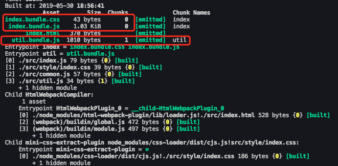

从上图中，我们可以看出index.css`和common.js在index.js中被引入，打包生成的`index.bundle.css`和 `index.bundle.js`都属于`chunk 0`，`util.js`因为是独立打包的，它生成的`util.bundle.js`属于`chunk 1`。

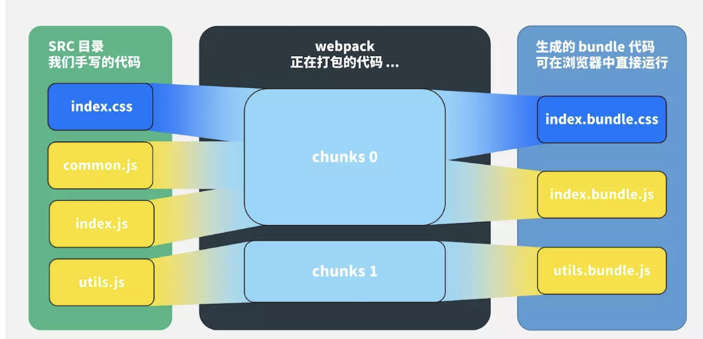

看这个图就很清晰了：
* 对于一份同逻辑的代码，当我们手写下一个一个的文件，它们无论是ES module还是commonJS或是AMD，他们都是module；
* 当我们写的 module 源文件传到 webpack 进行打包时，webpack 会根据文件引用关系生成 chunk 文件，webpack 会对这个 chunk 文件进行一些操作；
* webpack 处理好 chunk 文件后，最后会输出 bundle 文件，这个 bundle 文件包含了经过加载和编译的最终源文件，所以它可以直接在浏览器中运行。

一般来说，**一个chunk对应一个bundle**，比如上图中的 utils.js -> chunks 1 -> utils.bundle.js；但也有例外，比如说上图中，用 MiniCssExtractPlugin 从 chunks 0 中抽离出了 index.bundle.css 文件。

一句话总结：module，chunk 和 bundle 其实就是同一份逻辑代码在不同转换场景下的取了三个名字：
我们直接写出来的是 module，webpack 处理时是 chunk，最后生成浏览器可以直接运行的 bundle。

## filename和chunkFilename的区别

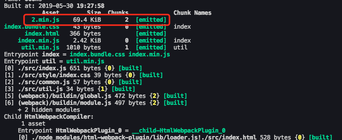

`2.min.js`就是异步加载的`chunk`文件。weboack文档里这么解释：`output.chunkFilename`默认使用`[id].js`或从 `output.filename`中推断出的值（[name]会被预先替换为 [id]或[id].）。

结合上面的例子来看：`output.filename`的输出文件名是 `[name].min.js`，`[name]`根据`entry`的配置推断为 index，所以输出为`index.min.js`；

由于`output.chunkFilename`没有显示指定，就会把[name]替换为chunk文件的id号，这里文件的id号是2，所以文件名就是`2.min.js`。

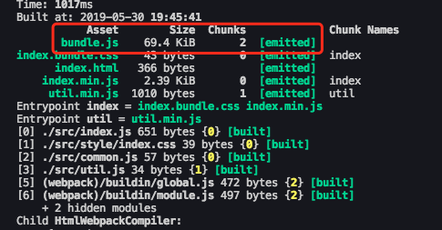

如果我们显式配置`chunkFilename`，就会按配置的名字生成文件：

```js
entry: {
    index: './src/index.js',
    util: './src/util.js',
},
output: {
    filename: '[name].min.js', // 输出 index.js 和 utils.js
    chunkFilename: 'bundle.js'
},
```
一句话总结：filename指列在entry中，打包后输出的文件的名称。chunkFilename指未列在entry中，却又需要被打包出来的文件的名称。

## webpackPrefetch、webpackPreload和webpackChunkName

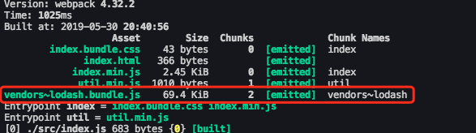

lodash是我们取的名字，按道理来说应该生成 `lodash.bundle.js`，前面的`vendors~`是什么鬼？
其实webpack懒加载是用内置的一个插件 SplitChunksPlugin实现的，这个插件里面有些默认配置项，比如说`automaticNameDelimiter`，默认的分割符就是 `~`，所以最后的文件名才会出现这个符号。

### webpackPrefetch和webpackPreload
这两个配置一个叫预拉取（Prefetch），一个叫预加载（Preload），两者有些细微的不同。

在上面的懒加载代码里，我们是**点击按钮**时，才会触发异步加载lodash的动作，这时候会动态的生成一个script标签，加载到head头里：

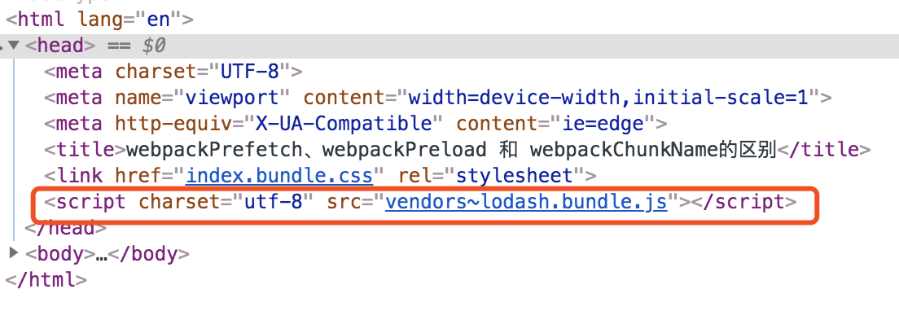

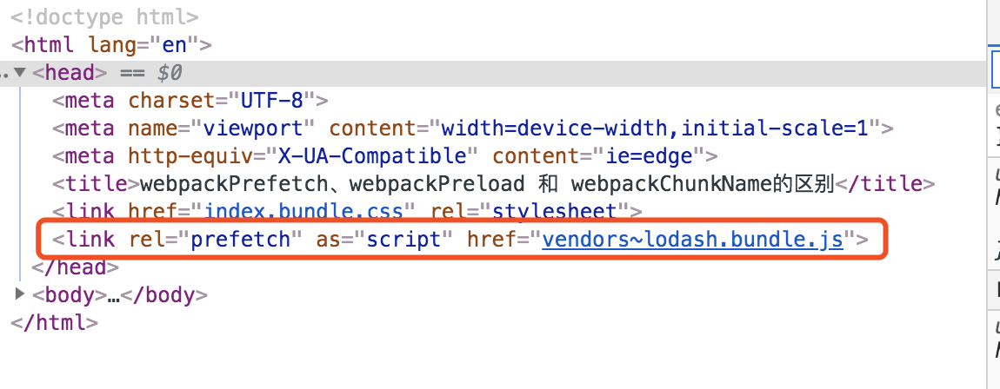

这个异步加载的代码不需要手动点击button触发，webpack会在父chunk完成加载后，闲时加载lodash文件。

webpackPreload是预加载当前导航下可能需要资源，它和 webpackPrefetch的主要区别是：

* preload chunk会在父chunk加载时，以并行方式开始加载。prefetch chunk会在父chunk加载结束后开始加载。
* preload chunk 具有中等优先级，并立即下载。prefetch chunk 在浏览器闲置时下载。
* preload chunk 会在父 chunk 中立即请求，用于当下时刻。prefetch chunk用于未来的某个时刻。

一句话总结：webpackChunkName是为懒加载的文件取别名，webpackPrefetch会在浏览器闲置下载文件，webpackPreload会在父chunk加载时并行下载文件。

## 文件指纹(hash、chunkhash、contenthash的区别)
文件指纹：打包后输出的文件名的后缀，可以用来做版本管理。设置了文件指纹后，对于没有修改的文件，可以更好的利用浏览器的缓存，从而加速页面的访问速度。
什么是chunk？
```js
entry: {
    index: './src/index.js',
    util: './src/util.js',
}
```
所谓chunk，我们可以简单理解为entry中定义的入口，当然对于异步加载的模块而言，每个异步加载的模块都对应一个chunk。

* hash：和整个项目的构建相关，只要项目文件有修改，整个项目构建的hash值就会更改；
* chunkhash：和webpack打包的chunk有关，不同的entry会生成不同的chunkhash值，在打包过程中需要保证一个entry中的内容发生了变化，并不会影响其他entry的文件指纹，这就需要用到chunkhash，来保证每个entry的文件指纹的独立；
* contenthash：根据文件内容来定义hash，文件内容不变，则contenthash不变。

## 文件指纹使用场景
### js文件指纹设置
对于js文件一般采用chunkhash。
```js
entry: {
    index: './src/index.js',
    vender: ['vue', 'vuex']
},
output: {
    filename: '[name].[chunkhash:8].js', // 改为chunkhash
}
```
在有多个入口文件时，一般会将一些第三方包打包成`vender`一个单独的`chunk`。因为这些包的源码，只要我们不升级是不发生变化的，而`index`对应的chunk是我们的业务代码，是经常发生变化的，因此对于多个入口的话，需要采用`chunkhash`。

::: warning
需要注意chunkhash不能与热更新插件HotModuleReplacementPlugin一同使用。
:::
### css文件指纹设置
对于css文件采用contenthash而不是使用chunkhash，原因在于：假如一个页面同时使用了js和css，但是只有js发生了改变，而css并未发生改变，那么css文件的文件指纹也会发生变化。
```js
plugins: [
    new MiniCssExtractPlugin({
        filename: '[name].[contenthash:8].css'
    })
]
```
### 图片或者字体的文件指纹设置
```js
{
    test: /\.(png|jpg|gif|svg|jpeg)$/,
    use: {
        loader: 'url-loader',
        options: {
            limit: 10240,
            name: 'img/[name].[hash:8].[ext]'
        }
    }
}
```
| 占位符名称        | 含义          |
| ------------- |:-------------:|
| [ext]      | 资源后缀名 |
| [name]      | 文件名称    |
| [path] |  文件的相对路径     |
| [folder] |  文件所在的文件夹     |
| [contenthash] |  文件的内容hash，默认是md5生成     |
| [hash] |  文件的内容Hash(默认32位，一般取前8位)，默认是md5生成     |
| [emoji] |  一个随机的指代文件内容的emoji     |
### runtimeChunk
runtimeChunk: 将webpack相关代码单独打包。在有新的模块加入的时候，webpack会给新模块增加一个id。

```js
runtimeChunk: true
```
## 代码压缩
### html压缩
修改`html-webpack-plugin`，设置压缩参数。
```js
new HtmlWebpackPlugin({
    template: path.join(__dirname, 'src/index.html'),
    filename: 'search.html',
    chunks: ['search'], // 指定要使用的chunk
    inject: true, // 自动注入打包后的chunk
    minify: {
        html5: true,
        collapseWhitespace: true,
        preserveLineBreaks: false,
        minifyCSS: true,
        minifyJS: true,
        removeComments: false
    }
})
```
### js压缩
在webpack4.x版本中，内置了`uglifyjs-webpack-plugin`。因此，生产环境下打包后的js代码默认就是压缩过的。当然，我们也可以安装`uglifyjs-webpack-plugin`插件，并为其设置一些参数，比如开启并行压缩等。
### css压缩
在webpack4.x版本中，压缩css需要使用`optimize-css-assets-webpack-plugin`插件，同时使用cssnano。
```js
yarn add optimize-css-assets-webpack-plugin -D
```
## sourse-map中eval、cheap、inline和module的区别

| 参数 | 参数解释 |
| --- | --- |
| eval | 打包后的模块都使用 eval() 执行，行映射可能不准；不产生独立的 map 文件 |
| cheap | map映射只显示行不显示列，忽略源自loader 的source map |
| inline | 映射文件以base64格式编码，加在bundle 文件最后，不产生独立的map文件 |
| module | 增加对loader source map和第三方模块的映射 |

### source-map
source-map是最大而全的，会生成独立map文件。
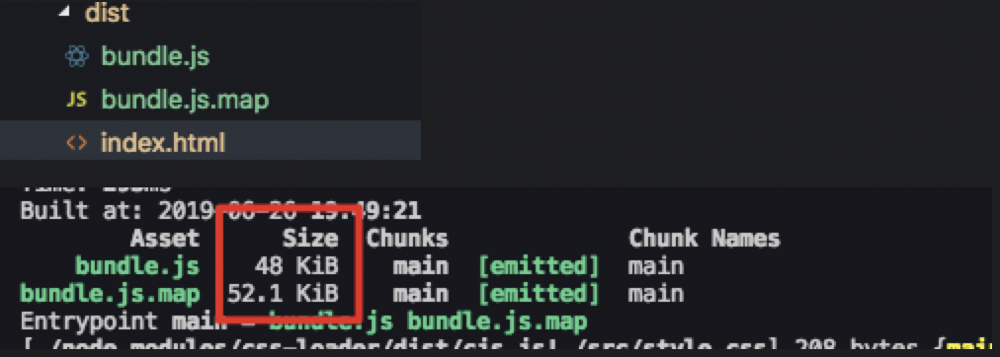

注意下图光标的位置，source-map会**显示报错的行列信息**：
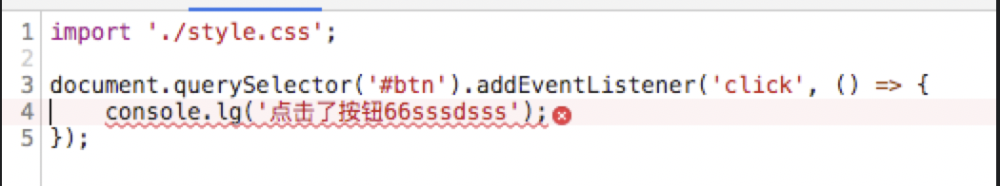

### cheap-sourse-map
cheap，就是廉价的意思，它**不会产生列映射**，相应的体积会小很多，我们和sourse-map的打包结果比一下，只有原来的 1/4。
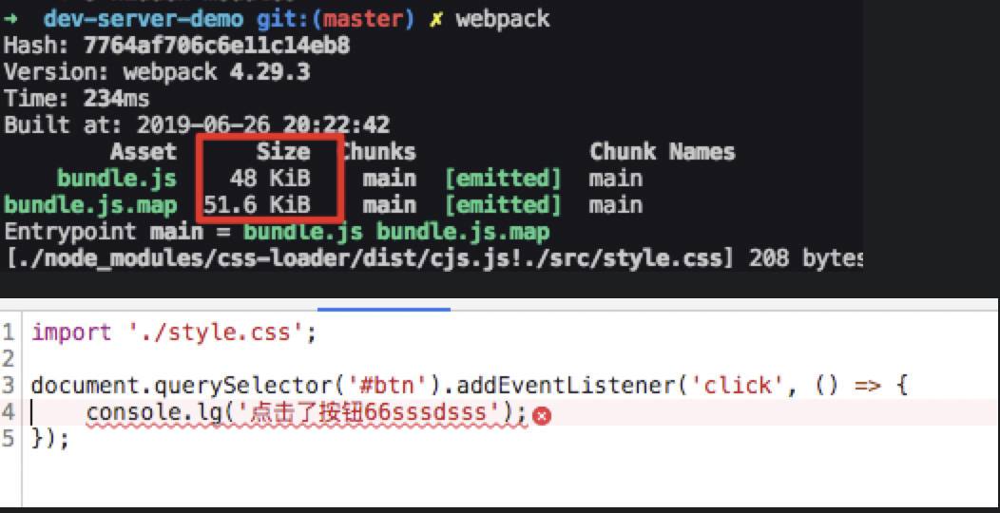

### eval-source-map
eval-source-map会以eval()函数打包运行模块，不产生独立的map文件，会显示报错的行列信息。每个module会通过 eval()来执行，并且生成一个DataUrl形式的SourceMap。
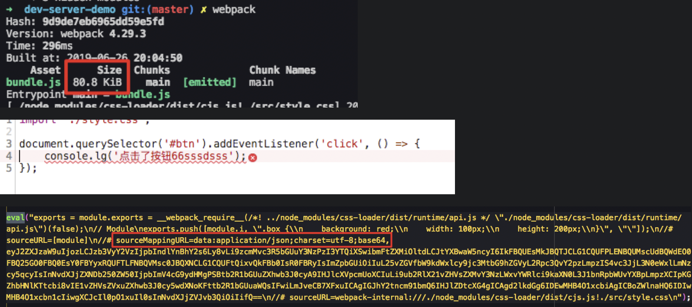

### inline-source-map
映射文件以base64格式编码，加在bundle文件最后，不产生独立的map文件。加入map文件后，我们可以明显的看到包体积变大了。
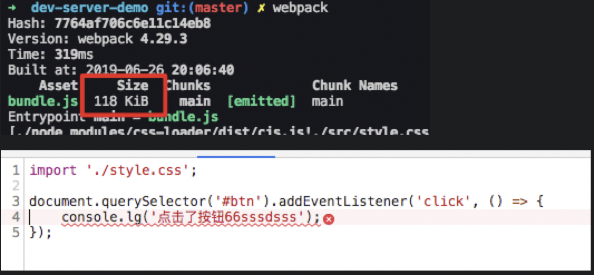
在打包后的bundle.js文件的最后，可以看到以base64格式编码的映射文件。

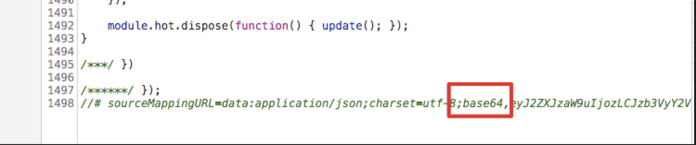

### hidden-source-map
与source-map相比少了末尾的注释，但dist目录下的 bundle.js.map没有少。

### 常用配置
上面的几个例子都是演示，结合官网推荐和实际经验，常用的配置其实是这几个：

1. source-map

大而全，啥都有，就因为啥都有可能会让 webpack 构建时间变长，看情况使用。

2. cheap-module-eval-source-map

这个一般是开发环境（dev）推荐使用，在构建速度报错提醒上做了比较好的均衡。

cheap(不产生列映射)和eval(不会生成单独的source-map文件)的组合。

3. cheap-module-source-map

一般来说，生产环境是不配 source-map 的，如果想捕捉线上的代码报错，我们可以用这个。

## 参考文档
1. [面试必备！webpack 中那些最易混淆的 5 个知识点](https://skychx.github.io/blog/scaffold/webpackConfuse.html#_1-webpack-%E4%B8%AD%EF%BC%8Cmodule%EF%BC%8Cchunk-%E5%92%8C-bundle-%E7%9A%84%E5%8C%BA%E5%88%AB%E6%98%AF%E4%BB%80%E4%B9%88%EF%BC%9F)
2. [深入浅出的webpack构建工具---devTool中SourceMap模式详解\(四\)](https://www.cnblogs.com/tugenhua0707/p/9464984.html#_labelTop)