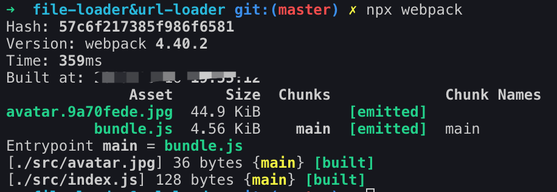
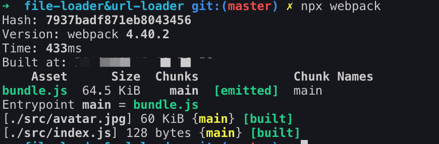
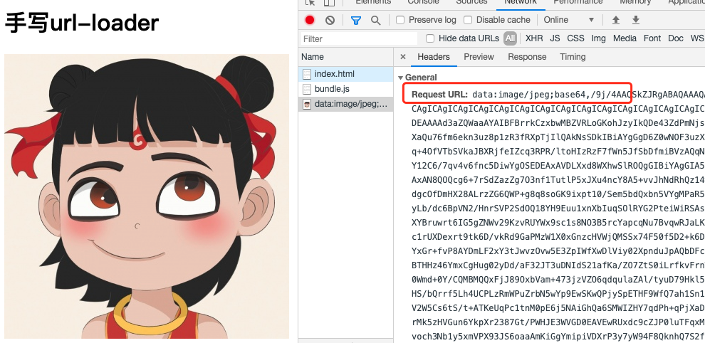

::: tip
写作不易，Star是最大鼓励，感觉写的不错的可以给个Star⭐，请多多指教。[本博客的Github地址](https://github.com/liujie2019/VuePress-Blog)。
:::
[TOC]
## babel-loader
```js
// 装包
yarn add @babel/core @babel/preset-env loader-utils
```
实现步骤：
1. 获取loader参数
2. 基于babel转换代码
3. 返回转换后的代码
```js
// 思路：从webpack.config.js中拿到babel的预设，通过预设来转换模块
// 先引入babel
const babel = require('@babel/core');
// 拿到babel的参数，使用loader-utils
const loaderUtils = require('loader-utils');
function loader(source) {
    // this是loader的上下文
    const options = loaderUtils.getOptions(this);
    // console.log(Object.keys(this));
    // console.log(options); // { presets: [ '@babel/preset-env' ] }
    // console.log(this.resourcePath); // /Users/xxxx/study/Blog/前端相关/Webpack学习总结/webpack4-study/code/webpack手写/babel-loader-demo/src/index.js
    // babel的转换是异步的，同步的返回是不行的，不能用return
    // 同步就是直接调用，异步会在async中
    // 这里采用异步，不阻塞其它编译流程
    const callback = this.async();
    // console.log(this.resourcePath.split('/').pop());
    babel.transform(source, {
        ...options,
        sourceMap: true, // 设置生成sourceMap，还需要再webpack.config.js中配置devtool: 'source-map'
        // pop方法删除数组的最后一个元素，并返回该元素，会影响原数组
        // 给生成的source-map指定名字
        filename: this.resourcePath.split('/').pop()
    }, (err, result) => {
        // console.log(Object.keys(result)); // [ 'metadata', 'options', 'ast', 'code', 'map', 'sourceType' ]
        // result.map是sourceMap
        callback(err, result.code, result.map);
    });
    // return只能返回一个值，callback可以返回多个值
    // return source; // 不起作用了
}
module.exports = loader;
```
## file-loader和url-loader
### file-loader
```js
// 装包
yarn add mime loader-utils
```
[mime](https://github.com/broofa/node-mime#readme)主要作用是：设置某种扩展名的文件的响应程序类型。

创建my-file-loader.js：

实现步骤：
1. 获取文件名
2. 文件输出目录兼容处理，默认直接输出到dist目录下
3. 原来的路径变成编译后的路径

需要注意二进制的处理：
```js
loader.raw = true;
```
```js
const loaderUtils = require('loader-utils');
const path = require('path');

// file-loader只是对文件进行复制移动到固定目录
function loader(source) {
    // '[name].[ext]'
    const {output} = loaderUtils.getOptions(this);
    // console.log(output); // { output: '/assets' }
    // interpolateName获取文件的hash值，并插入值，生成唯一的文件名
    // const interpolatedName = loaderUtils.interpolateName(loaderContext, name, options);
    // this代表loader上下文
    const filename = loaderUtils.interpolateName(this, '[name].[hash:8].[ext]', {content: source});
    if (output) {
        this.emitFile(path.resolve(__dirname, output, filename), source);
    } else {
        this.emitFile(filename, source);
    }
    // console.log(filename); // avatar.9a70fede.jpg
    // console.log('my-file-loader');
    // 把原来的路径变成编译后的路径
    return `module.exports='${filename}'`;
}
loader.raw = true; // 二进制
module.exports = loader;
```


### url-loader
my-url-loader.js：
```js
// 拿到loader的参数 需要工具包loaderUtils
const loaderUtils = require('loader-utils');
const mime = require('mime');  // 作用是设置某种扩展名的文件的响应程序类型

// 这里source是Buffer
function loader(source) {  // loader的参数就是源代码
    const {limit} = loaderUtils.getOptions(this);
    // console.log(this.resourcePath);
    // 如果图片小于limit，则使用base64编码
    // console.log(source); Buffer
    // console.log(source.toString('base64'));
    // mime.getType(this.resourcePath) 是文件类型
    if (limit && limit > source.length) {
        return `module.exports="data:${mime.getType(this.resourcePath)};base64,${source.toString('base64')}"`
    } else {
        // limit小于文件大小时还是走file-loader
        return require('./my-file-loader').call(this, source);
    }
}
loader.raw = true; // 二进制
module.exports = loader;
```



webpack配置如下：
```js
const path = require('path');

module.exports = {
    mode: 'development',
    entry: './src/index.js',
    output: {
        filename: 'bundle.js',
        path: path.resolve(__dirname, 'dist')
    },
    module: {
        rules: [
            {
                test: /\.js$/,
                use: 'babel-loader'
            }, {
                test: /\.(ico|gif|png|jpg|jpeg|webp)$/i,
                use: {
                    loader: 'my-file-loader',
                    options: {
                        output: '/assets'
                    }
                }
                // use: {
                //     loader: 'url-loader',
                //     options: {
                //         limit: 100 * 1024 // 小于100k的图片采用base64编码
                //     }
                // }
            }
        ]
    },
    resolveLoader: {
        modules: ['node_modules', path.resolve(__dirname, 'loaders')]
    }
};
```
## less-loader/css-loader/style-loader
### style-loader
```js
// 装包
yarn add less
```
在loaders目录下，分别创建my-style-loader.js、my-css-loader.js、my-less-loader.js。
my-style-loader.js：
```js
const loaderUtils = require('loader-utils');
function loader(source) {
    // 最后一个loader要返回一个脚本
    const str = `
        const style = document.createElement('style');
        style.innerHTML = ${JSON.stringify(source)};
        document.head.appendChild(style);
    `;
    return str;
}

// 在style-loader上写了pitch，有返回，后面的跳过，自己的写也不会执行
// remainingRequest：剩余的请求
loader.pitch = function (remainingRequest) {
    // /Users/xxxx/study/Blog/前端相关/Webpack学习总结/webpack4-study/code/webpack手写/less-loader&css-loader/loaders/my-css-loader.js!/Users/xxxx/study/Blog/前端相关/Webpack学习总结/webpack4-study/code/webpack手写/less-loader&css-loader/loaders/my-less-loader.js!/Users/liujie26/study/Blog/前端相关/Webpack学习总结/webpack4-study/code/webpack手写/less-loader&css-loader/src/style/index.less
    // 剩余的请求 my-css-loader!my-less-loader!./index.less
    // console.log(remainingRequest);
    // require路径 返回的就是css-loader处理好的结果require('!!css-loader!less-loader!./index.less')
    console.log(loaderUtils.stringifyRequest(this, '!!' + remainingRequest)); // "!!../../loaders/my-css-loader.js!../../loaders/my-less-loader.js!./index.less"
    const str = `
       let style = document.createElement('style')
       style.innerHTML = require(${loaderUtils.stringifyRequest(this, '!!' + remainingRequest)})
       document.head.appendChild(style)
   `;
    // stringifyRequest方法用来将绝对路径转为相对路径
    return str;
}

module.exports = loader;
```
### css-loader
css-loader：**主要用来处理css中的图片链接，需要把url转换成require**。
my-css-loader.js：
```js
// css-loader 用来解析@import或者url()语法，包括css中引入的图片
function loader(source) {
    const reg = /url\((.+?)\)/g;
    let pos = 0;
    let current;
    let arr = ['let list = []'];
    while(current = reg.exec(source)) {
        const [matchUrl, g] = current;
        // console.log(matchUrl, g);// url('./avatar.jpg') './avatar.jpg'
        // 拿到css从开始到地址链接之前的部分的索引值
        let lastIndex = reg.lastIndex - matchUrl.length;
        arr.push(`list.push(${JSON.stringify(source.slice(pos, lastIndex))})`); // 获取css开始和地址之前的代码
        pos = reg.lastIndex;
        // 把g替换成require的写法
        arr.push(`list.push('url('+ require(${g}) +')')`); // 拼入图片地址
    }
    arr.push(`list.push(${JSON.stringify(source.slice(pos))})`); // 拼入地址到结尾的代码
    arr.push(`module.exports = list.join('')`);
    // console.log(arr.join('\r\n'));
    /**
    let list = []
    list.push("body {\n  background-color: green;\n  background: ")
    list.push('url('+ require('./avatar.jpg') +')')
    list.push(";\n}\n")
    module.exports = list.join('')
    */
    return arr.join('\r\n');
}

module.exports = loader;
```
#### 正则表达式对象的lastIndex属性
```js
var regexp = /abcd/g;
var str = 'abcdefg';
alert(regexp.test(str)); // true
alert(regexp.test(str)); // false
alert(regexp.test(str)); // true
```
lastIndex从字面上来讲就是最后一个索引，实际上它的意思是正则表达式开始下一次查找的索引位置，第一次的时候总是为0的，第一次查找完了的时候会把lastIndex的值设为匹配到得字符串的最后一个字符的索引位置加1，第二次查找的时候会从lastIndex这个位置开始，后面的以此类推。如果没有找到，则会把lastIndex重置为0。要注意的是，lastIndex属性只有在有全局标志正则表达式中才有作用，如果我们把上面代码中正则表达式的g标志去掉，那么三次弹出的就都是true了。

### less-loader
less-loader实现比较简单，直接调用`less.render`方法将less语法转为css语法并返回。
my-less-loader.js：
```js
const less = require('less');

function loader(source) {
    let css = '';
    less.render(source, (err, output) => {
        css = output.css;
    });
    return css;
}

module.exports = loader;
```
webpack配置如下：
```js
const path = require('path');

module.exports = {
    mode: 'development',
    entry: './src/index.js',
    output: {
        filename: 'bundle.js',
        path: path.resolve(__dirname, 'dist')
    },
    module: {
        rules: [
            {
                test: /\.js$/,
                use: 'babel-loader'
            }, {
                test: /\.less$/,
                use: ['my-style-loader', 'my-css-loader', 'my-less-loader']
            }, {
                test: /\.(ico|gif|png|jpg|jpeg|webp)$/i,
                use: {
                    loader: 'url-loader',
                    options: {
                        limit: 100 * 1024 // 小于100k的图片采用base64编码
                    }
                }
            }
        ]
    },
    resolveLoader: {
        modules: ['node_modules', path.resolve(__dirname, 'loaders')]
    }
};
```
index.js
```js
import './style/index.less';
```
index.less
```css
@color: green;
body {
    background-color: @color;
    background: url('./avatar.jpg')
}
```