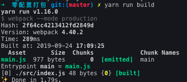
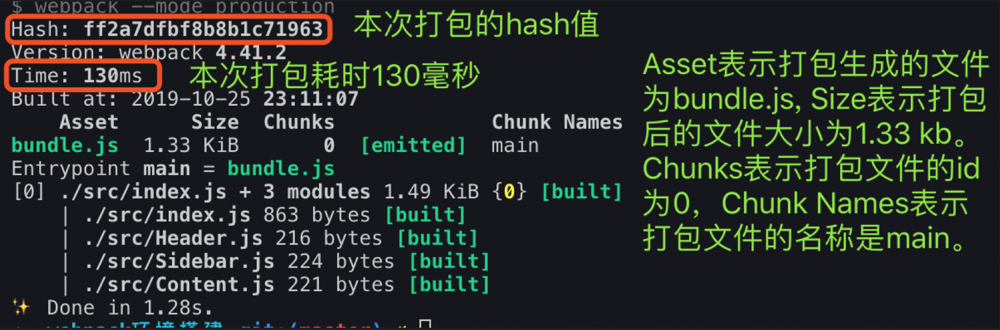

```bash
# 创建项目目录并进入
mkdir webpack4-demo && cd $_

# 快速初始化package.json文件
npm init -y
```
```js
{
  "name": "demo4",
  "version": "1.0.0",
  "description": "",
  "private": true, // 指定当前项目是一个私有项目，不会被发布到npm线上
  "main": "index.js",
  "scripts": {
    "test": "echo \"Error: no test specified\" && exit 1"
  },
  "author": "liujie",
  "license": "ISC",
}
```
```bash
# 安装webpack和webpack-cli
# webpack-cli的作用是使得我们可以在命令行中使用webpack这个打包命令
yarn add webpack webpack-cli -D
```
打开package.json文件，加入如下代码：
```js
"scripts": {
  "dev": "webpack --mode development",
  "build": "webpack --mode production"
}
```
::: warning
需要注意：在webpack4.x版本以前，必须在webpack.config.js的配置文件中通过entry属性定义`entry point`(入口文件)和output属性定义输出目录和文件。但是，从webpack4.x开始，不需要必须定义入口文件和输出目录了，webpack将入口文件默认为`./src/index.js`，输出目录为`./dist/main.js`。
:::
运行如下命令：
```js
yarn run build
```


## production模式和development模式
```bash
# ./dist/main.js是一个未被压缩过的文件
yarn run dev
# ./dist/main.js是一个被压缩过的文件
yarn run build
```
同时需要注意：在production模式下webpack进行了各种优化。包括：代码压缩，作用域提升，tree-shaking等。而development模式下，打包速度相对会快一点，其生成的一个没有被压缩的文件，并没有进行各种优化处理。

## 覆盖默认entry和output
在`package.json`中进行如下配置即可：这里指定打包后的文件名为bundle.js，而不是默认的main.js。
```js
"scripts": {
  "dev": "webpack --mode development ./src/index.js --output ./dist/bundle.js",
  "build": "webpack --mode production ./src/index.js --output ./dist/bundle.js"
}
```
## webpack开发环境搭建
需要注意：在项目中尽量使用最新版本的node，会提升打包速度。
### 项目内安装webpack(推荐)
主要是为了解决多个项目依赖不同版本webpack的问题。并不推荐全局安装webpack，会导致一些项目依赖的webpack版本跟全局webpack版本不一致而导致项目跑不起来。

```js
// npx会自动去node_modules目录查找
// 查看当前项目安装的webpack版本
npx webpack -v

// 查看webpack包信息
npm info webpack

// 在项目内安装webpack
yarn add webpack webpack-cli -D
```
```js
// webpack.config.js
const path = require('path');

module.exports = {
    // entry: './src/index.js', 等价于如下配置
    entry: {
        main: './src/index.js'
    },
    output: {
        filename: 'bundle.js',
        path: path.resolve(__dirname, 'dist')
    }
};
```
```js
"scripts": {
  "dev": "webpack --mode development",
  "build": "webpack --mode production"
}
```
运行`yarn run build`：



上面运行`yarn run build`，实际上是执行的scripts中对应的`webpack --mode production`。scripts会首先去当前项目的node_modules中查找是否存在webpack这个命令，没有的话再去全局中找。

这里会先打包index.js，然后打包index.js依赖的Header.js/Sidebar.js以及Content.js。
```js
// 手动指定webpack使用的配置文件为build目录下的webpack.config.js
webpack --mode production --config ./build/webpack.config.js
```
### 运行webpack打包命令的三种形式
* 使用全局安装的webpack，即webpack --mode production；
* 使用项目中安装的webpack，即npx webpack --mode production；
* 采用npm scripts的形式，即`yarn run build`。