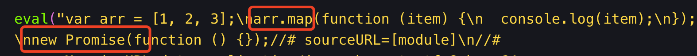
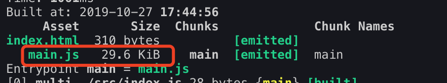
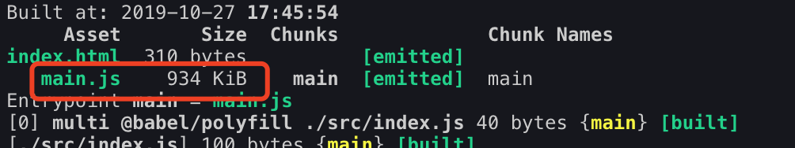
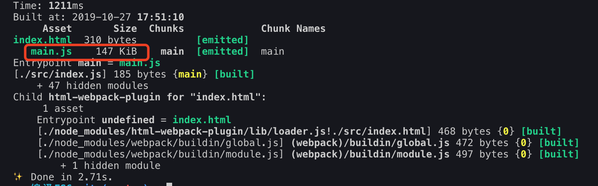
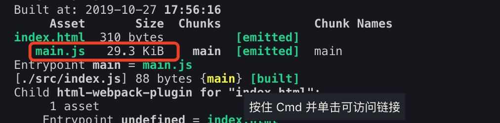

## loader作用
loader作用就是：把项目中使用到的文件转化成指定的格式文件输出。
webpack无法识别非`.js`结尾的模块，因此需要配置对应的loader来进行转换。`babel-loader`就是用于将`ES6+`语法转换成ES5语法的。

## Babel相关npm包
* babel-loader: 是webpack和babel之前的桥梁，webpack使用babel-loader来处理js文件；
* @babel/preset-env: 将ES6+转换成ES5；
* @babel/polyfill: 转换内置API和函数；
* @babel/plugin-transform-runtime: 主要用于第三方库的打包，避免polyfill污染全局变量。

需要注意的是：
* @babel/preset-env只负责语法转化，比如：箭头函数、class等；
* @babel/polyfill负责内置API和函数，比如：Set、Map、Promise、includes等。

::: tip
1. 处理项目中的业务逻辑采用：@babel/preset-env + @babel/polyfill
2. 第三方库的打包采用：@babel/plugin-transform-runtime + @babel/transform-runtime
:::
### presets和plugins的区别
一个plugin对应一个功能，而presets可以理解为一系列plugin的集合体。
## 处理业务代码
```js
yarn add babel-loader @babel/core @babel/preset-env --dev
```

需要注意：`@babel/preset-env`不会处理新的api，只转换对应的语法(比如let、const、箭头函数等语法)。



如上图所示：const语法被转化为了var，箭头函数也被转化了。但是像map和Promise等并没有被转化。

### 引入@babel/polyfill
@babel/polyfill用来处理新的api的转化。
在node中引入：

```js
require('@babel/polyfill');
```
如果在应用入口使用ES6的import语法，需要在入口顶部通过`import`将`polyfill`引入，以确保它能够最先加载。
```js
import '@babel/polyfill';
```
在`webpack.config.js`中，将`@babel/polyfill`加到entry数组中：
```js
module.exports = {
  entry: ['@babel/polyfill', './src/index.js']
};
```
```js
yarn add @babel/polyfill
```
未引入@babel/polyfill之前打包如下：



```js
// 在入口文件顶部引入@babel/polyfill
import '@babel/polyfill';

const arr = [1, 2, 3];
arr.map(item => {
    console.log(item);
});
new Promise(() => {});
```
引入@babel/polyfill之后打包如下：可以看出main.js变大了，是因为引入@babel/polyfill后，是去实现map和Promise。



### useBuiltIns(按需引入需要的polyfill)
```js
{
    "presets": [["@babel/preset-env", {
        "useBuiltIns": "usage",
        "corejs": 2
    }]]
}
```
配置useBuiltIns，只引入项目中使用到的新的api的polyfill，可以有效的减少打包后文件的体积。main.js体积变小。



::: warning
需要注意：当在项目中配置了"useBuiltIns": "usage"时，在打包的时候会自动引入所需要的polyfill，因此，不需要在业务代码中手动引入import '@babel/polyfill';。
:::

### targets
```js
{
    "presets": [
        ["@babel/preset-env", {
           "useBuiltIns": "usage",
           "corejs": 2,
           "targets": {
           // 指定编译后的代码的使用环境，如果chrome67版本以上完全支持es6语法，则不进行ES6转ES5了
               "chrome": ">67"
        }
    }]]
}
```
发现main.js体积跟之前不加polyfill一样了，说明chrome67以上的版本完全支持es6语法，不需要进行ES6转ES5了。



## 处理第三方库
```js
yarn add @babel/plugin-transform-runtime -D
yarn add @babel/runtime @babel/runtime-corejs2
```
修改`.babelrc`：采用plugins配置，而不是presets。
```js
{
    "plugins": [["@babel/plugin-transform-runtime", {
        "absoluteRuntime": false,
        "corejs": 2,
        "helpers": true,
        "regenerator": true,
        "useESModules": false
    }]]
}
```
特别注意：`"corejs": 2`需要配置成2，否则不会生效。

@babel/polyfill会污染全局环境，而@babel/plugin-transform-runtime会以闭包的形式注入相应的内容，不会污染全局环境。在写类库的时候，不污染全局环境是一个更好的选择。

## 配置React代码打包
```bash
yarn add react react-dom
```
安装`babel-preset-react`：
```bash
yarn add @babel/preset-react -D
```
>3. 在`.babelrc`中配置预设：
```js
// 需要注意preset的执行顺序是从右向左，从下往上的。
{
  "presets": [
    "@babel/preset-env",
    "@babel/preset-react"
   ]
}
```
这样一来，我们可以配置`babel-loader`来读取`.jsx`文件。具体配置如下：
```js
module.exports = {
  module: {
    rules: [
      {
        test: /\.(js|jsx)$/,
        exclude: /node_modules/,
        use: {
          loader: 'babel-loader'
        }
      }
    ]
  }
};
```
在`./src/App.js`中创建一个测试的`React`组件：
```js
import React from 'react';
import ReactDOM from 'react-dom';
const App = () => {
  return (
    <div>
      <p>React Test!</p>
    </div>
  );
};
export default App;
```
接下来在`./src/index.js`中导入组件：
```js
import React from 'react';
import ReactDOM from 'react-dom';
import App from './App';
ReactDOM.render(
    <App />,
    document.getElementById('app')
);
```
然后再次运行构建`yarn run build`。
## 在npm scripts中使用babel-loader(不推荐)
`--module-bind`参数允许我们在命令行中指定加载器，该参数从`webpack3`开始就有了。

如果希望在没有配置文件的情况下使用`babel-loader`，需要在 `package.json`中配置`npm scripts`，如下所示：
```js
"scripts": {
    "dev": "webpack --mode development --module-bind js=babel-loader",
    "build": "webpack --mode production --module-bind js=babel-loader"
}
```
运行`npm run build`构建项目。
