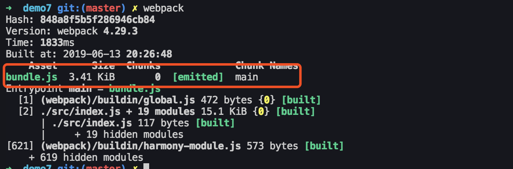

首先声明一点：Tree Shaking(摇树优化)只支持ES module。

## 什么是Tree Shaking
字面意思是摇树，简单来讲就是：项目中没有使用的代码会在打包时候丢掉。在我们的日常项目中，一个模块中可能有多个方法，只要其中得某个方法被引用了，则整个文件都会被打包到bundle里面去，Tree Shaking的作用就是只把使用到的方法打包到bundle中，没有用到得方法会在uglify阶段被删除掉。

JS的Tree Shaking依赖的是ES6的模块系统（比如：import和export）。也就是说不采用ES6模块规范(比如commonjs语法是不支持的)的话，无法进行Tree Shaking。
### 使用
webpack默认支持JS Tree Shaking，在`.babelrc`中配置`modules: false`即可。在生产环境下(mode: production)的情况下默认开启。

## DCE(Elimination)
* 代码不会被执行，不可到达
* 代码执行的结果不会被用到
* 代码只会影响死变量(只写不读)

```js
if (false) {
    // 永远不会被执行的代码
}
```
Tree Shaking就是基于DCE原理来实现的。
## webpack4开启Tree Shaking
`webpack4`中不再需要`UglifyjsWebpackPlugin`。只需要配置mode为production，即可显式激活`UglifyjsWebpackPlugin`插件。
```js
// 生产环境下默认开启Tree Shaking
mode: 'production'
// mode设置为none则关闭Tree Shaking
mode: 'none'
```
注意：根据版本不同，`webpack 4.x`版本后不配置mode也会自动激活插件。

`webpack.config.js`配置如下：
```js
const path = require('path');

module.exports = {
    mode: 'production',
    entry: './src/index.js',
    output: {
        path: path.resolve(__dirname, 'dist'),
        filename: 'bundle.js'
    }
};
```
在util.js文件中输入以下内容：
```js
const a = () => {
    return 'function a';
}

const b = () => {
    return 'function b';
}

const c = () => {
    return 'function c';
}

export {a, b, c};
```
然后在index.js中引用util.js的a函数：
```js
import {a} from './util';
console.log(a());
```
命令行运行webpack打包后，打开打包后生成的`/dist/bundle.js`文件。然后，查找我们a()函数输出的字符串，如下图所示：


如果将查找内容换成`"function b"`或者`"function c"`，并没有相关查找结果。说明`JS Tree Shaking`成功。

::: warning
需要注意：如果只是引用`import {a} from './util';`而不使用a的话，a对应的代码也会被Tree Shaking。
:::
```js
import {a} from './util';
// 这里虽然引用了a，并且调用了a，但是if代码块中的代码永远不会被执行到，因此也会被Tree Shaking
if (false) {
    console.log(a());
}
```
## 第三方JS库Tree Shaking
对于经常使用的第三方库（例如 jQuery、lodash 等等），如何实现Tree Shaking？下面以`lodash.js`为例，进行介绍。

安装：
```js
npm install lodash -S
```
在index.js中引用lodash的一个函数：
```js
import { chunk } from "lodash";
console.log(chunk([1, 2, 3], 2));
```
webpack命令行打包。如下图所示，打包后大小是70kb。显然，只引用了一个函数，不应该这么大，并没有进行Tree Shaking。


### 第三方库的模块系统版本
>需要注意：`JS Tree Shaking`利用的是es的模块系统。而`lodash.js`没有使用CommonJS或者ES6的写法。所以，安装库对应的模块系统即可。

安装lodash.js的es版本：
```js
npm install lodash-es --save
```
修改一下index.js:
```js
import {chunk} from "lodash-es";
console.log(chunk([1, 2, 3], 2));
```
再次打包，打包结果只有3.4KB（如下图所示）。显然，`JS Tree Shaking`成功。


## Tree Shaking原理
利用ES6模块的特点：
* 只能作为模块顶层的语句出现；
* import的模块名只能是字符串常量；
* import binding是immutable的

代码擦除：uglify阶段删除无用代码。

## 参考文档
1. [Tree-Shaking原理](https://blog.csdn.net/qq_34629352/article/details/104256311)