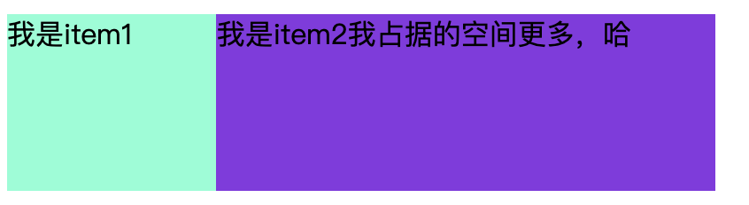

[TOC]
盒模型
垂直居中方法
三栏布局
选择器权重计算方式
清除浮动的方法
flex
什么是BFC、可以解决哪些问题
position属性
如何实现一个自适应的正方形
如何用css实现一个三角形
## 1. 常见选择器有哪些？选择器优先级？优先级是如何计算的？哪些属性可以继承？
### CSS选择器类型
* ID选择器：#
* 类选择器(class)：.box
* 标签选择器：div
* 相邻选择器：ul+div(选中ul后紧邻的div)
* 相邻选择器：ul~div(选中ul后所有的div)
* 子选择器：ul>li
* 后代选择器：ul li
* 分组选择器：div,p
* 属性选择器：a[href='xxx']
* 伪类选择器：a:hover
* 伪元素选择器：div::after(一个冒号也好使)
* 通配符：`*`

`ul+div`和`ul~div`的区别：
```css
ul+div {
    background: red;
}
```
ul后紧邻的div即div1背景颜色变红。
```css
ul~div {
    background: red;
}
```
ul后所有的div即div1和div2背景颜色都变红。
```html
<!DOCTYPE html>
<html lang="en">
<head>
    <meta charset="UTF-8">
    <meta name="viewport" content="width=device-width, initial-scale=1.0">
    <meta http-equiv="X-UA-Compatible" content="ie=edge">
    <title>Document</title>
    <style>
        div {
            width: 100px;
            height: 100px;
            border: 1px solid #ccc;
        }
        ul+div {
            background: red;
        }
    </style>
</head>
<body>
    <ul>1111</ul>
    <div>div1</div>
    <div>div2</div>
</body>
</html>
```
子选择器和后代选择器区别：
```html
<!DOCTYPE html>
<html lang="en">
<head>
    <meta charset="UTF-8">
    <meta name="viewport" content="width=device-width, initial-scale=1.0">
    <meta http-equiv="X-UA-Compatible" content="ie=edge">
    <title>Document</title>
    <style>
        ul>li {
            background: red;
        }
    </style>
</head>
<body>
    <ul>
        <li>1</li>
        <li>2</li>
        <li>3</li>
        <li>4</li>
        <li>5</li>
        <span>
            <li>6</li>
        </span>
    </ul>
</body>
</html>
```
子选择器：只有li是ul的子元素时北京才会变红。
```css
ul>li {
    background: red;
}
```
```html
<span>
    <li>6</li>
</span>
```
上述代码背景不会变红，因为span中li并不是ul的直接子元素。
```css
ul li {
    background: red;
}
```
上述代码的话，只要li是ul的后代就会生效。
### 伪类选择器和伪元素选择器的区别
* **伪类选择器**：`a:hover`，并不是一个实际存在的CSS类，而是鼠标浮上去的时候添加对应的CSS样式。
* **伪元素选择器**：`div::after`，相当于在div标签的最后添加一个**实际并不存在**的元素，所以称为伪元素。
### 选择器优先级
**!important > 内联样式(行内样式) > id选择器 > 类选择器 > 标签选择器 > 通配符选择器**

>选择器`从右往左`依次解析。

优先级就是分配给指定的CSS一个权重，它由匹配的选择器中的每一种选择器的权重大小决定。当优先级与多个CSS声明中任意一个声明的优先级相等的时候，CSS中最后的那个声明将会被应用到元素上。[具体请参考](https://developer.mozilla.org/zh-CN/docs/Web/CSS/Specificity)

关于权重计算，有两种不同的计算方式：
* 一种是以二进制的规则计算；
* 一种是以1,10,100,1000这种的计算方式。

个人更倾向于二进制的这种方式，**优先级(权重)计算规则：**
* 第一级别：内联样式，如style=""，权重为1000
* 第二级别：id选择器，权重为0100
* 第三级别：类、伪类和属性选择器，权重为0010
* 第四级别：标签选择器和伪元素选择器，权重为0001
* 通配符、子选择器、相邻选择器等。如*、>、+，权重为0000
* 继承的样式没有权值(**继承得到的样式优先级最低**)

**比较规则：如果层级相同，继续往后比较，如果层级不同，层级高的权重大，不论低层级有多少个选择器。**

::: warning
需要注意：虽然权重值是累加的，但是11个类选择器权重值为110，但是也没有一个id选择器(权重值为100)优先级高。
:::
### CSS可继承属性
- **可继承的属性:** font-size，font-family，color，text-indent
- **不可继承的样式:** border，padding，margin，width，height
## 2. 介绍一下CSS盒模型？CSS3中的`box-sizing`属性的值有哪些？有什么区别？
CSS盒模型本质上是一个盒子，封装周围的HTML元素，**它包括：外边距margin，边框border，填充padding，和实际内容content**。盒模型允许我们在其它元素和周围元素边框之间的空间放置元素。


盒模型的宽度包括：内容(content)、填充(padding)、边框(border)、外边距(margin)。

CSS盒模型分为两种：W3C标准盒模型和IE盒模型。
两者的区别是：
- W3C标准盒模型的宽度 = 内容宽度(width属性值) + 左右border + 左右padding + 左右margin
- W3C标准盒模型：width = content，不包含 border + padding
- IE盒模型的宽度 = 内容宽度(content + 左右border + 左右padding) + 左右margin
- IE盒模型：width = border + padding + content

`box-sizing`属性主要用来控制元素的盒模型的解析方式，默认值为`content-box`。其所有属性值如下：
- context-box：W3C标准盒模型，设置元素的height和width属性值是content部分的高和宽；
- border-box：IE盒模型(又名怪异盒模型)，设置元素的height和width属性值是border + padding + content部分的高和宽。
* padding-box(FireFox 曾经支持)
* margin-box(浏览器未实现)

>Tips: 理论上是有上面4种盒子，但现在 w3c 与 mdn 规范中均只支持 content-box 与 border-box。
## 3. BFC(块级格式化上下文)
BFC(Block Formatting Context)即块级格式化上下文，是Web页面中盒模型布局的CSS渲染模式，指一个**独立的渲染区域或者一个隔离的独立容器，让处于BFC内部的元素与外部的元素相互隔离，使内外元素的定位不会相互影响**。

BFC中只有`Block-level box`参与，它规定了内部的`Block-level Box`如何布局，并且与这个区域外部毫不相干。一个创建了新的BFC的盒子是独立布局的，盒子里面的子元素的样式不会影响到外面的元素。在同一个BFC中的两个相邻的**块级盒**，在**垂直方向（和布局方向有关系）的margin**会发生重叠。

::: warning
BFC在IE下为Layout，可通过`zoom: 1`触发。
:::

触发BFC条件：
* 根元素(html)
* float的值不为none
* position的值为absolute、fixed(即不为static或relative)
* overflow的值不为visible
* display的值为inline-block(行内块元素)、table、table-cell(表格单元格)、table-caption(表格标题)
* flex布局：flex, inline-flex
* 网格元素（display为 grid 或 inline-grid 元素的直接子元素）

>需要注意：尽管上述条件都可以触发BFC，但也会产生一些其他效果，如：

 - display: table;可能引发响应性问题
 - overflow: scroll;可能产生多余的滚动条
 - float: left;将把元素移至左侧，并被其他元素环绕
 - overflow: hidden;将裁切溢出元素

所以无论何时，当要创建一个BFC时，我们要基于需求选择最恰当的样式。

BFC的特点：
* BFC是一个独立的容器，**容器里面的元素和外面的元素互不影响**；
* 同一个BFC中的Box(块级盒)会在垂直方向上垂直排列；
* 垂直方向上的距离由margin决定，同一个BFC中的两个相邻的**块级盒**，垂直方向上的margin会发生重叠；每个元素的左外边距与包含块(BFC)的左边界相接触，即使浮动元素也是如此。
* BFC的区域不会与浮动元素区域重叠(即浮动元素仍然占据BFC的空间)；
* 计算BFC的高度时，浮动子元素也参与计算。
* 文字层不会被浮动层覆盖，环绕于周围(基于浮动可以实现文字环绕效果)。

BFC应用(能解决的问题)：
* 解决同一BFC容器中的相邻元素间的垂直外边距重叠问题
    * 同一个块格式化上下文中的相邻块级盒之间的**垂直margin**会合并，**水平方向上margin不合并**。
    * margin会产生合并(**经测试只会发生垂直margin的合并，左右的margin不会发生合并**)的情况有2种：一种是兄弟元素之间(解决方法：给发生margin重叠的元素添加一个父元素，并触发其父元素的BFC)，一种是父元素和子元素之间(解决方法：可以通过给父元素和子元素增加border，padding的方法来消除，但是有时候我们可能不需要border和padding。所以还有另一种好的方法是：可以给父元素设置新的块级格式上下文，加一个overflow:hidden。这样父元素就不会和子元素的margin发生重叠了。)。
* 清除浮动(父元素塌陷)
    * **其原理：** 当在父元素中设置**overflow:hidden时就会触发BFC**，所以父元素内部的子元素就不会影响外面的布局，BFC就把浮动的子元素高度当做了自己内部的高度去处理溢出，所以外面看起来是清除了浮动。
* 自适应两（多）栏布局

::: tip
考察：BFC是什么？BFC触发的条件有哪些？BFC可以干什么？

小技巧：可以讲解一些实际项目中的应用，比如Boostrap的清除浮动（`display：table;`创建匿名table-cell间接触发BFC），如果有看到别的场景使用或者自身有使用的场景可以尝试讲解一下使用技巧。这样可以让面试官觉得你不仅仅知道他问的东西是什么，你还能很好的使用它。
:::

[css3中的BFC,IFC,GFC和FFC](https://www.jianshu.com/p/e75f351e11f8)
## 4. 实现水平居中/垂直居中/垂直水平居中布局
水平居中
* 行内元素: text-align: center
* 块级元素: margin: 0 auto
* absolute + transform
* flex + justify-content: center

垂直居中
* line-height: height
* absolute + transform
* flex + align-items: center
* table

水平垂直居中
* absolute + transform
* flex + justify-content + align-items
### div水平居中
行内元素：给父元素设置
```css
.parent {
    text-align: center;
}
```
块级元素
```css
.parent {
    margin: 0 auto;
}
```
flex布局
```css
.parent {
    display: flex;
    justify-content: center;
}
```
绝对定位定宽
```css
.son {
    position: absolute;
    width: 宽度;
    left: 50%;
    margin-left: -0.5 * 宽度
}
```
绝对定位不定宽
```css
.son {
    position: absolute;
    left: 50%;
    transform: translate(-50%, 0);
}
```
left/right: 0
```css
.son {
    position: absolute;
    width: 宽度;
    left: 0;
    right: 0;
    margin: 0 auto;
}
```
### 垂直居中
行内元素
```css
.parent {
    height: 高度;
}
.son {
    line-height: 高度;
}
```
table
```css
.parent {
  display: table;
}
.son {
  display: table-cell;
  vertical-align: middle;
}
```
flex布局
```css
.parent {
    display: flex;
    align-items: center;
}
```
绝对定位定高
```css
.son {
    position: absolute;
    top: 50%;
    height: 高度;
    margin-top: -0.5 * 高度;
}
```
绝对定位不定高
```css
.son {
    position: absolute;
    top: 50%;
    transform: translate(0, -50%);
}
```
top/bottom: 0;
```css
.son {
    position: absolute;
    height: 高度;
    top: 0;
    bottom: 0;
    margin: auto 0;
}
```
### 垂直水平居中
#### 宽高固定
绝对定位水平垂直居中方式1：这种方式的盒子宽高必须固定，且需要知道具体的宽高值。
```css
div.parent {
    position: relative;
}
div.child {
    width: 100px;
    height: 200px;
    position: absolute;
    top: 50%;
    left: 50%;
    margin-left: -50px;
    margin-top: -100px;
}
```
绝对定位水平垂直居中方式2：这种方式的盒子宽高必须固定，但是不需要知道具体的宽高值。
```css
div.parent {
    position: relative;
}
div.child {
    width: 100px;
    height: 100px;
    position: absolute;
    left: 0;
    top: 0;
    right: 0;
    bottom: 0;
    margin: auto;
    background-color: green;
}
```
#### 宽高不固定
flex布局居中：兼容性不太好。
```css
div.parent {
    display: flex;
    justify-content: center;
    align-items: center;
}
```
```css
div.parent{
  display: flex;
}
div.child{
  margin: auto;
}
```
绝对定位，transform实现：兼容性不太好。
```css
div.parent {
    position: relative;
}
div.child {
    position: absolute;
    top: 50%;
    left: 50%;
    transform: translate(-50%, -50%);
}
```
网格布局居中
```css
div.parent {
    display: grid;
}
div.child {
    justify-self: center;
    align-self: center;
}
```
更多[干货!各种常见布局实现+知名网站实例分析](https://juejin.im/post/5aa252ac518825558001d5de)
## 5. 页面上隐藏元素有哪些方法?分析比较各种方法的优劣和各自的应用场景

1.opacity：0,该元素隐藏起来了，但不会改变页面布局，并且，如果该元素已经绑定了一些事件，如click事件也能触发
2.visibility:hidden,该元素隐藏起来了，但不会改变页面布局，但是不会触发该元素已经绑定的事件
3.display:node, 把元素隐藏起来，并且会改变页面布局，可以理解成在页面中把该元素删掉

元素消失的方案先列出来，display:none和visibility: hidden;的区别，拓展到vue框架的v-if和v-show的区别，还可以搭配重排(回流)和重绘来讲解。

- **第一种：display: none**，设置元素的display为none是最常用的隐藏元素的方法。给元素设置display:none后，元素将在页面上彻底消失，元素本来占有的空间就会被其他元素占有，也就是说它**会导致浏览器的重排和重绘**。
- **第二种：visibility: hidden**，设置元素的visibility为hidden也是一种常用的隐藏元素的方法，和display:none的区别在于：元素在页面消失后，其占据的空间依旧会保留着，所以它只会导致浏览器重绘而不会重排。这种方式适用于那些元素隐藏后不希望页面布局会发生变化的场景。
- **第三种：opacity: 0**，opacity属性用来设置元素的透明度，将元素的透明度设置为0后，在人们眼中，元素也是隐藏的，这也算是一种隐藏元素的方法。这种方法和 visibility:hidden 的一个共同点是**元素隐藏后依旧占据着空间**，但我们都知道，设置透明度为0后，元素只视觉上不可见了，它依旧存在页面中。
- **第四种：设置height，width等属性为0**，这是一种奇技淫巧，简单说就是将元素的margin，border，padding，height和width等影响元素盒模型的属性设置成0，如果元素内有子元素或内容，还应该设置其overflow:hidden来隐藏其子元素。

```css
.box {
  margin: 0;
  border: 0;
  padding: 0;
  height: 0;
  width: 0;
  overflow: hidden;
}
```
这种方式既不实用，也可能存在着着一些问题。但平时我们用到的一些页面效果可能就是采用这种方式来完成的，比如jquery的slideUp动画，它就是设置元素的overflow:hidden后，接着通过定时器，不断地设置元素的height，margin-top，margin-bottom，border-top，border-bottom，padding-top，padding-bottom 为 0，从而达到 slideUp 的效果。

- **第五种：clip-path**，通过剪裁元素实现隐藏。
```css
.hide {
  clip-path: polygon(0px 0px, 0px 0px, 0px 0px, 0px 0px);
}
```
- 第六种：设置z-index值为-1000(置于其他元素下面)

* 结构上：
    * display:none，元素隐藏，会从渲染树中消失，会改变页面布局，可以理解成**在页面中把该元素删掉**，元素不占据空间且无法点击；
    * visibility: hidden，元素隐藏，但不会从渲染树中消失，不会改变页面布局，元素继续占据空间，但**无法点击**，不会触发该元素已经绑定的事件；
    * opacity: 0，元素隐藏，但不会从渲染树消失，不会改变页面布局，元素占据空间且可点击，如果该元素已经绑定了一些事件，如click事件也能触发。
* 继承性：
    * display: none和opacity: 0是非继承属性；父元素设置了 display:none 或 opacity: 0，子元素无论怎么设置都无法显示；visibility: hidden 会被子元素继承，并且子元素可以通过设置设置visibility: visible; 来取消隐藏。
* 性能上：
    * display: none;会引起重排，性能消耗较大；
    * visibility: hidden 会引起重绘，性能消耗相对较小；
    * opacity: 0 会重建图层，性能较高

### display:none和visibility:hidden的共同点和区别？
**两者的共同点：** 都能让元素不可见。
**两者的区别：**
1. `display:none;`会让元素完全从页面中消失，渲染的时候不占据任何空间，它各边的元素会合拢，就当它从来不存在。；`visibility: hidden;`不会让元素从页面中消失，渲染时元素继续占据空间，只是内容不可见；
2. `display: none;`是非继承属性，子孙节点消失由于其父元素从页面中消失造成的，通过修改子孙节点属性无法显示；`visibility: hidden;`是继承属性，子孙节点消失由于继承了父元素的hidden属性，通过设置`visibility: visible;`可以让子孙节点显式；
3. 修改常规文档流中元素的display属性通常会造成文档重排(重排肯定重绘)，修改visibility属性只会造成本元素的重绘。
4. 读屏器不会读取`display: none;`的元素内容；会读取`visibility: hidden;`的元素内容。

## 6. CSS引入的方式有哪些? link和@import的区别？
### CSS引入的方式
有四种：
* 外部样式表(推荐使用)：通过link标签引入一个外部css文件，比如：`<head> <link rel="stylesheet" type="text/css" href="style.css"></head>`
    * 这是最常见的也是最推荐的引入CSS的方式。使用这种方式，所有的 CSS 代码只存在于单独的 CSS 文件中，所以**具有良好的可维护性**。并且所有的 CSS 代码只存在于 CSS 文件中，CSS 文件会在第一次加载时引入，以后切换页面时只需加载 HTML 文件即可。
* 内部样式表(即内嵌样式)：将css代码放在`<head>`标签的`<style>`标签内部，比如：`<head> <style>.content { background: red; }</style></head>`。
    * 嵌入方式的CSS只对当前的网页有效。因为CSS代码是在HTML文件中，所以会使得代码比较集中，当我们写模板网页时这通常比较有利。因为查看模板代码的人可以一目了然地查看 HTML结构和CSS样式。
    * 缺点：因为嵌入的CSS只对当前页面有效，所以当多个页面需要引入相同的CSS代码时，这样写会导致代码冗余，也不利于维护。
* 内联样式(行内样式)：将css样式直接定义在HTML标签元素内部(通过标签元素的style属性指定)，比如：`<div style="display: inline-block;background:red"></div>`
    * 缺点：通常，行内样式是个很糟糕的样式书写方式，其只能改变当前标签的样式，如果想要多个div拥有相同的样式，不得不重复地为每个div添加相同的样式，如果想要修改一种样式，又不得不修改所有的style中的代码。很显然，内联方式引入CSS代码会导致HTML代码变得冗长，且使得网页难以维护。
* 导入(@import)：导入方式指的是使用 CSS 规则引入外部 CSS 文件。比如：`<style> @import url(style.css);</style>`或者写在css样式中`@charset "utf-8";@import url(style.css);*{ margin:0; padding:0;}.notice-link a{ color:#999;}`

### link标签和@import标签的区别
1. link属于html标签，除了加载CSS外，还可以定义RSS等其他事务；而@import是CSS提供的，只能加载CSS。
2. 页面加载时，link引用的CSS会同时被加载；而@import引用的CSS会等到**页面加载完成后**再加载，所以会出现一开始没有css样式，闪烁一下出现样式后的页面(网速慢的情况下)。
3. link标签样式的**权重高于@import**的；
4. **link可以使用js动态引入**(通过**动态创建link标签**，并为其指定src属性值)，@import不行；
5. link是HTML标签，不存在兼容性问题，而@import是在CSS2.1提出的，低版本的浏览器不支持，要求IE5以上才能识别。

## 7. 说说flex布局以及其应用场景
采用Flex布局的元素，称为Flex 容器（flex container），简称"容器"。它的所有子元素自动成为容器成员，称为 Flex 项目（flex item），简称项目。


Flex(Flexible Box)，也就是`弹性布局`，它可以很灵活地实现垂直居中、多列布局等自适应问题。而任何一个容器都可以指定为Flex布局。**设为Flex布局以后，子元素的float、clear和vertical-align属性将失效**。
### flex属性
flex属性是flex-grow，flex-shrink和flex-basis的简写，默认值为0 1 auto，后两个属性可选。

flex属性取值：
* initial：元素会根据自身宽高设置尺寸。它会缩短自身以适应 flex 容器，但不会伸长并吸收 flex 容器中的额外自由空间来适应 flex 容器 。相当于将属性设置为"flex: 0 1 auto"。
* auto：元素会根据自身的宽度与高度来确定尺寸，但是会伸长并吸收 flex 容器中额外的自由空间，也会缩短自身来适应 flex 容器。这相当于将属性设置为 "flex: 1 1 auto"。
* none：元素会根据自身宽高来设置尺寸。它是完全非弹性的：既不会缩短，也不会伸长来适应 flex 容器。相当于将属性设置为"flex: 0 0 auto"。

* `<'flex-grow'>`：定义 flex 元素的 flex-grow 属性，详见`<number>`。默认值为 0，负值无效。
* `<'flex-shrink'>`：定义 flex 元素的 flex-shrink 属性，详见`<number>`。默认值为1，负值无效。
* `<'flex-basis'>`：定义 flex 元素的 flex-basis 属性。若值为0，则必须加上单位，以免被视作伸缩性。 默认值为 auto。

flex 属性可以指定1个，2个或3个值。

* 单值语法: 值必须为以下其中之一:
    * 一个无单位数(`<number>`): 它会被当作`<flex-grow>`的值。
    * 一个有效的宽度(width)值: 它会被当作`<flex-basis>`的值。
    * 关键字none，auto或initial.

* 双值语法: 第一个值必须为一个无单位数，并且它会被当作`<flex-grow>`的值。第二个值必须为以下之一：
    * 一个无单位数：它会被当作`<flex-shrink>`的值。
    * 一个有效的宽度值: 它会被当作`<flex-basis>`的值。
* 三值语法:
    * 第一个值必须为一个无单位数，并且它会被当作`<flex-grow>`的值。
    * 第二个值必须为一个无单位数，并且它会被当作`<flex-shrink>`的值。
    * 第三个值必须为一个有效的宽度值， 并且它会被当作`<flex-basis>`的值。

basis属性定义了在分配多余空间之前，项目占据的**主轴空间（main size）**。

flex-direction属性决定主轴的方向（即项目的排列方向）。
```js
.box {
  flex-direction: row | row-reverse | column | column-reverse;
}
```
当`flex-direction: row`时，`flex-basis: 200px`指定的是元素的宽度。
当`flex-direction: column`时，`flex-basis: 200px`指定的是元素的高度。

```js
.item {
  flex: none | [ <'flex-grow'> <'flex-shrink'>? || <'flex-basis'> ]
}
```
该属性有两个快捷值：auto (1 1 auto) 和 none (0 0 auto)。

建议优先使用这个属性，而不是单独写三个分离的属性，因为浏览器会推算相关值。
### `flex:1`含义
`flex: 1`等价于`flex: 1 1 0%`，其能实现各子元素均分外层容器空间的效果。
```html
<!DOCTYPE html>
<html lang="en">
<head>
    <meta charset="UTF-8">
    <meta name="viewport" content="width=device-width, initial-scale=1.0">
    <meta http-equiv="X-UA-Compatible" content="ie=edge">
    <title>flex:1</title>
    <style>
        .box {
            display: flex;
            height: 100px;
            width: 400px;
        }
        .child {
            /* flex: 1 1 auto; */
            flex: 1 1 0%;
            /* flex: 1; */
        }
        .left {
            background-color: aquamarine;
        }
        .right {
            background-color: blueviolet;
        }
    </style>
</head>
<body>
    <div class="box">
        <div class="left child">我是item1</div>
        <div class="right child">我是item2我占据的空间更多，哈</div>
    </div>
</body>
</html>
```
效果如下图所示：


`flex: 1 1 0%`表示left和right两个盒子为零尺寸的。
故剩余空间为：400px - 0px = 400px
伸缩放大系数之和为：1 + 1 = 2，即左右盒子各占据二分之一，即都是200px。

```css
.child {
    flex: 1 1 auto;
}
```
效果如下图所示：


## 8. 移动端Retina，1px像素问题的解决方案

* viewport + rem
* background-image
* 伪元素 + transform scale()
* box-shadow
[7 种方法解决移动端 Retina 屏幕 1px 边框问题](https://juejin.im/entry/584e427361ff4b006cd22c7c)
## 9. 文本显示行数控制
### 单行
```css
overflow: hidden; // 多余内容隐藏
text-overflow: ellipsis; // 超出显示'...'
white-space: nowrap; // 控制不换行
```
### 多行
```css
overflow: hidden;
text-overflow: ellipsis; // 超出显示'...'
display: -webkit-box; // 将元素作为弹性伸缩盒子模型显示
-webkit-line-clamp: 2; // 用来限制在一个块元素显示的文本的行数
-webkit-box-orient: vertical; // 设置或检索伸缩盒对象的子元素的排列方式
```
## 10. 解释一下浮动的原理。清除浮动的方法有哪些？
浮动元素**脱离文档流**，不占据空间。浮动元素可以向左或向右移动，直到它的外边缘碰到包含框或另一个浮动框的边框为止。由于浮动元素不在文档流中，所以文档流中的元素表现得就像浮动元素不存在一样。浮动的元素会漂浮在文档流的元素上面。

### 浮动的特性
- 浮动元素会脱离普通文档流，但浮动元素影响的不仅是自己，它会**影响周围的元素对齐进行环绕**。
- 不管一个元素是行内元素还是块级元素，如果被设置了浮动，那**浮动元素会生成一个块级框**，可以设置它的 width和height。

### 父元素高度塌陷原因
**父元素高度塌陷问题:** 如果一个块级元素没有设置height，其height是由子元素撑开的。对子元素设置了浮动之后，子元素会脱离标准文档流，也就是说，父级元素中没有内容可以撑开其高度，这样父级元素的height就会被忽略，这就是所谓的高度塌陷。

### 浮动元素引起的问题
1. 父元素的高度无法被撑开，影响与父元素同级的元素(导致父元素塌陷)
2. 与浮动元素同级的非浮动元素（内联元素）会跟随其后
3. 若非第一个元素浮动，则该元素之前的元素也需要浮动，否则会影响页面显示的结构

### 清除浮动的方法
1. 使用空标签清除浮动，在**浮动元素后面**添加`clear:both`的空`div`元素，定义`clear:both`. 弊端就是增加了无意义标签。
```html
<div class="container">
    <div class="left"></div>
    <div class="right"></div>
    <div style="clear:both"></div>
</div>
```
2. 间接触发BFC：给**浮动元素的父元素**添加overflow: hidden或者auto样式，触发BFC(或者给父元素设置浮动来触发BFC)。
```html
<div class="container">
    <div class="left"></div>
    <div class="right"></div>
</div>
```
```css
container {
    width: 300px;
    background-color: #aaa;
    overflow: hidden; /*触发BFC*/
    zoom: 1; /*用于兼容IE6*/
}
```
3. 给父级div定义高度。原理：给父级DIV定义固定高度（height），能解决父级 DIV 无法获取高度得问题。优点：代码简洁，缺点：高度被固定死了，适合内容固定不变的模块。（不推荐使用）
4. 使用`:after伪类`，也是在元素末尾添加一个点并带有`clear: both`属性的元素实现的。该方法只适用于非IE浏览器，该方法中必须为需要清除浮动元素的伪对象中设置`height:0`，否则该元素会比实际高出若干像素。
```html
<div class="container clearfix">
    <div class="left"></div>
    <div class="right"></div>
</div>
```
```css
.clearfix {
    zoom: 1; /*IE6*/
}
.clearfix:after {
  visibility: hidden;
  display: block;
  font-size: 0;
  content: "";
  clear: both;
  height: 0;
}
```
推荐使用第4种方法，不会在页面新增div，文档结构更加清晰。
## 11. position都有哪些值？各个值之间的区别是什么？
- static: 默认值。没有定位，元素出现在正常的文档流中。
- absolute: 绝对定位元素，相对于 static 定位以外的第一个父元素来进行定位。
- fixed: 固定定位元素，相对于浏览器窗口进行定位。
- relative: 相对定位元素，相对于其本身在文档流中的位置进行定位。
- inherit: 规定应该从父元素继承 position 属性的值。
- sticky(CSS3中新增，可以实现吸顶效果): 粘性定位元素。

CSS3中新增了一个 position:sticky 属性，该属性的作用类似 position:relative 和 position:fixed的结合。元素在跨越特定阈值前为相对定位，之后为固定定位。必须指定 top, right, bottom 或 left 四个阈值其中之一，才可使粘性定位生效。否则其行为与相对定位相同。但 sticky 尚在实验性阶段。

### absolute与fixed的共同点和区别？
* absolute绝对定位：相对于最近的已定位的祖先元素，有已定位(指**position不是static的元素**)祖先元素，以最近的祖先元素为参考标准。如果无已定位祖先元素，以body元素为偏移参照基准，完全脱离标准文档流。
* fixed固定定位的元素会相对于浏览器视口来定位，这意味着即便页面滚动，它还是会停留在相同的位置。一个固定定位元素不会保留它原本在页面应有的空隙。

**共同点:**
- 改变行内元素的呈现方式，display被置为block；
- 都让元素脱离文档流，不占据空间；
- 默认会覆盖到非定位元素上。

**不同点:**
- absolute的`根元素`是可以设置的，fixed的`根元素`固定为浏览器窗口。
- absolute的定位元素是可以设置的(距离它最近的定位不是static的父元素)；
- fixed是相对于浏览器窗口进行定位。当页面滚动时，fixed元素与浏览器窗口之间的距离是固定不变的。

### `position:absolute`和`float`属性的异同？
**共同点：** 对内联元素设置 float 和 absolute 属性，可以让元素脱离文档流，并且可以设置其宽高。
**不同点：** float仍会占据位置，position会覆盖文档流中的其他元素。
## 12. 纯CSS画圆/半圆/扇形/三角形/梯形
```css
/* 扇形 */
width: 0;
height: 0;
border: 100px solid red;
border-color: red transparent transparent transparent;
border-radius: 100px;
```
```css
/* 扇形 */
.sector {
  width: 0;
  height: 0;
  border-width: 50px;
  border-style: solid;
  border-color: red transparent transparent;
  border-radius: 50px;
}
```
```css
div {
    margin: 50px;
    width: 100px;
    height: 100px;
    background: red;
}
/* 半圆 */
.half-circle {
    height: 50px;
    border-radius: 50px 50px 0 0;
}
/* 扇形 */
.sector {
    border-radius: 100px 0 0;
}
/* 三角 */
.triangle {
    width: 0px;
    height: 0px;
    background: none;
    border: 50px solid red;
    border-color: red transparent transparent transparent;
}
/* 梯形 */
.ladder {
    width: 50px;
    height: 0px;
    background: none;
    border: 50px solid red;
    border-color: red transparent transparent transparent;
}
```
## 13. CSS3有哪些新特性？
- 动画(animation)
- 圆角(border-radius)
- 阴影(box-shadow)
- 文字阴影(text-shadow)
- 文字渲染(text-decoration)
- 渐变效果(gradient)
- 拉伸，压缩，旋转，偏移等变换(transform)
- 过渡效果(transition)
- 媒体查询
- 多栏布局
- border-image(背景边框)等

### CSS动画如何实现？transition和animation(keyframes)/的区别
* transition：用于做过渡效果，**没有帧概念，只有开始和结束状态**，性能开销较小
* animate：用于做动画，有帧的概念，可以重复触发且有中间状态，性能开销较大

Animation和transition大部分属性是相同的，他们都是随时间改变元素的属性值，主要区别是：transition需要触发一个事件才能改变属性，而animation不需要触发任何事件的情况下才会随时间改变属性值，并且transition为2帧，从from .... to，而animation可以一帧一帧的。

Animation功能与Transition功能相同，都是通过改变元素的属性值来实现动画效果的，他们的区别在于：使用Transition功能时只能通过指定属性的开始值和结束值，然后在这两个属性值之间进行平滑过渡的方式来实现动画效果，因此不能实现比较复杂的动画效果。
Animation功能通过定义多个关键帧以及定义每个关键帧中元素的属性值来实现更为复杂的动画效果
```css
/*旋转/缩放/定位/倾斜*/
transform: rotate(9deg) scale(0.85, 0.9) translate(0px, -30px) skew(-9deg, 0deg);
```
### CSS3动画性能的问题
在做CSS3动画的时候，如果使用gpu渲染图形，可以减少cpu的消耗，提高程序的性能。

当我们使用动画改变图片的left值时候，通常会使用margin-left的属性，但是margin-left属性的时候会触发页面的重绘和重排。当我们使用css3新属性transform来代替传统的margin-left来改变元素位置的时候，不会触发任何的重绘，而且会触发gpu加速来帮助页面的排版。
### transition和animation的区别
Animation和transition大部分属性是相同的，他们都是随时间改变元素的属性值，他们的主要区别是transition需要触发一个事件才能改变属性，
而animation不需要触发任何事件的情况下才会随时间改变属性值，并且transition为2帧，从from .... to，而animation可以一帧一帧的。

transition 规定动画的名字  规定完成过渡效果需要多少秒或毫秒  规定速度效果  定义过渡效果何时开始
animation  指定要绑定到选择器的关键帧的名称

## 14. calc函数
calc函数是css3新增的功能，可以使用calc()计算border、margin、pading、font-size和width等属性设置动态值。
```css
#div1 {
    position: absolute;
    left: 50px;
    width: calc( 100% / (100px * 2) );
    /*兼容写法*/
    width: -moz-calc( 100% / (100px * 2) );
    width: -webkit-calc( 100% / (100px * 2) );
    border: 1px solid black;
}
```
注意点：
* 需要注意的是，运算符前后都需要保留一个空格，例如：width: calc(100% - 10px);
* calc函数支持"+", "-", "*", "/" 运算;
* 对于不支持calc的浏览器，整个属性值表达式将被忽略。不过我们可以对那些不支持 calc()的浏览器，使用一个固定值作为回退。
## 15. 移动端rem
rem官方定义『The font size of the root element』，即根元素的字体大小。rem是一个相对的CSS单位，1rem等于html元素上font-size的大小。所以，我们只要设置html上font-size的大小，就可以改变1rem所代表的大小。
```js
(function () {
    var html = document.documentElement;
    function onWindowResize() {
        html.style.fontSize = html.getBoundingClientRect().width / 20 + 'px';
    }
    window.addEventListener('resize', onWindowResize);
    onWindowResize();
})();
```
## 16. 移动端1px
一般来说，在PC端浏览器中，设备像素比（dpr）等于1，1个css像素就代表1个物理像素；但是在retina屏幕中，dpr普遍是2或3，1个css像素不再等于1个物理像素，因此比实际设计稿看起来粗不少。
1. 伪元素+scale
```css
<style>
    .box{
        width: 100%;
        height: 1px;
        margin: 20px 0;
        position: relative;
    }
    .box::after{
        content: '';
        position: absolute;
        bottom: 0;
        width: 100%;
        height: 1px;
        transform: scaleY(0.5);
        transform-origin: 0 0;
        background: red;
    }
</style>

<div class="box"></div>
```
2. border-image
```css
div{
    border-width: 1px 0px;
    -webkit-border-image: url(border.png) 2 0 stretch;
    border-image: url(border.png) 2 0 stretch;
}
```
## 17. 两边宽度固定中间自适应的三栏布局
圣杯布局和双飞翼布局是前端工程师需要日常掌握的重要布局方式。两者的功能相同，都是为了实现一个**两侧宽度固定，中间宽度自适应**的三栏布局。
### 圣杯布局
[圣杯布局和双飞翼布局的理解与思考](https://www.jianshu.com/p/81ef7e7094e8)
```css
<style>
body{
    min-width: 550px;
}
#container{
    padding-left: 200px;
    padding-right: 150px;
}
#container .column{
    float: left;
}
#center{
    width: 100%;
}
#left{
    width: 200px;
    margin-left: -100%;
    position: relative;
    right: 200px;
}
#right{
    width: 150px;
    margin-right: -150px;
}
</style>
<div id="container">
    <div id="center" class="column">center</div>
    <div id="left" class="column">left</div>
    <div id="right" class="column">right</div>
</div>
```
圣杯布局：左右盒子以及中间的盒子是放在同一个容器中的，而且中间盒子放在最上面最先渲染。
而双飞翼布局：中间的盒子放在单独的容器盒子中，左右盒子并没放在容器盒子中。
### 双飞翼布局
```css
<style>
body {
    min-width: 500px;
}
#container {
    width: 100%;
}
.column {
    float: left;
}
#center {
    margin-left: 200px;
    margin-right: 150px;
}
#left {
    width: 200px;
    margin-left: -100%;
}
#right {
    width: 150px;
    margin-left: -150px;
}
</style>
<div id="container" class="column">
    <div id="center">center</div>
</div>
<div id="left" class="column">left</div>
<div id="right" class="column">right</div>
```
## 18. 伪类和伪元素
css引入伪类和伪元素概念是为了格式化文档树以外的信息。也就是说，伪类和伪元素都是用来修饰不在文档树中的部分。
### 伪类
伪类存在的意义是为了通过选择器找到那些不存在DOM树中的信息以及不能被常规CSS选择器获取到的信息。
* 获取不存在与DOM树中的信息。比如a标签的`:link、:visited`等，这些信息不存在与DOM树结构中，只能通过CSS选择器来获取；
* 获取不能被常规CSS选择器获取的信息。比如：要获取第一个子元素，我们无法用常规的CSS选择器获取，但可以通过 :first-child 来获取到。


### 伪元素
伪元素用于创建一些不在文档树中的元素，并为其添加样式。比如说，我们可以通过:before来在一个元素前增加一些文本，并为这些文本添加样式。虽然用户可以看到这些文本，但是这些文本实际上不在文档树中。常见的伪元素有：`::before，::after，::first-line，::first-letter，::selection、::placeholder`等

因此，伪类与伪元素的区别在于：**有没有创建一个文档树之外的元素**。
### `::after`和`:after`的区别
在实际的开发工作中，我们会看到有人把**伪元素**写成:after，这实际是CSS2与CSS3新旧标准的规定不同而导致的。
**CSS2中的伪元素使用1个冒号，在CSS3中，为了区分伪类和伪元素，规定伪元素使用2个冒号**。所以，对于CSS2标准的老伪元素，比如:first-line，:first-letter，:before，:after，写一个冒号浏览器也能识别，但对于CSS3标准的新伪元素，比如::selection，就必须写2个冒号了。
## 19. px、em 以及 rem 的区别
- px 像素(Pixel)。**绝对单位**。像素 px 是相对于显示器屏幕分辨率而言的，是一个虚拟长度单位，是计算 机系统的数字化图像长度单位，如果 px 要换算成物理长度，需要指定精度 DPI。
- em 是**相对长度单位，相对于当前对象内文本的字体尺寸**。如当前对行内文本的字体尺寸未被人为设置， 则相对于浏览器的默认字体尺寸。它会继承父级元素的字体大小，因此并不是一个固定的值。
- rem 是 CSS3 新增的一个相对单位(root em，根 em)，使用 rem 为元素设定字体大小时，仍然是相对大小， 但**相对于 HTML 根元素设置的字体尺寸**。
## 20. 流式布局与响应式布局的区别
- **流式布局：** 使用非固定像素来定义网页内容，也就是百分比布局，通过盒子的宽度设置成百分比来根据屏幕的宽度来进行伸缩，不受固定像素的限制，内容向两侧填充。
- **响应式布局：** 利用 CSS3 中的 Media Query(媒介查询)，通过查询 screen 的宽度来指定某个宽度区间的网页布局。

## 21. CSS3 实现一个持续的动画效果
使用`animation`和动画帧`@keyframes`实现。
### 延伸考察-使用js实现一个持续的动画效果(requestAnimationFrame)
## 22. 渐进增强和优雅降级
- **渐进增强:** 针对低版本浏览器进行构建页面，保证最基本的功能，然后再针对高级浏览器进行效果、交互等改进和追加功能达到更好的用户体验。
- **优雅降级:** 一开始就构建完整的功能，然后再针对低版本浏览器进行兼容。

**区别:** 优雅降级是从复杂的现状开始，并试图减少用户体验的供给，而渐进增强则是从一个非常基础的，能够起作用的版本开始，并不断扩充，以适应未来环境的需要。降级（功能衰减）意味着往回看；而渐进增强则意味着朝前看，同时保证其根基处于安全地带。
## 23. 实现0.5px的线
实现思路：`transform: scaleY(0.5);`。
```css
div {
    border-bottom: 1px solid red;
    width: 100px;
    transform: scaleY(0.5);
}
```
## 24. css sprite(即雪碧图)是什么？有什么优缺点？
概念：将多个小图片拼接到一个图片中，通过background-position和元素尺寸调节需要显示的背景图案。

* 多个图片集成在一个图片中的图
* 使用雪碧图可以减少网络请求的次数，可以加快页面加载速度
* 通过background-position，去定位图片在屏幕的哪个位置

优点：
1. 可以减少HTTP请求数，极大地提高页面加载速度
2. 增加图片信息重复度，提高压缩比，减少图片大小
3. 更换风格方便，只需在一张或几张图片上修改颜色或样式即可实现

缺点：
1. 图片合并麻烦
2. 维护麻烦，修改一个图片可能需要从新布局整个图片，样式
## 25. 层叠上下文
元素提升为一个比较特殊的图层，在三维空间中 (z轴) 高出普通元素一等。
触发条件：
* 根层叠上下文(html)
* position
* css3属性
    * flex
    * transform
    * opacity
    * filter
    * will-change
    * -webkit-overflow-scrolling

层叠等级：层叠上下文在z轴上的排序
* 在同一层叠上下文中，层叠等级才有意义
* z-index的优先级最高


## 26. CSS预处理器(Sass/Less/Postcss)
CSS预处理器的原理: 是将类 CSS 语言通过 Webpack 编译 转成浏览器可读的真正 CSS。在这层编译之上，便可以赋予 CSS 更多更强大的功能，常用功能:

* 嵌套
* 变量
* 循环语句
* 条件语句
* 自动前缀
* 单位转换
* mixin复用

## 27. 相邻的两个inline-block节点为什么会出现间隔，该如何解决？
元素间留白间距出现的原因就是**标签之间的空格**，因此，去掉HTML中的空格，自然间距就消失了。

还可以通过设置父元素的font-size来实现：`font-size: 0;`。
```html
<!DOCTYPE html>
<html lang="en">
<head>
    <meta charset="UTF-8">
    <meta name="viewport" content="width=device-width, initial-scale=1.0">
    <meta http-equiv="X-UA-Compatible" content="ie=edge">
    <title>Document</title>
    <style>
        .box {
            width: 200px;
            height: 200px;
            padding: 10px;
            background-color: bisque;
            font-size: 0;
        }
        .box > span {
            border: 1px solid #ccc;
            font-size: 12px;
        }
    </style>
</head>
<body>
    <div class="box">
        <span>123</span>
        <span>456</span>
        <span>789</span>
    </div>
</body>
</html>
```
## 参考文档
1. [50道CSS基础面试题（附答案）](https://segmentfault.com/a/1190000013325778)