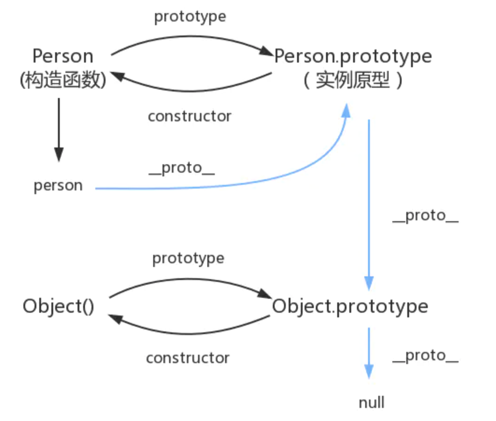
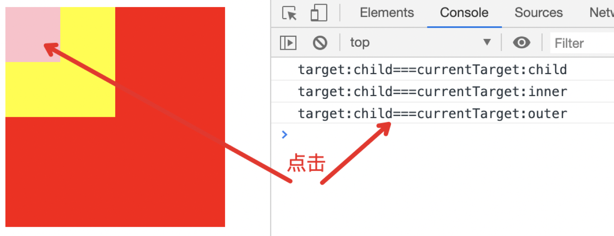

[TOC]
### js数据类型
* 栈：基本数据类型(Undefined，Null，Boolean，Number，String，Symbol，Bigint)
* 堆：引用数据类型(对象、数组和函数)

两者的区别是：存储位置不同；
基本数据类型是直接存储在**栈(stack)**中的简单数据段，占据空间小、大小固定，属于被频繁使用数据，所以放入栈中存储；

引用数据类型存储在**堆(heap)**中的对象，占据空间大、大小不固定，如果存储在栈中，将会影响程序运行的性能；引用数据类型在栈中存储了指针，该指针指向堆中该实体的起始地址。当解释器寻找引用值时，会首先检索其在栈中的地址，取得地址后从堆中获得实体。

**栈和堆的区别：** 栈(stack)会自动分配内存空间，会自动释放。堆(heap)动态分配的内存，大小不定也不会自动释放。
#### 如何判断类型
typeof()，instanceof，Object.prototype.toString.call()
#### typeof和instanceof有什么区别？
相同点：
都可以用来检测变量的数据类型。

不同点：
* typeof：返回值是一个字符串，用来说明变量的数据类型，不能判断null
* instanceof：用于判断一个变量是否属于某个对象的实例
#### 如何判断一个变量是对象还是数组
```js
Object.prototype.toString.call()
```
#### 判断是否是数组
1. Array.isArray(arr)
2. Object.prototype.toString.call(arr) === '[Object Array]'
3. arr instanceof Array
4. array.constructor === Array

#### 字符串转数字
parseInt(string, radix)

### 对作用域和作用域链的理解
#### 作用域
1. 全局作用域
浏览器打开一个页面时，浏览器会给JS代码提供一个全局的运行环境，那么这个环境就是全局作用域
一个页面只有一个全局作用域，全局作用域下有一个window对象
window是全局作用域下的最大的一个内置对象（全局作用域下定义的变量和函数都会存储在window下）
如果是全局变量，都会给window新增一个键值对；属性名就是变量名，属性值就是变量所存储的值
如果变量只被var过，那么存储值是undefined
在私有作用域中是可以获取到全局变量的，但是在全局作用域中不能获取私有变量
2. 局部作用域
函数执行会形成一个新的私有的作用域（执行多次，形成多个私有作用域）
私有作用域在全局作用域中形成，具有包含的关系；
在一个全局作用域中，可以有很多个私有作用域
在私有作用域下定义的变量都是私有变量
形参也是私有变量
函数体中通过function定义的函数也是私有的，在全局作用域不能使用；
3. 块级作用域
es6中新引入的一种作用域
在js中常见到的if{}、for{}、while{}、try{}、catch{}、switch case{}都是块级作用域
var obj = {} //对象的大括号不是块级作用域
块级作用域中的同一变量不能被重复声明（块级下var和function不能重名，否则会报错）
作用域链
4. 父级作用域
函数的父级作用域就是该函数定义的地方，和函数在哪个作用域下执行没有关系。也就是说作用域是在函数定义时就已经确定了的。这需要跟执行上下文区分开来，函数没执行一次，都会创建一个新的执行上下文。

作用域链：当获取变量所对应的值时，首先看变量是否是私有变量，如果不是私有变量，要继续向上一级作用域中查找，如果上一级也没有，那么会继续向上一级查找，直到找到全局作用域为止；如果全局作用域也没有，则会报错；这样一级一级向上查找，就会形成作用域链
当前作用域没有的，则会继续向上一级作用域查找
当前函数的上一级作用域跟函数在哪个作用域下执行没有关系，只跟函数在哪定义有关（重点）

**作用域链的作用是:** 保证对执行环境有权访问的所有变量和函数的有序访问。
作用域链的变量只能向上访问，变量访问到window对象即被终止，作用域链向下访问变量是不被允许的。内部环境可以通过作用域链访问所有的外部环境，但是外部环境不能访问内部环境中的任何变量和函数。

js中的作用域分为两种：全局作用域和函数作用域。函数作用域中定义的变量，只能在函数中调用，外界无法访问。没有块级作用域导致了if或for这样的逻辑语句中定义的变量可以被外界访问，因此ES6中新增了let和const命令来进行块级作用域的声明。
### 谈谈你对闭包的理解？应用的场景？
简单来说闭包就是在函数里面声明函数，本质上说就是在函数内部和函数外部搭建起一座桥梁，使得子函数可以访问父函数中所有的局部变量，但是反之不可以，这只是闭包的作用之一，另一个作用，则是保护变量不受外界污染，使其一直存在内存中，在工作中我们还是少使用闭包的好，因为闭包太消耗内存，不到万不得已的时候尽量不使用。

函数声明的时候，会生成一个独立的作用域，同一作用域的对象可以互相访问，作用域呈层级包含状态，形成作用域链，子作用域的对象可以访问父作用域的对象，反之不能；另外子作用域会使用最近的父作用域的对象。

闭包是指有权访问另一个函数作用域中的变量的函数，创建闭包的最常见的方式就是在一个函数内创建另一个函数，通过另一个函数访问包含函数的局部变量。
**闭包使用场合:** 使用闭包主要是为了设计私有的方法和变量以及特权方法(在某些函数中，只能通过特权方法才能访问相应的变量)。比如说插件的封装，一般在插件中定义的都是私有的变量和函数，我们对外提供访问这些变量和函数的接口。

**使用闭包的优点:**
- 希望一个变量长期驻扎在内存中(使用不当导致内存泄漏);
- 避免全局变量的污染，实现局部变量的累加;
- 私有成员的存在。
**缺点是:** 闭包会常驻内存，会增大内存使用量，使用不当很容易造成内存泄露。

**闭包有三个特性:**
- 函数嵌套函数;
- 函数内部可以包含函数的参数和变量;
- 参数和变量不会被垃圾回收机制回收(因为其被闭包引用)。
### js对象
#### 创建对象方式
```js
// 1.对象字面量
let obj = {name: 'lisi'}

// 2.构造函数
function Person(name) {
    this.name = name
}
let p = new Person('lisi')

// 3.Object.create(proto, [propertiesObject])
// Object.create()方法创建的对象时，属性是在原型下面的
let obj = Object.create({name: 'lisi'})

```

#### new操作符做了什么？

1. 创建一个新的实例对象；
2. 将构造函数中的this指向新创建的实例对象；
3. 将新创建的实例对象通过`__proto__`绑定到构造函数的prototype上；
4. 如果构造函数中没有返回其它对象，那么返回 this，即这个新创建的实例对象，否则，返回构造函数中返回的对象。

> 、创建一个空对象

> 2、让空对象的__proto__（IE没有该属性）成员指向了构造函数的prototype成员对象

> 3、使用apply调用构造器函数，属性和方法被添加到 this 引用的对象中


```js
function _new(func) {
    // 第一步 创建新对象
    let obj= {};
    // 第二步 空对象的_proto_指向了构造函数的prototype成员对象
    obj.__proto__ = func.prototype;
    // 一二步合并就相当于 let obj=Object.create(func.prototype)

    // 第三步 使用apply调用构造器函数，属性和方法被添加到 this 引用的对象中
    let result = func.apply(obj);
    if (result && (typeof (result) == "object" || typeof (result) == "function")) {
    // 如果构造函数执行的结果返回的是一个对象，那么返回这个对象
        return result;
    }
    // 如果构造函数返回的不是一个对象，返回创建的新对象
    return obj;
}
```

#### instanceof 原理

> 用来测试一个对象在其原型链中是否存在一个构造函数的 prototype 属性

```html
<script>
function Person(){
}
function Foo(){
}

//显示改变Foo.prototype指向Person的实例对象（原型继承）

Foo.prototype=new Person()

let a=new Foo()

console.log(a.__proto__===Foo.prototype); //true

console.log(a instanceof Foo);//true

console.log(Foo.prototype.__proto__===Person.prototype);//true

console.log(a instanceof Person);//true

console.log(a instanceof Object);//true

// 这个时候改变Foo.prototype的指向

Foo.prototype={}

// Foo.prototype已经不在a的原型链上面了

console.log(a.__proto__===Foo.prototype);//false

console.log(a instanceof Foo);//false

//Person.prototype依然在a的原型链上面

console.log(a instanceof Person); //true
</script>
```

### 谈谈对原型和原型链的理解
原型：所有的函数数据类型都天生自带一个prototype属性，该属性的属性值是一个对象
prototype的属性值中天生自带一个constructor属性，其constructor属性值指向当前原型所属的类
所有的对象数据类型，都天生自带一个`__proto__`(隐式原型)属性，该属性的属性值指向当前实例所属构造函数的原型。

把所有的对象共用的属性全部放在堆内存的一个对象（共用属性组成的对象），然后让每一个对象的 __proto__存储这个「共用属性组成的对象」的地址。而这个共用属性就是原型，原型出现的目的就是为了减少不必要的内存消耗。而原型链就是对象通过__proto__向当前实例所属类的原型上查找属性或方法的机制，如果找到Object的原型(即Object.prototype)上还是没有找到想要的属性或者是方法则查找结束，最终会返回undefined。

原型链中对象属性查找过程：首先在对象本身上面找 -> 没找到再到对象的原型上找 -> 还是找不到就到原型的原型上找 —> 直到Object.prototype找不到 -> 返回undefined。

原型链的最顶端是null。


原型继承的原理：原型继承是借助已有的对象创建新的对象，将子类的原型指向父类，就相当于加入了父类这条原型链。

什么是原型链：只要是对象就有原型, 并且原型也是对象, 因此只要定义了一个对象, 那么就可以找到他的原型, 如此反复, 就可以构成一个对象的序列, 这个结构就被称为原型链。
所有的实例有一个内部指针(prototype)，指向它的原型对象，并且可以访问原型对象上的所有属性和方法。

### js继承
1、原型链继承，将父类的实例作为子类的原型，他的特点是实例是子类的实例也是父类的实例，父类新增的原型方法/属性，子类都能够访问，并且原型链继承简单易于实现，缺点是来自原型对象的所有属性被所有实例共享，无法实现多继承，无法向父类构造函数传参。

2、构造继承，使用父类的构造函数来增强子类实例，即复制父类的实例属性给子类，构造继承可以向父类传递参数，可以实现多继承，通过call多个父类对象。但是构造继承只能继承父类的实例属性和方法，不能继承原型属性和方法，无法实现函数服用，每个子类都有父类实例函数的副本，影响性能

3、实例继承，为父类实例添加新特性，作为子类实例返回，实例继承的特点是不限制调用方法，不管是new 子类（）还是子类（）返回的对象具有相同的效果，缺点是实例是父类的实例，不是子类的实例，不支持多继承
4、拷贝继承：特点：支持多继承，缺点：效率较低，内存占用高（因为要拷贝父类的属性）无法获取父类不可枚举的方法（不可枚举方法，不能使用for in 访问到）
5、组合继承：通过调用父类构造，继承父类的属性并保留传参的优点，然后通过将父类实例作为子类原型，实现函数复用
6、寄生组合继承：通过寄生方式，砍掉父类的实例属性，这样，在调用两次父类的构造的时候，就不会初始化两次实例方法/属性，避免的组合继承的缺点


原型链继承
核心： 将父类的实例作为子类的原型

构造继承
核心：使用父类的构造函数来增强子类实例，等于是复制父类的实例属性给子类


实例继承
核心：为父类实例添加新特性，作为子类实例返回


拷贝继承

组合继承
核心：通过调用父类构造，继承父类的属性并保留传参的优点，然后通过将父类实例作为子类原型，实现	函数复用


寄生组合继承
核心：通过寄生方式，砍掉父类的实例属性，这样，在调用两次父类的构造的时候，就不会初始化两次实	例方法/属性，避免的组合继承的缺点。
```js
// 定义一个父类
function Father(name) {
    // 属性
    this.name = name || "father";
    // 实例方法
    this.sayName = function() {
    console.log(this.name);
    };
    this.color = ["red", "blue"];
}
// 原型方法
Father.prototype.age = 18;
Father.prototype.sayAge = function() {
  	console.log(this.age);
};
```
#### 原型链继承
实现思路：将父类的实例作为子类的原型。

```js
    function Son(name) {
      this.name = name || "son";
    }

    Son.prototype = new Father();

    let s1 = new Son("s1");
    let s2 = new Son("s2");

    s1.color.push("black");

    console.log(s1.name); //s1
    console.log(s1.color); //['red','blue','black']
    console.log(s1.age); //18
    s1.sayAge(); //18
    console.log(s2.name); //s2
    console.log(s2.color); //['red','blue','black']
```

优点：
1. 简单，易于实现
2. 父类新增原型方法、原型属性，子类都能访问到

缺点：
1. 无法实现多继承，因为原型一次只能被一个实例更改
2. 来自原型对象的所有属性被所有实例共享（上诉例子中的color属性）
3. 创建子类实例时，无法向父构造函数传参


- 构造函数继承：使用父类的构造函数来增强子类实例，即复制父类的实例属性给子类，构造继承可以向父类传递参数，可以实现多继承，通过call多个父类对象。但是构造继承只能继承父类的实例属性和方法，不能继承原型属性和方法，无法实现函数服用，每个子类都有父类实例函数的副本，影响性能。
- 原型链继承：将父类的实例作为子类的原型，他的特点是实例是子类的实例也是父类的实例，父类新增的原型方法/属性，子类都能够访问，并且原型链继承简单易于实现，缺点是来自原型对象的所有属性被所有实例共享，无法实现多继承，无法向父类构造函数传参。
- 组合继承：通过调用父类构造，继承父类的属性并保留传参的优点，然后通过将父类实例作为子类原型，实现函数复用。
- 实例继承，为父类实例添加新特性，作为子类实例返回，实例继承的特点是不限制调用方法，不管是new 子类()还是子类()返回的对象具有相同的效果，缺点是实例是父类的实例，不是子类的实例，不支持多继承。
- 拷贝继承：特点：支持多继承，缺点：效率较低，内存占用高（因为要拷贝父类的属性）无法获取父类不可枚举的方法（不可枚举方法，不能使用for in 访问到）。
- 寄生组合继承：通过寄生方式，砍掉父类的实例属性，这样，在调用两次父类的构造的时候，就不会初始化两次实例方法/属性，避免的组合继承的缺点。

#### ES5和ES6实现继承的区别
### this指向
1. 全局作用域下的this指向window
2. 如果给DOM元素的事件行为绑定函数，那么函数中的this指向当前被绑定的那个DOM元素
3. 函数中的this，要看函数执行前有没有`.`，有`.`的话，点前面是谁，this就指向谁，如果没有点，指向window
4. 自执行函数中的this永远指向window
5. 定时器中函数的this指向window
6. 构造函数中的this指向当前的实例
7. call、apply、bind可以改变函数的this指向
8. 箭头函数中没有this，如果输出this，就会输出箭头函数定义时所在的作用域中的this

#### this指向分类
1. 默认绑定：全局环境中，this默认绑定到window。
2. 隐式绑定：一般地，被直接对象所包含的函数调用时，也称为方法调用，this隐式绑定到该直接对象。
3. 隐式丢失：隐式丢失是指被隐式绑定的函数丢失绑定对象，从而默认绑定到window。显式绑定：通过call、apply、bind方法把对象绑定到this上，叫做显式绑定。
4. new绑定：如果函数或者方法调用之前带有关键字new，它就构成构造函数调用。对于this绑定来说，称为new绑定。

构造函数通常不使用return关键字，它们通常初始化新对象，当构造函数的函数体执行完毕时，它会显式返回。在这种情况下，构造函数调用表达式的计算结果就是这个新对象的值。

如果构造函数使用return语句但没有指定返回值，或者返回一个原始值，那么这时将忽略返回值，同时使用这个新对象作为调用结果。

如果构造函数显式地使用return语句返回一个对象，那么调用表达式的值就是这个对象。
#### 改变函数内部this指针的指向函数（bind/apply/call的区别）
* 相同点：
  * 三者都能指定函数中的this指向(this指向的永远是调用该方法的对象)。
* 不同点：
  * call/apply是立即执行对应函数；
  * bind是给对应函数绑定this指向，然后返回该函数；
  * **call和bind传参方式一样**，从第二个参数开始直接传入，apply传参的第二个参数是数组或者类数组，所传参数放在数组里。

```js
Function.prototype.bind(obj); // 作用: 将函数内的this绑定为obj, 并将函数返回
```

三个函数的作用都是将函数绑定到上下文中，用来改变函数中this的指向；三者的不同点在于语法的不同。
```js
fun.call(thisArg[, arg1[, arg2[, ...]]])
fun.apply(thisArg, [argsArray])
```
所以，apply和call的唯一区别是：call接受的是若干个参数列表，而apply接收的是一个包含多个参数的数组或者类数组。
而bind方法创建一个新的函数, 当被调用时，将其this关键字设置为提供的值，在调用新函数时，在任何提供之前提供一个给定的参数序列。

```js
var bindFn = fun.bind(thisArg[, arg1[, arg2[, ...]]])
bindFn()
```
```js
var name = 'window';
var sayName = function (param) {
    console.log('my name is:' + this.name + ',my param is ' + param)
};
//my name is:window,my param is window param
sayName('window param')

var callObj = {
    name: 'call'
};
//my name is:call,my param is call param
sayName.call(callObj, 'call param');

var applyObj = {
    name: 'apply'
};
//my name is:apply,my param is apply param
sayName.apply(applyObj, ['apply param']);

var bindObj = {
    name: 'bind'
}
var bindFn = sayName.bind(bindObj, 'bind param')
//my name is:bind,my param is bind param
bindFn();
```
### js字符串操作

#### js实现字符串反转

```js
str.split('').reverse().join('');
```
### js事件机制
#### js事件流
一个完整的JS事件流是从window开始，最后回到window的过程。

事件流被分为三个阶段`(1~5)`捕获过程、`(5~6)事`件触发过程、`(6~10)`冒泡过程。

DOM2级事件模型中规定了事件流的三个阶段：
* 捕获阶段(ie8及以下版本不支持捕获阶段)
* 处于目标阶段
* 冒泡阶段

**事件捕获:** 当某个元素触发某个事件(如 onclick)，顶层对象document就会发出一个事件流，随着DOM树的节点向目标元素节点流去，直到到达事件真正发生的目标元素。在这个过程中，事件相应的监听函数是不会被触发的。

**事件目标:**  当到达目标元素之后，执行目标元素该事件应的处理函数。如果没有绑定监听函数，那就不执行。

**事件冒泡:**  从目标元素开始，往顶层元素传播。途中如果有节点绑定了相应的事件处理函数，这些函数都会被一次触发。

#### 阻止事件冒泡和默认事件
* **阻止事件冒泡:** 如果想阻止事件冒泡，可以使用`e.stopPropagation()`或者`e.cancelBubble=true(IE)`。

```js
function stopBubble(e) {
    // 如果提供了事件对象event，则这是一个非IE浏览器
    if (e && e.stopPropagation)
        //因此它支持W3C的stopPropagation()方法
        e.stopPropagation();
    else {
        //否则，我们需要使用IE的方式来取消事件冒泡
        window.event.cancelBubble = true;
    }
}
```

* **阻止默认事件:**  IE 中使用`e.returnVlaue = false;`现代高级浏览器使用`e.preventDeflaut();`。

```js
// 阻止浏览器的默认行为
function stopDefault(e) {
    // 阻止默认浏览器动作(W3C)
    if (e && e.preventDefault)
        e.preventDefault();
    // IE中阻止函数器默认动作的方式
    else {
        window.event.returnValue = false;
    }
    return false;
}
```
#### stopImmediatePropagation

stopImmediatePropagation 既能阻止事件向父元素冒泡，也能阻止元素同事件类型的其它监听器被触发。

```html
<body>
    <button id="btn">点击</button>
    <script>
        const btn = document.querySelector('#btn');
        btn.addEventListener('click', function(e) {
            console.log('click1');
            // stopImmediatePropagation 既能阻止事件向父元素冒泡，也能阻止元素同事件类型的其它监听器被触发
          	// 这里不使用stopImmediatePropagation的话，点击按钮将会输出两次click
          	e.stopImmediatePropagation();
        }, false);
        btn.addEventListener('click', function(e) {
            console.log('click2');
        }, false);
    </script>
</body>
```

#### event.target & event.currentTarget

```js
<body>
    <div id="outer">
        <div id="inner">
            <div id="child"></div>
        </div>
    </div>
    <script>
        const outer = document.querySelector('#outer');
        const inner = document.querySelector('#inner');
        const child = document.querySelector('#child');
        outer.addEventListener('click', function(e) {
            console.log('target:' + e.target.id + '===currentTarget:' + e.currentTarget.id);
        });
        inner.addEventListener('click', function(e) {
            console.log('target:' + e.target.id + '===currentTarget:' + e.currentTarget.id);
        });
        child.addEventListener('click', function(e) {
            console.log('target:' + e.target.id + '===currentTarget:' + e.currentTarget.id);
        });
    </script>
</body>

```
当我们点击最里层的粉色div的时候，会依次输出:


从输出中我们可以看到，event.target指向引起触发事件的元素，而event.currentTarget则是事件绑定的元素，**只有被点击的那个目标元素的event.target才会等于event.currentTarget**。也就是说，event.currentTarget始终是监听事件者，而event.target是事件的真正发出者。

#### 事件级别

DOM 0级
```js
el.οnclick = function() { }
```

> 当希望为同一个元素/标签绑定多个同类型事件的时候（如给上面的这个btn元素绑定3个点击事件），是不被允许的。DOM0事件绑定，给元素的事件行为绑定方法，这些方法都是在当前元素事件行为的冒泡阶段(或者目标阶段)执行的。

DOM 2级

```js
el.addEventListener(eventName, callback, useCapture)
```

* eventName: 事件名称，可以是标准的DOM事件
* callback: 回调函数，当事件触发时，函数会被注入一个参数为当前的事件对象 event
* useCapture: 默认是false，代表事件句柄在冒泡阶段执行

DOM 3级写法和DOM2级一致，只是在DOM 2级事件的基础上添加了更多的事件类型

#### 事件代理原理

事件代理，又称之为事件委托。是JS中常用绑定事件的常用技巧。顾名思义，事件代理即把子元素需要绑定的事件委托给父元素，让父元素担当事件监听的职务。给父元素绑定事件，用来监听子元素的冒泡事件，并找到是哪个子元素的事件。事件代理的原理是: 事件冒泡。使用事件代理的好处是可以提高性能。
**优点: **

1. 能够有效减少页面上事件处理程序的数量，减少内存消耗，提高性能(不需要为每一个子元素绑定事件)
2. 动态绑定事件，对于动态生成的节点的事件绑定依然生效

来看个🌰：

```html
<body>
    <ul id="test">
        <li>1</li>
        <li>2</li>
        <li>3</li>
    </ul>
    <script>
        var ulTag = document.querySelector('#test');
        ulTag.addEventListener('click', function(e) {
            console.log(e.target); // <li>1/2/3</li>
            if(e.target && e.target.nodeName.toLowerCase() === 'li') {
                console.log(e.target.innerHTML);
            }
        }, false);
    </script>
</body>
```
```html
<!DOCTYPE html>
<html lang="en">
<head>
    <meta charset="UTF-8">
    <title>事件委托</title>
</head>
<body>
    <ul id="list">
        <li>我是第一个li</li>
        <li>我是第二个li</li>
        <li>我是第三个li</li>
        <li>我是第四个li</li>
        <li>我是第五个li</li>
    </ul>
</body>
<script>
    window.onload = function(){
        var list = document.getElementById("list");
        var li = document.getElementsByTagName("li");
        list.onmouseover = function(env){
            //  兼容获取event对象
           var env = env || window.event;
          //  兼容获取目标对象   env.target为标准  env.srcElement为IE
           var target = env.target || env.srcElement;
           // 判断目标对象是否是li
           // target.nodeName 可以获取节点名称，通过toLowerCase()可以将节点名称的大小转换为小写
           if(target.nodeName.toLowerCase()=== "li"){
               target.style.background = "red";
           }
        }
    }
</script>
</html>
```
#### **自定义事件**

```js
<button id="btn">test event</button>
<script>
  	// 创建事件, Event是无法传递参数的
    const event = new Event('event-test');
    const btn = document.querySelector('#btn');
    btn.addEventListener('event-test', function() {
        console.log('触发自定义事件');
    }, false);
    btn.addEventListener('click', function() {
        btn.dispatchEvent(event);
    }, false);
</script>
```

```js
<script>
  // 支持传递参数，detail是固定写法
  const event = new CustomEvent('event-test', {detail: {name: 'lisi'}});
  const btn = document.querySelector('#btn');
  btn.addEventListener('event-test', function(e) {
      console.log('触发自定义事件');
      console.log(e.detail); // {name: "lisi"}
  }, false);
  btn.addEventListener('click', function() {
      btn.dispatchEvent(event);
  }, false);
</script>
```
#### **手写EventEmitter(发布订阅模式--乞丐版)**

```js
// 手写发布订阅模式
class EventEmitter {
    constructor() {
        this.events = {};
    }
    // 订阅
    on(type, callback) {
        if (!this.events[type]) {
            this.events = Object.create(null); // 创建一个空对象
        }
        if (!this.events[type]) {
            this.events[type] = [callback];
        } else {
            this.events[type].push(callback);
        }
    }
    // 取消订阅
    off(type, callback) {
        if (!this.events[type]) return;
        this.events[type] = this.events[type].filter(item => item !== callback);
    }
    // 只执行一次订阅事件
    once(type, callback) {
        function fn() {
            callback();
            this.off(type, fn); // 执行一次就会取消订阅
        }
        this.on(type, fn);
    }
    // 触发事件
    emit(type, ...args) {
        this.events[type] && this.events[type].forEach(cb => cb.apply(this, args));
    }
}

const event = new EventEmitter();
const handler = (...args) => console.log(args);
// 订阅
event.on('click', handler);
// 触发
event.emit('click', 1, 2, 3);
// 取消订阅
event.off('click', handler);
// 取消后再次触发不生效
event.emit('click', 1, 2);

event.once('click-once', () => console.log('once'));
event.emit('click-once');
event.emit('click-once');
```
#### 事件如何先捕获后冒泡？
在DOM标准事件模型中，是先捕获后冒泡。但是如果要实现先冒泡后捕获的效果，
对于同一个事件，监听捕获和冒泡，分别对应相应的处理函数，监听到捕获事件，先暂缓执行，直到冒泡事件被捕获后再执行捕获事件。

哪些事件不支持冒泡事件：
* 鼠标事件：mouserleave  mouseenter
* 焦点事件：blur focus
* UI事件：scroll resize

### 深拷贝和浅拷贝
浅拷贝：只拷贝一层
只是拷贝了基本类型的数据，而引用类型数据，复制后也是会发生引用，我们把这种拷贝叫做“（浅复制）浅拷贝”，换句话说，浅复制仅仅是指向被复制的内存地址，如果原地址中对象被改变了，那么浅复制出来的对象也会相应改变。

深拷贝：递归拷贝
创建一个新对象，属性中引用的其他对象也会被克隆，不再指向原有对象地址。
```js
const newObj = JSON.parse(JSON.stringify(oldObj));
```
### 描述一下原生js中ajax请求的整个过程
原生jax的四个步骤
1. 创建ajax实例
2. 执行open 确定要访问的链接 以及同步异步
3. 监听请求状态
4. 发送请求

- 1. 创建XMLHttpRequest对象;
- 2. 调用该对象的open方法创建一个新的 HTTP 请求,并指定该 HTTP 请求的方法、URL 及验证信息;
- 3. 设置响应HTTP请求状态变化的函数(onreadystatechange);
- 4. 调用该对象的send方法发送 HTTP 请求;
- 5. 获取异步调用返回的数据;
- 6. 使用JavaScript和DOM实现局部刷新。

* xhr.readyState：XMLHttpRequest对象的状态，等于4表示数据已经接收完毕。
* xhr.status：服务器返回的状态码，等于200表示一切正常。
* xhr.responseText：服务器返回的文本数据。
* xhr.statusText：服务器返回的状态文本。

### 跨域
#### 同源策略(如何判断同源?)
[详见总结](http://blog.csdn.net/liujie19901217/article/details/50723702)

#### 跨域(如何判断跨域？跨域是什么原因引起？解决方法是什么？)
[详见总结](http://blog.csdn.net/liujie19901217/article/details/50723702)
注：只有当目标窗口的源与postMessage 函数中传入的源参数值匹配时，才能接收到消息。
跨域是指一个域下的文档或脚本试图去请求另一个域下的资源，这里跨域是广义的。
① jsonp函数

在HTML DOM中,script标签本身就可以访问其它域的资源，不受浏览器同源策略的限制，可以通过在页面动态创建script标签。
```js
var script = document.createElement('script');
script.src = "http://aa.xx.com/js/*.js";
document.body.appendChild(script);
```
② iframe实现跨域
基于iframe实现的跨域要求两个域具有aa.xx.com,bb.xx.com这种特点，也就是两个页面必须属于同一个顶级基础域（例如都是xxx.com，或是xxx.com.cn），使用同一协议（例如都是 http）和同一端口（例如都是80），这样在两个页面中同时添加document.domain，就可以实现父页面调用子页面的函数
③ 跨域资源共享（CORS）
服务器端对于CORS的支持，主要就是通过设置Access-Control-Allow-Origin来进行的。如果浏览器检测到相应的设置，就可以允许Ajax进行跨域的访问。
④ 使用HTML5的window.postMessage方法跨域
window对象新增了一个window.postMessage方法，允许跨窗口通信，不论这两个窗口是否同源。目前IE8+、FireFox、Chrome、Opera等浏览器都已经支持window.postMessage方法。
⑤nginx反向代理
#### postMessage实现跨域
postMessage 函数接收两个参数：第一个为将要发送的消息，第二个为源窗口的源。
#### jsonp为什么只支持get，不支持post？
jsonp的本质是：动态创建script标签，利用`<script>jsonpCallback(...)</script>`标签发起跨域请求的技术。
对于浏览器来说是你只是发起一次资源请求，请求的目标是一个js文件，因此显然浏览器并不支持资源文件请求发起post请求。

::: tip
jsonp就是一种hack技术，为了绕过浏览器同源安全策略的限制，而不得已而为之的方法，自然它的使用是有限制的。
:::
#### 用一个域名对应的ip地址访问该域名是跨域吗？
是跨域
#### 手写jsonp
### JS中常见的异步任务
定时器、ajax、事件绑定、回调函数、async await、promise
### 内存泄露
* 意外的全局变量: 无法被回收
* 定时器: 未被正确关闭，导致所引用的外部变量无法被释放
* 事件监听: 没有正确销毁 (低版本浏览器可能出现)
* 闭包: 会导致父级中的变量无法被释放
* dom引用: dom元素被删除时，内存中的引用未被正确清空

可用 chrome 中的 timeline 进行内存标记，可视化查看内存的变化情况，找出异常点。
### V8垃圾回收机制
垃圾回收: 将内存中不再使用的数据进行清理，释放出内存空间。V8 将内存分成**新生代空间 和 老生代空间**。

新生代空间: 用于存活较短的对象

* 又分成两个空间: from 空间 与 to 空间
* Scavenge GC算法: 当 from 空间被占满时，启动 GC 算法
    * 存活的对象从 from space 转移到 to space
    * 清空 from space
    * from space 与 to space 互换
    * 完成一次新生代GC

老生代空间: 用于存活时间较长的对象
* 从 新生代空间 转移到 老生代空间 的条件
    * 经历过一次以上 Scavenge GC 的对象
    * 当 to space 体积超过25%
* 标记清除算法: 标记存活的对象，未被标记的则被释放
    * 增量标记: 小模块标记，在代码执行间隙执，GC 会影响性能
    * 并发标记(最新技术): 不阻塞 js 执行
* 压缩算法: 将内存中清除后导致的碎片化对象往内存堆的一端移动，解决 内存的碎片化
### Web Worker
现代浏览器为JavaScript创造的 多线程环境。可以新建并将部分任务分配到worker线程并行运行，两个线程可 独立运行，互不干扰，可通过自带的 消息机制 相互通信。
基本用法:
```js
// 创建 worker
const worker = new Worker('work.js');

// 向 worker 线程推送消息
worker.postMessage('Hello World');

// 监听 worker 线程发送过来的消息
worker.onmessage = function (event) {
  console.log('Received message ' + event.data);
}
```
限制:
* 同源限制
* 无法使用 document / window / alert / confirm
* 无法加载本地资源
### 浏览器下事件循环(Event Loop)
事件循环是指: 执行一个宏任务，然后执行清空微任务列表，循环再执行宏任务，再清微任务列表

微任务：microtask(jobs): promise / ajax / Object.observe(该方法已废弃)
宏任务：macrotask(task): setTimout / script / IO / UI Rendering

### 常见的http状态码
- 200 成功
- 301 永久重定向。如http://xxx.com这个 GET 请求（最后没有/），就会被 301 到http://xxx.com/（最后是/）；
- 302 临时重定向。临时的，不是永久的；
- 304 资源找到但是不符合请求条件，不会返回任何主体。如发送 GET 请求时，head 中有 If-Modified-Since: xxx（要求返回更新时间是 xxx 时间之后的资源），如果此时服务器 端资源未更新，则会返回 304，即不符合要求
- 404 找不到资源
- 5xx 服务器端错误
#### 304状态码的含义？解释一下浏览器缓存原理?
**浏览器缓存分为:** 强缓存和协商缓存。当客户端请求某个资源时，获取缓存的流程如下：

- 1. 先根据这个资源的一些 http header 判断它是否命中强缓存，如果命中，则直接从本地获取缓存资源，不会发请求到服务器；
- 2. 当强缓存没有命中时，客户端会发送请求到服务器，服务器通过另一些 request header 验证这个资源是否命中协商缓存，称为 http 再验证，如果命中，服务器将请求返回，但不返回资源，而是告诉客户端直接从缓存中获取，客户端收到返回后就会从缓存中获取资源；
- 3. 强缓存和协商缓存共同之处在于，如果命中缓存，服务器都不会返回资源；
- 4. 区别是: 强缓存不对发送请求到服务器，但协商缓存会；
- 5. 当协商缓存也没命中时，服务器就会将资源发送回客户端；
- 6. 当 `ctrl+f5` 强制刷新网页时，直接从服务器加载，跳过强缓存和协商缓存；
- 7. 当f5刷新网页时，跳过强缓存，但是会检查协商缓存；

**强缓存:**

- Expires（该字段是 http1.0 时的规范，值为一个绝对时间的 GMT 格式的时间字符串，代表缓存资源的过期时间）;
- Cache-Control:max-age（该字段是 http1.1 的规范，强缓存利用其 max-age 值来判断缓存资源的最大生命周期，它的值单位为秒）

**协商缓存:**
- `Last-Modified`(值为资源最后更新时间，随服务器 response 返回);
- `If-Modified-Since`(通过比较两个时间来判断资源在两次请求期间是否有过修改，如果没有修改，则命中协商缓存);
- `ETag`(表示资源内容的唯一标识，随服务器 response 返回);
- `If-None-Match`(服务器通过比较请求头部的 If-None-Match 与当前资源的 ETag 是否一致来判断资源是否在两次请求之间有过修改，如果没有修改，则命中协商缓存)。
### vue路由的两种模式，hash与history的区别
1. 直观区别：
hash模式url带#号，history模式不带#号。

2. 深层区别：
* hash模式url里面永远带着#号，我们在开发当中默认使用这个模式。
* 如果用户考虑url的规范那么就需要使用history模式，因为history模式没有#号，是个正常的url适合推广宣传
* 功能也有区别，比如我们在开发app的时候有分享页面，那么这个分享出去的页面就是用vue或是react做的，
* 咱们把这个页面分享到第三方的app里，有的app里面url是不允许带有#号的，所以要将#号去除那么就要使用history模式

但是使用history模式还有一个问题就是，在访问二级页面的时候，做刷新操作，会出现404错误，那么就需要和后端人配合让他配置一下apache或是nginx的url重定向，重定向到你的首页路由上就ok啦。
### 常见设计模式
1. js工厂模式
2. js构造函数模式
3. js原型模式
4. 构造函数+原型的js混合模式
5. 构造函数+原型的动态原型模式
6. 观察者模式
7. 发布-订阅模式
8. 访问者模式
### ES6模块化规范与CommonJS的差异
1. CommonJS模块输出的是一个值的拷贝(也就是说，一旦输出一个值，模块内部的变化就影响不到这个值)，ES6模块输出的是值的引用(**ES6 模块的运行机制与 CommonJS 不一样。JS 引擎对脚本静态分析的时候，遇到模块加载命令import，就会生成一个只读引用。等到脚本真正执行时，再根据这个只读引用，到被加载的那个模块里面去取值**)；
2. CommonJS模块是运行时加载，ES6模块是编译时输出接口。

第二个差异是因为**CommonJS加载的是一个对象**（即module.exports属性），该对象只有在脚本运行完才会生成。而 ES6 模块不是对象，它的对外接口只是一种静态定义，在代码静态解析阶段就会生成。
### es6用到过哪些特性？
#### 数组去重
```js
[...new Set([1, 2, 3, 'abc', 2, 'abc'])]
```
#### 交换两个变量的值(数组解构)
```js
[a, b] = [b, a];
```
#### Set和Map数据结构
ES6 提供了新的数据结构 Set 它类似于数组，但是**成员的值都是唯一**的，没有重复的值。
ES6 提供了 Map 数据结构。它类似于对象，也是键值对的集合，但是"键"的范围不限于字符串，各种类型的值（包括对象）都可以当作键。也就是说，Object 结构提供了"字符串—值"的对应，Map 结构提供了"值—值"的对应，是一种更完善的 Hash 结构实现。

### `Object.is()`和比较操作符===、==的区别？
- `==`在比较时进行隐式类型转换；允许不同数据类型之间的比较；如果是不同类型的数据进行，会默认进行数据类型之间的转换； 如果是对象数据类型的比较，比较的是对象在堆内存中的空间地址。
- `===`在比较时不进行隐式类型转换，类型不同则会返回false；
- Object.is() 在全等判断的基础上特别处理了NaN、-0和+0 ，保证-0和+0不再相同。

```js
Object.is(NaN, NaN) // 返回true
Object.is(+0, -0); // 返回false
+0 === -0； // true
NaN === NaN; // false
```
### js获取浏览器信息及屏幕分辨率
- 网页可见区域宽：document.body.clientWidth
- 网页可见区域高：document.body.clientHeight
- 网页可见区域宽：document.body.offsetWidth (包括边线和滚动条的宽)
- 网页可见区域高：document.body.offsetHeight(包括边线的宽)
- 网页正文全文宽：document.body.scrollWidth
- 网页正文全文高：document.body.scrollHeight
- 网页被卷去的高：document.body.scrollTop(滚动条滚动的高度)
- 网页被卷去的左：document.body.scrollLeft
- 网页正文部分上：window.screenTop
- 网页正文部分左：window.screenLeft
- 屏幕分辨率的高：window.screen.height
- 屏幕分辨率的宽：window.screen.width
- 屏幕可用工作区高度：window.screen.availHeight
- 屏幕可用工作区宽度：window.screen.availWidth
- 屏幕设置 window.screen.colorDepth 位彩色
- 屏幕设置 window.screen.deviceXDPI 像素/英寸

### 重绘和重排(重排一定重绘，重绘不一定重排)

* **重绘:** 屏幕的一部分要重画，不影响整体布局，比如某个元素的背景颜色变了，但是该元素的几何尺寸没有变化。
* **重排:** 意味着元素的几何尺寸改变了，需要重新验证并计算Render Tree。特别注意：至少会发生一次重排-初始化页面布局。

#### 重绘和重排什么情况下触发？
- 添加、删除、更新 DOM 节点
- 通过 `display: none` 隐藏一个 DOM 节点-触发重排和重绘
- 通过 `visibility: hidden` 隐藏一个 DOM 节点-只触发重绘，因为没有几何变化
- 移动或者给页面中的 DOM 节点添加动画
- 添加一个样式表，调整样式属性
- 用户行为，例如调整窗口大小，改变字号，或者滚动。
#### 如何减少重绘和重排？
- 1. 不要一条一条地修改 DOM 的样式，可以使用 cssText 来替代;
- 2. 把 DOM 脱离文档流后修改：使用文档片段对象在内存中操作 DOM、把 DOM 的 display:none；
     Clone 一个 DOM 节点到内存中;
- 3. 为动画的 HTML 元素使用 absolute 或 fixed 的定位设置。
#### 谈一谈CSS重绘与回流/重排？
会触发重绘或回流/重排的操作：
1. 添加、删除元素(回流+重绘)
2. 隐藏元素，display:none(回流+重绘)，visibility:hidden(只重绘，不回流)
3. 移动元素，如改变top、left或移动元素到另外1个父元素中(重绘+回流)
4. 改变浏览器大小(回流+重绘)
5. 改变浏览器的字体大小(回流+重绘)
6. 改变元素的padding、border、margin(回流+重绘)
7. 改变浏览器的字体颜色(只重绘，不回流)
8. 改变元素的背景颜色(只重绘，不回流)

介绍一下重绘和回流？需要怎么优化？

1. 用transform 代替 top，left ，margin-top， margin-left... 这些位移属性
2. opacity 加上 transform: translateZ/3d  这个属性之后便不会发生回流和重绘了
3. 不要使用 js 代码对dom 元素设置多条样式，选择用一个 className 代替之。
4. 如果确实需要用 js 对 dom 设置多条样式那么可以将这个dom 先隐藏，然后再对其设置
5. 不要使用table 布局，因为table 的每一个行甚至每一个单元格的样式更新都会导致整个table 重新布局
6. 对于频繁变化的元素应该为其加一个 transform 属性，对于视频使用video 标签

### 前端路由实现原理
**实现原理:** 通过 hash(好处：hash 能兼容低版本的浏览器)来实现，给不同的路径指定不同的处理逻辑，当解析到路径时，执行对应的处理逻辑就可以了。

**特别说明:** hash 值通过`window.location.hash`来获取。

从性能和用户体验的层面来比较的话，后端路由每次访问一个新页面的时候都要向服务器发送请求，然后服务器再响应请求，这个过程肯定会有延迟。而前端路由在访问一个新页面的时候仅仅是变换了一下路径而已(改变 hash 值)，没有了网络延迟，对于用户体验来说会有相当大的提升。
### 使用js实现一个持续的动画效果(requestAnimationFrame)
#### 使用定时器
```js
var e = document.getElementById("e");
var flag = true;
var left = 0;
setInterval(() => {
  left == 0 ? (flag = true) : left == 100 ? (flag = false) : "";
  flag ? (e.style.left = ` ${left++}px`) : (e.style.left = ` ${left--}px`);
}, 1000 / 60);
```
#### 使用requestAnimationFrame
```js
//兼容性处理
window.requestAnimFrame = (function() {
  return (
    window.requestAnimationFrame ||
    window.webkitRequestAnimationFrame ||
    window.mozRequestAnimationFrame ||
    function(callback) {
      window.setTimeout(callback, 1000 / 60);
    }
  );
})();

var e = document.getElementById("e");
var flag = true;
var left = 0;

function render() {
  left == 0 ? (flag = true) : left == 100 ? (flag = false) : "";
  flag ? (e.style.left = ` ${left++}px`) : (e.style.left = ` ${left--}px`);
}

(function animloop() {
  render();
  requestAnimFrame(animloop);
})();
```
### 谈谈深拷贝和浅拷贝？
浅拷贝：浅拷贝就是对内存地址的复制，让目标对象指针和源对象指向同一片内存空间，当内存销毁的时候，指向这片内存的几个指针需要重新定义才可以使用，要不然会成为野指针。

深拷贝：深拷贝是指拷贝对象的具体内容，而内存地址是自主分配的，拷贝结束之后，两个对象虽然存的值是相同的，但是内存地址不一样，两个对象也互不影响，互不干涉。
### 解释一下变量提升
在进入一个执行上下文后，先把var和function声明的变量前置，再去顺序执行代码。
PS：作用域分为全局作用域和函数作用域，用var声明的变量，只在自己所在的所用域有效。
我们举例来看看下面的代码。
```js
// 示例一
console.log(fn); var fn = 1; function fn() { } console.log(fn);
// 相当于
var fn = undefined; function fn() { } console.log(fn); fn = 1; console.log(fn);

// 示例二
console.log(i); for (var i = 0; i < 3; i++) { console.log(i) }
// 相当于
var i = undefined; console.log(i); for (i = 0; i < 3; i++) { console.log(i);
```
### 谈谈toString和String的区别？
* toString()方法；数值、字符串、对象、布尔；都有toString方法；这个方法唯一能做的就是返回相应的字符串；其中null和undefined没有toString()方法；
* String()属于强制转换， null转换的结果为null；undefined转换的结果为undefined；其余的如果有toString()方法，即调用该方法，返回相应的结果；
### setTimeout 和 setInterval的机制
因为js是单线程的。浏览器遇到setTimeout 和 setInterval会先执行完当前的代码块，在此之前会把定时器推入浏览器的待执行时间队列里面，等到浏览器执行完当前代码之后会看下事件队列里有没有任务，有的话才执行定时器里的代码。

### 数组相关
#### 将类数组转为数组
* Array.from()能将类数组(arguments,NodeList)，可迭代对象(Set,Map)，字符串(String)转换成数组。
* ES6扩展运算符
* Array.prototype.slice.call() 能将类数组(arguments,NodeList)，字符串(String)转换成数组。
Array.prototype.slice.call(arrayLike, index)从第index个开始转换成数组
#### map和forEach的区别
共同点：都是循环遍历数组中的每一项。

* map不会改变原数组，并且返回一个新的数组
* forEach会改变原数组，没有return，返回值是undefined
#### indexOf和findIndex区别
主要的不同是两个函数的参数：
indexOf 的第一个参数 expect a value，可以用于原始类型的数组
findIndex 的一个参数 expect a callback，可以用于复杂数据类型的数组或者查找条件比一个值要复杂的情况

#### splice和slice、map和forEach、 filter()、reduce()的区别
```js
 1.slice(start,end):方法可以从已有数组中返回选定的元素，返回一个新数组，
 包含从start到end（不包含该元素）的数组方法
	注意：该方法不会改变原数组，而是返回一个新的子数组。
 2.splice():该方法想或者从数组中添加或删除项目，返回被删除的项目。（该方法会改变原数组）
	splice(index, howmany,item1,...itemx)
		·index参数：必须，整数规定添加或删除的位置，使用负数，从数组尾部规定位置
		·howmany参数：必须，要删除的数量，
		·item1..itemx:可选，向数组添加新项目
3.map()：会返回一个全新的数组。使用于改变数据值的时候。会分配内存存储空间数组并返回，forEach（）不会返回数据
4.forEach(): 不会返回任何有价值的东西，并且不打算改变数据，单纯的只是想用数据做一些事情，他允许callback更改原始数组的元素
5.reduce(): 方法接收一个函数作为累加器，数组中的每一个值（从左到右）开始缩减，最终计算一个值，不会改变原数组的值
6.filter(): 方法创建一个新数组，新数组中的元素是通过检查指定数组中符合条件的所有元素。它里面通过function去做处理
```
#### 数组扁平化
```js
Array.prototype.flat = function() {
    return this.toString().split(',').map(item => +item )
}
```
### 不借助变量，交换两个数
#### 常规做法：借助第三方变量
```js
var a = 1,
	b = 2,
	tmp;

tmp = a;
a = b;
b = tmp;
```
常规的做法就是多声明一个临时变量tmp，进行数据交换过程中的缓存。这样的做法直观，易懂。但是，会增加内存的使用。
#### 算术运算
```js
var a = 1,
	b = 2;

a = a + b; // a = 3, b = 2
b = a - b; // a = 3, b = 1
a = a - b; // a = 2, b = 1
```
通过算术运算过程中的技巧，可以巧妙地将两个值进行互换。但是，有个缺点是：变量数据溢出。因为JavaScript能存储数字的精度范围是 -2 ** 53 到 2 ** 53。所以，加法运算，会存在溢出的问题。
#### 异或运算
```js
var a = 1, // 二进制：0001
	b = 2;	// 二进制：0010

a = a ^ b; // 计算结果：a = 0011, b = 0010
b = a ^ b; // 计算结果：a = 0011, b = 0001
a = a ^ b; // 计算结果：a = 0010, b = 0001
```
本题巧用位运算的技巧，利用 a ^ b ^ b == a 的特点，进行数值交换，避免了使用算术运算带来的弊端，不会发生溢出问题。
#### ES6的解构
```js
let a = 1,
	b = 2;

[a, b] = [b, a];`
```
用解构的语法特性，一次性解决，简单暴力。**更重要的一点：** 解构语法还适用于其他类型的变量进行互换。所以，用解构可以很简单地进行互换。
#### 利用数组特性进行交换
```js
var a = 1,
	b = 2;

a = [a, b];
b = a[0];
a = a[1];
```
### js求值相关问题
#### 连续赋值与求值顺序
```js
var a = {n: 1}
var b = a;
a.x = a = {n: 2}
console.log(a.x); // undefined
console.log(b.x); // {n: 2}
```
[具体解析见](https://www.cnblogs.com/huaan011/p/4381703.html)
#### 闭包
```js
var a = 1;
function b() {
  var a = 2;
  function c() {
    console.log(a);
  }
  return c;
}
b()(); //2 考察闭包
var fn = b();
fn(); //2 考察闭包
```
#### this指向
```js
var obj = {
  a: 1,
  b: function() {
    console.log(this.a);
  }
};

var a = 2;
var objb = obj.b;

obj.b(); //1
objb(); //2
obj.b.call(window); //2
```
#### 对象
```js
function A() {}
function B(a) {
  this.a = a;
}
function C(a) {
  if (a) {
    this.a = a;
  }
}

A.prototype.a = 1;
B.prototype.a = 1;
C.prototype.a = 1;

var objA = new A();
console.log(objA); //A {}
console.log(objA.a); // 1
console.log(new B()); //B {a: undefined}
console.log(new C(2)); //C {a: 2}
```
#### 逻辑运算符
```js
console.log(1 && 2); // 2
console.log(0 || 2); // 2
console.log(1 || 2); // 1
```
#### 20.6
```js
(function() {
  var a = (b = 5); // 注意这里b是全局变量
})();

console.log(b); // 5
```
#### 实现原生方法
```js
// 'hello'.repeatify(3) => hellohellohello
String.prototype.repeatify =
  String.prototype.repeatify ||
  function(times) {
    var str = "";

    for (var i = 0; i < times; i++) {
      str += this;
    }

    return str;
  };
```
#### 变量提升
```js
function test() {
  console.log(a);
  console.log(foo());

  var a = 1;
  function foo() {
    return 2;
  }
}

test();

// 上面代码相当于：
// 函数和变量都发生了声明提升
function test() {
  var a;
  function foo() {
    return 2;
  }
  console.log(a); //undefined
  console.log(foo()); //2
  a = 1;
}

test();
```
#### this指向问题
```js
var fullname = "John Doe";
var obj = {
  fullname: "Colin Ihrig",
  prop: {
    fullname: "Aurelio De Rosa",
    getFullname: function() {
      return this.fullname;
    }
  }
};

console.log(obj.prop.getFullname()); //Aurelio De Rosa

var test = obj.prop.getFullname;

console.log(test()); //John Doe 全局环境调用，this指向window
console.log(test.call(obj)); //Colin Ihrig
```
**特别注意：在 JS 中，一个函数的上下文环境，也就是 this 所指向的对象，是依赖于函数是如何被调用的，而不是依赖于函数如何被定义的。**
```js
var factory = function() {
	this.a = 1,
	this.c = {
		a: 2,
		fn: function() {
			return this.a;
		}
	}
}
console.log(new factory().c.fn());//2

// 在es6箭头函数中this指向定义时的对象
var factory = function() {
	this.a = 1,
	this.c = {
		a: 2,
		fn: () => {
			return this.a;
		}
	}
}
console.log(new factory().c.fn());//1
```
