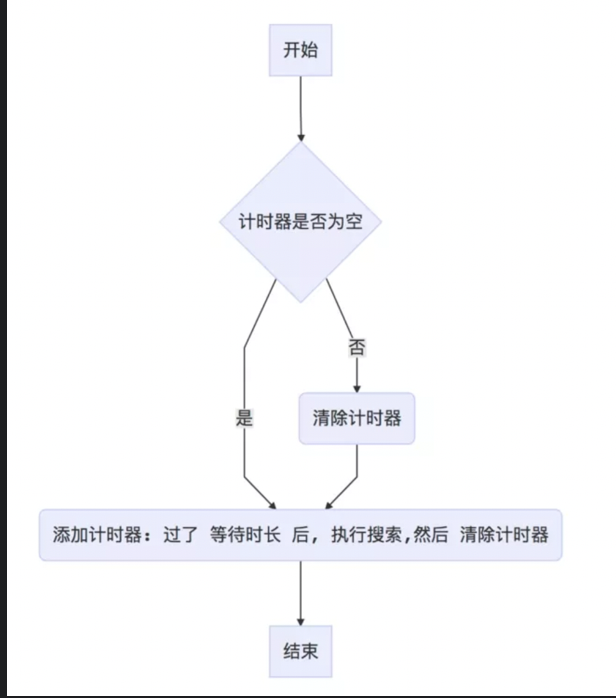

[TOC]
## css布局实现
### 1. 两栏布局
>要求：垂直两栏，左边固定右边自适应。
```html
<!DOCTYPE html>
<html lang="en">
<head>
    <meta charset="UTF-8">
    <meta name="viewport" content="width=device-width, initial-scale=1.0">
    <meta http-equiv="X-UA-Compatible" content="ie=edge">
    <title>flex实现左定宽右自适应</title>
    <style>
        .container {
            display: flex;
            height: 300px;
        }
        .left {
            background: red;
            flex: 0 0 200px;
        }
        .right {
            background: blue;
            flex: 1 1 auto;
        }
    </style>
</head>
<body>
    <!-- 左右两栏，左边固定，右边自适应 -->
    <div class="container">
        <div class="left">左边</div>
        <div class="right">右边</div>
    </div>
</body>
</html>
```
```html
<!DOCTYPE html>
<html lang="en">
<head>
    <meta charset="UTF-8">
    <meta name="viewport" content="width=device-width, initial-scale=1.0">
    <meta http-equiv="X-UA-Compatible" content="ie=edge">
    <title>浮动实现</title>
    <style>
        .box > div {
            height: 300px;
        }
        .left {
            width: 200px;
            float: left;
            background-color: brown;
        }
        .right {
            margin-left: 200px;
            background-color: aquamarine;
        }
    </style>
</head>
<body>
    <div class="box">
        <div class="left">left</div>
        <div class="right">right</div>
    </div>
</body>
</html>
```
```html
<!DOCTYPE html>
<html lang="en">
<head>
    <meta charset="UTF-8">
    <meta name="viewport" content="width=device-width, initial-scale=1.0">
    <meta http-equiv="X-UA-Compatible" content="ie=edge">
    <title>绝对定位实现</title>
    <style>
        .box {
            height: 300px;
            position: relative;
        }
        .left, .right {
            height: 100%;
        }
        .left {
            width: 200px;
            background-color: bisque;
        }
        .right {
            position: absolute;
            left: 200px;
            top: 0;
            right: 0;
            width: calc(100% - 200px);
            background-color: aquamarine;
        }
    </style>
</head>
<body>
    <div class="box">
        <div class="left">left</div>
        <div class="right">right</div>
    </div>
</body>
</html>
```
```html
<!DOCTYPE html>
<html lang="en">
<head>
    <meta charset="UTF-8">
    <meta name="viewport" content="width=device-width, initial-scale=1.0">
    <meta http-equiv="X-UA-Compatible" content="ie=edge">
    <title>绝对定位实现2</title>
    <style>
        .box {
            height: 300px;
            position: relative;
        }
        .left, .right {
            height: 100%;
        }
        .left {
            width: 200px;
            background-color: blanchedalmond;
            position: absolute;
        }
        .right {
            margin-left: 200px;
            background-color: aquamarine;
        }
    </style>
</head>
<body>
    <div class="box">
        <div class="left">left</div>
        <div class="right">right</div>
    </div>
</body>
</html>
```
### 2. 三栏布局
>要求：垂直三栏布局，左右两栏宽度固定，中间自适应。
```html
<!DOCTYPE html>
<html lang="en">
<head>
    <meta charset="UTF-8">
    <meta name="viewport" content="width=device-width, initial-scale=1.0">
    <meta http-equiv="X-UA-Compatible" content="ie=edge">
    <title>flex实现</title>
    <style>
        .box {
            display: flex;
        }
        .box > div {
            height: 300px;
        }
        .left {
            width: 200px;
            background-color: aquamarine;
        }
        .right {
            width: 200px;
            background-color: antiquewhite;
        }
        .middle {
            background-color: brown;
            flex: 1 1 auto;
        }
    </style>
</head>
<body>
    <!-- 三栏布局 左右固定 中间自适应 -->
    <div class="box">
        <div class="left">left</div>
        <div class="middle">middle</div>
        <div class="right">right</div>
    </div>
</body>
</html>
```
```html
<!DOCTYPE html>
<html lang="en">
<head>
    <meta charset="UTF-8">
    <meta name="viewport" content="width=device-width, initial-scale=1.0">
    <meta http-equiv="X-UA-Compatible" content="ie=edge">
    <title>浮动实现</title>
    <style>
        .box > div {
            height: 300px;
        }
        .left {
            width: 200px;
            float: left;
            background-color: aquamarine;
        }
        .right {
            width: 200px;
            float: right;
            background-color: antiquewhite;
        }
        .middle {
            background-color: brown;
            margin: 0 200px;
        }
    </style>
</head>
<body>
    <!-- 三栏布局 左右固定 中间自适应 -->
    <div class="box">
        <!-- 左右盒子浮动导致父元素高度塌陷 -->
        <div class="left">left</div>
        <div class="right">right</div>
        <!-- 右栏部分要写在中间内容之前 这种实现方式要把middle这个div放到最后面。相当于先把两边的div布局好，然后中间的div嵌入进去。-->
        <div class="middle">middle</div>
    </div>
</body>
</html>
```
```html
<!DOCTYPE html>
<html lang="en">
<head>
    <meta charset="UTF-8">
    <meta name="viewport" content="width=device-width, initial-scale=1.0">
    <meta http-equiv="X-UA-Compatible" content="ie=edge">
    <title>绝对定位实现</title>
    <style>
        .box {
            position: relative;
        }
        .box > div {
            height: 300px;
        }
        .left {
            position: absolute;
            width: 200px;
            background-color: aquamarine;
        }
        .right {
            width: 200px;
            position: absolute;
            right: 0;
            top: 0;
            background-color: bisque;
        }
        .middle {
            margin: 0 200px;
            background-color: blueviolet;
        }
    </style>
</head>
<body>
    <!-- 三栏布局 左右固定 中间自适应 -->
    <div class="box">
        <div class="left">left</div>
        <div class="middle">middle</div>
        <div class="right">right</div>
    </div>
</body>
</html>
```
### 3. 圣杯布局和双飞翼布局
#### flex实现圣杯布局
用flex来实现圣杯布局特别简单。
```html
<!DOCTYPE html>
<html lang="en">
<head>
    <meta charset="UTF-8">
    <meta name="viewport" content="width=device-width, initial-scale=1.0">
    <meta http-equiv="X-UA-Compatible" content="ie=edge">
    <title>flex圣杯布局</title>
    <style>
        html, body {
            height: 100%;
            overflow: hidden; /*默认显示一屏*/
            margin: 0;
            padding: 0;
        }
        .container {
            height: 100%;
            display: flex;
            flex-direction: column;
        }
        header {
            background-color: aqua;
            flex: 0 0 50px;
            text-align: center;
            line-height: 50px;
        }
        footer {
            background-color: blueviolet;
            flex: 0 0 50px;
        }
        section {
            background-color: blanchedalmond;
            flex: auto;
            display: flex;
        }
        .left {
            background-color: aquamarine;
            flex: 0 0 200px;
        }
        .right {
            background-color: blue;
            flex: 0 0 200px;
        }
        .center {
            background-color: brown;
            flex: auto;
        }
    </style>
</head>
<body>
    <div class="container">
        <header>头部</header>
        <section>
            <div class="left">left</div>
            <div class="center">center</div>
            <div class="right">right</div>
        </section>
        <footer>底部</footer>
    </div>
</body>
</html>
```
#### 绝对定位实现圣杯布局
```html
<!DOCTYPE html>
<html lang="en">
<head>
    <meta charset="UTF-8">
    <meta name="viewport" content="width=device-width, initial-scale=1.0">
    <meta http-equiv="X-UA-Compatible" content="ie=edge">
    <title>绝对定位实现圣杯布局</title>
    <style>
        html, body {
            height: 100%;
            overflow: hidden;
            margin: 0;
            padding: 0;
        }
        .container {
            position: relative;
        }
        .center {
            background-color: aquamarine;
            height: 400px;
            margin: 0 200px;
        }
        .left, .right {
            width: 200px;
            height: 400px;
            position: absolute;
            top: 0;
        }
        .left {
            background-color: blue;
            left: 0;
        }
        .right {
            background-color: brown;
            right: 0;
        }
    </style>
</head>
<body>
    <div class="container">
        <div class="left">左边</div>
        <div class="center">中间</div>
        <div class="right">右边</div>
    </div>
</body>
</html>
```
#### 浮动实现圣杯布局
```html
<!DOCTYPE html>
<html lang="en">
<head>
    <meta charset="UTF-8">
    <meta name="viewport" content="width=device-width, initial-scale=1.0">
    <meta http-equiv="X-UA-Compatible" content="ie=edge">
    <title>浮动-圣杯布局</title>
    <style>
        html, body {
            height: 100%;
            overflow: hidden; /* 默认显示一屏 */
            margin: 0;
            padding: 0;
        }
        header, footer {
            height: 50px;
            background-color: yellow;
            text-align: center;
            line-height: 50px;
        }
        .container {
            padding: 0 200px;
            overflow: hidden; /*触发BFC，清除浮动*/
        }
        .center, .left, .right {
            float: left;
        }
        .left, .right {
            width: 200px;
            height: 400px;
        }
        .center {
            width: 100%;
            background-color: aquamarine;
            height: 400px;
        }
        .left {
            background-color: blueviolet;
            margin-left: -100%;
            position: relative;
            left: -200px;
        }
        .right {
            background-color: red;
            margin-left: -200px;
            position: relative;
            left: 200px;
        }
    </style>
</head>
<body>
    <header>头部</header>
    <section class="container">
        <div class="center">中</div>
        <div class="left">左</div>
        <div class="right">右</div>
    </section>
    <footer>底部</footer>
</body>
</html>
```
思路：
1. 在html中，先定义好header和footer的样式，使之横向撑满；
2. 在container中的三列设为浮动，center要放在最前面；
3. 三列的左右两列分别定宽200px和200px，中间部分center设置100%撑满；
4. 这样因为浮动的关系，center会占据整个container，左右两块区域被挤下去了；
5. 接下来设置left的 margin-left: -100%;，让left回到上一行最左侧；
6. 但这会**把center给遮住了**，所以这时给外层的container设置`padding: 0 200px;`，给left空出位置；
7. 这时left并没有在最左侧，给left盒子设置相对定位和`left: -200px;`，把left拉回最左侧；
8. 同样的，对于right区域，设置`margin-left: -200px;`，把right拉回第一行；
9. 这时右侧空出了200px的空间，所以最后给给right盒子设置相对定位和`right: -220px;`把right区域拉到最右侧就行了。
#### 浮动实现双飞翼
```html
<!DOCTYPE html>
<html lang="en">
<head>
    <meta charset="UTF-8">
    <meta name="viewport" content="width=device-width, initial-scale=1.0">
    <meta http-equiv="X-UA-Compatible" content="ie=edge">
    <title>浮动实现双飞翼</title>
    <style>
        html, body {
            height: 100%;
            overflow: hidden;
            margin: 0;
            padding: 0;
        }
        .container, .left, .right {
            float: left;
        }
        .container {
            width: 100%;
        }
        .container .center {
            height: 400px;
            background-color: aquamarine;
            margin: 0 200px;
        }
        .left, .right {
            width: 200px;
            height: 400px;
        }
        .left {
            background-color: blueviolet;
            margin-left: -100%;
        }
        .right {
            background-color: brown;
            margin-left: -200px;
        }
    </style>
</head>
<body>
    <!-- 双飞翼布局 center 最先且 多包一层 div -->
    <div class="container">
        <div class="center">中</div>
    </div>
    <div class="left">左</div>
    <div class="right">右</div>
</body>
</html>
```
### 4. 实现一个三角形
```html
<!DOCTYPE html>
<html lang="en">
<head>
    <meta charset="UTF-8">
    <meta name="viewport" content="width=device-width, initial-scale=1.0">
    <meta http-equiv="X-UA-Compatible" content="ie=edge">
    <title>实现一个三角形</title>
    <style>
        div{
            width: 0;
            height: 0;
            border: 100px solid;
            margin-bottom: 10px;
        }
        .box {
            border-color: transparent transparent greenyellow transparent; /*等腰直角*/
        }
        .box2 {
            border-color: transparent transparent greenyellow green; /*等腰直角*/
        }
        .box3 {
            border-width: 100px 80px;
            border-color: transparent transparent yellow transparent; /*等腰三角形*/
        }
        .box4 {
            border-width: 100px 173px; /*173由勾股定理计算得来*/
            border-color: greenyellow yellow greenyellow red; /*等边三角形*/
        }
        .box5 {
            border-width: 100px 90px 80px 70px;
            border-color: transparent transparent yellow transparent; /*其它三角形*/
        }
    </style>
</head>
<body>
    <!-- 通过border实现 -->
    <div class="box"></div>
    <div class="box2"></div>
    <div class="box3"></div>
    <div class="box4"></div>
    <div class="box5"></div>
</body>
</html>
```
### 5. 实现正方形
使用css实现一个宽高自适应的正方形：
```html
<!DOCTYPE html>
<html lang="en">
<head>
    <meta charset="UTF-8">
    <meta name="viewport" content="width=device-width, initial-scale=1.0">
    <meta http-equiv="X-UA-Compatible" content="ie=edge">
    <title>正方形</title>
    <style>
        div {
            margin-bottom: 10px;
        }
        /* 都是像对于屏幕宽度的比例 */
        .square1 {
            width: 10%;
            height: 10vw;
            background-color: aquamarine;
        }
        /* margin/padding 百分比是相对父元素 width 的 */
        .square2 {
            width: 20%;
            height: 0;
            padding-top: 20%;
            background-color: blueviolet;
        }
        /* 通过子元素 margin */
        .square3 {
            width: 30%;
            overflow: hidden; /* 触发 BFC */
            background-color: brown;
        }
        .square3::after { /* 高度相对于 square3 的 width */
            content: '';
            display: block;
            margin-top: 100%;
        }
    </style>
</head>
<body>
    <div class="square1">square1</div>
    <div class="square2"></div>
    <div class="square3"></div>
</body>
</html>
```
### 6. 画一个扇形
```html
<!DOCTYPE html>
<html lang="en">
<head>
    <meta charset="UTF-8">
    <meta name="viewport" content="width=device-width, initial-scale=1.0">
    <meta http-equiv="X-UA-Compatible" content="ie=edge">
    <title>画一个扇形</title>
    <style>
        div {
            margin-bottom: 10px;
        }
        /* 通过 border 和 border-radius 实现 1/4 圆 */
        .sector1 {
            width: 0;
            height: 0;
            border: 100px solid;
            /* border-color: aquamarine yellow yellowgreen goldenrod; */
            border-color: transparent transparent yellowgreen transparent;
            border-radius: 50%;
        }
        /* .sector2 {
            width: 200px;
            height: 200px;
            border: 100px solid;
            border-color: aquamarine yellow yellowgreen goldenrod;
            border-color: transparent transparent yellowgreen transparent;
            border-radius: 50%;
        } */
        /* 类似三角形的做法加上父元素 overflow: hidden; 也可以实现任意弧度圆 */
    .sector2 {
        height: 100px;
        width: 200px;
        border-radius: 100px 100px 0 0;
        overflow: hidden;
    }
    .sector2::after {
        content: '';
        display: block;
        height: 0;
        width: 0;
        border-style: solid;
        border-width: 100px 58px 0;
        border-color: tomato transparent;
        transform: translate(42px,0);
    }
    /* 通过子元素 rotateZ 和父元素 overflow: hidden 实现任意弧度扇形（此处是60°） */
    .sector3 {
        height: 100px;
        width: 100px;
        border-top-right-radius: 100px;
        overflow: hidden;
        /* background: gold; */
    }
    .sector3::after {
        content: '';
        display: block;
        height: 100px;
        width: 100px;
        background: tomato;
        transform: rotateZ(-30deg);
        transform-origin: left bottom;
    }
    /* 通过 skewY 实现一个60°的扇形 */
    .sector4 {
        height: 100px;
        width: 100px;
        border-top-right-radius: 100px;
        overflow: hidden;
    }
    .sector4::after {
        content: '';
        display: block;
        height: 100px;
        width: 100px;
        background: tomato;
        transform: skewY(-30deg);
        transform-origin: left bottom;
    }
    /* 通过渐变设置60°扇形 */
    .sector5 {
        height: 200px;
        width: 200px;
        background: tomato;
        border-radius: 50%;
        background-image: linear-gradient(150deg, transparent 50%, #fff 50%),
        linear-gradient(90deg, #fff 50%, transparent 50%);
    }
    </style>
</head>
<body>
    <div class="sector1"></div>
    <div class="sector2"></div>
    <div class="sector3"></div>
    <div class="sector4"></div>
    <div class="sector5"></div>
</body>
</html>
```
### 7. 实现水平垂直居中
```html
<!DOCTYPE html>
<html lang="en">
<head>
    <meta charset="UTF-8">
    <meta name="viewport" content="width=device-width, initial-scale=1.0">
    <meta http-equiv="X-UA-Compatible" content="ie=edge">
    <title>实现水平垂直居中</title>
    <style>
        .container {
            width: 500px;
            height: 500px;
            background-color: bisque;
            position: relative;
            margin-bottom: 10px;
        }
        .child {
            width: 100px;
            height: 100px;
            background-color: aquamarine;
        }
        /*flex实现*/
        .container1 {
            display: flex;
            justify-content: center;
            align-items: center;
        }
        .child1 {
            width: 100px;
            height: 100px;
            background-color: aquamarine;
        }
        /*绝对定位 + transform*/
        .child2 {
            position: absolute;
            left: 50%;
            top: 50%;
            transform: translate(-50%, -50%);
        }
        /*
            绝对定位 + margin
            缺点：需要知道子盒子的长和宽
        */
        .child3 {
            position: absolute;
            left: 50%;
            top: 50%;
            /* margin-left: -50%; 这里不能用-50%，会按照父元素的宽度的50%来计算 */
            margin-left: -50px;
            margin-top: -50px;
        }
        /*绝对定位 + margin 居中*/
        .child4 {
            position: absolute;
            left: 0;
            top: 0;
            right: 0;
            bottom: 0;
            margin: auto;
        }
    </style>
</head>
<body>
    <div class="container container1">
        <div class="child child1">flex实现</div>
    </div>
    <div class="container">
        <div class="child child2">transform</div>
    </div>
    <div class="container">
        <div class="child child3">margin</div>
    </div>
    <div class="container">
        <div class="child child4">margin居中</div>
    </div>
</body>
</html>
```
### 8. 清除浮动
```html
<!DOCTYPE html>
<html lang="en">
<head>
    <meta charset="UTF-8">
    <meta name="viewport" content="width=device-width, initial-scale=1.0">
    <meta http-equiv="X-UA-Compatible" content="ie=edge">
    <title>清除浮动</title>
    <style>
        .parent {
            background-color: bisque;
            margin-bottom: 10px;
        }
        /*触发BFC*/
        .parent1 {
            overflow: hidden;
        }
        /*伪元素实现*/
        .parent2::after {
            content: '';
            display: block;
            clear: both;
        }
        .child {
            width: 100px;
            height: 100px;
            background-color: aquamarine;
            float: left;
        }
    </style>
</head>
<body>
    <div class="parent parent1">
        <div class="child"></div>
    </div>
    <div class="parent parent2">
            <div class="child"></div>
        </div>
</body>
</html>
```
### 9. 实现一个对话框
```html
<!DOCTYPE html>
<html lang="en">
<head>
    <meta charset="UTF-8">
    <meta name="viewport" content="width=device-width, initial-scale=1.0">
    <meta http-equiv="X-UA-Compatible" content="ie=edge">
    <title>弹出框</title>
    <style>
        html, body {
            height: 100%;
            margin: 0;
            padding: 0;
        }
        .bg {
            height: 100%;
            background-color: aquamarine;
            font-size: 60px;
            text-align: center;
        }
        .dialog {
            position: fixed;
            z-index: 999;
            background: rgba(0, 0, 0, 0.5);
            top: 0;
            bottom: 0;
            right: 0;
            left: 0;
            display: flex;
            justify-content: center;
            align-items: center;
        }
        .dialog .content {
            background-color: #fff;
            width: 500px;
            min-height: 300px;
            border-radius: 10px;
            border: 1px solid #ebeef5;
            box-shadow: 0 2px 12px 0 rgba(0, 0, 0, .1);
        }
    </style>
</head>
<body>
    <div class="bg">页面内容呢</div>
    <div class="dialog">
        <div class="content">这里是对话框</div>
    </div>
</body>
</html>
```
### 10. 导航栏实现
```html
<!DOCTYPE html>
<html lang="en">
<head>
    <meta charset="UTF-8">
    <meta name="viewport" content="width=device-width, initial-scale=1.0">
    <meta http-equiv="X-UA-Compatible" content="ie=edge">
    <title>水平滚动导航栏</title>
    <style>
        html, body {
            margin: 0;
            padding: 0;
        }
        /* .nav {
            display: flex;
            padding: 3px;
            border: 1px solid #000;
            overflow-x: auto;
        }
        .item {
            height: 30px;
            flex: 0 0 200px;
            background: gray;
            margin-right: 5px;
            text-align: center;
            line-height: 30px;
        } */
        .nav {
            width: auto;
            height: 30px;
            padding: 3px;
            border: 1px solid #000;
            overflow-x: auto;
            white-space: nowrap;
        }
        .nav::-webkit-scrollbar {
            display: none;
        }
        .item {
            display: inline-block;
            width: 200px;
            height: 30px;
            margin-right: 5px;
            background: gray;
        }
    </style>
</head>
<body>
    <div class="nav">
        <div class="item">item1</div>
        <div class="item">item2</div>
        <div class="item">item3</div>
        <div class="item">item4</div>
        <div class="item">item5</div>
        <div class="item">item6</div>
        <div class="item">item7</div>
        <div class="item">item8</div>
        <div class="item">item9</div>
    </div>
</body>
</html>
```
## js手写代码
### 1. Object.create实现
Object.create(obj)基本原理：接收一个obj对象，然后创建一个空对象，让空对象的`__proto__`指向obj，最终返回这个空对象。
实现思路：
1. 接收一个要作为原型的对象；
2. 返回一个原型指向该对象的空对象
```js
Object.create = function(obj) {
    let o = {};
    // 理论上是可以的，但是__proto__在ie中不支持
    o.__proto__ = obj;
    return o;
}
```
Object.create()方法创建一个新对象，使用现有的对象来提供新创建的对象的__proto__。
```js
// 模拟Object.create
Object.create = function(proto) {
    function Fn() {};
    Fn.prototype = proto;
    // new Fn()就是一个空对象，因为没有任何私有属性和方法
    return new Fn();
}
```
### 2. new操作符实现
new操作符做了什么：
1. 创建了一个全新的对象。
2. 这个对象会被执行`[[Prototype]]`(也就是`__proto__`)链接。
3. 使得this指向新创建的对象。
4. 通过new创建的每个对象将最终被`[[Prototype]]`链接到这个函数的prototype对象上。
5. 如果函数没有返回对象类型Object(包含Functoin，Array，Date，RegExg，Error)，那么new表达式中的函数调用会自动返回这个新的对象。

步骤：
1. 新建一个对象
2. 将新建对象的原型指向构造函数的原型
3. 获取构造函数参数并执行构造函数获取其结果
4. 根据构造函数执行结果返回对应的对象

```js
function myNewOperator (ctor) {
    if (typeof ctor !== 'function') {
        throw new Error('newOperator function the first param must be a function');
    }
    // new.target是指向构造函数的
    myNewOperator.target = ctor;
    // 新建一个对象，并指向构造函数原型
    const newObj = Object.create(ctor.prototype);
    const args = Array.prototype.slice.call(arguments, 1);
    // 获取构造函数的结果
    const res = ctor.call(newObj, ...args);
    // 判断构造函数返回结果是否为函数或者对象类型
    // 返回基本数据类型的时不受影响
    const isObject = typeof res === 'object' && res !== null;
    const isFunction = typeof res === 'function';
    // 构造函数结果为函数或者对象类型，直接返回该结果
    if (isObject || isFunction) {
        return res;
    }
    // 否则返回新建的实例对象
    return newObj;
}

// 测试
function Person(name, age) {
    this.name = name;
    this.age = age;
    // return 123;
    // return {};
}

const p = myNewOperator(Person, 'lisi', 12);
console.log(p); // Person { name: 'lisi', age: 12 }
```
```js
function myNew(fn, ...args) {
    if (typeof fn !== 'function') {
        throw new Error('newOperator function the first param must be a function');
    }
    myNew.target = fn;
    const obj = Object.create(fn.prototype);
    const res = fn.call(obj, ...args);
    // 如果构造函数返回函数或者对象，则返回对应的函数或者对象，而不是返回新创建的obj
    if ((typeof res !== null) && (typeof res === 'object' || typeof res === 'function')) {
        return res;
    }
    return obj;
}

function Person(name, age) {
    this.name = name;
    this.age = age;
    // return {name: '111'};
    // return function() {console.log(123)};
}

// const p = new Person('lisi', 12);
// console.log(p);

const p = myNew(Person, 'wangwu', 12);
console.log(p);
```
[具体参考-JavaScript深入之new的模拟实现](https://juejin.im/post/590a99015c497d005852cf26)
### js继承实现
```js
// 参考 You Dont Know JavaScript 上卷
// 基类
function Base() {
}
// 派生类
function Derived() {
    Base.call(this);
}
// 将派生类的原型的原型链挂在基类的原型上
Object.setPrototypeOf(Derived.prototype, Base.prototype);
```
### 实现instanceOf
instanceOf的作用：判断一个对象是不是某个类型的实例。其原理就是通过原型链查找，一直向上查找左侧(实例对象)的隐式原型`__ptoto__`是否等于右侧(构造函数)的显式原型，原型链的尽头是null，没找到就返回false。
```js
/**
 * 模拟实现instanceof
 * @param {*} left 实例对象(取隐式原型)
 * @param {*} right 构造函数(取显示原型)
 */
function myInstanceof(left, right) {
    let proto = left.__proto__;
    const prototype = right.prototype;
    while(true) {
        if (proto === null) return false;
        if (proto === prototype) return true;
        proto = proto.__proto__;
    }
}

class Person {
    constructor(name) {
        this.name = name;
    }
    sayName() {
        console.log(this.name);
    }
}
const p = new Person('lisi');
console.log(p instanceof Person); // true
console.log(p instanceof Object); // true
console.log(myInstanceof(p, Person)); // true
console.log(myInstanceof(p, Object)); // true
```
更好的写法：使用getInstanceof方法代替`__proto__`。采用`Object.getPrototypeOf`的写法：
```js
function myInstanceof(left, right) {
    let proto = Object.getPrototypeOf(left);
    let prototype = right.prototype;
    while (true) {
        if (proto === null) return false;
        if (proto === prototype) return true;
        proto = Object.getPrototypeOf(proto);
    }
}
```
### 实现call/apply/bind
1. 三者都可以改变函数的this对象指向。
2. 三者第一个参数都是this要指向的对象，如果没有这个参数，默认指向全局window。
3. 三者都可以传参，但是apply是数组，而call是单个参数有顺序的传入。
4. bind是返回对应函数，便于稍后调用；apply和call都是立即执行，返回对应函数的执行结果。
#### call
call做了什么：
* 将函数设为对象(this上下文)的属性
* 执行&删除这个函数
* 指定this到函数并传人给定参数执行函数
* 如果不传入参数，默认指向为window
```js
// context为绑定的this指向
// args是参数集合
Function.prototype.myCall = (context, ...args) => {
    if (typeof this !== 'function') {
        throw new TypeError('call must be called on a function');
    }
    context = context || window;
    context.fn = this;
    const res = context.fn(...args);
    delete context.fn;
    return res;
};
```
```js
// 实现call方法
Function.prototype.myCall = function(context) {
    if (typeof this !== 'function') {
        // 调用call的如果不是函数则报错
        throw TypeError('not a function');
    }
    // 当call的第一个参数不存在或者为null，this指向window
    context = context || window;
    // 给context添加一个属性(将函数设为对象(this上下文)的属性)
    // getInfo.call(obj, 'lisi', 22) => obj.fn = getInfo
    context.fn = this;
    // 获取context后面参数
    const args = [...arguments].slice(1); // ['lisi', 22]
    const result = context.fn(...args);
    // 删除属性fn
    delete context.fn;
    return result;
}

// 验证
const obj = {
    name: 'lisi',
    age: 22
};

function getInfo() {
    console.log(this.name + '--' + this.age);
}

getInfo.myCall(obj);
```
#### apply
```js
Function.prototype.myApply = (context, args) => {
    if (typeof this !== 'function') {
        throw new TypeError('apply must be called on a function');
    }
    context = context || window;
    context.fn = this;
    let res;
    // 兼容不传递参数的情况
    if (args && args.length) {
        res = context.fn(...args);
    } else {
        res = context.fn();
    }
    delete context.fn;
    return res;
};
```
```js
// 实现apply方法
Function.prototype.myApply = function(context) {
    if (typeof this !== 'function') {
        throw TypeError('not a function');
    }
    context = context || window;
    context.fn = this;
    let result;
    // 判断是否存在第二个参数，如果存在，则第二个参数展开
    if (arguments[1]) {
        result = context.fn(...arguments[1]);
    } else {
        result = context.fn();
    }
    delete context.fn;
    return result;
}


const obj = {
    name: 'lisi',
    age: 22
};

function getInfo() {
    console.log(this.name + '--' + this.age);
}

getInfo.myApply(obj, [1, 2, 3]);
```
#### bind
由此我们可以首先得出bind函数的两个特点：

1. 返回一个函数
2. 可以传入参数

实现bind要做什么？
* 返回一个函数，绑定this，传递预置参数。
* bind返回的函数可以作为构造函数使用。特别注意：作为构造函数时，提供的this值会被忽略，但是传入的参数依然有效。

bind实现：
* 箭头函数的this永远指向它所在的作用域
* 函数作为构造函数用new关键字调用时，不应该改变其this指向，因为new绑定的优先级高于显示绑定和硬绑定

```js
Function.prototype.myBind = function(context, ...bindArgs) {
    if (typeof this !== 'function') {
        throw new TypeError('bind must be called on a function');
    }
    const self = this; // 获取绑定函数
    const fNOP = function() {};
    const fBound = function(...args) {
        const allArgs = [...bindArgs, ...args];
        return self.apply(this instanceof fBound ? this : context, allArgs);
    };
    fNOP.prototype = self.prototype;
    fBound.prototype = new fNOP(); // 将返回函数的原型指向绑定函数的原型，使得实例对象可以访问原型上的属性
    return fBound;
};
```
```js
Function.prototype.myBind = function(context) {
    if (typeof this !== 'function') {
        throw new TypeError('Bind must be called on a function');
    }
     // 获取除context之外的其它参数
    const args = Array.prototype.slice.call(arguments, 1),
    // 调用bind的函数
    self = this,
    fNOP = function() {},
    fBound = function() {
        // 获取fBound调用时的参数
        const bindArgs = Array.prototype.slice.call(arguments);
        // this instanceof fBound为true时表示fBound被当做构造函数调用了
        // 当作为构造函数时，this指向实例，self指向绑定函数，因为下面一句`fBound.prototype = this.prototype;`，已经修改了fBound.prototype为绑定函数的prototype，此时结果为true，当结果为true的时候，this指向实例。
        // 当作为普通函数时，this指向window，self指向绑定函数，此时结果为false，当结果为false的时候，this指向绑定的 context。
        return self.apply(this instanceof fBound
               ? this : context,
               args.concat(bindArgs) // 将fBound的参数和args进行结合
        );
    };
    // 修改返回函数的prototype为绑定函数的prototype，实例就可以继承函数原型中的值
    fNOP.prototype = this.prototype;
    fBound.prototype = new fNOP();
    // 上面的一行代码使fBound.prototype是fNOP的实例
    // 因此，返回的fBound函数若作为构造函数调用，new生成的新对象作为this传入fBound，新对象的__proto__就是fNOP的实例
    return fBound;
}
```
需要注意：构造函数效果的优化实现，不直接将`fbound.prototype = this.prototype`，因为假如我们直接修改fbound.prototype的时候，也会直接修改函数的prototype。这个时候，我们可以通过一个空函数来进行中转。[具体参考-JavaScript深入之bind的模拟实现](https://juejin.im/post/59093b1fa0bb9f006517b906)
#### 应用场景
```js
// 求数组的最大值和最小值
const arr = [1, 2, 23, 34];
console.log(Math.max.apply(null, arr)); // 34
console.log(Math.min.apply(null, arr)); // 1
```
```js
// 将类数组转化为数组
const arr = Object.prototype.slice.call(arrayLike)
```
```js
// 判断变量类型
function isArray(obj) {
    return Object.prototype.toString.call(obj) === '[object Array]';
}
```
```js
// 对象冒充实现继承
function Parent(name, age) {
    this.name = name;
    this.age = age;
}

function Child(name, age) {
    Parent.call(this, name, age);
}
```
### 实现防抖函数(debounce)和节流函数(throttle)
#### 防抖函数(debounce)
防抖函数原理：在事件被触发n秒后再执行回调，如果在这n秒内又被触发，则重新计时。



```js
/*
 * 函数调用后不会被立即执行，之后连续delay时间段没有调用才会执行
 * 用法：用户输入校验
*/
function debounce(fn, delay) {
    let timer = null;
    return function(...args) {
        clearTimeout(timer); // 如果在定时器未执行期间又被调用 该定时器将被清除 并重新等待 delay 秒
        timer = setTimeout(() => {
            fn.apply(this, args);
        }, delay);
    }
}
```
```js
function debounce(fn, delay) {
  let timer = null;
  return function () {
    if (timer) clearTimeout(timer);
    timer = setTimeout(() => {
      fn.apply(this, arguments);
    }, delay);
  }
}
```
适用场景：
* 按钮提交场景：防止多次提交按钮，只执行最后提交的一次；
* 服务端验证场景：表单验证需要服务端配合，只执行一段连续的输入事件的最后一次，还有搜索联想词功能。

生存环境请用`lodash.debounce`。
#### 节流函数(throttle)
节流函数原理：规定在单位时间内，只能触发一次函数。如果这个单位时间内触发多次函数，只有一次生效。
```js
/*
 * 节流函数 限制函数在指定时间段只能被调用一次
 * 用法 比如防止用户连续执行一个耗时操作 对操作按钮点击函数进行节流处理
*/
function throttle(fn, delay) {
    let timer = null;
    return function(...args) {
        if (!timer) {
            fn(...args);
            timer = setTimeout(() => {
                timer = null;
            }, delay);
        }
    }
}
```
```js
// 节流函数
const throttle = (fn, delay = 500) => {
    let flag = true;
    return (...args) => {
        if (!flag) return;
        flag = false;
        setTimeout(() => {
            fn.apply(this, args);
        }, delay);
    };
};
```
```js
function throttle(fn, cycle) {
  let start = Date.now();
  let now;
  let timer;
  return function () {
    now = Date.now();
    clearTimeout(timer);
    if (now - start >= cycle) {
      fn.apply(this, arguments);
      start = now;
    } else {
      timer = setTimeout(() => {
        fn.apply(this, arguments);
      }, cycle);
    }
  }
}
```
适用场景：
* 拖拽场景：固定时间内只执行一次，防止超高频次触发位置变动
* 缩放场景：监控浏览器resize
* 动画场景：避免短时间内多次触发动画引起性能问题
### 手写jsonp
```js
const jsonp = ({ url, params, callbackName }) => {
  const generateURL = () => {
    let dataStr = '';
    for(let key in params) {
      dataStr += `${key}=${params[key]}&`;
    }
    dataStr += `callback=${callbackName}`;
    return `${url}?${dataStr}`;
  };
  return new Promise((resolve, reject) => {
    // 初始化回调函数名称
    callbackName = callbackName || Math.random().toString.replace(',', '');
    // 创建 script 元素并加入到当前文档中
    let scriptEle = document.createElement('script');
    scriptEle.src = generateURL();
    document.body.appendChild(scriptEle);
    // 绑定到 window 上，为了后面调用
    window[callbackName] = (data) => {
      resolve(data);
      // script 执行完了，成为无用元素，需要清除
      document.body.removeChild(scriptEle);
    }
  });
}
// 后端服务
const express = require('express')
const app = express()
app.get('/', function(req, res) {
  let { a, b, callback } = req.query
  console.log(a); // 1
  console.log(b); // 2
  // 注意哦，返回给script标签，浏览器直接把这部分字符串执行
  res.end(`${callback}('数据包')`);
})
app.listen(3000);
// 使用
jsonp({
  url: 'http://localhost:3000',
  params: {
    a: 1,
    b: 2
  }
}).then(data => {
  // 拿到数据进行处理
  console.log(data); // 数据包
})
```
```js
// 全局回调函数
// globalFn函数将会被调用并传入后台返回的数据
function globalFn(data) {
    console.log('通过jsonp获取后台数据:', data);
}

/**
 * 通过动态创建一个script标签发送一个 get 请求
 * 并利用浏览器对 <script> 不进行跨域限制的特性绕过跨域问题
 */
(function jsonp() {
    const head = document.getElementsByTagName('head')[0];
    const script = document.createElement('script');
    script.src = 'http://domain:port/testJSONP?name=lisi&age=20&callback=globalFn'; // 设置请求地址
    head.appendChild(script); // 这一步会发送请求
})();

// 后台代码
// 因为是通过script标签调用的 后台返回的相当于一个js文件
// 根据前端传入的 callback 的函数名直接调用该函数
function testJSONP(callback, name, age) {
    const data = {name, age};
    return `${callback}(${data})`;
}
```
### 手写原生ajax
```js
// Asynchronous Javascript And XML
function ajax(options) {
  // 选项
  var method = options.method || 'GET',
      params = options.params,
      data = options.data,
      url = options.url + (params ? '?' + Object.keys(params).map(key => key + '=' + params[key]).join('&') : ''),
      async = options.async === false ? false : true,
      success = options.success,
      headers = options.headers;

  var request;
  if (window.XMLHttpRequest) {
    request = new XMLHttpRequest();
  } else {
    request = new ActiveXObject('Microsoft.XMLHTTP');
  }

  request.onreadystatechange = function() {
    /**
    readyState:
      0: 请求未初始化
      1: 服务器连接已建立
      2: 请求已接收
      3: 请求处理中
      4: 请求已完成，且响应已就绪

    status: HTTP 状态码
    **/
    if (request.readyState === 4 && request.status === 200) {
      success && success(request.responseText);
    }
  }

  request.open(method, url, async);
  if (headers) {
    Object.keys(headers).forEach(key => request.setRequestHeader(key, headers[key]));
  }
  method === 'GET' ? request.send() : request.send(data);
}
// e.g.
ajax({
  method: 'GET',
  url: '...',
  success: function(res) {
    console.log('success', res);
  },
  async: true,
  params: {
    p: 'test',
    t: 666
  },
  headers: {
    'Content-Type': 'application/json'
  }
})
```
### 数组方法实现
#### reduce的实现
```js
Array.prototype.myReduce = function(cb, initialValue) {
    const {length} = this;
    let result = initialValue;
    let startIndex = 0;
    // 检查initialValue是否为undefined。如果是，则将数组的第一项设置为初始值，并将startIndex设置为1。
    if (initialValue === undefined) {
        result = this[0];
        startIndex = 1;
    }
    for (let i = startIndex; i < length; i++) {
        // 每次迭代，reduce方法都将回调函数的结果保存在累加器中，然后在下一次迭代中使用
        result = cb(result, this[i], i, this);
    }
    return result;
}

const arr = [1, 2, 3, 4, 5];
// accumulator为初始值，没有初始值的话为数组的第一个元素
const res = arr.myReduce((accumulator, currentValue, currentIndex, sourceArray) => {
    return accumulator + currentValue;
});
const res2 = arr.myReduce((accumulator, currentValue, currentIndex, sourceArray) => {
    return accumulator + currentValue;
}, 10);

console.log(res); // 15
console.log(res2); // 25
```
### 实现generator的自动执行器
```js
function func(data, cb) {
    console.log(data);
    console.log(cb); // next函数
    cb();
}

function *generatorTest() {
    let a = yield Promise.resolve(1);
    console.log(a);
    let b = yield Promise.resolve(2);
    console.log(b);
    yield func.bind(null, a + b);
}

function run(gen) {
    const g = gen();
    function next(data) {
        const result = g.next(data);
        // console.log(result);
        if (result.done) return result.value;
        // console.log(result.value);
        if (result.value instanceof Promise) {
            result.value.then(data => next(data));
        } else {
            result.value(next);
        }
    }
    next();
}

run(generatorTest);
/**
output:
1
2
3
**/
```
### 深拷贝和浅拷贝
#### 浅拷贝
```js
function simpleClone(obj) {
    var result = {};
    for (var i in obj) {
        result[i] = obj[i];
    }
    return result;
}
```
#### 深拷贝(递归拷贝)
```js
function deepClone(obj) {
    let result;
    if (typeof obj == 'object') {
        result = isArray(obj) ? [] : {}
        for (let i in obj) {
            // isObject(obj[i]) ? deepClone(obj[i]) : obj[i]
            result[i] = isObject(obj[i])||isArray(obj[i])?deepClone(obj[i]):obj[i]
        }
    } else {
        result = obj
    }
    return result
}
function isObject(obj) {
    return Object.prototype.toString.call(obj) == "[object Object]"
}
function isArray(obj) {
    return Object.prototype.toString.call(obj) == "[object Array]"
}
```
简单版：
```js
const newObj = JSON.parse(JSON.stringify(oldObj));
```
局限性 ：
1. 无法实现函数、RegExp等特殊对象的克隆
2. 会抛弃对象的constructor，所有的构造函数会指向Object
3. 对象有循环引用，会报错
### 3. 观察者模式实现
```js
class Subject {
    constructor(name) {
        this.name = name;
        this.observers = []; // 存放观察者
        this.state = '心情很美丽';
    }
    // 被观察者添加观察者的方法(观察者和被观察者建立关系)
    attach(observer) {
        this.observers.push(observer);
    }
    // 更改被观察者的状态
    setState(newState) {
        this.state = newState;
        this.notify(); // 被观察者状态发生变化时，通知观察者
    }
    notify() {
        this.observers.forEach(o => {
            o.update(this.name, this.state);
        });
    }
}

class Observer {
    constructor(name) {
        this.name = name;
    }
    update(subject, newState) {
        console.log(`${this.name}说：${subject}${newState}`);
    }
}
// 创建一个被观察者
const sub = new Subject('小公主');
// 创建两个观察者
const observer1 = new Observer('爸爸');
const observer2 = new Observer('妈妈');
// 被观察者添加观察者
sub.attach(observer1);
sub.attach(observer2);
// 被观察者更新状态，并通知观察者
sub.setState('不开心了');
```
Vue的依赖收集就是基于观察者模式(基于watcher)。观察者模式包含发布订阅模式。
### 4. 发布订阅模式实现
```js

```
#### 实现Event (event bus)
event bus既是node中各个模块的基石，又是前端组件通信的依赖手段之一，同时涉及了订阅-发布设计模式，是非常重要的基础。
简单版：
```js
class EventEmeitter {
    constructor(){
        this._events = this._events || new Map(); //储存事件/回调键值对
        this._maxListeners = this._maxListeners || 1o;//设立监听上限
    }
}

//触发名为type的事件
EventEmeitter.prototype.emit = function(type,...args){
    let hander;
    //从储存事件键值对的this._events中获取对应事件回调函数
    handler = this._events.get(type);
    if (args.length > 0) {
        hander.apply(this,args);
    }else{
        handler.call(this);
    }
    return true;
};

//监听名为type事件
EventEmeitter.prototype.addListener = function(type,fn) {
    //将type事件以及对应的fn函数放入this._events中储存
    if (!this._events.get(type)) {
        this._events.set(type,fn);
    }
};
```
[具体参考](https://juejin.im/post/5ac2fb886fb9a028b86e328c)
```js
class Events {
  constructor() {
    this._evnets = Object.create(null);
  }

  on(event, fn) {
    if (Array.isArray(event)) {
      for (let i = 0; i < event.length; i++) {
        this.on(evnet[i], fn);
      }
    } else {
      (this._evnets[event] || (this._evnets[event] = [])).push(fn);
    }
  }

  emit(event, ...args) {
    const cbs = this._evnets[event];
    if (cbs) {
      for (let i = 0; i < cbs.length; i++) {
        cbs[i].apply(this, args);
      }
    }
  }

  off(event, fn) {
    if (!arguments) {
      this._evnets = Object.create(null);
      return this;
    }
    if (Array.isArray(event)) {
      for (let i = 0; i < event.length; i++) {
        this.off(event[i], fn);
      }
      return this;
    }
    if (!fn) {
      this._evnets[event] = null;
      return this;
    }
    const cbs = this._evnets[event];
    let i = cbs.length;
    while (i--) {
      const cb = cbs[i];
      if (cb === fn || cb.fn === fn) {
        cbs.splice(i, 1);
        break;
      }
    }
    return this;
  }

  once(evnet, fn) {
    function on() {
      this.off(evnet, on);
      fn.apply(this, arguments);
    }
    on.fn = fn;
    this.on(evnet, on);
    return this;
  }
}
```
### 迭代器实现
```js
function myIterator(items) {
  let i = 0;
  return {
    next() {
      const done = i >= items.length;
      const value = !done ? items[i++] : undefined;
      return {
        done,  // 是否全部迭代完成
        value  // 返回迭代的值
      }
    }
  }
}

const interator = myIterator([1, 2, 3]);
interator.next();
interator.next();
```
### 5. 实现一个sleep函数
```js
function sleep(ms) {
    return new Promise((resolve, reject) => {
        setTimeout(resolve, ms);
    });
}
```
### 6. 判断是否为Promise对象
```js
function isPromise(p) {
  return p && typeof p.then === 'function' && typeof p.catch === 'function';
}
// 判断是否是Generator对象
function isGenerator(obj) {
  return obj && 'function' === typeof obj.next && 'function' === typeof obj.throw;
}
```
### 7. 实现(5).add(3).minus(2),使其输出结果为6
```js
/**
 * 实现(5).add(3).minus(2),使其输出结果为6
*/
// 实现一个闭包
~function() {
    // 每一个方法执行完，都要返回Number这个类的实例，这样才可以继续调用Number类原型中的方法(链式操作)
    function checkNum(n) {
        n = Number(n);
        return isNaN(n) ? 0 : n;
    }
    function add(n) {
        return this + n;
    }
    function minus(n) {
        return this - n;
    }
    ['add', 'minus'].forEach(method => {
        Number.prototype[method] = eval(method);
    });
}();

console.log((5).add(3).minus(2)); // 6
```
### 8. 数据类型判断函数实现
```js
Object.prototype.toString.call()
```
### 9. 实现简单的数组求和
```js
eval([1, 2, 3 ].join('+'))
// 或者
arr.reduce();
```
### 10. 实现简单的数组去重
基础数据结构数组：
```js
[...new Set([...])]或Array.from(new Set(array))(set返回的结构不是数组类型)
```
对象数组类型数组：
```js
// 方法：
//定义常量res，值为一个Map对象实例
const res = new Map();
//返回arr数组过滤后的结果，结果为一个数组
//过滤条件是，如果res中没有某个键，就设置这个键的值为1
return arr.filter((a) => !res.has(a) && res.set(a, 1))
// 方法2：利用reduce方法遍历数组，reduce第一个参数是遍历需要执行的函数，第二个参数是item的初始值
var obj = {};
arr = arr.reduce((item, next) => {
   obj[next.key] ? '' : obj[next.key] = true && item.push(next);
    return item;
 }, []);
```
#### map
```js
let arr = ['1', '2', '3', '1', 'a', 'b', 'b']
const unique = arr => {
    let obj = {}
    arr.map(value => {
        obj[value] = 0
    })
    return Object.keys(obj)
}
console.log(unique(arr))  // ['1','2','3','a','b']
```
#### filter
```js
let arr = ['1', '2', '3', '1', 'a', 'b', 'b']
const unique = arr => {
    return arr.filter((ele, index, array) => {
        return index === array.indexOf(ele)
    })
}
console.log(unique(arr))  // ['1','2','3','a','b']
```
#### set
```js
let arr = ['1', '2', '3', '1', 'a', 'b', 'b']
const unique = arr => {
    return [...new Set(arr)]
}
console.log(unique(arr))  // ['1','2','3','a','b']
```
### 11. 数组交集/并集/差集
① 直接使用filter、concat来计算
```js
var a = [1,2,3,4,5]
var b = [2,4,6,8,10]
//交集
var c = a.filter(function(v){ return b.indexOf(v) > -1 })
//差集
var d = a.filter(function(v){ return b.indexOf(v) == -1 })
//补集
var e = a.filter(function(v){ return !(b.indexOf(v) > -1) })
.concat(b.filter(function(v){ return !(a.indexOf(v) > -1)}))
//并集
var f = a.concat(b.filter(function(v){ return !(a.indexOf(v) > -1)}));
console.log("数组a：", a);
console.log("数组b：", b);
console.log("a与b的交集：", c);
console.log("a与b的差集：", d);
console.log("a与b的补集：", e);
console.log("a与b的并集：", f);
```
② 借助扩展运算符（...）以及 Set 的特性实现相关计算，代码也会更加简单些
```js
var a = [1,2,3,4,5]
var b = [2,4,6,8,10]
console.log("数组a：", a);
console.log("数组b：", b);
var sa = new Set(a);
var sb = new Set(b);
// 交集
let intersect = a.filter(x => sb.has(x));
// 差集
let minus = a.filter(x => !sb.has(x));
// 补集
let complement = [...a.filter(x => !sb.has(x)), ...b.filter(x => !sa.has(x))];
// 并集
let unionSet = Array.from(new Set([...a, ...b]));
console.log("a与b的交集：", intersect);
console.log("a与b的差集：", minus);
console.log("a与b的补集：", complement);
console.log("a与b的并集：", unionSet);
```
### 16. 解析URL Params为对象
```js
let url = 'http://www.domain.com/?user=anonymous&id=123&id=456&city=%E5%8C%97%E4%BA%AC&enabled';
parseParam(url)

/* 结果
{ user: 'anonymous',
  id: [ 123, 456 ], // 重复出现的 key 要组装成数组，能被转成数字的就转成数字类型
  city: '北京', // 中文需解码
  enabled: true, // 未指定值得 key 约定为 true
}
*/
```
### 17. 转化为驼峰命名
```js
var s1 = "get-element-by-id"
// 转化为 getElementById
var f = function(s) {
    return s.replace(/-\w/g,function(x) {
      return x.slice(1).toUpperCase();
    })
}
```
### 19. JSON.stringify&JSON.parse
#### JSON.stringify
JSON.stringify: 将对象转为json字符串
```js
function jsonStringify(obj) {
  const type = typeof obj;
  if (type !== 'object') {
    if (type === 'string') {
      obj = '"' + obj + '"';
    }
    return String(obj);
  } else {
    const json = [];
    const arr = Array.isArray(obj);
    for (const k in obj) {
      let v = obj[k];
      const type = typeof v;
      if (type === 'string') {
        v = '"' + v + '"';
      } else if (v === null) { // 处理null情况
        v = null
      } else if (/function|undefined/.test(type)) {
        // 原生方法会移除function和undefined，其实我们可以不移除
        delete obj[k];
      } else {
        v = jsonStringify(v); // 递归
      }
      json.push((arr ? "" : '"' + k + '":') + String(v));
    }
    return (arr ? "[" : "{") + String(json) + (arr ? "]" : "}")
  }
}

const obj = {
  a: 'a1',
  b: [1, 2, 3],
  c: 22,
  d: function () {},
  e: Date.now(),
  f: null,
  g: /str/ig,
  h: undefined
}

const str = jsonStringify(obj);
// {"a":"a1","b":[1,2,3],"c":22,"e":1562815128952,"f":null,"g":{}}
```
#### JSON.parse
JSON.parse: 将字符串格式的对象转为对象
```js
function jsonParse(str) {
  return new Function('return ' + str)(); // return后有一个空格
}

很神奇有木有，直接在字符串前面加上'return '关键字就可以转为对象。
在组件精讲小册里有一个实例，在线vue单文件编辑器。
原理就是将编辑器内的vue单文件字符串使用正则分割，
js部分将‘export default’替换为'return '。
通过new Function转为js对象使用。

const sum = new Function('a','b','return a + b');
sum(1, 2); // 3

const str = '{"a":"a1","b":[1,2,3],"c":22,"e":1562815128952,"f":null,"g":{}}';
jsonParse(str); //
a: "a1",
b: [1, 2, 3],
c: 22,
e: 1562815128952,
f: null,
g: {}
```
### 20. setInterval实现
```js
function mySetInterval(fn, interval) {
  const now = Date.now;
  let startTime = now();
  const loop = () => {
    const timer = requestAnimationFrame(loop);
    if (now() - startTime >= interval) {
      startTime = now();
      fn(timer);
    }
  }
  loop();
}
/*
一般来说是不建议使用setInterval的，如内部函数复杂就不能保证一定在规定时间内自动执行。
一般是通过setTimeout模仿setInterval。
那为什么要实现setInterval？
因为它内部的实现是使用requestAnimationFrame实现的，
该方法自带函数节流。
如有持续的动画需要执行，
基本会保证在16.6毫秒内执行一次，
提高动画性能并延时也是精确的。
*/

mySetInterval(timer => {
  console.log('a');
  // cancelAnimationFram(timer) 可以取消当前定时器
})
```
### 21. 实现printf函数
主要考察replace函数和正则表达式：[js replace方法第二个参数，远不止你想的那么强大](https://www.cnblogs.com/garfieldzhong/p/11654630.html)
```js
function printf(str, info) {
    str = str.replace(/\$\{([a-z]+)\}/g, function(word) {
        // console.log(word); // ${name}或者${city}
        // console.log(arguments);
        return info[arguments[1]];
    });
    return str;
}

const str = 'My name is ${name}, I am from ${city}';
const info = {
    name: 'AaDerBrane',
    city: 'GungZhou'
};
console.log(printf(str, info));
// My name is AaDerBrane, I am from GuangZhou
```
```js
console.log(arguments);
// 输出：
[Arguments] {
  '0': '${name}',
  '1': 'name',
  '2': 11,
  '3': 'My name is ${name}, I am from ${city}' }
[Arguments] {
  '0': '${city}',
  '1': 'city',
  '2': 30,
  '3': 'My name is ${name}, I am from ${city}' }
```
- param1: 匹配到的字符串
- param2: 匹配的子字符串
- param3: 匹配到的字符串在字符串中的位置
- param4: 原始字符串

### 22. js统计一个字符串出现频率最高的字母/数字
```js
let str = 'asdfghjklaqwertyuiopiaia';
const strChar = str => {
    let string = [...str],
        maxValue = '',
        obj = {},
        max = 0;
    string.map(value => {
        obj[value] = obj[value] == undefined ? 1 : obj[value] + 1
        if (obj[value] > max) {
            max = obj[value]
            maxValue = value
        }
    })
return maxValue;
}
console.log(strChar(str))    // a
```
### 23. 翻转字符串
```js
let str = "Hello Dog";
const reverseString = str => {
    return [...str].reverse().join("");
}
console.log(reverseString(str));  // goD olleH
```
### 24. 数组中最大差值
#### map
```js
let arr = [23, 4, 5, 2, 4, 5, 6, 6, 71, -3];
const difference = arr => {
    let min = arr[0],
        max = 0;
    arr.map(value => {
        if (value < min) min = value
        if (value > max) max = value
    })
    return max - min ;
}
console.log(difference(arr))  // 74
```
#### max、min
```js
let arr = [23, 4, 5, 2, 4, 5, 6, 6, 71, -3];
const difference = arr => {
    let max = Math.max(...arr),
        min = Math.min(...arr);
    return max - min ;
}
console.log(difference(arr)) // 74
```
### 25. 不借助临时变量，进行两个整数的交换
#### 数组解构
```js
let a = 2,
    b = 3;
    [b,a] = [a,b]
    console.log(a,b)   // 3 2
```
#### 算术运算（加减）
```js
// 输入a = 2, b = 3, 输出 a = 3,b = 2
let a = 2,
    b = 3;
const swop = (a, b) => {
    b = b - a;
    a = a + b;
    b = a - b;
    return [a,b];
}
console.log(swop(2,3)) // [3,2]
```
#### 逻辑运算（异或）
```js
let a = 2,
    b = 3;
const swap = (a, b) => {
    a ^= b; // x先存x和y两者的信息
    b ^= a; // 保持x不变，利用x异或反转y的原始值使其等于x的原始值
    a ^= b; // 保持y不变，利用x异或反转y的原始值使其等于y的原始值
    return [a, b];
}
console.log(swap(2, 3)) // [3, 2]
```
### 26. 排序 (从小到大)
#### 冒泡排序
```js
let arr = [43, 32, 1, 5, 9, 22];
const sort = arr => {
    let res = []
    arr.map((v, i) => {
        for (let j = i + 1; j < arr.length; j++) {
            if (arr[i] > arr[j]) {
                [arr[i],arr[j]] = [arr[j],arr[i]]
            }
        }
    })
    return arr
}
console.log(sort(arr))  // [1, 5, 9, 22, 32, 43]
```
### 27. 数组平均数
```js
/**
 * 数组平均数
 * 使用reduce()将每个值添加到累加器，初始值为0，总和除以数组长度。
 * @param {*} arr
 * array.reduce(function(total, currentValue, currentIndex, arr), initialValue)
 * total 必需。初始值, 或者计算结束后的返回值。
 * currentValue	必需。当前元素
 * currentIndex	可选。当前元素的索引
 * arr	可选。当前元素所属的数组对象。
 */
const averge = arr => arr.reduce((total, currentValue) => total + currentValue, 0) / arr.length;

console.log(averge([1, 2, 3, 4]));
```
## 参考文档
1. [[译]非常有用的 48 个 JavaScript 代码片段，值得收藏！](https://juejin.im/entry/5a791567f265da4e8e7842a2)
2. [同学，你会手写代码吗？(https://juejin.im/post/5c9edb066fb9a05e267026dc#heading-20)
3. [22 道高频 JavaScript 手写面试题及答案](https://juejin.im/post/5d51e16d6fb9a06ae17d6bbc#heading-1)