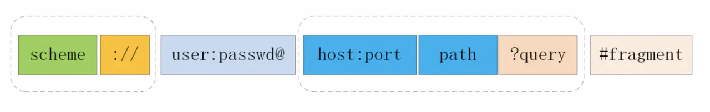

[TOC]
## 1. 什么是HTTP？概括一下HTTP的特点？HTTP有哪些缺点？
HTTP是一个连接客户端，网关和服务器的一个协议。
### HTTP协议的特点
* 灵活可扩展：主要体现在两个方面。一个是语义上的自由，只规定了基本格式，比如空格分隔单词，换行分隔字段，其他的各个部分都没有严格的语法限制。另一个是传输形式的多样性，不仅仅可以传输文本，还能传输图片、视频等任意数据，非常方便。
* 可靠传输：HTTP基于TCP/IP，因此把这一特性继承了下来。
* 请求-应答：也就是一发一收、有来有回，当然这个请求方和应答方不单单指客户端和服务器之间，如果某台服务器作为代理来连接后端的服务端，那么这台服务器也会扮演请求方的角色。
* 无状态：这里的状态是指通信过程的上下文信息，而每次 http 请求都是独立、无关的，默认不需要保留状态信息。

### HTTP 缺点
* 无状态：所谓的优点和缺点还是要分场景来看的，对于 HTTP 而言，最具争议的地方在于它的无状态。在需要长连接的场景中，需要保存大量的上下文信息，以免传输大量重复的信息，那么这时候无状态就是 http 的缺点了。但与此同时，另外一些应用仅仅只是为了获取一些数据，不需要保存连接上下文信息，无状态反而减少了网络开销，成为了 http 的优点。
* 明文传输：即协议里的报文(主要指的是头部)不使用二进制数据，而是文本形式。这当然对于调试提供了便利，但同时也让 HTTP 的报文信息暴露给了外界，给攻击者也提供了便利。WIFI陷阱就是利用 HTTP 明文传输的缺点，诱导你连上热点，然后疯狂抓你所有的流量，从而拿到你的敏感信息。
* 队头阻塞问题：当http开启长连接时，共用一个 TCP 连接，同一时刻只能处理一个请求，那么当前请求耗时过长的情况下，其它的请求只能处于阻塞状态，也就是著名的队头阻塞问题。
### 怎么解决无状态和无连接
* 无状态：HTTP协议本身无法解决这个状态，只有通过cookie和session将状态做贮存，常见的场景是登录状态保持；
* 无连接：可以通过自身属性Keep-Alive。
### http协议无状态中的**状态**指的是什么
【状态】的含义就是：客户端和服务器在某次会话中产生的数据

那么对应的【无状态】就意味着：这些数据不会被保留。

http 无状态无连接：
* http 协议对于事务处理没有记忆能力
* 对同一个url请求没有上下文关系
* 每次的请求都是独立的，它的执行情况和结果与前面的请求和之后的请求是无直接关系的，它不会受前面的请求应答情况直接影响，也不会直接影响后面的请求应答情况
* 服务器中没有保存客户端的状态，客户端必须每次带上自己的状态去请求服务器
## 2. HTTP报文的组成部分
请求报文：
* 请求行 (请求方法 + 请求路径 + http协议版本)
* 请求头(key + value值)
* 空行(服务端通过空行来判断下一部分不再是请求头，而当做请求体来解析)
* 请求体(数据部分)

```js
GET /user HTTP/1.1
```


响应报文：
* 状态行 (状态码 + 状态文字)--响应报文的起始行也叫做状态行
* 响应头(key + value值)
* 空行
* 响应体

```js
HTTP/1.1 200 OK
```

### 头部字段
头部字段(请求头和响应头)的格式：
* 字段名不区分大小写
* 字段名不允许出现空格，不可以出现下划线`_`
* 字段名后面必须紧接着`:`

### 空行
空行很重要，用来区分开头部和实体。

>问: 如果说在头部中间故意加一个空行会怎么样？

那么空行后的内容全部被视为实体。
### 实体
就是具体的数据了，也就是body部分。请求报文对应请求体，响应报文对应响应体。

## HTTP的部首有哪些？
>内容很多，重点看标『✨』内容

通用首部字段（General Header Fields）：请求报文和响应报文两方都会使用的首部

* Cache-Control  控制缓存 ✨
* Connection 连接管理、逐条首部 ✨
* Upgrade  升级为其他协议 ✨
* via 代理服务器的相关信息
* Wraning 错误和警告通知
* Transfor-Encoding 报文主体的传输编码格式 ✨
* Trailer 报文末端的首部一览
* Pragma 报文指令
* Date 创建报文的日期

请求首部字段（Reauest Header Fields）:客户端向服务器发送请求的报文时使用的首部

* Accept 客户端或者代理能够处理的媒体类型 ✨
* Accept-Encoding 优先可处理的编码格式
* Accept-Language 优先可处理的自然语言
* Accept-Charset 优先可以处理的字符集
* If-Match 比较实体标记（Etag） ✨
* If-None-Match 比较实体标记（ETag）与 If-Match相反 ✨
* If-Modified-Since 比较资源更新时间（Last-Modified）✨
* If-Unmodified-Since 比较资源更新时间（Last-Modified），与 If-Modified-Since相反 ✨
* If-Rnages 资源未更新时发送实体byte的范围请求
* Range 实体的字节范围请求 ✨
* Authorization web的认证信息 ✨
* Proxy-Authorization 代理服务器要求web认证信息
* Host 请求资源所在服务器 ✨
* From 用户的邮箱地址
* User-Agent 客户端程序信息 ✨
* Max-Forwrads 最大的逐跳次数
* TE 传输编码的优先级
* Referer 请求原始放的url
* Expect 期待服务器的特定行为

响应首部字段（Response Header Fields）: 从服务器向客户端响应时使用的字段

* Accept-Ranges 能接受的字节范围
* Age 推算资源创建经过时间
* Location 令客户端重定向的URI ✨
* vary  代理服务器的缓存信息
* ETag 能够表示资源唯一资源的字符串 ✨
* WWW-Authenticate 服务器要求客户端的验证信息
* Proxy-Authenticate 代理服务器要求客户端的验证信息
* Server 服务器的信息 ✨
* Retry-After 和状态码503 一起使用的首部字段，表示下次请求服务器的时间

实体首部字段（Entiy Header Fields）: 针对请求报文和响应报文的实体部分使用首部

* Allow 资源可支持http请求的方法 ✨
* Content-Language 实体的资源语言
* Content-Encoding 实体的编码格式
* Content-Length 实体的大小（字节）
* Content-Type 实体媒体类型
* Content-MD5 实体报文的摘要
* Content-Location 代替资源的uri
* Content-Rnages 实体主体的位置返回
* Last-Modified 资源最后的修改资源 ✨
* Expires 实体主体的过期资源 ✨

## 说说对Accept系列字段的了解
Accept系列字段的介绍分为四个部分: 数据格式、压缩方式、支持语言和字符集。
### 数据格式
HTTP协议支持非常多的数据格式，那么这么多格式的数据一起到达客户端，客户端怎么知道它的格式呢？

首先介绍一个标准——MIME(Multipurpose Internet Mail Extensions, 多用途互联网邮件扩展)。它首先用在电子邮件系统中，让邮件可以发任意类型的数据，这对于 HTTP 来说也是通用的。
因此，HTTP从MIME type取了一部分来标记报文body部分的数据类型，这些类型体现在Content-Type这个字段，当然这是针对于发送端而言，接收端想要收到特定类型的数据，也可以用Accept字段。

* Content-Type：服务器端使用
* Accept：客户端使用

具体而言，这两个字段的取值可以分为下面几类:

* text：text/html, text/plain, text/css 等
* image：image/gif, image/jpeg, image/png 等
* audio/video：audio/mpeg, video/mp4 等
* application：application/json, application/javascript, application/pdf, application/octet-stream
### 压缩方式
Accept：客户机通过这个头，告诉服务器，它支持哪些数据类型

浏览器通过Accept-Encoding这个头，告诉服务器，它支持的数据压缩格式。

当然一般这些数据都是会进行编码压缩的，采取什么样的压缩方式就体现在了发送方的Content-Encoding字段上， 同样的，接收什么样的压缩方式体现在了接受方的Accept-Encoding字段上。这个字段的取值有下面几种：
* gzip: 当今最流行的压缩格式
* deflate: 另外一种著名的压缩格式
* br: 一种专门为 HTTP 发明的压缩算法

```js
// 发送端
Content-Encoding: gzip
// 接收端
Accept-Encoding: gzip
```
### 支持语言(Accept-Language)
浏览器通过Accept-Language这个头，告诉服务器，它支持的语言。

对于发送方而言，还有一个Content-Language字段，在需要实现国际化的方案当中，可以用来指定支持的语言，在接受方对应的字段为Accept-Language。如:
```js
// 发送端
Content-Language: zh-CN, zh, en
// 接收端
Accept-Language: zh-CN, zh, en
```
```js
Accept-Language: zh-cn,zh;q=0.5
```
其中：zh-cn表示简体中文，zh 表示中文，q是权重系数，范围 0 =< q <= 1，q 值越大，请求越倾向于获得其“;”之前的类型表示的内容，若没有指定 q 值，则默认为1，若被赋值为0，则用于提醒服务器哪些是浏览器不接受的内容类型。
### 字符集(Accept-Charset)
浏览器通过Accept-Charset这个头，告诉服务器，它支持的编码。

字符集在接收端对应为Accept-Charset，指定可以接受的字符集，而在发送端并没有对应的Content-Charset, 而是直接放在了Content-Type中，以charset属性指定。如:
```js
// 发送端
Content-Type: text/html; charset=utf-8
// 接收端
Accept-Charset: charset=utf-8
```
## 对于定长和不定长的数据，HTTP 是怎么传输的？
### 定长包体
对于定长包体而言，发送端在传输的时候一般会带上
Content-Length,来指明包体的长度。
我们用一个nodejs服务器来模拟一下:
```js
const http = require('http');

const server = http.createServer();

server.on('request', (req, res) => {
  if(req.url === '/') {
    res.setHeader('Content-Type', 'text/plain');
    res.setHeader('Content-Length', 10);
    res.write("helloworld");
  }
})

server.listen(8081, () => {
  console.log("成功启动");
})
```
启动后访问: localhost:8081。
浏览器中显示如下:
```js
helloworld
```
这是长度正确的情况，那不正确的情况是如何处理的呢？
我们试着把这个长度设置的小一些:
```js
res.setHeader('Content-Length', 8);
```
重启服务，再次访问，现在浏览器中内容如下:
```js
hellowor
```
那后面的ld哪里去了呢？实际上在 http 的响应体中直接被截去了。
然后我们试着将这个长度设置得大一些:
```js
res.setHeader('Content-Length', 12);
```
此时浏览器显示如下:


直接无法显示了。可以看到Content-Length对于 http 传输过程起到了十分关键的作用，如果设置不当可以直接导致传输失败。
### 不定长包体
上述是针对于定长包体，那么对于不定长包体而言是如何传输的呢？
这里就必须介绍另外一个 http 头部字段了:
```js
Transfer-Encoding: chunked
```
表示分块传输数据，设置这个字段后会自动产生两个效果:
* Content-Length 字段会被忽略
* 基于长连接持续推送动态内容

我们依然以一个实际的例子来模拟分块传输，nodejs 程序如下:
```js
const http = require('http');

const server = http.createServer();

server.on('request', (req, res) => {
  if(req.url === '/') {
    res.setHeader('Content-Type', 'text/html; charset=utf8');
    res.setHeader('Content-Length', 10);
    res.setHeader('Transfer-Encoding', 'chunked');
    res.write("<p>来啦</p>");
    setTimeout(() => {
      res.write("第一次传输<br/>");
    }, 1000);
    setTimeout(() => {
      res.write("第二次传输");
      res.end()
    }, 2000);
  }
})

server.listen(8009, () => {
  console.log("成功启动");
})
```
访问效果入下:
用 telnet 抓到的响应如下:


注意，Connection: keep-alive及之前的为响应行和响应头，后面的内容为响应体，这两部分用换行符隔开。

响应体的结构比较有意思，如下所示:
```js
chunk长度(16进制的数)
第一个chunk的内容
chunk长度(16进制的数)
第二个chunk的内容
......
0

```
最后是留有有一个空行的，这一点请大家注意。
## HTTP 如何处理大文件的传输？
对于几百 M 甚至上 G 的大文件来说，如果要一口气全部传输过来显然是不现实的，会有大量的等待时间，严重影响用户体验。因此，HTTP 针对这一场景，采取了范围请求的解决方案，允许客户端仅仅请求一个资源的一部分。

### 如何支持
当然，前提是服务器要支持范围请求，要支持这个功能，就必须加上这样一个响应头:
```js
Accept-Ranges: bytes
```
用来告知客户端这边是支持范围请求的。
### Range 字段拆解
而对于客户端而言，它需要指定请求哪一部分，通过Range这个请求头字段确定，格式为bytes=x-y。接下来就来讨论一下这个 Range 的书写格式:
* 0-499表示从开始到第 499 个字节。
* 500- 表示从第 500 字节到文件终点。
* -100表示文件的最后100个字节。

服务器收到请求之后，首先验证范围是否合法，如果越界了那么返回`416`错误码，否则读取相应片段，返回`206`状态码。
同时，服务器需要添加Content-Range字段，这个字段的格式根据请求头中Range字段的不同而有所差异。

具体来说，请求单段数据和请求多段数据，响应头是不一样的。
举个例子:
```js
// 单段数据
Range: bytes=0-9
// 多段数据
Range: bytes=0-9, 30-39
```
接下来我们就分别来讨论着两种情况。
### 单段数据
对于单段数据的请求，返回的响应如下:
```js
HTTP/1.1 206 Partial Content
Content-Length: 10
Accept-Ranges: bytes
Content-Range: bytes 0-9/100

i am xxxxx
```
值得注意的是Content-Range字段，0-9表示请求的返回，100表示资源的总大小，很好理解。
### 多段数据
接下来我们看看多段请求的情况。得到的响应会是下面这个形式:
```js
HTTP/1.1 206 Partial Content
Content-Type: multipart/byteranges; boundary=00000010101
Content-Length: 189
Connection: keep-alive
Accept-Ranges: bytes


--00000010101
Content-Type: text/plain
Content-Range: bytes 0-9/96

i am xxxxx
--00000010101
Content-Type: text/plain
Content-Range: bytes 20-29/96

eex jspy e
--00000010101--
```
这个时候出现了一个非常关键的字段Content-Type: multipart/byteranges;boundary=00000010101，它代表了信息量是这样的:

* 请求一定是多段数据请求
* 响应体中的分隔符是 00000010101

因此，在响应体中各段数据之间会由这里指定的分隔符分开，而且在最后的分隔末尾添上--表示结束。
以上就是 http 针对大文件传输所采用的手段。
## 3. HTTP请求过程(从浏览器地址栏输入url到页面展示的过程)
在浏览器中输入url地址 -> 发起HTTP请求 → DNS 解析 → 三次握手 → 发送请求 → 四次挥手

### 基础版本
* 浏览器根据请求的URL交给DNS域名解析，找到真实IP，向服务器发起请求；
* 服务器交给后台处理完成后返回数据，浏览器接收文件（HTML、JS、CSS、图象等）；
* 浏览器对加载到的资源（HTML、JS、CSS等）进行语法解析，建立相应的内部数据结构（如HTML的DOM）；
* 载入解析到的资源文件，渲染页面，完成。
### 详细版
1. 在浏览器地址栏输入URL
2. 浏览器查看缓存，如果请求资源在缓存中并且新鲜，跳转到转码步骤
    1. 如果资源未缓存，发起新请求
    2. 如果已缓存，检验是否足够新鲜，足够新鲜直接提供给客户端，否则与服务器进行验证。
    3. 检验新鲜通常有两个HTTP头进行控制Expires和Cache-Control：
        * HTTP1.0提供Expires，值为一个绝对时间表示缓存新鲜日期
        * HTTP1.1增加了Cache-Control: max-age=,值为以秒为单位的最大新鲜时间
3. 浏览器解析URL获取协议，主机，端口，path
4. 浏览器组装一个HTTP（GET）请求报文
5. 浏览器获取主机ip地址，过程如下：
    1. 浏览器缓存
    2. 本机缓存
    3. hosts文件
    4. 路由器缓存
    5. ISP DNS缓存
    6. DNS递归查询（可能存在负载均衡导致每次IP不一样）
6. 打开一个socket与目标IP地址，端口建立TCP链接，三次握手如下：
    1. 客户端发送一个TCP的SYN=1，Seq=X的包到服务器端口
    2. 服务器发回SYN=1，ACK=X+1，Seq=Y的响应包
    3. 客户端发送ACK=Y+1，Seq=X+1的确认包
7. TCP链接建立后发送HTTP请求
8. 服务器接受请求并解析，将请求转发到服务程序，如虚拟主机使用HTTP Host头部判断请求的服务程序
9. 服务器检查HTTP请求头是否包含缓存验证信息如果验证缓存新鲜，返回304等对应状态码
10. 处理程序读取完整请求并准备HTTP响应，可能需要查询数据库等操作
11. 服务器将响应报文通过TCP连接发送回浏览器
12. 浏览器接收HTTP响应，然后根据情况选择关闭TCP连接或者保留重用，关闭TCP连接的四次握手如下：
    1.  主动方发送Fin=1， Ack=Z， Seq=X报文
    2.  被动方发送ACK=X+1， Seq=Z报文
    3.  被动方发送Fin=1， ACK=X， Seq=Y报文
    4.  主动方发送ACK=Y， Seq=X报文
13. 浏览器检查响应状态吗：是否为1XX，3XX， 4XX， 5XX，这些情况处理与2XX不同
14. 如果资源可缓存，进行缓存
15. 对响应进行解码（例如gzip压缩）
16. 根据资源类型决定如何处理（假设资源为HTML文档）
17. 解析HTML文档，构件DOM树，下载资源，构造CSSOM树，执行js脚本，这些操作没有严格的先后顺序，以下分别解释
18. 构建DOM树：
    1.  Tokenizing：根据HTML规范将字符流解析为标记
    2.  Lexing：词法分析将标记转换为对象并定义属性和规则
    3.  DOM construction：根据HTML标记关系将对象组成DOM树
19. 解析过程中遇到图片、样式表、js文件，启动下载
20. 构建CSSOM树：
    1.  Tokenizing：字符流转换为标记流
    2.  Node：根据标记创建节点
    3.  CSSOM：节点创建CSSOM树
21. 根据DOM树和CSSOM树构建渲染树:
    1.  从DOM树的根节点遍历所有可见节点，不可见节点包括：1）script,meta这样本身不可见的标签。2)被css隐藏的节点，如display: none
    2.  对每一个可见节点，找到恰当的CSSOM规则并应用
    3.  发布可视节点的内容和计算样式
22. js解析如下：
    1.  浏览器创建Document对象并解析HTML，将解析到的元素和文本节点添加到文档中，此时document.readystate为loading
    2.  HTML解析器遇到没有async和defer的script时，将他们添加到文档中，然后执行行内或外部脚本。这些脚本会同步执行，并且在脚本下载和执行时解析器会暂停。这样就可以用document.write()把文本插入到输入流中。同步脚本经常简单定义函数和注册事件处理程序，他们可以遍历和操作script和他们之前的文档内容
    3.  当解析器遇到设置了async属性的script时，开始下载脚本并继续解析文档。脚本会在它下载完成后尽快执行，但是解析器不会停下来等它下载。异步脚本禁止使用document.write()，它们可以访问自己script和之前的文档元素
    4.  当文档完成解析，document.readState变成interactive
    5.  所有defer脚本会按照在文档出现的顺序执行，延迟脚本能访问完整文档树，禁止使用document.write()
    6.  浏览器在Document对象上触发DOMContentLoaded事件
    7.  此时文档完全解析完成，浏览器可能还在等待如图片等内容加载，等这些内容完成载入并且所有异步脚本完成载入和执行，document.readState变为complete，window触发load事件
23. 显示页面（HTML解析过程中会逐步显示页面）

### 详细简版
1. 从浏览器接收url到开启网络请求线程（这一部分可以展开浏览器的机制以及进程与线程之间的关系）
2. 开启网络线程到发出一个完整的HTTP请求（这一部分涉及到dns查询，TCP/IP请求，五层因特网协议栈等知识）
3. 从服务器接收到请求到对应后台接收到请求（这一部分可能涉及到负载均衡，安全拦截以及后台内部的处理等等）
4. 后台和前台的HTTP交互（这一部分包括HTTP头部、响应码、报文结构、cookie等知识，可以提下静态资源的cookie优化，以及编码解码，如gzip压缩等）
5. 单独拎出来的缓存问题，HTTP的缓存（这部分包括http缓存头部，ETag，catch-control等）
6. 浏览器接收到HTTP数据包后的解析流程（解析html-词法分析然后解析成dom树、解析css生成css规则树、合并成render树，然后layout、painting渲染、复合图层的合成、GPU绘制、外链资源的处理、loaded和DOMContentLoaded等）
7. CSS的可视化格式模型（元素的渲染规则，如包含块，控制框，BFC，IFC等概念）
8. JS引擎解析过程（JS的解释阶段，预处理阶段，执行阶段生成执行上下文，VO，作用域链、回收机制等等）
9. 其它（可以拓展不同的知识模块，如跨域，web安全，hybrid模式等等内容）

## 4. TCP三次握手和四次挥手的理解
三次握手和四次挥手可以模拟成对讲机通话的过程
三次握手(客服端和服务器端都需要确认各自都可接收和发送消息）：
1. 客户端：服务器，我们可以建立连接吗
2. 服务器：可以啊，我们建立连接吧
3. 客户端：收到，我们建立连接吧

第一次握手：客户端发送一个SYN码给服务器，要求建立数据连接；
第二次握手：服务器SYN和自己处理一个SYN（标志）；叫SYN+ACK（确认包）；发送给客户端，可以建立连接
第三次握手：客户端再次发送ACK向服务器，服务器验证ACK没有问题，则建立起连接；

建立连接前，客户端和服务端需要通过握手来确认对方:

* 客户端发送 syn(同步序列编号) 请求，进入 syn_send 状态，等待确认
* 服务端接收并确认 syn 包后发送 syn+ack 包，进入 syn_recv 状态
* 客户端接收 syn+ack 包后，发送 ack 包，双方进入 established 状态


### 为什么是三次握手？两次或者四次握手呢？
四次握手的话，第四次握手是没啥作用的，有点浪费。

两次次握手：
1. 客户端：服务器，我们可以建立连接吗
2. 服务器：可以啊，我们建立连接吧

经历两次握手：客户端知道了服务器拥有接收和发送消息的能力；服务器只知道客户端拥有发送消息的能力，而不知道客户端是否拥有接收消息的能力。因此，TCP连接就变得不可靠了。这是需要三次握手的一个原因。

另外一个原因是：如果只有两次握手的话，当客户端向服务器发送建立连接请求，可能由于网络堵塞的原因，长时间没有得到服务器的响应。此时客户端就认为这次连接请求丢失了，就重新向服务器发送了一次建立连接请求(这就是所谓的超时重传以保证TCP连接的可靠性)，这一次请求得到了响应，双方成功建立了TCP连接。但是，过了一段时间，第一次请求又得到了服务器响应(之前因为被堵塞延迟了)，如果是两次握手的话，这样客户端和服务器的连接就建立起来了，服务端会一直等待客户端发送数据，而实际上客户端已经将延迟的请求作为无效请求处理了，这样就会造成服务端大量的资源浪费。

而三次握手的话，当第二次握手服务器向客户端发送确认建立连接的报文后，如果过了很久，服务器都没有收到客户端建立连接的报文即第三次握手，那么服务器就不会为客户端分配资源了，此次连接也就放弃了，也就不会再浪费服务器的资源了。

四次挥手：
客户端：我已经没什么话说了，结束通话吧
服务器：稍等，我还有最后一句话要说
服务器：我已经说完了
客户端：好的，你可以关掉对讲机了，不用回复了（然后A等待2MSL无回复，也关掉对讲机）

第一次挥手：客户端发送FIN(结束)报文，通知服务器数据已经传输完毕；
第二次挥手：服务器接收到之后，通知客户端我收到了FIN，发送ACK(确认)给客户端，数据还没有传输完成
第三次挥手：服务器已经传输完毕，再次发送FIN通知客户端，数据已经传输完毕
第四次挥手：客户端再次发送ACK,进入TIME_WAIT状态；服务器和客户端关闭连接；

客户端 -- FIN --> 服务端， FIN—WAIT
服务端 -- ACK --> 客户端， CLOSE-WAIT
服务端 -- ACK,FIN --> 客户端， LAST-ACK
客户端 -- ACK --> 服务端，CLOSED


### TCP三次握手和四次挥手，分别发了什么数据
### 为什么建立连接是三次握手，而断开连接是四次挥手呢?
建立连接的时候，服务器在LISTEN状态下，收到建立连接请求的SYN报文后，把ACK和SYN放在一个报文里发送给客户端。

而关闭连接时，服务器收到对方的FIN报文时，仅仅表示对方不再发送数据了但是还能接收数据，而服务端也未必全部数据都发送给客户端了，所以服务端可以立即关闭，也可以发送一些数据给对方后，再发送FIN报文给对方来表示同意现在关闭连接，因此，客户端ACK和FIN一般都会分开发送，从而导致多了一次。
## HTTP/1.1 如何解决 HTTP 的队头阻塞问题？
### 什么是 HTTP 队头阻塞？
我们都知道，HTTP传输是基于请求-应答的模式进行的，报文必须是一发一收，但值得注意的是，里面的任务被放在一个任务队列中串行执行，一旦队首的请求处理太慢，就会阻塞后面请求的处理。这就是所谓的HTTP队头阻塞。
### 并发连接
对于一个域名允许分配多个长连接，那么相当于增加了任务队列，不至于一个队伍的任务阻塞其它所有任务。在RFC2616规定过客户端最多并发2个连接，不过事实上在现在的浏览器标准中，这个上限要多很多，Chrome 中是6个。
但其实，即使是提高了并发连接，还是不能满足人们对性能的需求。
### 域名分片
从上述介绍中知道，一个域名可以并发6个长连接，那我就多分几个域名。
比如：a.baidu.com、b.baidu.com。

这样一来，一个baidu.com域名下可以分出非常多的二级域名，而它们都指向同样的一台服务器，能够并发的长连接数更多了，事实上也更好地解决了队头阻塞的问题。
## HTTP1.x(1.0 1.1)、2.0有什么区别？http 1.0的keep-alive功能，http的长连接功能。
长连接：HTTP1.0需要使用keep-alive参数来告知服务器建立一个长连接，而HTP1.1默认支持长连接

节约宽带：HTTP1.1支持只发送一个header信息（不带任何body信息）
host域（设置虚拟站点，也就是说，web server上的多个虚拟站点可以共享同一个ip端口：HTTP1.0没有host域

### http2
1. 采用的二进制文本传输数据，而非http1文本格式，二进制在协议的解析和扩展更好
2. 头部数据压缩：对信息头采用了HPACK进行压缩传输，节省了信息头带来的网络流量
3. 多路复用：一个连接可以并发处理多个请求
4. 服务器推送：我们对支持HTTP2.0的web server请求数据的时候，服务器会顺便把一些客户端需要的资源一起推送到客户端，免得客户端再次创建连接发送请求到服务器端获取。这种方式非常合适加载静态资源

[简单讲解一下 http2 的多路复用](https://github.com/ravencrown/noteBook/issues/16)
在HTTP/1中，每次请求都会建立一次TCP连接，也就是我们常说的3次握手4次挥手，这个过程在一次请求过程中占用了相当长的时间，即使开启了Keep-Alive ，解决了多次连接的问题，但是依然有两个效率上的问题：

* 第一个：串行的文件传输。当请求a文件时，b文件只能等待，等待a连接到服务器、服务器处理文件、服务器返回文件，这三个步骤。我们假设这三步用时都是1秒，那么a文件用时为3秒，b文件传输完成用时为6秒，依此类推。（注：此项计算有一个前提条件，就是浏览器和服务器是单通道传输）
* 第二个：连接数过多。我们假设Apache设置了最大并发数为300，因为浏览器限制，浏览器发起的最大请求数为6，也就是服务器能承载的最高并发为50，当第51个人访问时，就需要等待前面某个请求处理完成。

HTTP/2的多路复用就是为了解决上述的两个性能问题。
在HTTP/2中，有两个非常重要的概念，分别是帧（frame）和流（stream）。
帧代表着最小的数据单位，每个帧会标识出该帧属于哪个流，流也就是多个帧组成的数据流。
多路复用，就是在一个 TCP 连接中可以存在多条流。换句话说，也就是可以发送多个请求，对端可以通过帧中的标识知道属于哪个请求。通过这个技术，可以避免 HTTP 旧版本中的队头阻塞问题，极大的提高传输性能。
### HTTP请求中的keep-alive(长连接)作用
在http1.1中默认开启keep-alive。

http2的多路复用，简单来说就是在同一个TCP连接，同一时刻可以传输多个HTTP请求。
http2之前是同一个连接只能用一次，如果开启了keep-alive，虽然可以用多次，但是同一时刻只能有一个HTTP请求。

在早期的HTTP/1.0中，每次http请求都要创建一个TCP连接，而创建连接的过程需要消耗资源和时间，为了减少资源消耗，缩短响应时间，就**需要重用连接**。在后来的HTTP/1.0中以及HTTP/1.1中，引入了重用连接的机制，就是在http请求头中加入Connection: keep-alive来告诉对方这个请求响应完成后不要关闭，下一次咱们还用这个请求继续交流。协议规定HTTP/1.0如果想要保持长连接，需要在请求头中加上Connection: keep-alive。

keep-alive的优点：
* 较少的CPU和内存的使用（由于同时打开的连接的减少了）
* 允许请求和应答的HTTP管线化
* 降低拥塞控制 （TCP连接减少了）
* 减少了后续请求的延迟（无需再进行握手）
* 报告错误无需关闭TCP连接

## 6. HTTP2.0的特性？HTTP/2有哪些改进？
### HTTP2相对于HTTP1.x有什么优势和特点？
#### 二进制分帧
帧：HTTP/2数据通信的最小单位消息：指 HTTP/2 中逻辑上的 HTTP 消息。例如请求和响应等，消息由一个或多个帧组成。

流：存在于连接中的一个虚拟通道。流可以承载双向消息，每个流都有一个唯一的整数ID

HTTP/2采用二进制格式传输数据，而非 HTTP 1.x 的文本格式，二进制协议解析起来更高效。

#### 服务器推送
服务器可以额外的向客户端推送资源，而无需客户端明确的请求。

服务端可以在发送页面HTML时主动推送其它资源，而不用等到浏览器解析到相应位置，发起请求再响应。例如服务端可以主动把JS和CSS文件推送给客户端，而不需要客户端解析HTML时再发送这些请求。

服务端可以主动推送，客户端也有权利选择是否接收。如果服务端推送的资源已经被浏览器缓存过，浏览器可以通过发送RST_STREAM帧来拒收。主动推送也遵守同源策略，服务器不会随便推送第三方资源给客户端。
#### 头部压缩(Header压缩)
HTTP/1.x会在请求和响应中重复地携带不常改变的、冗长的头部数据，给网络带来额外的负担。

* HTTP/2在客户端和服务器端使用“首部表”来跟踪和存储之前发送的键－值对，对于相同的数据，不再通过每次请求和响应发送；
* 首部表在HTTP/2的连接存续期内始终存在，由客户端和服务器共同渐进地更新；
* 每个新的首部键－值对要么被追加到当前表的末尾，要么替换表中之前的值。

>你可以理解为只发送差异数据，而不是全部发送，从而减少头部的信息量


#### 多路复用
HTTP 1.x 中，如果想并发多个请求，必须使用多个 TCP 链接，且浏览器为了控制资源，还会对单个域名有6-8个的TCP链接请求限制(chrome限制为6个)。
HTTP2中：
* 同域名下**所有通信都在单个TCP连接上**完成。
* 单个TCP连接**可以承载任意数量的双向数据流**。
* 数据流以消息的形式发送，而消息又由一个或多个帧组成，多个帧之间可以乱序发送，因为根据帧首部的流标识可以重新组装

对于 HTTP/2 而言，它对于性能的提升主要在于两点:
* 头部压缩
* 多路复用

当然还有一些颠覆性的功能实现:
* 设置请求优先级
* 服务器推送

### HTTP2.0有没有最大数连接？

### HTTP/2的多路复用
[第 15 题：简单讲解一下 http2 的多路复用 ](https://github.com/Advanced-Frontend/Daily-Interview-Question/issues/14)
HTTP2采用二进制格式传输，取代了HTTP1.x的文本格式，二进制格式解析更高效。
多路复用代替了HTTP1.x的序列和阻塞机制，所有的相同域名请求都通过同一个TCP连接并发完成。在HTTP1.x中，并发多个请求需要多个TCP连接，浏览器为了控制资源会有6-8个TCP连接都限制。
HTTP2中：
* 同域名下所有通信都在单个连接上完成，消除了因多个TCP连接而带来的延时和内存消耗。
* 单个连接上可以并行交错的请求和响应，之间互不干扰。

简单版回答：
HTTP/2复用TCP连接，在一个连接里，客户端和浏览器都可以同时发送多个请求或回应，而且不用按照顺序一一对应。

举例来说，在一个TCP连接里面，服务器同时收到了A请求和B请求，于是先回应A请求，结果发现处理过程非常耗时，于是就发送A请求已经处理好的部分，接着回应B请求，完成后，再发送A请求剩下的部分。

历史原因解释：
1、HTTP/1.0版本
该版本主要缺点是：每个TCP连接只能发送一个请求。发送数据完毕，连接就关闭，如果还要请求其他资源，就必须再新建一个连接。为了解决这个问题，需要使用Connection: keep-alive这个字段。

2、HTTP/1.1 版本
该版本引入了持久连接（persistent connection），即TCP连接默认不关闭，可以被多个请求复用，**不用声明Connection: keep-alive**。还引入了管道机制（pipelining），即在同一个TCP连接里面，客户端可以同时发送多个请求。这样就进一步改进了HTTP协议的效率。

虽然1.1版允许复用TCP连接，但是同一个TCP连接里面，所有的数据通信是按次序进行的。**服务器只有处理完一个回应，才会进行下一个回应。要是前面的响应特别慢，后面就会有许多请求排队等着。这称为"队头堵塞"（Head-of-line blocking）**。
## 7. HTTP1.x和2.0有什么区别？http 1.x的keep-alive和http2.0的多路复用的区别？
1.0 协议缺陷:
* 无法复用链接，完成即断开，重新慢启动和 TCP 3次握手
* head of line blocking: 线头阻塞，导致请求之间互相影响*

1.1 改进:
* 长连接(默认 keep-alive)，复用
* host 字段指定对应的虚拟站点
* 新增功能:
    * 断点续传
    * 身份认证
    * 状态管理
    * cache缓存
        * Cache-Control
        * Expires
        * Last-Modified
        * Etag

2.0:
* 多路复用
* 二进制分帧层: 应用层和传输层之间
* 首部压缩
* 服务端推送

答案1：
* 线头阻塞（Head-of-Line Blocking），HTTP1.x虽然可以采用keep alive来解决复用TCP的问题，但是还是无法解决请求阻塞问题。
* 所谓请求阻塞意思就是一条TCP的链接在同一时间只能允许一个请求经过，这样假如后续请求想要复用这个链接就必须等到前一个完成才行。
* 之所以有这个问题就是因为HTTP1.x需要每条请求都是可是识别，按顺序发送，否则server就无法判断该相应哪个具体的请求。
* HTTP2采用多路复用是指，在同一个域名下，开启一个TCP的链接，每个请求以**stream的方式**传输，每个stream有唯一标识，链接一旦建立，后续的请求都可以**复用这个链接并且可以同时发送**，server端可以根据stream的唯一标识来相应对应的请求。

答案2：
* 在http1.1中，默认允许 connect：keep-alive但是在一个TCP里面 数据通信时按次进行，也就是说第二次请求发送要在第一次响应后进行，若第一次响应慢，则要一直阻塞。这个问题就是对头阻塞。
* 在HTTP/2.0中，在一个TCP链接中，客户端和服务器可以同时发送多个请求和响应，则避免了对头阻塞，实现了双向实时多工。在2.0中采用了数据流，对同一个请求或响应的所有数据包做了一个独一无二的标识，所以可以不用等待发送。两端会根据标识组装数据流。
## 8. HTTPS理解
* 证书(公钥)
* SSL 加密
* 端口 443

### 为什么有了HTTP为什么还要HTTPS？
https是安全版的http，因为http协议的数据都是明文进行传输的，所以对于一些敏感信息的传输就很不安全，HTTPS就是为了解决HTTP的不安全而生的。

HTTPS还是通过HTTP来传输信息，但是信息通过TLS协议进行了加密。
TLS中的加密：
* 对称加密：两边拥有相同的秘钥，两边都知道如何将密文加密解密。
* 非对称加密：有公钥私钥之分，公钥所有人都可以知道，可以将数据用公钥加密，但是将数据解密必须使用私钥解密，私钥只有分发公钥的一方才知道。

HTTPS握手过程：
* 第一步，客户端给出协议版本号、一个客户端生成的随机数（Client random），以及客户端支持的加密方法。
* 第二步，服务端确认双方使用的加密方法，并给出数字证书、以及一个服务器生成的随机数（Server random）。
* 第三步，客户端确认数字证书有效，然后生成一个新的随机数（Premaster secret），并使用数字证书中的公钥，加密这个随机数，发给服务端。
* 第四步，服务端使用自己的私钥，获取客户端发来的随机数（即Premaster secret）。
* 第五步，客户端和服务端根据约定的加密方法，使用前面的三个随机数，生成"对话密钥"（session key），用来加密接下来的整个对话过程。

### HTTP与HTTPS的区别
* HTTP的URL由`http://`起始且默认使用端口80，而HTTPS的URL由`https://`起始且默认使用端口443
* HTTP是超文本传输协议，信息是明文传输，HTTPS则是具有安全性的 SSL 加密传输协议
* HTTP的连接很简单，是无状态的，HTTPS 协议是由 SSL+HTTP 协议构建的可进行加密传输、身份认证的网络协议，比 http 协议安全
### HTTPS是如何保证安全的？
过程比较复杂，我们得先理解两个概念：

* 对称加密：即通信的双方都使用同一个秘钥进行加解密，比如特务接头的暗号，就属于对称加密
* 对称加密虽然很简单性能也好，但是无法解决首次把秘钥发给对方的问题，很容易被hacker拦截秘钥。

非对称加密：

* 私钥 + 公钥= 密钥对
* 即用私钥加密的数据,只有对应的公钥才能解密,用公钥加密的数据,只有对应的私钥才能解密
* 因为通信双方的手里都有一套自己的密钥对,通信之前双方会先把自己的公钥都先发给对方
* 然后对方再拿着这个公钥来加密数据响应给对方,等到到了对方那里,对方再用自己的私钥进行解密

非对称加密虽然安全性更高，但是带来的问题就是速度很慢，影响性能。
解决方案：

那么结合两种加密方式，将对称加密的密钥使用非对称加密的公钥进行加密，然后发送出去，接收方使用私钥进行解密得到对称加密的密钥，然后双方可以使用对称加密来进行沟通。

此时又带来一个问题，中间人问题：如果此时在客户端和服务器之间存在一个中间人，这个中间人只需要把原本双方通信互发的公钥，换成自己的公钥，这样中间人就可以轻松解密通信双方所发送的所有数据。

所以这个时候需要一个安全的第三方颁发证书（CA），证明身份的身份，防止被中间人攻击。证书中包括：签发者、证书用途、使用者公钥、使用者私钥、使用者的HASH算法、证书到期时间等

但是问题来了，如果中间人篡改了证书，那么身份证明是不是就无效了？这个证明就白买了，这个时候需要一个新的技术，数字签名。

数字签名就是用CA自带的HASH算法对证书的内容进行HASH得到一个摘要，再用CA的私钥加密，最终组成数字签名。

当别人把他的证书发过来的时候,我再用同样的Hash算法,再次生成消息摘要，然后用CA的公钥对数字签名解密,得到CA创建的消息摘要,两者一比,就知道中间有没有被人篡改了。
这个时候就能最大程度保证通信的安全了。

## 10. 常见状态码
* 1xx：指示信息状态码，服务器收到请求，需要请求者继续执行操作
  * 100：Continue 继续。客户端应继续其请求，一般在发送post请求时，已发送了http header之后服务端将返回此信息，表示确认，之后发送具体参数信息。
  * 101：Switching Protocols 切换协议。服务器根据客户端的请求切换协议。只能切换到更高级的协议，例如，切换到HTTP的新版本协议或者升级到websocket协议。在HTTP升级为WebSocket的时候，如果服务器同意变更，就会发送状态码101。
* 2xx：成功状态码，请求被成功接收并处理
  * 200：OK，表示从客户端发送的请求在服务器端被正确处理，**通常在响应体中放有数据**；
  * 201：Created，已创建。请求成功并且服务器创建了新的资源；
  * 202：Accepted，服务器已经接受请求，但尚未处理完成；
  * 204：No content，含义与200相同，但响应头不含实体部分(即没有body数据)；
  * 205：Reset Content，表示请求成功，但响应报文不含实体的主体部分，但是与204 响应不同在于要求请求方重置内容
  * 206：Partial Content，顾名思义，表示部分内容，**它的使用场景为HTTP分块下载和断点续传，当然也会带上相应的响应头字段Content-Range**。
* 3xx：重定向，资源位置发生变动，需要进一步的操作以完成请求
  * 301：Moved Permanently，永久重定向。请求的资源**已被永久的移动到新URI**，返回信息会包括新的URI，浏览器会自动定向到新URI(通过Location头)。今后任何新的请求都应使用新的URI代替。
  * 302：Found，临时性重定向。与301类似，但资源只是临时被移动。客户端应继续使用原有URI。
  * 303：See Other，临时性重定向，且总是使用 GET 请求新的 URI。查看其它地址。与301类似。使用GET和POST请求查看
  * 304：Not Modified，自从上次请求后，请求的网页未修改过。未修改。所请求的资源未修改，服务器返回此状态码时，不会返回任何资源。客户端通常会缓存访问过的资源，通过提供一个头信息指出客户端希望只返回在指定日期之后修改的资源
  * 305：Use Proxy，使用代理。所请求的资源必须通过代理访问
  * 307：Temporary Redirect，临时重定向。与302类似。使用GET请求重定向，但是期望客户端保持请求方法不变向新的地址发出请求
* 4xx：客户端错误，请求包含语法错误或无法完成请求
  * 400：bad request，客户端的请求报文存在语法错误，服务器无法理解，请求无效，出现这个请求无效报错说明**请求没有进入到后台服务里**。
    * 400的原因：
      1. 前端提交数据的字段名称或者是字段类型和后台的实体类不一致，导致无法封装；
      2. 前端提交到后台的数据应该是json字符串类型，而前端没有将对象转化为字符串类型；
     * 解决方案：
        1. 对照字段名称，类型保证一致性；
        2. 使用JSON.stringify将前端传递的对象转化为字符串`data: JSON.stringify(param)`。
   * 401：Unautorized(未授权，请求要求用户的身份认证)，表示发送的请求需要有通过HTTP认证的认证信息，需认证或认证失败；
   * 402：Payment Required，保留，将来使用
   * 403：Forbidden，表示对请求资源的访问被服务器拒绝，不允许访问资源
   * 404：Not Found，表示在服务器上没有找到请求的资源，服务器上没有请求对应的资源
   * 405：Method Not Allowed，客户端请求中的方法被禁止
   * 406：Not Acceptable，服务器无法根据客户端请求的内容特性完成请求
   * 407：Proxy Authentication Required，请求要求代理的身份认证，与401类似，但请求者应当使用代理进行授权
   * 408：Request Time-out，服务器等待客户端发送的请求时间过长，超时
   * 409：Conflict，服务器完成客户端的PUT请求时可能返回此代码，服务器处理请求时发生了冲突。当客户端试图执行一个'会导致一个或多个资源处于不一致状态'的操作时，发送此响应代码。
   * 410：用于服务器端知道客户端所请求的资源曾经存在，但现在已经不存在了的情况。
* 5xx：服务器错误，服务器在处理请求的过程中发生了错误。
  * 500：Internal Server Error，服务器内部错误，无法完成请求
  * 501：Not Implemented，服务器不支持请求的功能，无法完成请求
  * 502：Bad Gateway，作为网关或者代理工作的服务器尝试执行请求时，从远程服务器接收到了一个无效的响应
  * 503：Service Unavailable，表明服务器暂时处于超负载或正在停机维护，暂时无法处理客户端的请求，延时的长度可包含在服务器的Retry-After头信息中
  * 504：Gateway Time-out，充当网关或代理的服务器，未及时从远端服务器获取请求
  * 505：HTTP Version not supported

[常见状态码](https://www.runoob.com/http/http-status-codes.html)
### 301和302的区别
http协议中，301代表资源的永久重定向，302代表资源的临时重定向，举一个例子，很多的第三方授权，授权过后的回跳地址经常会使用301形式，改变浏览器的回跳地址。

再比如你的网站从HTTP升级到了HTTPS，以前的站点再也不用了，应当返回301，这个时候浏览器默认会做缓存优化，在下一次访问的时候自动访问重定向的那个地址。
而如果只是暂时不可用，那么直接返回302即可，和301不同的是，浏览器并不会做缓存优化。

* 301：永久重定向，浏览器会记住(即浏览器会做缓存优化)
* 302：临时重定向，浏览器并不会做缓存优化
### 同样是重定向307，303，302的区别？
* 302是http1.0的协议状态码，在http1.1版本的时候为了细化302状态码又出来了两个303和307。
* 303明确表示客户端应当采用get方法获取资源，会把POST请求变为GET请求进行重定向。
* 307会遵照浏览器标准，不会从post变为get。

### 如何通过服务器让客户端重定向？
1. statusCode：状态码设置为302临时重定向；
2. setHeader：在响应头中通过`Location`告诉客户端往哪儿重定向。

如果客户端发现收到服务器的响应的状态码是`302`就会自动去响应头中找`Location`，然后对该地址发起新的请求，所以就能看到客户端自动跳转了。
```js
res.statusCode = 302;
res.setHeader('Location', '/');
```
浏览器只要发现响应状态码是`302`，就会根据`Response Headers`中的`Location`字段去发起请求。
### 301和302的应用场景分别是什么
[Http 状态码 301 和 302 的应用场景分别是什么](https://github.com/Advanced-Frontend/Daily-Interview-Question/issues/249)
### 状态码400，bad-request请求有到了后端吗？跨域情况下请求到了后端吗？
请求没有到后端。
### 200From cache和200 ok
### 介绍下304过程
>考点：304状态码原理，last-modified，Etag那些

1. 浏览器请求资源时首先命中资源的Expires 和 Cache-Control，Expires 受限于本地时间，如果修改了本地时间，可能会造成缓存失效，可以通过Cache-control: max-age指定最大生命周期，状态仍然返回200，但不会请求数据，在浏览器中能明显看到from cache字样
2. 强缓存失效，进入协商缓存阶段，首先验证ETagETag可以保证每一个资源是唯一的，资源变化都会导致ETag变化。服务器根据客户端上送的If-None-Match值来判断是否命中缓存。
3. 协商缓存Last-Modify/If-Modify-Since阶段，客户端第一次请求资源时，服务服返回的header中会加上Last-Modify，Last-modify是一个时间标识该资源的最后修改时间。再次请求该资源时，request的请求头中会包含If-Modify-Since，该值为缓存之前返回的Last-Modify。服务器收到If-Modify-Since后，根据资源的最后修改时间判断是否命中缓存。
## 11. HTTP缓存和代理缓存
### 缓存好处
* 减少了冗余的数据传输，减少网费
* 减少服务器端的压力
* Web 缓存能够减少延迟与网络阻塞，进而减少显示某个资源所用的时间
* 加快客户端加载网页的速度

1. web缓存就是存在于客户端与服务器之间的一个副本、当你第一个发出请求后，缓存根据请求保存输出内容的副本
2. 缓存的好处
    （1）减少不必要的请求
    （2）降低服务器的压力，减少服务器的消耗
    （3）降低网络延迟，加快页面打开速度（直接读取浏览器的数据）
### HTTP缓存
>考点：强缓存和协商缓存，max-age和expires的区别，缓存有哪些？

本地缓存是指浏览器请求资源时命中了浏览器本地的缓存资源，浏览器并不会发送真正的请求给服务器了。它的执行过程是：

第一次浏览器发送请求给服务器时，此时浏览器还没有本地缓存副本，服务器返回资源给浏览器，响应码是200 OK，浏览器收到资源后，**把资源和对应的响应头一起缓存下来**。
第二次浏览器准备发送请求给服务器时候，浏览器会先检查上一次服务端返回的响应头信息中的Cache-Control，它的值是一个相对值，单位为秒，表示资源在客户端缓存的最大有效期，过期时间为第一次请求的时间加上Cache-Control的值，过期时间跟当前的请求时间比较，如果本地缓存资源没过期，那么命中缓存，不再请求服务器。
如果没有命中，浏览器就会把请求发送给服务器，进入缓存协商阶段。

与本地缓存相关的头有：Cache-Control、Expires，Cache-Control有多个可选值代表不同的意义，而Expires就是一个日期格式的绝对值。

#### Cache-Control(相对时间)
Cache-Control是HTPP缓存策略中最重要的头，它是HTTP/1.1中出现的，它由如下几个值

* no-cache：不使用本地缓存。需要使用缓存协商，先与服务器确认返回的响应是否被更改，如果之前的响应中存在ETag，那么请求的时候会与服务端验证，如果资源未被更改，则可以避免重新下载。
* no-store：直接禁止游览器缓存数据，每次用户请求该资源，都会向服务器发送一个请求，每次都会下载完整的资源。
* public：可以被所有的用户缓存，包括终端用户和CDN等中间代理服务器。
* private：只能被终端用户的浏览器缓存，不允许CDN等中继缓存服务器对其缓存。
* max-age：从当前请求开始，允许获取的响应被重用的最长时间（秒）。

例如：
```js
Cache-Control: public, max-age=1000
```
表示资源可以被所有用户以及代理服务器缓存，最长时间为1000秒。
#### Expires(绝对时间)
Expires是**HTTP/1.0**出现的头信息，同样是用于决定本地缓存策略的头，它是一个绝对时间，时间格式是如Mon, 10 Jun 2015 21:31:12 GMT，只要发送请求时间是在Expires之前，那么本地缓存始终有效，否则就会去服务器发送请求获取新的资源。如果同时出现Cache-Control：max-age和Expires，那么max-age优先级更高。他们可以这样组合使用
```js
Cache-Control: public
Expires: Wed, Jan 10 2018 00:27:04 GMT
```
#### 协商缓存
当第一次请求时服务器返回的响应头中存在以下情况时

* 没有Cache-Control和Expires
* Cache-Control和Expires过期了
* Cache-Control的属性设置为no-cache时

那么浏览器第二次请求时就会与服务器进行协商，询问浏览器中的缓存资源是不是旧版本，需不需要更新，此时，服务器就会做出判断，如果缓存和服务端资源的最新版本是一致的，那么就无需再次下载该资源，服务端直接返回304 Not Modified 状态码，如果服务器发现浏览器中的缓存已经是旧版本了，那么服务器就会把最新资源的完整内容返回给浏览器，状态码就是200 Ok，那么服务端是根据什么来判断浏览器的缓存是不是最新的呢？其实是根据HTTP的另外两组头信息，分别是：**Last-Modified/If-Modified-Since 与 ETag/If-None-Match**。

##### Last-Modified 与 If-Modified-Since
* 浏览器第一次请求资源时，服务器会把资源的最新修改时间Last-Modified:Thu, 29 Dec 2011 18:23:55 GMT放在响应头中返回给浏览器。
* 第二次请求时，浏览器就会把上一次服务器返回的修改时间放在请求头If-Modified-Since:Thu, 29 Dec 2011 18:23:55发送给服务器，服务器就会拿这个时间跟服务器上的资源的最新修改时间进行对比。

如果两者相等或者大于服务器上的最新修改时间，那么表示浏览器的缓存是有效的，此时缓存会命中，服务器就不再返回内容给浏览器了，同时Last-Modified头也不会返回，因为资源没被修改，返回了也没什么意义。如果没命中缓存则最新修改的资源连同Last-Modified头一起返回。

第一次请求返回的响应头：
```js
Cache-Control:max-age=3600
Expires: Fri, Jan 12 2018 00:27:04 GMT
Last-Modified: Wed, Jan 10 2018 00:27:04 GMT
```
第二次请求的请求头信息：
```js
If-Modified-Since: Wed, Jan 10 2018 00:27:04 GMT
```
这组头信息是基于资源的修改时间来判断资源有没有更新，另一种方式就是根据资源的内容来判断，就是接下来要讨论的ETag与If-None-Match
##### ETag与If-None-Match
ETag/If-None-Match与Last-Modified/If-Modified-Since的流程其实是类似的，唯一的区别是它基于资源的内容的摘要信息（比如MD5 hash）来判断。

浏览器发送第二次请求时，会把第一次的响应头信息ETag的值放在If-None-Match的请求头中发送到服务器，与最新的资源的摘要信息对比，如果相等，取浏览器缓存，否则内容有更新，最新的资源连同最新的摘要信息返回。用ETag的好处是如果因为某种原因到时资源的修改时间没改变，那么用ETag就能区分资源是不是有被更新。

第一次请求返回的响应头：
```js
Cache-Control: public, max-age=31536000
ETag: "15f0fff99ed5aae4edffdd6496d7131f"
```
第二次请求的请求头信息：
```js
If-None-Match: "15f0fff99ed5aae4edffdd6496d7131f"
```

按协议分为：协议层缓存和非http协议缓存：
* 协议层缓存：利用http协议头属性值设置；
* 非协议层缓存：利用 meta 标签的 http-equiv 属性值 Expires,set-cookie。
按缓存分为：强缓存和协商缓存
* 强缓存：利用 cache-control 和 expires 设置，直接返回一个过期时间，所以在缓存期间不请求，If-modify-since；
* 协商缓存：响应头返回 etag 或 last-modified 的哈希值，第二次请求头 If-none-match 或 IF-modify-since 携带上次哈希值，一致则返回 304。

#### 有了Last-Modified，为什么还要用ETag？
  1、因为如果在一秒钟之内对一个文件进行两次更改，Last-Modified就会不正确（**Last—Modified不能识别秒单位的修改**）
  2、某些服务器不能精确的得到文件的最后修改时间
  3、一些文件也行会周期新的更改，但是它的内容并不改变（仅仅改变修改的事件），这个时候我们并不希望客户端认为文件被修改，而重新Get
#### 有了ETag，为什么还要用Last-Modified？
  1、两者互补，ETag的判断的缺陷，比如一些图片等静态文件的修改
  2、如果每次扫描内容都生成ETag比较，显然要比直接比较修改时间慢的多。

ETag是被请求变量的实体值（文件的索引节，大小和最后修改的时间的Hash值）
  1、ETag的值服务器端对文件的索引节，大小和最后的修改的事件进行Hash后得到的。
### 协商缓存对比
* etag优先级高于last-modified；
* etag精度高，last-modified精度是秒，1秒内etag修改多少次都会被记录；last-modified性能好，etag要得到hash值。
### 浏览器读取缓存流程
会先判断强缓存；再判断协商缓存 etag(last-modified)是否存在；存在利用属性 If-None-match(If-Modified-since)携带值；请求服务器，服务器对比 etag(last-modified)，生效返回304。

F5刷新会忽略强缓存不会忽略协商缓存，ctrl+f5都失效。
### 代理缓存
#### 为什么需要代理缓存？
对于源服务器来说，它也是有缓存的，比如Redis, Memcache，但对于 HTTP 缓存来说，如果每次客户端缓存失效都要到源服务器获取，那给源服务器的压力是很大的。
由此引入了缓存代理的机制。让代理服务器接管一部分的服务端HTTP缓存，客户端缓存过期后就近到代理缓存中获取，代理缓存过期了才请求源服务器，这样流量巨大的时候能明显降低源服务器的压力。
那缓存代理究竟是如何做到的呢？
总的来说，缓存代理的控制分为两部分，一部分是源服务器端的控制，一部分是客户端的控制。

#### 源服务器的缓存控制
##### private 和 public
在源服务器的响应头中，会加上Cache-Control这个字段进行缓存控制字段，那么它的值当中可以加入private或者public表示是否允许代理服务器缓存，前者禁止，后者为允许。
比如对于一些非常私密的数据，如果缓存到代理服务器，别人直接访问代理就可以拿到这些数据，是非常危险的，因此对于这些数据一般是不会允许代理服务器进行缓存的，将响应头部的Cache-Control设为private，而不是public。
##### must-revalidate和proxy-revalidate
* must-revalidate的意思是客户端缓存过期就去源服务器获取。
* proxy-revalidate则表示代理服务器的缓存过期后到源服务器获取。
##### s-maxage
s是share的意思，限定了缓存在代理服务器中可以存放多久，和限制客户端缓存时间的max-age并不冲突。
讲了这几个字段，我们不妨来举个小例子，源服务器在响应头中加入这样一个字段:
```js
Cache-Control: public, max-age=1000, s-maxage=2000
```
相当于源服务器说: 我这个响应是允许代理服务器缓存的，客户端缓存过期了到代理中拿，并且在客户端的缓存时间为 1000 秒，在代理服务器中的缓存时间为 2000 s。
#### 客户端的缓存控制
##### max-stale 和 min-fresh
在客户端的请求头中，可以加入这两个字段，来对代理服务器上的缓存进行宽容和限制操作。比如：
```js
max-stale: 5
```
表示客户端到代理服务器上拿缓存的时候，即使代理缓存过期了也不要紧，只要过期时间在5秒之内，还是可以从代理中获取的。
又比如:
```js
min-fresh: 5
```
表示代理缓存需要一定的新鲜度，不要等到缓存刚好到期再拿，一定要在到期前 5 秒之前的时间拿，否则拿不到。
##### only-if-cached
这个字段加上后表示客户端只会接受代理缓存，而不会接受源服务器的响应。如果代理缓存无效，则直接返回504（Gateway Timeout）。

## 12. HTTP请求方法和用途
* HTTP1.0定义了三种请求方法： GET, POST 和 HEAD方法
* HTTP1.1新增了五种请求方法：OPTIONS, PUT, DELETE, TRACE 和 CONNECT

<hr>

* GET：通常用来服务器上的资源
* POST：向URL指定的资源提交数据或**附加新的数据**
* PUT：修改数据，跟POST方法很像，也是向服务器提交数据。但是，它们之间有不同。PUT指定了资源在服务器上的位置，而POST没有。
* DELETE：删除服务器上的资源
* HEAD：请求资源的头部信息，并且这些头部**与GET方法请求时返回的一致**。**该请求方法的一个使用场景是在下载一个大文件前先获取其大小再决定是否要下载，以此可以节约带宽资源**。
* OPTIONS(预检请求)：列出可对资源实行的请求方法，用来跨域请求。它用于获取当前URL所支持的方法，如果请求成功，会有一个Allow的头包含类似“GET,POST”这样的信息
* PATCH: 用于对资源进行部分修改
* TRACE：回显服务器收到的请求，主要用于测试或诊断
* CONNECT：建立连接隧道，用于代理服务器。把请求连接转换到透明的TCP/IP通道。

### POST和GET的区别
1. 从缓存角度，GET请求会被浏览器主动缓存下来，留下历史记录(为了防止走缓存，给url后面每次拼的参数不同；放在?后面，一般用添加时间戳的方式来避免缓存)，而POST默认不会，除非手动设置。
2. 从数据类型编码角度，GET请求只能进行url编码，只能接收ASCII字符，而POST没有限制。
3. 从传参角度
    3.1 参数位置：GET请求通过URL的query参数来传输数据；而POST将请求参数放在请求体中，更适合传输敏感信息。
    3.2 参数大小：GET请求在url中传递的参数是有长度限制的(受限于浏览器url大小，一般不超过32K)，而POST没有限制；
    3.3 参数的数据类型：对参数的数据类型，GET只接受ASCII字符，而POST没有限制。
    3.4 安全性不同：POST的数据因为在请求主体内，所以有一定的安全性保证，而GET的数据在URL中，通过历史记录，缓存很容易查到数据信息，将参数直接暴露在url上是不安全的，不能用来传递敏感信息。
4. 特性不同：GET是安全（这里的安全是指只读特性，就是使用这个方法不会引起服务器状态变化）且幂等（幂等的概念是指同一个请求方法执行多次和仅执行一次的效果完全相同），而**POST是非安全非幂**等。
5. 从TCP的角度，GET请求会把请求报文一次性发出去，而POST会分为两个TCP数据包，首先发header部分，如果服务器响应100(continue)，然后发body部分。(火狐浏览器除外，它的POST请求只发一个TCP包)
6. 从请求地址角度，GET请求产生的url地址可以被收藏，而POST不可以。
7. GET无害：刷新、后退等浏览器操作GET请求是无害的，POST可能重复提交表单
8. GET请求只能进行url编码，而POST支持多种编码方式。
9. GET请求参数会被完整保留在浏览器的历史记录里，而POST中的参数不会被保留。

[浅谈HTTP中Get与Post的区别(https://www.cnblogs.com/hyddd/archive/2009/03/31/1426026.html)
### PUT和POST都是给服务器发送新增资源，有什么区别？
* POST常用于提交数据至服务端，新建资源时使用。
* PUT常用于更新已存在的资源时使用。

PUT和POST方法的区别是：**PUT方法是幂等的**，连续调用一次或者多次的效果相同（无副作用），而POST方法是非幂等的。

除此之外还有一个区别：通常情况下，PUT的URI指向是**具体单一资源**，而POST可以指向资源集合。

举个例子，我们在开发一个博客系统，当我们要创建一篇文章的时候往往用`POST https://www.jianshu.com/articles`，这个请求的语义是，在articles的资源集合下创建一篇新的文章，**如果我们多次提交这个请求会创建多个文章，这是非幂等的**。

而PUT`https://www.jianshu.com/articles/820357430`的语义是更新对应文章下的资源（比如修改作者名称等），这个URI指向的就是单一资源，而且是幂等的，比如你把『李四』修改成『王五』，提交多少次都是修改成『王五』。

>tips: 『POST表示创建资源，PUT表示更新资源』这种说法是错误的，两个都能创建资源，根本区别就在于**幂等性**

### PUT和PATCH都是给服务器发送修改资源，有什么区别？
PUT和PATCH都是更新资源，而PATCH用来对已知资源进行**局部更新**。

比如我们有一篇文章的地址https://www.jianshu.com/articles/820357430，这篇文章的可以表示为:
```js
article = {
    author: 'lisi',
    creationDate: '2019-6-12',
    content: '我写文章',
    id: 820357430
}
```
当我们要修改文章的作者时，我们可以直接发送`PUT https://www.jianshu.com/articles/820357430`，这个时候的数据应该是:
```js
{
    author:'wangwu',
    creationDate: '2019-6-12',
    content: '我写文章',
    id: 820357430
}
```
这种**直接覆盖资源的修改方式**应该用put，但是你觉得每次都带有这么多无用的信息，那么可以发送`PATCH https://www.jianshu.com/articles/820357430`，这个时候只需要:
```js
{
    author:'wangwu'
}
```
### POST请求中有几种content-type？
[第 7 题：表单提交有哪些content-type？](https://github.com/ravencrown/noteBook/issues/22)
### HTTP中如何处理表单数据的提交
在http中，有两种主要的表单提交的方式，体现在两种不同的Content-Type取值:
* application/x-www-form-urlencoded
* multipart/form-data

由于表单提交一般是POST请求，很少考虑GET，因此这里我们将默认提交的数据放在请求体中。

对于application/x-www-form-urlencoded格式的表单内容，有以下特点:
* 其中的数据会被编码成以`&`分隔的键值对
* 字符以URL编码方式编码。

如：
```js
// 转换过程: {a: 1, b: 2} -> a=1&b=2 -> 如下(最终形式)
"a%3D1%26b%3D2"
```
对于multipart/form-data而言:

请求头中的Content-Type字段会包含boundary，且boundary的值有浏览器默认指定。例: `Content-Type: multipart/form-data;boundary=----WebkitFormBoundaryRRJKeWfHPGrS4LKe`。
数据会分为多个部分，每两个部分之间通过分隔符来分隔，每部分表述均有HTTP头部描述子包体，如Content-Type，在最后的分隔符会加上--表示结束。

相应的请求体是下面这样:
```js
Content-Disposition: form-data;name="data1";
Content-Type: text/plain
data1
----WebkitFormBoundaryRRJKeWfHPGrS4LKe
Content-Disposition: form-data;name="data2";
Content-Type: text/plain
data2
----WebkitFormBoundaryRRJKeWfHPGrS4LKe--
```
multipart/form-data 格式最大的特点在于:每一个表单元素都是独立的资源表述。另外，你可能在写业务的过程中，并没有注意到其中还有boundary的存在，如果你打开抓包工具，确实可以看到不同的表单元素被拆分开了，之所以在平时感觉不到，是以为浏览器和 HTTP 给你封装了这一系列操作。

而且，在实际的场景中，对于图片等文件的上传，基本采用multipart/form-data而不用application/x-www-form-urlencoded，因为没有必要做 URL 编码，带来巨大耗时的同时也占用了更多的空间。
## 13. 一个TCP连接上面能发多少个HTTP请求？
[具体参考](https://zhuanlan.zhihu.com/p/61423830)
## 14. 如何理解URI？
URI，全称为(Uniform Resource Identifier)，即统一资源标识符，它的作用很简单，就是区分互联网上不同的资源。

但是，它并不是我们常说的网址，网址指的是URL(Uniform Resource Locator)，即统一资源定位符，实际上URI包含了URN和URL两个部分，由于URL过于普及，就默认将URI视为URL了。
### URI 的结构
URI真正最完整的结构是这样的：


* scheme 表示协议名，比如http, https, file等等。后面必须和://连在一起。
* user:passwd@ 表示登录主机时的用户信息，不过很不安全，不推荐使用，也不常用。
* host:port表示主机名和端口。
* path表示请求路径，标记资源所在位置。
* query表示查询参数，为key=val这种形式，多个键值对之间用&隔开。
* fragment表示 URI 所定位的资源内的一个锚点，浏览器可以根据这个锚点跳转到对应的位置。

举个例子:
```js
https://www.baidu.com/s?wd=HTTP&rsv_spt=1
```
上述URI 中，https即scheme部分，www.baidu.com为host:port部分（注意，http 和 https 的默认端口分别为80、443），/s为path部分，而wd=HTTP&rsv_spt=1就是query部分。
### URI 编码
URI只能使用ASCII，**ASCII之外的字符是不支持显示的**，而且还有一部分符号是界定符，如果不加以处理就会导致解析出错。

因此，URI引入了编码机制，将所有非ASCII码字符和界定符转为十六进制字节值，然后在前面加个%。比如：空格被转义成了%20。
## 谈谈对Cookie的理解
### Cookie 简介
前面说到了 HTTP 是一个无状态的协议，每次http请求都是独立、不相关的，默认不需要保留状态信息。但有时候需要保存一些状态，怎么办呢？

HTTP为此引入了Cookie。Cookie 本质上就是浏览器里面存储的一个很小的文本文件，内部以键值对的方式来存储(在chrome开发者面板的Application这一栏可以看到)。向**同一个域名**下发送请求，都会携带相同的Cookie，服务器拿到 Cookie 进行解析，便能拿到客户端的状态。而服务端可以通过响应头中的Set-Cookie字段来对客户端写入Cookie。举例如下:
```js
// 请求头
Cookie: a=xxx;b=xxx
// 响应头
Set-Cookie: a=xxx
set-Cookie: b=xxx
```
### Cookie 属性
#### 生存周期
Cookie的有效期可以通过Expires和Max-Age两个属性来设置。

* Expires即过期时间
* Max-Age用的是一段时间间隔，单位是秒，从浏览器收到报文开始计算。

若Cookie过期，则这个Cookie会被删除，并不会发送给服务端。
#### 作用域
关于作用域也有两个属性：Domain和path，给Cookie绑定了域名和路径，在发送请求之前，发现域名或者路径和这两个属性不匹配，那么就不会带上 Cookie。值得注意的是，对于路径来说，/表示域名下的任意路径都允许使用 Cookie。

#### 安全相关
* Secure：设置Secure，说明只能通过HTTPS传输cookie。
* HttpOnly：设置HttpOnly，那么说明只能通过HTTP协议传输，不能通过JS访问cookie，这也是预防XSS攻击的重要手段。
* SameSite：该属性主要用来预防CSRF攻击。SameSite可以设置为三个值，Strict、Lax和None。
    * 在Strict模式下，浏览器完全禁止第三方请求携带Cookie。比如请求www.baidu.com网站只能在www.baidu.com域名当中请求才能携带Cookie，在其他网站请求都不能。
    * 在Lax模式，就宽松一点了，但是只能在get方法提交表单况或者a标签发送 get 请求的情况下可以携带 Cookie，其他情况均不能。
    * 在None模式下，也就是默认模式，请求会自动携带上 Cookie。

### Cookie的缺点
* 容量缺陷。Cookie 的体积上限只有4KB，只能用来存储少量的信息。
* 性能缺陷。Cookie 紧跟域名，不管域名下面的某一个地址需不需要这个 Cookie ，请求都会携带上完整的 Cookie，这样随着请求数的增多，其实会造成巨大的性能浪费的，因为请求携带了很多不必要的内容。但可以通过Domain和Path指定作用域来解决。
* 安全缺陷。由于 Cookie 以纯文本的形式在浏览器和服务器中传递，很容易被非法用户截获，然后进行一系列的篡改，在 Cookie 的有效期内重新发送给服务器，这是相当危险的。另外，在HttpOnly为 false 的情况下，Cookie 信息能直接通过 JS 脚本来读取。
## 如何理解 HTTP 代理？
我们都知道HTTP是基于请求-响应模型的协议，一般由客户端发请求，服务器来进行响应。

当然，也有特殊情况，就是代理服务器的情况。引入代理服务器之后，代理服务器相当于一个中间人的角色，对于客户端而言，表现为服务器进行响应；而对于源服务器，表现为客户端发起请求，具有双重身份。
那代理服务器到底是用来做什么的呢？
### 功能
1. 负载均衡。客户端的请求只会先到达代理服务器，后面到底有多少源服务器，IP 都是多少，客户端是不知道的。因此，这个代理服务器可以拿到这个请求之后，可以通过特定的算法分发给不同的源服务器，让各台源服务器的负载尽量平均。当然，这样的算法有很多，包括随机算法、轮询、一致性hash、LRU(最近最少使用)等等，不过这些算法并不是本文的重点，大家有兴趣自己可以研究一下。
2. 保障安全。利用心跳机制监控后台的服务器，一旦发现故障机就将其踢出集群。并且对于上下行的数据进行过滤，对非法 IP 限流，这些都是代理服务器的工作。
3. 缓存代理。将内容缓存到代理服务器，使得客户端可以直接从代理服务器获得而不用到源服务器那里。下一节详细拆解。
### 相关头部字段
#### Via
代理服务器需要标明自己的身份，在 HTTP 传输中留下自己的痕迹，怎么办呢？
通过Via字段来记录。举个例子，现在中间有两台代理服务器，在客户端发送请求后会经历这样一个过程:
```js
客户端 -> 代理1 -> 代理2 -> 源服务器
```
在源服务器收到请求后，会在请求头拿到这个字段:
```js
Via: proxy_server1, proxy_server2
```
而源服务器响应时，最终在客户端会拿到这样的响应头:
```js
Via: proxy_server2, proxy_server1
```
可以看到，Via中代理的顺序即为在 HTTP 传输中报文传达的顺序。
#### X-Forwarded-For
字面意思就是为谁转发, 它记录的是请求方的IP地址(注意，和Via区分开，X-Forwarded-For记录的是请求方这一个IP)。
#### X-Real-IP
是一种获取用户真实 IP 的字段，不管中间经过多少代理，这个字段始终记录最初的客户端的IP。
相应的，还有X-Forwarded-Host和X-Forwarded-Proto，分别记录客户端(注意哦，不包括代理)的域名和协议名。
#### X-Forwarded-For产生的问题
前面可以看到，X-Forwarded-For这个字段记录的是请求方的 IP，这意味着每经过一个不同的代理，这个字段的名字都要变，从客户端到代理1，这个字段是客户端的 IP，从代理1到代理2，这个字段就变为了代理1的 IP。
但是这会产生两个问题:
1. 意味着代理必须解析 HTTP 请求头，然后修改，比直接转发数据性能下降。
2. 在 HTTPS 通信加密的过程中，原始报文是不允许修改的。

由此产生了代理协议，一般使用明文版本，只需要在 HTTP 请求行上面加上这样格式的文本即可:
```js
// PROXY + TCP4/TCP6 + 请求方地址 + 接收方地址 + 请求端口 + 接收端口
PROXY TCP4 0.0.0.1 0.0.0.2 1111 2222
GET / HTTP/1.1
...
```
这样就可以解决X-Forwarded-For带来的问题了。

## nginx配置，有几种rewrite、gzip的选项有几种，upstream的方式
## gzip编码协议
这个看过一些，大概就是和缓存策略一样，需要在服务器进行配置，同时需要浏览器的支持。
```js
http {
    ...
    gzip on; // 开启gzip
    gzip_min_length 1k; // 最小1k的文件才使用gzip
    gzip_buffers 4 8k; // 代表以8k为单位，按照原始数据大小以8k为单位的4倍申请内存
    gzip_comp_level 5; // 1 压缩比最小处理速度最快，9 压缩比最大但处理最慢（传输快但比较消耗cpu）
    gzip_types application/javascript text/plain application/x-javascript text/css application/xml text/javascript application/x-httpd-php image/jpeg image/gif image/png; // 支持的文件类型
    gzip_disable "MSIE [1-6]\."; // IE6一下 Gzip支持的不好，故不实用gzip
    ...
}
```
服务器配置之后，会在浏览器请求接口后的response header的Content-Encoding字段看到gzip。
客户端请求数据时，请求头中有个Accept-Encoding声明浏览器支持的压缩方式，当客户端请求到服务端的时候，服务器解析请求头，如果客户端支持gzip压缩，响应时对请求的资源进行压缩并返回给客户端，浏览器按照自己的方式解析。
然后拓展问了下，如果传输的数据希望后端压缩，但是算法没有声明如何启用后端算法。我就模拟了下这个流程，客户端利用header头部的自定义字段将可以容忍的压缩算法告诉服务端，服务端配置允许发送这个自定义header，逐个匹配服务器上当前的算法，匹配到则发送成功结果，无法匹配则告知客服端数据无法进行压缩，等待接下来的操作。
## 介绍下Restful
当时被问到这个问题感觉太笼统了，就介绍了下Restful的集中请求格式，GET从服务器取出资源，POST在服务器新建一个资源，PUT在服务器更新资源，PATCH在服务器部分更新资源，DELETE从服务器删除资源。

## 描述一个XSS攻击的场景
表单提交过程中，需要对提交的数据进行引号，尖括号，斜杠进行转义，防止标签或者是eval()的恶意代码注入。

## 跨域是在哪个阶段

## http和https监听端口
* https默认端口是443
* http默认端口是80
## Websocket
Websocket是一个持久化的协议，基于http，服务端可以 主动 push

兼容：
FLASH Socket
长轮询： 定时发送 ajax
long poll： 发送 --> 有消息时再 response
```js
new WebSocket(url)
ws.onerror = fn
ws.onclose = fn
ws.onopen = fn
ws.onmessage = fn
ws.send()
```

十三、图片CDN缓存，为什么cookie不用传，因为cookie的同源政策，path决定，只能在同一个域名下
十四、输入URL到页面渲染的整个流程，浏览器渲染原理的主要步骤，合成renderTree之后的两个关键步骤是什么？
重绘和回流
4、前端持久化的方式、区别
5、DNS是怎么解析的
10、ajax、axios库
16、网络分层
17、即时通信，除了Ajax和websocket

## 参考文档
1. [万字长文，一文搞懂TCP、IP和HTTP、HTTPS](https://zhuanlan.zhihu.com/p/128000072)
2. [你猜一个 TCP 连接上面能发多少个 HTTP 请求](https://zhuanlan.zhihu.com/p/61423830)
3. [HTTP灵魂之问，巩固你的 HTTP 知识体系](https://juejin.im/post/5e76bd516fb9a07cce750746)
4. [面试官，不要再问我三次握手和四次挥手](https://zhuanlan.zhihu.com/p/86426969)
5. [面试官，不要再问我三次握手和四次挥手-更新版本](https://yuanrengu.com/2020/77eef79f.html)
6. [可能是全网最全的http面试答案](https://juejin.im/post/5d032b77e51d45777a126183)