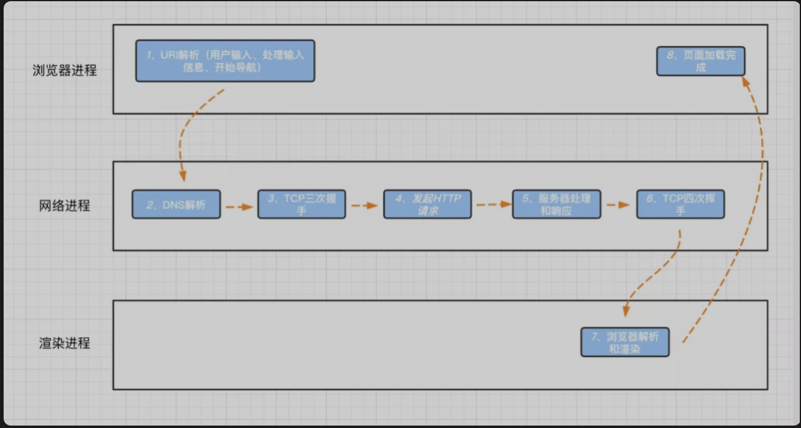
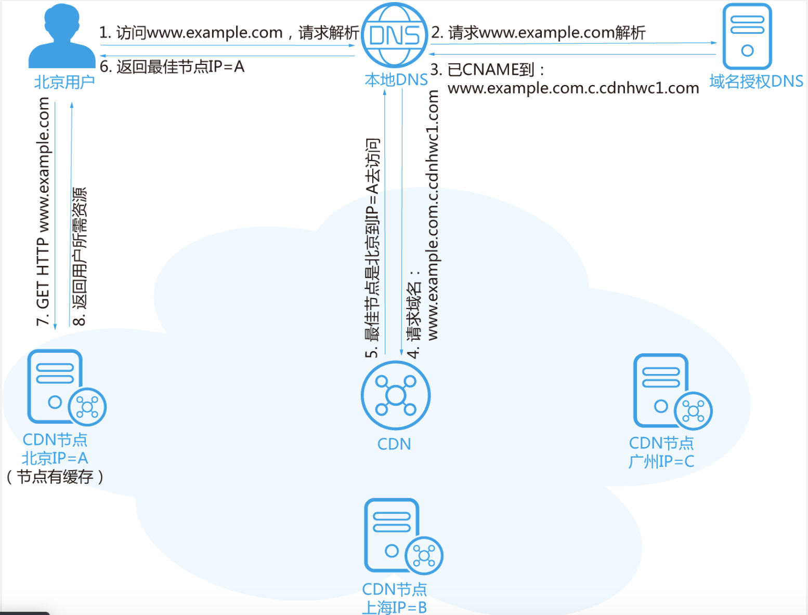
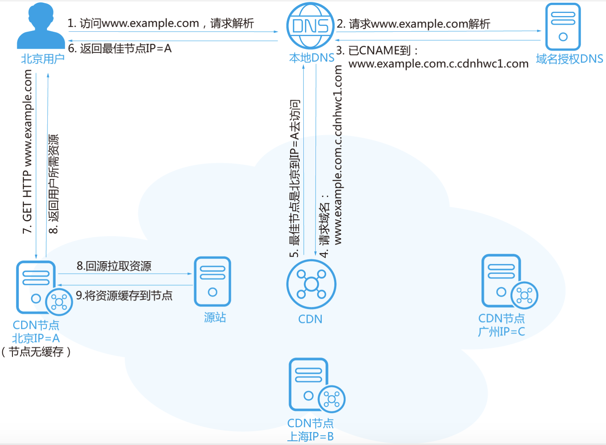

[TOC]
垃圾回收机制
## 浏览器
### 线程和进程的区别
进程：CPU进行资源分配的最小单位
线程：CPU调度的最小单位

#### CPU、进程、线程之间的关系
从上文我们已经简单了解了CPU、进程、线程，简单汇总一下。

1. 进程是cpu资源分配的最小单位（是能拥有资源和独立运行的最小单位）。
2. 线程是cpu调度的最小单位（线程是建立在进程的基础上的一次程序运行单位，一个进程中可以有多个线程）。
3. 线程是隶属于进程的，被包含于进程之中，**一个线程只能隶属于一个进程，但是一个进程是可以拥有多个线程的**。
4. 不同进程之间也可以通信，不过代价较大。
5. 单线程与多线程，都是指在一个进程内的单和多。
### 浏览器架构
* 用户界面
* 主进程
* 内核
    * 渲染引擎
    * JS引擎
        * 执行栈
    * 事件触发线程
        * 消息队列
            * 微任务
            * 宏任务
    * 网络异步线程
    * 定时器线程
### 浏览器渲染机制或者说浏览器渲染的主要流程
DOM -> CSSOM -> render -> layout -> paint

流程：解析html以及构建dom树 -> 构建render树 -> 布局render树(layout) -> 绘制render树
概念：1.构建DOM树： 渲染引擎解析HTML文档，首先将标签转换成DOM树中的DOM node(包括js生成的标签)生成内容树
      2.构建渲染树： 解析对应的css样式文件信息（包括js生成的样式和外部的css）
      3.布局渲染树：从根节点递归调用，计算每一个元素的大小，位置等。给出每个节点所在的屏幕的精准位置
      4.绘制渲染树：遍历渲染树，使用UI后端层来绘制每一个节点

1. 构建DOM(Document Object Model)树（parse）：**渲染引擎**解析HTML代码，按照深度优先遍历来生成DOM树。
2. 构建CSSOM(CSS Object Model)树：css文件下载完后也会进行渲染，生成相应的CSSOM。
3. 构建渲染树：当所有的css文件下载完且所有的CSSOM树构建结束后，就会和DOM树一起生成Render Tree(在这一过程中，不是简单的将两者合并就行了。渲染树只会包括需要显示的节点和这些节点的样式信息，如果某个节点是 display: none 的，那么就不会在渲染树中显示)。
4. 布局渲染树（reflow/layout）：接下来，浏览器就会进入Layout环节，从根节点递归调用，**计算每一个元素的大小、位置等，给出每个节点所应该在屏幕上出现的精确坐标**；。
5. 最后，通过Painting环节将所有的节点内容呈现到屏幕上(调用GPU绘制，合成图层，显示在屏幕上)。

#### 为什么操作DOM慢？
因为DOM是属于**渲染引擎**，而JS又属于JS引擎。当我们通过JS操作 DOM 的时候，其实**这个操作涉及到了两个线程之间的通信**，那么势必会带来一些性能上的损耗。操作 DOM 次数一多，也就等同于一直在进行线程之间的通信，并且操作 DOM 可能还会带来重绘回流的情况，所以也就导致了性能上的问题。
#### 插入几万个 DOM，如何实现页面不卡顿？
虚拟滚动（virtualized scroller）。原理就是**只渲染可视区域内的内容，非可见区域的那就完全不渲染了，当用户在滚动的时候就实时去替换渲染的内容**。
#### 什么情况阻塞渲染
首先渲染的前提是生成渲染树，所以 HTML 和 CSS 肯定会阻塞渲染。如果你想渲染的越快，你越应该降低一开始需要渲染的文件大小，并且扁平层级，优化选择器。

然后当浏览器在解析到 script 标签时，会暂停构建 DOM，完成后才会从暂停的地方重新开始。也就是说，如果你想首屏渲染的越快，就越不应该在首屏就加载 JS 文件，这也是都建议将 script 标签放在 body 标签底部的原因。

当然在当下，并不是说 script 标签必须放在底部，因为你可以给 script 标签添加defer或者async属性。

当 script 标签加上 defer 属性以后，表示该 JS 文件会并行下载，但是会放到 HTML 解析完成后**DOMContentLoaded事件执行前**顺序执行，所以对于这种情况你可以把 script 标签放在任意位置。

对于**没有任何依赖的JS文件可以加上 async 属性(因此执行顺序不定，谁先下载完谁就先执行)**，表示JS文件下载不会阻塞渲染，但是解析执行会阻塞HTML解析。
### 重绘和重排
重绘（repaint或redraw）：当盒子的位置、大小以及其他属性，例如颜色、字体大小等到确定下来之后，浏览器便把这些颜色都按照各自的特性绘制一遍，将内容呈现在页面上。此时由于只需要UI层面的重新像素绘制，因此**损耗较少**。

重绘是指一个**元素外观的改变**所触发的浏览器行为，浏览器会根据元素的新属性重新绘制，使元素呈现新的外观。

>触发重绘的条件：改变元素外观属性。如：color，background-color等

**注意：table及其内部元素需要多次计算才能确定好其在渲染树中节点的属性值，比同等元素要多花时间，要尽量避免使用table布局**。

重排（回流/reflow）：当渲染树中的一部分（或全部）因为元素的规模尺寸，布局，隐藏等改变而需要重新构建，这就是回流。此时，**浏览器需要重新经过计算，计算后还需要重新页面布局，因此是较重的操作**。

**每个页面都至少需要一次回流，就是页面第一次加载的时候**。

>重排必定会引发重绘，但重绘不一定会引发重排。

触发重排的条件：任何页面布局和几何属性的改变都会触发重排：

* 页面初次渲染(无法避免)
* 浏览器窗口大小改变
* 元素尺寸(大小，外边距，边框)、位置、内容发生改变，或者使用动画
* 元素字体大小变化
* 添加或者删除可见的dom元素
* 激活 CSS 伪类（例如：:hover）
* 填充内容的改变，比如文本的改变或图片大小改变而引起的计算值宽度和高度的改变
* **查询某些属性或调用某些方法**
    * clientWidth、clientHeight、clientTop、clientLeft
    * offsetWidth、offsetHeight、offsetTop、offsetLeft
    * scrollWidth、scrollHeight、scrollTop、scrollLeft
    * getComputedStyle()
    * getBoundingClientRect()
    * scrollTo()

最佳实践:
css
* 避免使用table布局
* 将动画效果应用到position属性为absolute或fixed的元素上

javascript
* 避免频繁操作样式，可汇总后统一一次修改
* 尽量使用class进行样式修改
* 减少dom的增删次数，可使用 字符串拼接 或者 documentFragment 一次性插入
* 极限优化时，修改样式可将其display: none后修改
* 避免多次触发上面提到的那些会触发回流的方法，可以的话尽量用 变量存住

### 浏览器缓存机制理解
这里将浏览器的缓存机制分为3个部分来说：
* 强缓存
* 协商缓存
* 缓存位置

缓存分为强缓存和协商缓存。强缓存不需要向服务器发送请求且返回的状态码是200，协商缓存需要过服务器，协商缓存返回的状态码是304。两类缓存机制可以同时存在，强缓存的优先级高于协商缓存。当执行强缓存时，如若缓存命中，则直接使用缓存数据库中的数据，不再进行缓存协商。
#### 强缓存
* Expires
* cache-control

#### 协商缓存
* Last-Modified 和 If-Modified-Since
* Etag 和 If-None-Match
#### 缓存位置
### 用户输入url到页面呈现的过程



1. 浏览器的地址栏输入URL并按下回车。
2. 浏览器查找当前URL的DNS缓存记录，并比较缓存是否过期。
3. DNS解析：将域名转换为对应的IP。
4. 根据IP建立TCP连接（三次握手）。
5. HTTP发起请求。
6. 服务器处理请求，浏览器接收HTTP响应。
7. 渲染页面，构建DOM树。
8. 关闭TCP连接（四次挥手）。

* DNS 解析
* TCP 三次握手
* 发送请求，分析 url，设置请求报文(头，主体)
* 服务器返回请求的文件 (html)
* 浏览器渲染
    * HTML parser --> DOM Tree
        * 标记化算法，进行元素状态的标记
        * dom 树构建
    * CSS parser --> Style Tree
        * 解析css代码，生成样式树
    * attachment --> Render Tree
        * 结合 dom树 与 style树，生成渲染树
    * layout: 布局
    * GPU painting: 像素绘制页面

### CDN缓存
CDN缓存: CDN通过在多个节点部署来减少请求时间，这样不需要每次都回到源站服务器进行请求。 CDN对于常见的HTTP请求都支持，但只对GET请求进行缓存。（对于其它请求不做缓存，仅起到转发作用，相当于proxy）。
#### CDN（内容分发网络）
CDN（Content Delivery Network，内容分发网络）是构建在现有互联网基础之上的一层智能虚拟网络，**通过在网络各处部署节点服务器，实现将源站内容分发至所有CDN节点，使用户可以就近获得所需的内容**。CDN服务缩短了用户查看内容的访问延迟，提高了用户访问网站的响应速度与网站的可用性，解决了网络带宽小、用户访问量大、网点分布不均等问题。

1. 尽可能的避开互联网有可能影响数据传输速度和稳定性的瓶颈和环节。使内容传输的更快更稳定。
2. 关键技术：内容存储和分发技术中
3. 基本原理：广泛采用各种缓存服务器，将这些缓存服务器分布到用户访问相对的地区或者网络中。当用户访问网络时利用全局负载技术将用户的访问指向距离最近的缓存服务器，由缓存服务器直接相应用户的请求（全局负载技术）。
#### CDN组成
一般来讲，CDN网络主要由**中心节点、边缘节点**两部分构成。
* 中心节点包括CDN网管中心和全局负载均衡DNS重定向解析系统，负责整个CDN网络的分发及管理。
* CDN边缘节点主要指异地分发节点，由负载均衡设备、高速缓存服务器两部分组成。

负载均衡设备负责每个节点中各个Cache的负载均衡，保证节点的工作效率；同时还负责收集节点与周围环境的信息，保持与全局负载均衡DNS的通信，实现整个系统的负载均衡。

高速缓存服务器（Cache）负责存储客户网站的大量信息，就像一个靠近用户的网站服务器一样响应本地用户的访问请求。通过全局负载均衡DNS的控制，用户的请求被透明地指向离他最近的节点，节点中Cache服务器就像网站的原始服务器一样，响应终端用户的请求。因其距离用户更近，故其响应时间才更快。
#### CDN作用
CDN将源站的内容分发到接近用户的边缘节点上，用户可以就近获取所需数据，不仅降低了网络的拥塞状况、提高请求的响应速度，也能够**减少源站的负载压力**。

CDN将我们对源站的请求导向了距离用户较近的缓存节点，而非源站。
#### CDN原理
网站可以预先把内容分发至全国各地的加速节点。这样用户就可以就近获取所需内容，避免网络拥堵、地域、运营商等因素带来的访问延迟问题，有效提升下载速度、降低响应时间，提供流畅的用户体验。

静态资源上传到CDN节点，用户在访问的时候就可以就近获取所需内容，可以有效加快页面响应速度。

CDN就像前面提到的"物流仓配网络"一样，解决了因**分布、带宽、服务器性**能带来的访问延迟问题，适用于站点加速、点播、直播等场景。使用户可就近取得所需内容，解决 Internet网络拥挤的状况，提高用户访问网站的响应速度和成功率。
#### CDN如何确保用户访问的是最近节点
* 当用户点击网站页面上的内容URL，先经过本地DNS系统(本地DNS服务器一般都是你的网络接入服务器商提供，比如中国电信，中国移动。)解析，如果本地DNS服务器没有相应域名的缓存，则**本地DNS服务器会将域名的解析权交给CNAME指向的CDN专用DNS服务器(因为CDN对域名解析的设置)**。
* CDN的DNS服务器将**CDN的全局负载均衡设备IP地址**返回给用户。
* 用户向**CDN的全局负载均衡设备**发起URL访问请求。
* CDN全局负载均衡设备**根据用户IP地址**，以及用户请求的URL，选择一台用户所属区域的区域负载均衡设备，并将请求转发到此设备上。
* 基于以下这些条件的综合分析之后，区域负载均衡设备会选择一个最优的缓存服务器节点，并从缓存服务器节点处得到缓存服务器的IP地址，最终将得到的IP地址返回给全局负载均衡设备：
    * **根据用户IP地址，判断哪一个边缘节点距用户最近**；
    * 根据用户所请求的URL中携带的内容名称，判断哪一个边缘节点上有用户所需内容；
    * 查询各个边缘节点当前的负载情况，判断哪一个边缘节点尚有服务能力。全局负载均衡设备把服务器的IP地址返回给用户。
* 用户向缓存服务器发起请求，缓存服务器响应用户请求，将用户所需内容传送到用户终端。如果这台缓存服务器上并没有用户想要的内容，而区域均衡设备依然将它分配给了用户，那么这台服务器就要向它的上一级缓存服务器请求内容，直至追溯到网站的源服务器将内容拉到本地。

#### CDN加速原理
当用户访问使用CDN服务的网站时，**本地DNS服务器通过CNAME方式将最终域名请求重定向到CDN服务**。CDN通过一组预先定义好的策略(如内容类型(即用户请求的URL)、地理区域(根据用户IP)、网络负载状况(节点负载情况)等)，将当时能够最快响应用户的CDN节点IP地址提供给用户，使用户可以以最快的速度获得网站内容。

部署了CDN之后，我们发出请求后，可以把所有的请求都转向CDN节点（配置cdn时设置CNAME，别名），从而达到加速的效果。如：`https://www.imooc.com/ -> https://sycdn.imooc.com`，我们的请求最后都会转到`https://sycdn.imooc.com`。

使用CDN后的HTTP请求处理流程如下：

CDN节点有缓存场景：



1. 用户在浏览器输入要访问的网站域名，向本地DNS发起域名解析请求。
2. 域名解析的请求被发往网站授权DNS服务器。
3. 网站DNS服务器解析发现域名已经CNAME到了www.example.com.c.cdnhwc1.com这个域名(并由这个域名提供IP地址)。
4. 请求被指向CDN服务。
5. **CDN对域名进行智能解析**，将响应速度最快的CDN节点IP地址返回给本地DNS。
6. 用户获取响应速度最快的CDN节点IP地址。
7. 浏览器在得到速度最快节点的IP地址以后，向CDN节点发出访问请求。
8. CDN节点将用户所需资源返回给用户。

CDN节点无缓存场景:



1. 用户在浏览器输入要访问的网站域名，向本地DNS发起域名解析请求。
2. 域名解析的请求被发往网站授权DNS服务器。
3. 网站DNS服务器解析发现域名已经CNAME到了www.example.com.c.cdnhwc1.com。
4. 请求被指向CDN服务。
5. CDN对域名进行智能解析，将响应速度最快的CDN节点IP地址返回给本地DNS。
6. 用户获取响应速度最快的CDN节点IP地址。
7. 浏览器在得到速度最快节点的IP地址以后，向CDN节点发出访问请求。
8. CDN节点回源站拉取用户所需资源。
9. 将回源拉取的资源缓存至节点。
10. 将用户所需资源返回给用户。

[介绍一下CDN和加速的原理？](https://fecommunity.github.io/front-end-interview/%E8%AE%A1%E7%AE%97%E6%9C%BA%E7%BD%91%E7%BB%9C/8.CDN.html)

#### CDN加速是对网站所在服务器加速，还是对其域名加速？
CDN是只对网站的某一个具体的域名加速。如果同一个网站有多个域名，则访客访问加入CDN的域名获得加速效果，访问未加入CDN的域名，或者直接访问IP地址，则无法获得CDN效果。
#### 绑定CNAME
接入CDN时，在CDN提供商控制台添加完加速域名后，您会得到一个CDN给您分配的CNAME域名， 您需要在您的DNS解析服务商添加CNAME记录，将自己的加速域名指向这个CNAME域名，这样该域名所有的请求才会都将转向CDN的节点，达到加速效果。

[CDN加速原理](https://www.jianshu.com/p/1dae6e1680ff)
#### DNS解析
如果要访问的网站名为："join.qq.com"，**客户端首先会在本机的hosts文件和hosts缓存中查找该域名对应的IP地址**；如果本机中没有此信息，则会到我们的本地DNS进行询问该域名对应的IP地址；如果本地DNS中仍然没有该域名的IP信息时，则会由本地DNS依次向根DNS、顶级域DNS、权威DNS进行询问，最终本地DNS将IP地址发送给客户端。客户端通过IP地址向远程的源站服务器发出HTTP请求并获取相应的数据内容。

### 为什么css放在顶部而js写在后面
1. 浏览器预先加载css后，可以不必等待HTML加载完毕就可以渲染页面了
2. 其实HTML渲染并不会等到完全加载完再渲染页面，而是一边解析DOM一边渲染。
3. js写在尾部，主要是因为js主要扮演事件处理的功能，一方面很多操作是在页面渲染后才执行的。另一方面可以节省加载时间，使页面能够更加的加载，提高用户的良好体验

但是随着JS技术的发展，JS也开始承担页面渲染的工作。比如我们的UI其实可以分被对待，把渲染页面的js放在前面，事件处理的js放在后面。
### 跨标签页通讯
不同标签页间的通讯，本质原理就是去运用一些可以 共享的中间介质，因此比较常用的有以下方法:

* 通过父页面window.open()和子页面postMessage
    * 异步下，通过`window.open('about: blank')` 和 `tab.location.href = '*'`
* 设置同域下共享的localStorage与**监听window.onstorage**
    * 重复写入相同的值无法触发
    * 会受到浏览器隐身模式等的限制
* 设置共享cookie与不断轮询脏检查(setInterval)
* 借助服务端或者中间层实现

## Web安全
1.sql注入原理：是将sql代码伪装到输入参数中，传递到服务器解析并执行的一种攻击手法。也就是说，
            在一些对server端发起的请求参数中植入一些sql代码，server端在执行sql操作时，会拼接对应参数，
            同时也将一些sql注入攻击的“sql”拼接起来，导致会执行一些预期之外的操作。
		防范：1.对用户输入进行校验
		       2.不适用动态拼接sql
2.XSS（跨站脚本攻击）：往web页面插入恶意的html标签或者js代码。
		        举例子：在论坛放置一个看是安全的链接，窃取cookie中的用户信息
			防范：1. 尽量采用post而不使用get提交表单
			     2. 避免cookie中泄漏用户的隐式
3.CSRF(跨站请求伪装）：通过伪装来自受信任用户的请求
			举例子：黄轶老师的webapp音乐请求数据就是利用CSRF跨站请求伪装来获取QQ音乐的数据
			防范：在客服端页面增加伪随机数，通过验证码
XSS和CSRF的区别：
   1.XSS是获取信息，不需要提前知道其他用户页面的代码和数据包
   2.CSRF代替用户完成指定的动作，需要知道其他页面的代码和数据包

### 什么是XSS，如何预防
XSS：跨站脚本攻击，是一种网站应用程序的安全漏洞攻击，是代码注入的一种。常见方式是将恶意代码注入合法代码里隐藏起来，再诱发恶意代码，从而进行各种各样的非法活动。

防范：记住一点，**所有用户输入都是不可信的**，所以得做输入过滤和转义

XSS攻击: 注入恶意代码
* cookie 设置 httpOnly
* 转义页面上的输入内容和输出内容

[对于跨站脚本攻击（XSS攻击）的理解和总结](http://www.imooc.com/article/13553)
#### 预防手段
* 转义字符
* 开启CSP
* cookie设置httpOnly(并不能防止XSS攻击，只是限制js不能操作cookie)
#### Content-Security-Policy细节实现
### 什么是CSRF，如何预防
CSRF：跨站请求伪造，也称 XSRF，是一种挟制用户在当前已登录的Web应用程序上执行非本意的操作的攻击方法。与XSS相比，XSS利用的是用户对指定网站的信任，CSRF利用的是网站对用户网页浏览器的信任。

CSRF中文名为跨站请求伪造。原理就是攻击者构造出一个后端请求地址，诱导用户点击或者通过某些途径自动发起请求(利用隐藏的img标签-get请求或者是隐藏的form表单来触发post请求)。**如果用户是在登录状态下的话**，后端就以为是用户在操作，从而进行相应的逻辑。

防范：用户操作验证（验证码），额外验证机制（token使用）等

#### 预防手段
* get请求不修改数据
* SameSite：可以对Cookie设置SameSite属性。该属性可以**设置Cookie不随着跨域请求发送**，可以很大程度减少CSRF的攻击，但是该属性目前并不是所有浏览器都兼容。
* 验证Referer：对于需要防范 CSRF 的请求，我们可以通过验证 Referer 来判断该请求是否为第三方网站发起的。
* Token-请求校验：用户登录页面，登录成功后，服务器端会生成一个token，放在用户的session或cookie当中，以后每次客户端与服务器端交互的时候都会把该token带过去，服务器端获取该token与自己服务器端保存的token对比，如果相同的话，说明是安全的，否则的话，会拒绝该请求的。

[对于跨站伪造请求（CSRF）的理解和总结](http://www.imooc.com/article/13552)
#### CSRF会不会有跨域的问题
不会，这里涉及到跨域的一些原理，跨域请求会被后端接口执行，但是返回的时候会被浏览器拦截。
### XSS和CSRF区别
跨站脚本攻击（Cross Site Scripting)，为了不和层叠样式表 CSS 混淆，故将跨站脚本攻击缩写为 XSS。恶意攻击者往Web页面里注入恶意的Script代码，当用户浏览该页面时，嵌入其中的Script 代码会被执行，从而达到恶意攻击用户的目的。

跨站请求伪造（Cross-site request forgery），是伪造请求，冒充用户在站内的正常操作。我们知道，绝大多数网站是通过cookie等方式辨识用户身份，再予以授权的。所以，要伪造用户的正常操作，最好的方法是通过XSS或链接欺骗等途径，让用户在本机（即拥有身份cookie的浏览器端）发起用户所不知道的请求。

CSRF(Cross-site Request Forgery), 中文名字叫：跨站请求伪造。那么什么是跨站请求伪造呢？就是用户登录一个正常的网站后，由于没有退出该正常网站，cookie信息还保留，然后用户去点击一个危险的网站页面，那么这个时候危险网站就可以拿到你之前登录的cookie信息。然后使用cookie信息去做一些其他事情。

因此，要完成一次CSRF攻击，需要完成如下事情：
1. 登录受信任的网站A，并且在本地生成cookie。
2. 在不登出网站A的情况下，继续访问危险网站B(在网站B中发出攻击请求)。

区别：
* 原理不同，CSRF是利用网站本身的漏洞，去请求网站的api；XSS是向目标网站注入JS代码，然后执行JS里的代码。
* CSRF需要用户先登录目标网站获取cookie，而XSS不需要登录
* CSRF的目标是用户，XSS的目标是服务器
* XSS是利用合法用户获取其信息，而CSRF是伪造成合法用户发起请求

## 前端性能优化
首屏加载如何优化
一个网页从请求到呈现花了很长时间，如何排查
### 编码优化
1. 减少cookie体积: 能有效减少每次请求的体积和响应时间；
* 去除不必要的 cookie；
* 压缩 cookie 大小；
* 设置 domain 与 过期时间；
2. dom优化:
* 减少访问dom的次数，如需多次，将dom缓存于变量中；
* 减少重绘与重排:
    * 多次操作合并为一次；
    * 减少对计算属性的访问；
        * 例如 offsetTop， getComputedStyle 等
        * 因为浏览器需要获取最新准确的值，因此必须立即进行重排，这样会破坏了浏览器的队列整合，尽量将值进行缓存使用；
    * 大量操作时，可将 dom 脱离文档流或者隐藏，待操作完成后再重新恢复；
    * 使用DocumentFragment / cloneNode / replaceChild进行操作；
* 使用事件委托，避免大量的事件绑定；

3. css优化:
* 层级扁平，避免过于多层级的选择器嵌套；
* 特定的选择器 好过一层一层查找: .xxx-child-text{} 优于 .xxx .child .text{}
* 减少使用通配符与属性选择器；
* 减少不必要的多余属性；
* 使用 动画属性 实现动画，动画时脱离文档流，开启硬件加速，优先使用 css 动画；
* 使用`<link>`替代原生 @import；

4. html优化:
* 减少 dom 数量，避免不必要的节点或嵌套；
* 避免``空标签，能减少服务器压力，因为 src 为空时，浏览器仍然会发起请求
    * IE 向页面所在的目录发送请求；
    * Safari、Chrome、Firefox 向页面本身发送请求；
    * Opera 不执行任何操作。
* 图片提前 指定宽高 或者 脱离文档流，能有效减少因图片加载导致的页面回流；
* 语义化标签 有利于 SEO 与浏览器的解析时间；
* 减少使用 table 进行布局，避免使用`<br />与<hr />`；
### 页面基础优化
1. 文件引入位置: css文件`<head>`中引入，js文件`<body>`底部引入；
    * 影响首屏的，优先级很高的 js 也可以头部引入，甚至内联；
2. 减少http请求 (http 1.0 - 1.1)，合并请求，正确设置http缓存；
3. 减少文件体积:
    * 删除多余代码:
        * tree-shaking
        * UglifyJs
        * code-spliting
    * 混淆 / 压缩代码，开启 gzip 压缩；
    * 多份编译文件按条件引入:
        * 针对现代浏览器直接给 ES6 文件，只针对低端浏览器引用编译后的 ES5 文件；
        * 可以利用`<script type="module"> / <script type="module">`进行条件引入用
    * 动态 polyfill，只针对不支持的浏览器引入 polyfill；
4. 图片优化:
    * 根据业务场景，与UI探讨选择 合适质量，合适尺寸；
    * 根据需求和平台，选择 合适格式，例如非透明时可用 jpg；非苹果端，使用 webp；
    * 小图片合成 雪碧图，低于 5K 的图片可以转换成 base64 内嵌；
    * 合适场景下，使用 iconfont 或者 svg；
5. 使用缓存:
    * 浏览器缓存: 通过设置请求的过期时间，合理运用浏览器缓存；
    * CDN缓存: 静态文件合理使用 CDN 缓存技术；
    * HTML 放于自己的服务器上；
        * 打包后的图片 / js / css 等资源上传到 CDN 上，文件带上 hash 值；
        * 由于浏览器对单个域名请求的限制，可以将资源放在多个不同域的 CDN 上，可以绕开该限制；
    * 服务器缓存: 将不变的数据、页面缓存到 内存 或 远程存储(redis等) 上；
    * 数据缓存: 通过各种存储将不常变的数据进行缓存，缩短数据的获取时间；

###  首屏渲染优化
1. css / js 分割，使首屏依赖的文件体积最小，内联首屏关键 css / js；
2. 非关键性的文件尽可能的 异步加载和懒加载，避免阻塞首页渲染；
3. 使用dns-prefetch / preconnect / prefetch / preload等浏览器提供的资源提示，加快文件传输；
4. 谨慎控制好 Web字体，一个大字体包足够让你功亏一篑；
    * 控制字体包的加载时机；
    * 如果使用的字体有限，那尽可能只将使用的文字单独打包，能有效减少体积；
5. 合理利用 Localstorage / server-worker 等存储方式进行 数据与资源缓存；
6. 分清轻重缓急:
    * 重要的元素优先渲染；
    * 视窗内的元素优先渲染；
7. 服务端渲染(SSR):
    * 减少首屏需要的数据量，剔除冗余数据和请求；
    * 控制好缓存，对数据/页面进行合理的缓存；
    * 页面的请求使用流的形式进行传递；
8. 优化用户感知:
    * 利用一些动画 过渡效果，能有效减少用户对卡顿的感知；
    * 尽可能利用 骨架屏(Placeholder) / Loading 等减少用户对白屏的感知；
    * 动画帧数尽量保证在 30帧 以上，低帧数、卡顿的动画宁愿不要；
    * js 执行时间避免超过 100ms，超过的话就需要做:
        * 寻找可 缓存 的点；
        * 任务的 分割异步 或 web worker 执行；

### 谈谈前端性能优化？
1. 减少HTTP请求数(合并文件、CSS精灵(雪碧图)、inline Image即图片内联)
2. 合理设置HTTP缓存(304)
3. 资源合并与压缩(尽量合并css和js文件)
4. DNS预解析：DNS 解析也是需要时间的，可以通过预解析的方式来预先获得域名所对应的 IP。
    * 减少DNS查询：DNS查询完成之前浏览器不能从这个主机下载任何任何文件。方法：DNS缓存、将资源分布到恰当数量的主机名，平衡并行下载和DNS查询
```html
<link rel="dns-prefetch" href="//www.example.cn">
```
5. 防抖和节流
6. 减少操作dom的次数，如需多次，将dom缓存于变量中(DOM查找缓存)
7. 减少页面的重绘和重排
8. 避免重定向：多余的中间访问
9. 非必须组件延迟加载和未来所需组件预加载
    * preload：预加载其实是声明式的fetch ，强制浏览器请求资源，**并且不会阻塞 onload 事件**，可以使用以下代码开启预加载
```html
<link rel="preload" href="http://example.com">
```
10. 单域和多域
    * 将资源放到不同的域下：浏览器同时从一个域下载资源的数目有限，增加域可以提高并行下载量
11. 使用CDN存储静态资源文件，采用CDN加速
12. 图片懒加载
13. 启用Gzip压缩：通过减小HTTP响应的大小也可以节省HTTP响应时间。Gzip可以压缩所有可能的文件类型，是减少文件体积、增加用户体验的简单方法。
14. 将css放在页面最上面，将script放在页面最下面
    * 最好的方式是：在文档`<head/>`内加载你的样式表，这样做的好处是：提高网页渲染性能，避免网页出现白屏或者是没有样式的内容。
    * 将script标签放在页面底部（body结束标签之前），这样做可以让页面内容优先呈现出来，而非先暴露script脚本中可能存在的错误，能够带来更好的用户体验。此外即便脚本正确无误，但是脚本的加载和执行是阻塞的，如果需要加载的脚本过多，将会延长页面内容的加载时间，造成不好的用户体验。
    * 将Script放在页面的最下面，因为浏览器加载和解释网页的顺序是从左到右从上到下的，如果JavaScript代码有死循环的问题，网页可能是空白一片的，如果放在页面的最下面即使如此，页面也能正常展现出来，用户体验更好。


从设计实现层面简化页面
将外部脚本置底（将脚本内容在页面信息内容加载后再加载）
多图片网页使用图片懒加载。
在js中尽量减少闭包的使用
尽量使用字体图标或者SVG图标，来代替传统的PNG等格式的图片
在JS中避免“嵌套循环”和 “死循环”
尽可能使用事件委托（事件代理）来处理事件绑定的操作

### 首屏加载如何优化
1. 一个网页从请求到呈现花了很长时间，如何排查

### pv和uv
1. pv的全称是page view，译为bai页面浏览量或du点击量，通常是衡量一个网zhi站甚至一条网络新闻的指标。用dao户每次对网站中的一个页面的请求或访问均被记录1个PV，用户对同一页面的多次访问，pv累计。例如，用户访问了4个页面，pv就+4。
2. uv的全称是unique view，译为通过互联网访问、浏览这个网页的自然人，访问网站的一台电脑客户端被视为一个访客，在同一天内相同的客户端只被计算一次。
## 参考文档
1. [浏览器灵魂之问，请问你能接得住几个？](https://juejin.im/post/5df5bcea6fb9a016091def69#heading-102)
2. [浏览器层合成与页面渲染优化](https://juejin.im/post/5da52531518825094e373372#heading-0)
3. [浏览器工作原理](http://taligarsiel.com/Projects/howbrowserswork1.htm)
4. [聊一聊前端性能优化 CRP](https://mp.weixin.qq.com/s/vUfwspYbbekXVF2ZV8qPjw)