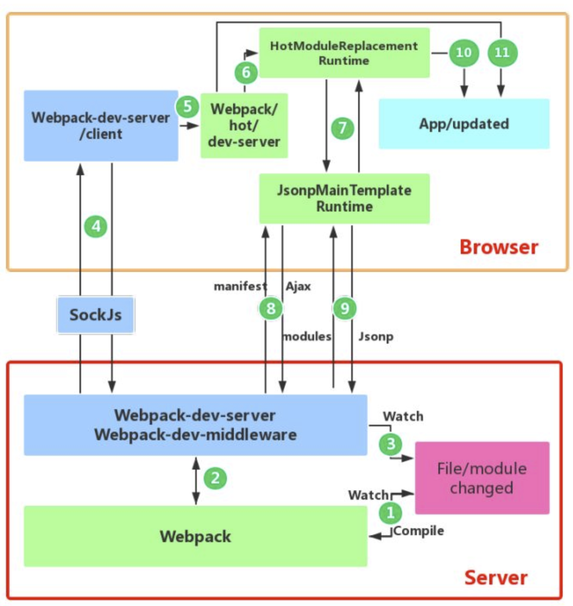

[TOC]
loader的执行顺序为什么是后写的先执行
tree-shaking作用，如何才能生效
## Webpack
### 介绍一下webpack基本的属性
* entry
* output
* module
* plugins
* Chunk: 代码块，可以根据配置，将所有模块代码合并成一个或多个代码块，以便按需加载，提高性能；

```js
const path = require('path')
module.exports = {
    entry: { // main是默认入口，也可以是多入口
        main: './src/main.js'
    },
    // 出口
    output: {
        filename: 'build.js', // 指定js路径
        path: path.join(__dirname, '..', '', 'dist') // 最好是绝对路径
        // 代表上一级的dist
    },
    module: {
        rules:
            {
                test: /\.css$/,
                use: ['style-loader', 'css-loader']
            },
            {
                test: /\.(jpg|svg)$/,
                loader: 'url-loader',
                options: {
                    limit: 4096,
                    name: '[name].[ext]'
                }
            }
        ]
    },
    plugins: [
        // 插件的执行顺序是依次执行的，和loader是反过来的
        new htmlWebpackPlugin({
            template: './src/index.html',
        })
        // 将src下的template属性描述的文件根据当前配置的output.path，将文件移动到该目录。
        // 在插件的执行过程中，它本身可以去拿当前所设置的webpack选项，便于对webpack选项的复用，
    ]
}
```
### Webpack构建流程简单说一下
Webpack的构建流程是**一个串行的过程**，从启动到结束会依次执行以下流程：

* 初始化打包参数：读取shell命令和webpack配置文件相关参数，合并两者得到最终的构建参数。
* 开始编译：通过得到的参数**初始化Compiler对象**，加载所有配置的插件，执行Compiler对象的run方法开始执行编译。
* 确定入口：根据配置中的entry找出所有的入口文件。
* 编译模块：从入口文件出发，调用所有配置的Loader对模块进行处理，同时处理该模块依赖的模块，再递归本步骤直到所有入口依赖的文件都经过了loader处理。
* 完成模块编译(输出依赖图谱)：在经过第4步使用Loader编译完所有模块后，得到了每个模块被编译后的最终内容以及它们之间的依赖关系。
* 打包输出：监听seal事件调用各插件对构建后的结果进行封装，根据入口和模块之间的依赖关系，合并拆分组成chunk，再把每个Chunk转换成一个单独的文件加入到输出列表(每一个chunk对应一个入口文件)，这一步是可以修改输出内容的最后机会。
* 输出完成：在确定好输出内容后，根据配置确定输出的文件路径和文件名，把文件内容写入到文件系统。

在以上过程中，Webpack 会在特定的时间点广播出特定的事件，插件在监听到感兴趣的事件后会执行特定的逻辑，并且插件可以调用 Webpack 提供的 API 改变 Webpack 的运行结果。

简单说：
* 初始化：启动构建，读取与合并配置参数，加载 Plugin，实例化 Compiler
* 编译：从 Entry 出发，针对每个 Module 串行调用对应的 Loader 去翻译文件的内容，再找到该 Module 依赖的 Module，递归地进行编译处理
* 输出：将编译后的 Module 组合成 Chunk，将 Chunk 转换成文件，输出到文件系统中

[具体看](https://juejin.im/post/5e1b2f77e51d454d5177a69d)
[细说 webpack 之流程篇](https://fed.taobao.org/blog/2016/09/10/webpack-flow/)
#### 工作流程 (加载 - 编译 - 输出)
1、读取配置文件，按命令初始化配置参数，创建Compiler对象；
2、调用插件的 apply 方法 挂载插件 监听，然后从入口文件开始执行编译；
3、按文件类型，调用相应的 Loader 对模块进行 编译，并在合适的时机点触发对应的事件，调用 Plugin 执行，最后再根据模块 依赖查找 到所依赖的模块，递归执行第三步；
4、将编译后的所有代码包装成一个个代码块 (Chuck)， 并按依赖和配置确定 输出内容。这个步骤，仍然可以通过 Plugin 进行文件的修改;
5、最后，根据 Output 把文件内容一一写入到指定的文件夹中，完成整个过程；
#### 模块包装
```js
(function(modules) {
	// 模拟 require 函数，从内存中加载模块；
	function __webpack_require__(moduleId) {
		// 缓存模块
		if (installedModules[moduleId]) {
			return installedModules[moduleId].exports;
		}

		var module = installedModules[moduleId] = {
			i: moduleId,
			l: false,
			exports: {}
		};

		// 执行代码；
		modules[moduleId].call(module.exports, module, module.exports, __webpack_require__);

		// Flag: 标记是否加载完成；
		module.l = true;

		return module.exports;
	}

	// ...

	// 开始执行加载入口文件；
	return __webpack_require__(__webpack_require__.s = "./src/index.js");
 })({
 	"./src/index.js": function (module, __webpack_exports__, __webpack_require__) {
		// 使用 eval 执行编译后的代码；
		// 继续递归引用模块内部依赖；
		// 实际情况并不是使用模板字符串，这里是为了代码的可读性；
		eval(`
			__webpack_require__.r(__webpack_exports__);
			//
			var _test__WEBPACK_IMPORTED_MODULE_0__ = __webpack_require__("test", ./src/test.js");
		`);
	},
	"./src/test.js": function (module, __webpack_exports__, __webpack_require__) {
		// ...
	},
 })
```
* 模块机制: webpack 自己实现了一套模拟模块的机制，将其包裹于业务代码的外部，从而提供了一套模块机制；
* 文件编译: webpack 规定了一套编译规则，通过 Loader 和 Plugin，以管道的形式对文件字符串进行处理；
### 分别介绍bundle，chunk，module是什么
* bundle：是由webpack打包出来的文件
* chunk：代码块，一个chunk由多个模块组合而成，用于代码的合并和分割
* module：是开发中的单个模块，在webpack的世界，一切皆模块，一个模块对应一个文件，webpack会从配置的entry中递归开始找出所有依赖的模块
### Loader和Plugin的不同？
不同的作用:
* Loader直译为"模块加载器"。Webpack将一切文件视为模块，但是webpack原生只能解析js文件，如果想打包其他后缀的文件，就需要用到loader。所以，Loader的作用是让webpack拥有了加载和解析非js文件的能力。
* Plugin直译为"插件"。Plugin可以扩展webpack的功能，让webpack具有更多的灵活性。在Webpack运行的生命周期中会广播出许多事件，Plugin可以监听这些事件，在合适的时机通过 Webpack提供的API改变输出结果。

不同的用法:
* Loader在module.rules中配置，也就是说loader作为**模块的解析规则**而存在。类型为数组，每一项都是一个Object，里面描述了对于什么类型的文件（test），使用什么加载(loader)和使用的参数（options）
* Plugin在plugins中单独配置。类型为数组，每一项是一个plugin的实例，参数都通过构造函数传入。

### webpack里面的loader和plugin的实现原理
Loader像一个"翻译官"把读到的源文件内容转义成新的文件内容，并且每个Loader通过链式操作，将源文件一步步翻译成想要的样子。

编写Loader时要遵循单一原则，每个Loader只做一种"转义"工作。 每个Loader的拿到的是源文件内容（source），可以通过返回值的方式将处理后的内容输出，也可以调用this.callback()方法，将内容返回给webpack。 还可以通过 this.async()生成一个callback函数，再用这个callback将处理后的内容输出出去。 此外webpack还为开发者准备了开发loader的工具函数集——loader-utils。

相对于Loader而言，Plugin的编写就灵活了许多。 webpack在运行的生命周期中会广播出许多事件，Plugin 可以监听这些事件，在合适的时机通过 Webpack 提供的 API 改变输出结果。
#### 是否写过Loader？简单描述一下编写loader的思路？
Loader支持链式调用，所以开发上需要严格遵循`单一职责`，每个Loader只负责自己需要负责的事情。Loader的API可以去官网查阅。

* Loader运行在 Node.js 中，我们可以调用任意 Node.js 自带的 API 或者安装第三方模块进行调用。
* Webpack 传给 Loader 的原内容都是 UTF-8 格式编码的字符串，当某些场景下 Loader 处理二进制文件时，需要通过`exports.raw = true`告诉 Webpack 该 Loader 是否需要二进制数据。
* 尽可能的异步化 Loader，如果计算量很小，同步也可以。
* Loader 是无状态的，我们不应该在 Loader 中保留状态。
* 使用 loader-utils 和 schema-utils 为我们提供的实用工具
* 加载本地 Loader 方法
  * Npm link
  * ResolveLoader
#### 是否写过Plugin？简单描述一下编写Plugin的思路？
webpack在运行的生命周期中会广播出许多事件，Plugin 可以监听这些事件，在特定的阶段钩入想要添加的自定义功能。Webpack 的 Tapable 事件流机制保证了插件的有序性，使得整个系统扩展性良好。Plugin的API可以去官网查阅。

* compiler暴露了和Webpack整个生命周期相关的钩子
* compilation 暴露了与模块和依赖有关的粒度更小的事件钩子
* 插件需要在其原型上绑定apply方法，才能访问 compiler 实例
* 传给每个插件的 compiler 和 compilation对象都是同一个引用，若在一个插件中修改了它们身上的属性，会影响后面的插件
* 找出合适的事件点去完成想要的功能
  * emit 事件发生时，可以读取到最终输出的资源、代码块、模块及其依赖，并进行修改(emit 事件是修改 Webpack 输出资源的最后时机)
  * watch-run 当依赖的文件发生变化时会触发
* 异步的事件需要在插件处理完任务时调用回调函数通知 Webpack 进入下一个流程，不然会卡住

### dev-server运行原理
#### 文件监听原理
在发现源码发生变化时，自动重新构建出新的输出文件。

Webpack开启监听模式，有两种方式：
* 启动 webpack 命令时，带上`--watch`参数
* 在配置webpack.config.js中设置`watch: true`

缺点：每次需要手动刷新浏览器才能看到修改后的效果
原理：轮询检查文件的最后编辑时间是否变化，如果某个文件发生了变化，并不会立刻告诉监听者，而是先缓存起来，等 aggregateTimeout后再执行。
```js
module.export = {
    // 默认false，也就是不开启
    watch: true,
    // 只有开启监听模式时，watchOptions才有意义
    watchOptions: { // 默认为空，不监听的文件或者文件夹，支持正则匹配
        ignored: /node_modules/,
        // 监听到变化发生后会等300ms再去执行，默认300ms
        aggregateTimeout:300,
        // 判断文件是否发生变化是通过不停询问系统指定文件有没有变化实现的，默认每秒问1000次
        poll: 1000
    }
}
```
#### Webpack热更新总体流程
首先整个流程分为客户端和服务端，需要两者之间通过websocket链接进行通信来完成。

服务端主要分为以下四个关键点：
1. 读取shell命令行参数和配置文件参数，合并两者作为构建的参数；
2. 基于合并后的参数，创建compiler对象，并且webpack在watch模式下编译；
3. 基于express创建webserver静态服务器，让浏览器可以请求编译生成的模块文件；
4. 创建websocket服务：建立本地服务和浏览器的双向通信；每当有新的编译，立马告知浏览器执行热更新逻辑；
5. 向配置文件的entry属中注入新的入口文件：lib/client/index.js(websocket客户端)、lib/client/hot/dev-server.js(热更新脚本文件)注入到打包输出的chunk文件中；
6. 向compiler.hooks.done钩子（webpack编译完成后触发）注册事件：里面会向客户端发射hash和ok事件；
7. 调用webpack-dev-middleware：启动编译、设置文件为内存文件系统、里面有一个中间件负责返回编译的文件。监听本地文件的变化、文件改变自动编译、编译输出。

客户端主要分为两个关键点：
1. 创建一个websocket客户端连接websocket服务端，websocket客户端监听hash 和ok事件；
2. 主要的热更新客户端实现逻辑，浏览器会接收服务器端推送的消息，如果需要热更新，浏览器发起http请求去服务器端获取新的模块资源解析并局部刷新页面(HotModuleReplacementPlugin帮我们做了，其将HMR运行时代码注入到打包后的文件中了)。
#### Webpack热更新原理


首先要知道server端和client端都做了处理工作：

1. 第一步，在 webpack 的 watch 模式下，文件系统中某一个文件发生修改，webpack 监听到文件变化，根据配置文件对模块重新编译打包，并将打包后的代码通过简单的 JavaScript 对象保存在内存中。
2. 第二步是 webpack-dev-server 和 webpack 之间的接口交互，而在这一步，主要是 dev-server 的中间件 webpack-dev-middleware 和 webpack 之间的交互，webpack-dev-middleware 调用 webpack 暴露的 API对代码变化进行监控，并且告诉 webpack，将代码打包到内存中。
3. 第三步是 webpack-dev-server 对文件变化的一个监控，这一步不同于第一步，并不是监控代码变化重新打包。当我们在配置文件中配置了devServer.watchContentBase 为 true 的时候，Server 会监听这些配置文件夹中静态文件的变化，变化后会通知浏览器端对应用进行 live reload。注意，这儿是浏览器刷新，和 HMR 是两个概念。
4. 第四步也是 webpack-dev-server 代码的工作，该步骤主要是通过 sockjs（webpack-dev-server 的依赖）在浏览器端和服务端之间建立一个 websocket 长连接，将 webpack 编译打包的各个阶段的状态信息告知浏览器端，同时也包括第三步中 Server 监听静态文件变化的信息。浏览器端根据这些 socket 消息进行不同的操作。当然服务端传递的最主要信息还是新模块的 hash 值，后面的步骤根据这一 hash 值来进行模块热替换。
5. webpack-dev-server/client 端并不能够请求更新的代码，也不会执行热更模块操作，而把这些工作又交回给了 webpack，webpack/hot/dev-server 的工作就是根据 webpack-dev-server/client 传给它的信息以及 dev-server 的配置决定是刷新浏览器呢还是进行模块热更新。当然如果仅仅是刷新浏览器，也就没有后面那些步骤了。
6. HotModuleReplacement.runtime 是客户端 HMR 的中枢，它接收到上一步传递给他的新模块的 hash 值，它通过 JsonpMainTemplate.runtime 向 server 端发送 Ajax 请求，服务端返回一个 json，该 json 包含了所有要更新的模块的 hash 值，获取到更新列表后，该模块再次通过 jsonp 请求，获取到最新的模块代码。这就是上图中 7、8、9 步骤。
7. 而第 10 步是决定 HMR 成功与否的关键步骤，在该步骤中，HotModulePlugin 将会对新旧模块进行对比，决定是否更新模块，在决定更新模块后，检查模块之间的依赖关系，更新模块的同时更新模块间的依赖引用。
8. 最后一步，当 HMR 失败后，回退到 live reload 操作，也就是进行浏览器刷新来获取最新打包代码。


Webpack 的热更新又称热替换（Hot Module Replacement），缩写为 HMR。 这个机制可以做到不用刷新浏览器而将新变更的模块替换掉旧的模块。

HMR的核心就是客户端从服务端拉去更新后的文件，准确的说是 chunk diff (chunk 需要更新的部分)，实际上 WDS 与浏览器之间维护了一个 Websocket，当本地资源发生变化时，WDS 会向浏览器推送更新，并带上构建时的 hash，让客户端与上一次资源进行对比。客户端对比出差异后会向 WDS 发起 Ajax 请求来获取更改内容(文件列表、hash)，这样客户端就可以再借助这些信息继续向 WDS 发起 jsonp 请求获取该chunk的增量更新。

后续的部分(拿到增量更新之后如何处理？哪些状态该保留？哪些又需要更新？)由 HotModulePlugin 来完成，提供了相关 API 以供开发者针对自身场景进行处理，像react-hot-loader 和 vue-loader 都是借助这些 API 实现 HMR。

[Webpack HMR 原理解析](https://zhuanlan.zhihu.com/p/30669007)
### loader
由于 Webpack 是基于 Node，因此 Webpack 其实是只能识别 js 模块，比如 css / html / 图片等类型的文件并无法加载，因此就需要一个对 不同格式文件转换器。其实 Loader 做的事，也并不难理解: 对 Webpack 传入的字符串进行按需修改。例如一个最简单的 Loader:
```js
// html-loader/index.js
module.exports = function(htmlSource) {
	// 返回处理后的代码字符串
	// 删除 html 文件中的所有注释
	return htmlSource.replace(/<!--[\w\W]*?-->/g, '')
}
```
当然，实际的 Loader 不会这么简单，通常是需要将代码进行分析，构建 AST (抽象语法树)，遍历进行定向的修改后，再重新生成新的代码字符串。如我们常用的 Babel-loader 会执行以下步骤:

* babylon 将 ES6/ES7 代码解析成 AST
* babel-traverse 对 AST 进行遍历转译，得到新的 AST
* 新 AST 通过 babel-generator 转换成 ES5

Loader 特性:
* 链式传递，按照配置时相反的顺序链式执行；
* 基于 Node 环境，拥有 较高权限，比如文件的增删查改；
* 可同步也可异步；

#### 编写原则:
* 单一原则: 每个 Loader 只做一件事；
* 链式调用: Webpack 会按顺序链式调用每个 Loader；
* 统一原则: 遵循 Webpack 制定的设计规则和结构，输入与输出均为字符串，各个 Loader 完全独立，即插即用；
### Plugin
插件系统是 Webpack 成功的一个关键性因素。在编译的整个生命周期中，Webpack 会触发许多事件钩子，Plugin 可以监听这些事件，根据需求在相应的时间点对打包内容进行定向的修改。

一个最简单的 plugin 是这样的:
```js
class Plugin{
  	// 注册插件时，会调用 apply 方法
  	// apply 方法接收 compiler 对象
  	// 通过 compiler 上提供的 Api，可以对事件进行监听，执行相应的操作
  	apply(compiler){
  		// compilation 是监听每次编译循环
  		// 每次文件变化，都会生成新的 compilation 对象并触发该事件
    	compiler.plugin('compilation', function(compilation) {})
  	}
}
```
注册插件:
```jss
// webpack.config.js
module.export = {
	plugins:[
		new Plugin(options),
	]
}
```
事件流机制:

Webpack 就像工厂中的一条产品流水线。原材料经过 Loader 与 Plugin 的一道道处理，最后输出结果。

* 通过链式调用，按顺序串起一个个 Loader；
* 通过事件流机制，让 Plugin 可以插入到整个生产过程中的每个步骤中；

Webpack 事件流编程范式的核心是基础类 Tapable，是一种 观察者模式 的实现事件的订阅与广播：
```js
const { SyncHook } = require("tapable")

const hook = new SyncHook(['arg'])

// 订阅
hook.tap('event', (arg) => {
	// 'event-hook'
	console.log(arg)
})

// 广播
hook.call('event-hook')
```
Webpack 中两个最重要的类 Compiler 与 Compilation 便是继承于 Tapable，也拥有这样的事件流机制。

* Compiler: 可以简单的理解为 Webpack 实例，它包含了当前 Webpack 中的所有配置信息，如 options， loaders, plugins 等信息，全局唯一，只在启动时完成初始化创建，随着生命周期逐一传递；
* Compilation: 可以称为 编译实例。当监听到文件发生改变时，Webpack 会创建一个新的 Compilation 对象，开始一次新的编译。它包含了当前的输入资源，输出资源，变化的文件等，同时通过它提供的 api，可以监听每次编译过程中触发的事件钩子；

区别:
* Compiler 全局唯一，且从启动生存到结束；
* Compilation 对应每次编译，每轮编译循环均会重新创建；

### 使用过webpack里面哪些plugin和loader
#### 有哪些常见的Loader？你用过哪些Loader？
* babel-loader：把ES6转换成ES5(更准确的说是webpack和babel之间的桥梁)，加载 js / jsx 文件， 将 ES6 / ES7 代码转换成 ES5，抹平兼容性问题；
* css-loader：加载CSS，分析`@import和url()`，引用 css 文件与对应的资源；支持模块化、压缩、文件导入等特性
* style-loader：将 css 代码以`<style>`标签的形式插入到 html 中；
* less-loader：将less语法转为css语法
* sass-loader：将SCSS/SASS代码转换成CSS
* postcss-loader：扩展CSS语法，使用下一代 CSS，可以配合 autoprefixer 插件自动补齐 CSS3 前缀；用于 css 的兼容性处理，具有众多功能，例如 添加前缀，单位转换 等。
* file-loader：把文件输出到一个文件夹中，在代码中通过相对URL去引用输出的文件 (处理图片和字体)。加载文件资源，如 字体 / 图片 等，具有移动/复制/命名等功能。
* url-loader：与 file-loader 类似，区别是用户可以设置一个阈值，小于阈值时返回文件 base64 形式编码 (处理图片和字体)；通常用于加载图片，可以将小图片直接转换为 Date Url，减少请求；
* image-loader：加载并且压缩图片文件
* thread-loader

1. raw-loader：加载文件原始内容（utf-8）
2. source-map-loader：加载额外的Source Map文件，以方便断点调试
3. svg-inline-loader：将压缩后的 SVG 内容注入代码中
4. json-loader：加载 JSON 文件（默认包含）
5. handlebars-loader: 将 Handlebars 模版编译成函数并返回
6. ts-loader: 加载 ts / tsx 文件，编译 TypeScript；
7 awesome-typescript-loader：将 TypeScript 转换成 JavaScript，性能优于ts-loader
8. eslint-loader：通过 ESLint 检查 JavaScript 代码
9. tslint-loader：通过 TSLint检查 TypeScript 代码
10. mocha-loader：加载 Mocha 测试用例的代码
11. coverjs-loader：计算测试的覆盖率
12. vue-loader：加载 Vue.js 单文件组件
13. i18n-loader：国际化
14. cache-loader：可以在一些性能开销较大的Loader之前添加，目的是将结果缓存到磁盘里

#### 有哪些常见的Plugin？你用过哪些Plugin？
* html-webpack-plugin：加载html模板文件，并引入css / js文件来生成入口html文件(依赖于html-loader)
* mini-css-extract-plugin: 分离样式文件，将CSS提取为独立文件，支持按需加载 (替代extract-text-webpack-plugin)
* define-plugin：定义全局变量
* EnvironmentPlugin: 定义环境变量 (Webpack4 之后指定 mode 会自动配置)
* clean-webpack-plugin: 目录清理
* webpack-parallel-uglify-plugin：多进程执行代码压缩，提升构建速度
* terser-webpack-plugin: 支持压缩 ES6 (Webpack4)
* uglifyjs-webpack-plugin：不支持 ES6 压缩 (Webpack4 以前)
* webpack-bundle-analyzer: 可视化 Webpack 输出文件的体积 (业务组件、依赖第三方模块)
* speed-measure-webpack-plugin: 可以看到每个 Loader 和 Plugin 执行耗时 (整个打包耗时、每个 Plugin 和 Loader 耗时)
* compression-webpack-plugin: 使用 gzip 压缩 js 和 css；
* optimize-css-assets-webpack-plugin: CSS 代码去重；

1. ignore-plugin：忽略部分文件
2. web-webpack-plugin：可方便地为单页应用输出 HTML，比 html-webpack-plugin 好用
3. serviceworker-webpack-plugin：为网页应用增加离线缓存功能
4. ModuleConcatenationPlugin: 开启 Scope Hoisting
#### 使用webpack开发时，你用过哪些可以提高效率的插件？
* webpack-dashboard：可以更友好的展示相关打包信息。
* webpack-merge：提取公共配置，减少重复配置代码。
* speed-measure-webpack-plugin：简称SMP，分析出 Webpack 打包过程中 Loader 和 Plugin 的耗时，有助于找到构建过程中的性能瓶颈。
* size-plugin：监控资源体积变化，尽早发现问题。
* HotModuleReplacementPlugin：模块热替换。

#### 说一说Loader和Plugin的区别？
1. Loader本质上就是一个函数，在该函数中对接收到的内容进行转换，返回转换后的结果。因为Webpack只认识JavaScript，所以Loader就成了翻译官，对其他类型的资源进行转译的预处理工作。
2. Plugin即插件，本质上的一个class类(或者构造函数)，基于事件流框架`Tapable`(发布-订阅机制)，插件可以扩展Webpack的功能，在Webpack运行的生命周期中会广播出许多事件，Plugin可以监听这些事件，在合适的时机通过 Webpack 提供的 API 改变输出结果。
3. Loader在module.rules中配置，作为模块的解析规则，类型为数组。每一项都是一个Object，内部包含了test(类型文件)、loader、options (参数)等属性。
4. Plugin在plugins中单独配置，类型为数组，每一项是一个Plugin的实例，参数都通过构造函数传入。
#### 如何保证各个loader按照预想顺序执行？
可以使用enforce强制执行loader的作用顺序：
* pre 代表在所有正常loader之前执行
* post 是所有loader之后执行。
* inline(内联) 官方不推荐使用
#### 使用webpack开发时，你用过哪些可以提高效率的插件？
* webpack-dashboard：可以更友好的展示相关打包信息。
* webpack-merge：提取公共配置，减少重复配置代码
* speed-measure-webpack-plugin：简称 SMP，分析出 Webpack 打包过程中 Loader 和 Plugin 的耗时，有助于找到构建过程中的性能瓶颈。
* size-plugin：监控资源体积变化，尽早发现问题
* HotModuleReplacementPlugin：模块热替换

### css-loader原理和过程
### 文件指纹是什么？如何使用？
文件指纹是：打包后输出的文件名的后缀。

* Hash：和整个项目的构建相关，只要项目文件有修改，整个项目构建的hash值就会更改；
* Chunkhash(js文件推荐)：和Webpack打包的chunk有关，不同的entry会产生不同的chunkhash；
* Contenthash(css文件推荐)：根据文件内容来定义hash，文件内容不变，则contenthash不变。
#### js的文件指纹设置
设置output的filename，用chunkhash。
```js
module.exports = {
    entry: {
        app: './src/app.js',
        search: './src/search.js'
    },
    output: {
        filename: '[name]_[chunkhash:8].js',
        path: __dirname + '/dist'
    }
}
```
#### CSS的文件指纹设置
设置MiniCssExtractPlugin的filename，使用contenthash。
```js
module.exports = {
    entry: {
        app: './src/app.js',
        search: './src/search.js'
    },
    output: {
        filename: '[name]_[chunkhash:8].js',
        path: __dirname + '/dist'
    },
    plugins:[
        new MiniCssExtractPlugin({
            filename: `[name]_[contenthash:8].css`
        })
    ]
}
```
#### 图片的文件指纹设置
设置file-loader的name，使用hash。
各个占位符名称及含义：
* ext：资源后缀名
* name：文件名称
* path：文件的相对路径
* folder：文件所在的文件夹
* contenthash：文件的内容hash，默认是md5生成
* hash：文件内容的hash，默认是md5生成
* emoji：一个随机的指代文件内容的emoji

```js
const path = require('path');
module.exports = {
    entry: './src/index.js',
    output: {
        filename:'bundle.js',
        path:path.resolve(__dirname, 'dist')
    },
    module:{
        rules:[
            {
                test:/\.(png|svg|jpg|gif)$/,
                use:[{
                     loader:'file-loader',
                     options:{
                         name:'imgs/[name]_[hash:8].[ext]'
                     }
                }]
        }]
    }
}
```
### 介绍Scope Hoisting
Scope Hoisting只支持ES6 module。

在不开启Scope Hoisting时，构建后的代码存在大量的闭包代码。带来的问题：
* 大量函数闭包包裹代码，导致体积增大(模块越多越明显)；
* 运行代码时创建的函数作用域变多，内存开销变大。

好处：
* 减少代码中的函数声明语句，代码体积更小，因为函数申明语句会产生大量的代码；
* 减少代码中的函数声明语句，则代码在运行时因为创建的函数作用域变少了，所以内存开销也变小了。

`Scope Hoisting`的实现原理：**分析出模块之间的依赖关系，尽可能将被打散的模块合并到一个函数中，但前提是不能造成代码冗余**。因此只有那些被引用了一次的模块才能被合并。
### Tree Shaking原理

### 如何优化Webpack的构建速度
#### 代码优化
1. 无用代码消除，是许多编程语言都具有的优化手段，这个过程称为 DCE (dead code elimination)，即 删除不可能执行的代码；

例如我们的UglifyJs，它就会帮我们在生产环境中删除不可能被执行的代码，例如:
```js
var fn = function() {
	return 1;
	// 下面代码便属于 不可能执行的代码；
	// 通过 UglifyJs (Webpack4+ 已内置) 便会进行 DCE；
	var a = 1;
	return a;
}
```
2. 摇树优化 (Tree-shaking)，这是一种形象比喻。我们把打包后的代码比喻成一棵树，这里其实表示的就是，通过工具 "摇" 我们打包后的 js 代码，将没有使用到的无用代码 "摇" 下来 (删除)。即 消除那些被 引用了但未被使用 的模块代码。

原理: 由于是在编译时优化，因此最基本的前提就是语法的静态分析，ES6的模块机制 提供了这种可能性。不需要运行时，便可进行代码字面上的静态分析，确定相应的依赖关系。

问题: 具有 副作用 的函数无法被 tree-shaking。
* 在引用一些第三方库，需要去观察其引入的代码量是不是符合预期；
* 尽量写纯函数，减少函数的副作用；
* 可使用 webpack-deep-scope-plugin，可以进行作用域分析，减少此类情况的发生，但仍需要注意；

#### code-spliting
代码分割 技术，将代码分割成多份进行 **懒加载 或 异步加载**，避免打包成一份后导致体积过大，影响页面的首屏加载；

Webpack 中使用 SplitChunksPlugin 进行拆分:
* 按页面拆分: 不同页面打包成不同的文件；
* 按功能拆分:
    * 将类似于播放器，计算库等大模块进行拆分后再懒加载引入；
    * 提取复用的业务代码，减少冗余代码；
* 按 文件修改频率 拆分: **将第三方库等不常修改的代码单独打包，而且不改变其文件 hash 值，能最大化运用浏览器的缓存**；
#### scope hoisting
作用域提升，将分散的模块划分到同一个作用域中，避免了代码的重复引入，有效减少打包后的代码体积和运行时的内存损耗；
#### 编译性能优化
* 升级至最新版本的webpack，能有效提升编译性能；
* 使用 dev-server / 模块热替换 (HMR) 提升开发体验；
    * 监听文件变动 忽略 node_modules 目录能有效提高监听时的编译效率；
* 缩小编译范围:
    * modules: 指定模块路径，减少递归搜索；
    * mainFields: 指定入口文件描述字段，减少搜索；
    * noParse: 避免对非模块化文件的加载；
    * includes/exclude: 指定搜索范围/排除不必要的搜索范围；
    * alias: 缓存目录，避免重复寻址；
* 减少代码体积
    * 代码压缩
    * 把部分依赖转移到CDN上，避免每次编译过程都由Webpack处理
    * 对一些组件库采用按需加载，避免无用的代码
* babel-loader:
    * 忽略node_moudles，避免编译第三方库中已经被编译过的代码；
    * 使用cacheDirectory，可以缓存编译结果，避免多次重复编译；
* 多进程并发:
    * webpack-parallel-uglify-plugin: 可多进程并发压缩 js 文件，提高压缩速度；
    * HappyPack: 多进程并发文件的 Loader 解析；
* 第三方库模块缓存:
    * DLLPlugin 和 DLLReferencePlugin 可以提前进行打包并缓存，避免每次都重新编译；
* 使用分析:
    * Webpack Analyse / webpack-bundle-analyzer 对打包后的文件进行分析，寻找可优化的地方；
    * 配置profile：true，对各个编译阶段耗时进行监控，寻找耗时最多的地方；
* 配置合理的source-map:
    * 开发: cheap-module-eval-source-map；
    * 生产: hidden-source-map；

1. 尽量使用高版本的Webpack和Node.js(最新的)
2. 多进程/多实例构建：使用HappyPack(不维护了)实现多线程加速编译、thread-loader
3. 压缩代码
   * 多进程并行压缩
     * webpack-paralle-uglify-plugin：使用webpack-uglify-parallel来提升uglifyPlugin的压缩速度。原理上webpack-uglify-parallel采用了多核并行压缩来提升压缩速度。
     * uglifyjs-webpack-plugin 开启 parallel 参数 (不支持ES6)
     * terser-webpack-plugin 开启 parallel 参数
   * 通过mini-css-extract-plugin提取Chunk中的CSS代码到单独文件，通过css-loader的minimize选项开启cssnano压缩CSS。
4. 图片压缩
   * 使用基于 Node 库的 imagemin (很多定制选项、可以处理多种图片格式)
   * 配置 image-webpack-loader
5. 缩小打包作用域
   * exclude/include (确定loader规则范围)
   * resolve.modules 指明第三方模块的绝对路径 (减少不必要的查找)
   * resolve.mainFields 只采用main字段作为入口文件描述字段 (减少搜索步骤，需要考虑到所有运行时依赖的第三方模块的入口文件描述字段)
   * resolve.extensions 尽可能减少后缀尝试的可能性
   * noParse对完全不需要解析的库(非模块化的库)进行忽略 (不去解析但仍会打包到bundle中，注意被忽略掉的文件里不应该包含import、require、define等模块化语句)
   * IgnorePlugin (完全排除模块)合理使用alias
6. 提取页面公共资源
   * 基础包分离：
     * 使用html-webpack-externals-plugin，将基础包通过CDN引入，不打入bundle中
     * 使用SplitChunksPlugin进行(公共脚本、基础包、页面公共文件)分离(Webpack4内置) ，替代了CommonsChunkPlugin插件
7. 使用动态链接库(DLL)
   * 使用DllPlugin进行分包，使用DllReferencePlugin(索引链接) 对 manifest.json 引用，**让一些基本不会改动的代码先打包成静态资源，避免反复编译浪费时间**。* * HashedModuleIdsPlugin可以解决模块数字id问题
   * 利用DllPlugin和DllReferencePlugin预编译资源模块 通过DllPlugin来对那些我们引用但是绝对不会修改的npm包来进行预编译，再通过DllReferencePlugin将预编译的模块加载进来。
8. 充分利用缓存提升二次构建速度
   * babel-loader开启缓存
   * terser-webpack-plugin 开启缓存
   * 使用cache-loader 或者 hard-source-webpack-plugin
9. Tree shaking(只对ES6 Modlue生效)，使用Tree-shaking和Scope Hoisting来剔除多余代码。
   * 打包过程中检测工程中没有引用过的模块并进行标记，在资源压缩时将它们从最终的bundle中去掉，开发中尽可能使用ES6 Module的模块，提高tree shaking效率
   * **禁用babel-loader的模块依赖解析**，否则Webpack接收到的就都是转换过的 CommonJS 形式的模块，无法进行 tree-shaking
   * 使用 PurifyCSS(不在维护) 或者 uncss 去除无用 CSS 代码
     * purgecss-webpack-plugin和mini-css-extract-plugin配合使用(建议)
10. Scope hoisting
    * 构建后的代码会存在大量闭包，造成体积增大，运行代码时创建的函数作用域变多，内存开销变大。Scope hoisting 将所有模块的代码按照引用顺序放在一个函数作用域里，然后适当的重命名一些变量以防止变量名冲突
    * 必须是ES6的语法，因为有很多第三方库仍采用 CommonJS 语法，为了充分发挥 Scope hoisting 的作用，需要配置 mainFields 对第三方模块优先采用 jsnext:main 中指向的ES6模块化语法
11. 动态Polyfill
    * 建议采用polyfill-service只给用户返回需要的polyfill。
12. 通过externals配置来提取常用库。

* happypack: 利用进程并行编译loader,利用缓存来使得 rebuild 更快,遗憾的是作者表示已经不会继续开发此项目,类似的替代者是thread-loader
* 外部扩展(externals): 将不怎么需要更新的第三方库脱离webpack打包，不被打入bundle中，从而减少打包时间,比如jQuery用script标签引入
* dll: 采用webpack的 DllPlugin 和 DllReferencePlugin 引入dll，让一些基本不会改动的代码先打包成静态资源,避免反复编译浪费时间
* 利用缓存: webpack.cache、babel-loader.cacheDirectory、HappyPack.cache都可以利用缓存提高rebuild效率
* 缩小文件搜索范围: 比如babel-loader插件,如果你的文件仅存在于src中,那么可以include: path.resolve(__dirname, 'src'),当然绝大多数情况下这种操作的提升有限,除非不小心build了node_modules文件

[使用webpack4提升180%编译速度](https://louiszhai.github.io/2019/01/04/webpack4/)
[构建性能](https://www.webpackjs.com/guides/build-performance/)
### 如何用webpack来优化前端性能？
用webpack优化前端性能是指优化webpack的输出结果，让打包的最终结果在浏览器运行快速高效。

* 压缩代码: 删除多余的代码、注释、简化代码的写法等等方式。可以利用webpack的UglifyJsPlugin和ParallelUglifyPlugin来压缩JS文件， 利用cssnano（css-loader?minimize）来压缩css
* 利用CDN加速: 在构建过程中，将引用的静态资源路径修改为CDN上对应的路径。可以利用webpack对于output参数和各loader的publicPath参数来修改资源路径
* Tree Shaking: 将代码中永远不会走到的片段删除掉。可以通过在启动webpack时追加参数--optimize-minimize来实现
* Code Splitting: 将代码按路由维度或者组件分块(chunk)，这样做到按需加载,同时可以充分利用浏览器缓存
* 提取公共第三方库: SplitChunksPlugin插件来进行公共模块抽取，利用浏览器缓存可以长期缓存这些无需频繁变动的公共代码
### Webpack打包文件体积过大？
1. 异步加载模块
2. 提取第三库
3. 代码压缩
4. 去除不必要的插件
### Code spliting(代码分割)的本质是什么？有什么意义呢？
代码分割的本质：就是在**源代码直接上线**和**打包成唯一脚本main.bundle.js**这两种极端方案之间的一种更适合实际场景的中间状态。

而且，在项目开发过程中，我们一般修改的都是业务代码，对于一些库文件(jquery/lodash等)一般不去做变更，还有对于一些首屏不需要的js脚本文件采用动态加载的形式引入，所以需要进行代码分割。

用可接受的服务器性能压力增加来换取更好的用户体验。
源代码直接上线：虽然过程可控，但是http请求多，性能开销大。
打包成唯一脚本：一把梭完自己爽，服务器压力小，但是页面空白期长，用户体验不好。

Code spliting 的好处：
1. 假如项目中引入了lodash，而我们的项目代码也很大，会导致打包后的文件很大，页面加载时间会变长；
2. 像lodash这种第三方库我们一般不会改动，但是我们的项目业务代码是经常改动的，假如我们稍微改动一下业务代码，重新访问页面时，又要加载2MB的内容

### 如何对bundle体积进行监控和分析？
VSCode 中有一个插件 Import Cost 可以帮助我们对引入模块的大小进行实时监测，还可以使用 webpack-bundle-analyzer 生成 bundle 的模块组成图，显示所占体积。
bundlesize 工具包可以进行自动化资源体积监控。
### source map是什么？生产环境怎么用？
source map是将编译、打包、压缩后的代码映射回源代码的过程。打包压缩后的代码不具备良好的可读性，想要调试源码就需要soucre map。
**source map文件只要不打开开发者工具，浏览器是不会加载的**。

线上环境一般有三种处理方案：
* hidden-source-map：借助第三方错误监控平台 Sentry 使用
* nosources-source-map：只会显示具体行数以及查看源代码的错误栈。安全性比 sourcemap 高
* sourcemap：通过nginx设置将`.map`文件只对白名单开放(公司内网)

注意：避免在生产中使用`inline-`和`eval-`，因为它们会增加bundle体积大小，并降低整体性能。
### webpack与Grunt、Gulp的区别
Grunt、Gulp是**基于任务运行**的工具：
它们会自动执行指定的任务，就像流水线，把资源放上去然后**通过不同插件**进行加工，它们拥有活跃的社区，丰富的插件，能方便的打造各种工作流。

Webpack是基于模块化打包的工具:
自动化处理模块，webpack把一切当成模块，当webpack构建应用程序时，它会递归地构建一个依赖关系图(dependency graph)，其中包含应用程序需要的每个模块，然后将所有这些模块打包成一个或多个bundle文件。

* gulp强调的是前端开发的工作流程，可以通过配置一系列的task，定义task处理的事务（例如文件压缩合并、雪碧图、启动server、版本控制等），然后定义执行顺序，来让gulp执行这些task，从而构建项目的整个前端开发流程。PS：简单说就一个Task Runner。
* webpack是一个前端模块化方案，更侧重模块打包，我们可以把开发中的所有资源（图片、js文件、css文件等）都看成模块，通过loader（加载器）和plugins（插件）对资源进行处理，打包成符合生产环境部署的前端资源。PS：webpack is a module bundler。

两者区别：
虽然都是前端自动化构建工具，但看他们的定位就知道不是对等的。
* gulp严格上讲，模块化不是它强调的东西，其旨在规范前端开发流程。
* webpack更是明显**强调模块化开发**，而那些文件压缩合并、预处理等功能，不过是它附带的功能。
### webpack、rollup、parcel优劣？
* webpack适用于大型复杂的前端站点构建: webpack拥有丰富的loader和插件生态，打包后的文件实际上就是一个**立即执行函数**，这个立即执行函数接收一个参数，这个参数是模块对象，键为各个模块的路径，值为模块内容。立即执行函数内部则处理模块之间的引用，执行模块等，这种情况更适合文件依赖复杂的应用开发。
* rollup适用于**基础库的打包**，如Vue、d3等。Rollup就是将各个模块打包进一个文件中，并且通过 `Tree-shaking` 来剔除无用的代码，可以最大程度上降低代码体积，但是rollup没有webpack如此多的的如代码分割、按需加载等高级功能，其更聚焦于库的打包，因此更适合库的开发.
* parcel适用于简单的实验性项目: 可以满足低门槛的快速看到效果，但是生态差、报错信息不够全面都是他的硬伤，除了一些玩具项目或者实验项目不建议使用。
## Babel
### babel编译原理
1. 解析：babylon 将 ES6/ES7 代码解析成 AST
    * 词法分析：将代码(字符串)分割为令牌(token)流，即语法单元成的数组
    * 语法分析：分析token流(上面生成的数组)并生成AST
2. 转换：babel-traverse 对 AST 进行遍历转译，得到新的 AST
    * 在visitor对象的给要修改的节点添加监听方法，当匹配到对应节点时进行相关修改操作。
3. 生成：新AST通过 babel-generator 转换成 ES5

### babel转换es6语法工作原理？
babel是一个转译器，感觉相对于编译器compiler，叫转译器transpiler更准确，因为它只是把同种语言的高版本规则翻译成低版本规则，而不像编译器那样，输出的是另一种更低级的语言代码。

但是和编译器类似，babel的转译过程也分为三个阶段：parsing(解析)、transform(转换)、generate(生成)，以ES6代码转译为ES5代码为例，babel转译的具体过程如下：

ES6代码输入 -> babylon(@babel/parser)进行解析 -> 得到AST -> plugin用babel-traverse对AST树进行遍历转译 -> 得到新的AST树 ->用babel-generator通过AST树生成ES5代码

大多数JavaScript Parser遵循estree规范，Babel最初基于acorn项目(轻量级现代JavaScript解析器)
Babel大概分为三大部分：
* 解析：将代码转换成AST
  * 词法分析：将代码(字符串)分割为token流，即语法单元成的数组
  * 语法分析：分析token流(上面生成的数组)并生成 AST
* 转换：访问 AST 的节点进行变换操作生产新的 AST
  * Taro就是利用 babel 完成的小程序语法转换
* 生成：以新的 AST 为基础生成代码

想了解如何一步一步实现一个编译器的同学可以移步 Babel 官网曾经推荐的开源项目`the-super-tiny-compiler`。

## AST

## Git工作流程

[Git 工作流程](https://www.ruanyifeng.com/blog/2015/12/git-workflow.html)
### rebase 与 merge的区别

### git reset、git revert 和 git checkout的区别

## 参考文档
1. [Webpack面试题](https://juejin.im/post/5e6f4b4e6fb9a07cd443d4a5)